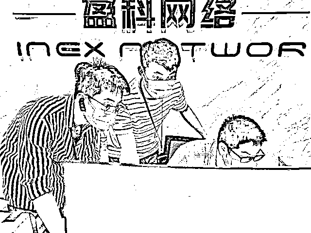
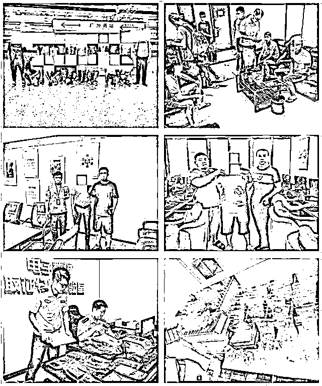
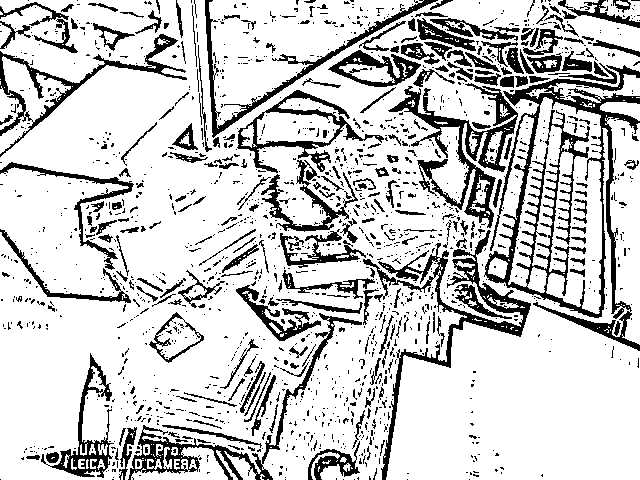

# 虚拟钱包被盗！充值 1 元被扣 1000 元

> 原文：[`mp.weixin.qq.com/s?__biz=MzIyMDYwMTk0Mw==&mid=2247533971&idx=6&sn=dd7f50ab0cca687942b397647c21e2ca&chksm=97cb8eaba0bc07bdd25e4abbe55ccf4d5a8b4184cdb2531ab5d1cf43cca1b0cf74626cab5a56&scene=27#wechat_redirect`](http://mp.weixin.qq.com/s?__biz=MzIyMDYwMTk0Mw==&mid=2247533971&idx=6&sn=dd7f50ab0cca687942b397647c21e2ca&chksm=97cb8eaba0bc07bdd25e4abbe55ccf4d5a8b4184cdb2531ab5d1cf43cca1b0cf74626cab5a56&scene=27#wechat_redirect)

张先生上网时看到一个色情直播间的广告称开通会员只要人民币 1 元，他想“1 元就 1 元，试试看”。

没想到，操作后，手机银行发来一条短信：扣款 1000 元！这才知道上了当。

去年年底杭州网警陆续接到一大批这样的报案，最后从各种羞答答的报案人这里问出来一个色情直播 app，经过侦查，竟然发现了一条“直播+洗钱”的完整犯罪产业链。

“数字钱包”问世才没多久，犯罪分子早已盯上；各种新产品新功能消费者还没摸熟，不法分子已经研究出了相应的犯罪套路……在第七个全民国家安全教育日到来之际，杭州公安通报近期侦破的一批非法获取计算机信息系统数据案、侵犯公民个人信息等涉网案件，并以案说法，提醒广大网民筑牢网络安全意识，防范网络犯罪，守护清朗网络空间。

山寨软件难分真假  盗取账户转移资产

在这里，杭州拱墅警方要给大家讲一个假冒虚拟货币钱包的骗局——

“imToken”钱包是一款移动端轻钱包 APP，用于虚拟货币资产的管理，提供钱包创建和恢复（导入）服务。

犯罪分子完全仿造了“imToken”的官网界面及软件页面，以“软件版本过低”等理由诱骗原有用户下载假冒软件。

在受害人无法区分软件真伪的情况下，犯罪分子通过盗取用户输入钱包“助记词”的方式，盗取用户的账户信息，进而盗取和转移用户的虚拟货币资产。

2021 年上半年拱墅公安接到这样的线索通报后，杭州市公安局网警分局马上会同拱墅网警大队抽调精干力量组成专案组立案侦查，经调查发现了一条由境内人员负责软件开发运维，境外人员实施资产盗取的有组织犯罪产业链。

经查实，伪冒“imToken”软件系盈科云商网络科技有限公司开发，该公司有多人直接参与该伪冒 imToken 软件开发。

专案组在杭州、福州两地抓获郑某某等犯罪嫌疑人 11 名，现场搜查扣押电脑、手机、U 盘等一大批作案工具。

充值 1 元实扣 1000 元   想看色情直播却被洗钱

张先生上网时看到一个色情直播间的广告，称开通会员只要人民币 1 元，他想“1 元就 1 元，试试看”，没想到，操作后，手机银行发来一条短信：扣款 1000 元！这才知道上了当。

准备哑巴吃黄连，认了；过了几天，终究心里过不去，羞答答地找 110 咨询：能不能报案？

去年 11 月，杭州网警陆续接到类似的报警，经过全面筛查、分析发现，这些被扣款的报警人大多都下载了同一款含有“暗雷陷阱”的色情软件。

杭州网警侦查发现了一条“直播+洗钱”的完整犯罪产业链。以梁某、郑某为首的 3 个人开发了这款色情软件，欺诈网民“付款 1 元就能观看视频”。只要有人点击付款链接，软件里的“暗雷欺诈”代码就会开始运作，它通过技术手段将金额遮盖，让人误以为只支付 1 块钱，实际上被害人的 1000 元钱被充值到后台。

2021 年底至 2022 年 2 月，在杭州公安开展的“净网 2022”专项行动中，临平网警组织警力对这个“暗雷欺诈”团伙及下游“直播洗钱”犯罪团伙进行集中统一收网。专案组辗转辽宁盘锦、广东廉江、黑龙江哈尔滨、河南南阳等多地进行抓捕行动，共抓获犯罪嫌疑人 25 名，采取刑事强制措施 9 人，现查明涉案资金 152.8 万元，扣押手机 110 余只，电话卡 400 余张，电脑 10 余台，将犯罪团伙一网打尽。

投资行业业务员不务正业

变卖公民信息上亿条

2021 年上半年，杭州网警发现一条贩卖公民个人信息的犯罪线索，萧山网警大队根据线索摸排研判，认定蔡某有重大犯罪嫌疑，立即对其实施抓捕，在其住所扣押电脑 3 台、手机 13 只。

经查，蔡某曾有在多家企业单位从事业务渠道开发的工作经历，并利用工作便利获取了大量投资理财等金融类公民个人信息。

离职后，蔡某通过在社交软件群内出售、邮箱发送等方式出售上述数据并且获利。

在对案件的抽丝剥茧中，杭州网警查获涉案公民个人信息上亿条，明确数据来源 7 个，查清从事金融投资等行业的侵公涉刑人员百余名。

2021 年下半年，专案组前往上海、江苏、福建等十省市开展首轮集中抓捕收网行动，截止目前，已抓获犯罪嫌疑人 92 人，其中采取刑事强制措施 48 人，成功斩断了一条在国内非法交易公民个人金融数据的产业链。

网警的这些提醒，请大家收好

一、广大网民在使用涉财类软件时，务必从官方途径下载正版 APP，从源头上杜绝盗版软件；

二、浏览网页时慎点弹窗广告，防止恶意程序、木马等悄然植入；

三、涉及输入交易密码、关键词等情形要三思后行，对交易平台、交易对端要多加核验；

四、面对一些来历不明的投票、“帮砍价”类链接，一定要小心，切忌自身信息泄露，成为网络诈骗对象；

五、对待“低价购买”打赏代币、油卡等各类充值卡一定要额外小心，以免贪小失大；

六、发现信息被窃取、财物被盗要及时向公安机关报案止损；

七、涉及金融业务的企业应加强对员工的管理和权限的严格把控，防止因自身管理漏洞令不法分子有机可乘；

八、如果入职后发现你的公司正在从事非法犯罪行为，请主动向公安机关进行举报，电话 110，你懂的！

来源：钱江晚报

← 向右滑动与灰产圈互动交流 →

