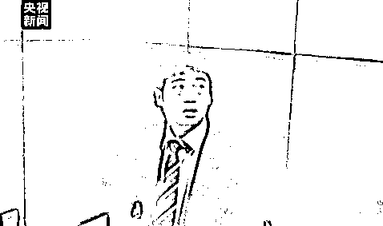
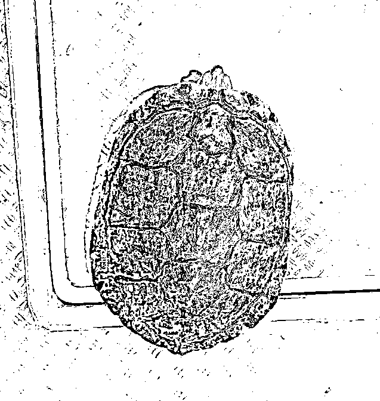

# 为了挣钱，竟然向境外出售中国高铁数据……

> 原文：[`mp.weixin.qq.com/s?__biz=MzIyMDYwMTk0Mw==&mid=2247533971&idx=7&sn=08313221e856463b3027ca3ff535713d&chksm=97cb8eaba0bc07bd162a603d5349dccb5593de5fb06296752e02dbe0e3267ad19942d8b0979b&scene=27#wechat_redirect`](http://mp.weixin.qq.com/s?__biz=MzIyMDYwMTk0Mw==&mid=2247533971&idx=7&sn=08313221e856463b3027ca3ff535713d&chksm=97cb8eaba0bc07bd162a603d5349dccb5593de5fb06296752e02dbe0e3267ad19942d8b0979b&scene=27#wechat_redirect)

案件起于 2020 年年底，经朋友介绍，上海某信息科技公司一名员工被拉进一个微信群，群里一家西方境外公司表示自己有项目要委托中国公司开展。 

有境外公司自称其客户从事铁路运输的技术支撑服务，为进入中国市场需要提前对中国的铁路网络进行调研，但是受新冠疫情的影响，公司人员来华比较困难，所以委托境内公司采集中国铁路信号数据，包括物联网、蜂窝和 GSM-R，也就是轨道使用的频谱等数据。

为了挣钱，上海某信息科技公司很快应下了这个项目……

[`mp.weixin.qq.com/mp/readtemplate?t=pages/video_player_tmpl&action=mpvideo&auto=0&vid=wxv_2355380695147036674`](https://mp.weixin.qq.com/mp/readtemplate?t=pages/video_player_tmpl&action=mpvideo&auto=0&vid=wxv_2355380695147036674)

在对接过程中，双方约定了两个阶段的合作：第一阶段由上海这家公司按照对方要求购买、安装设备，在固定地点采集数据。第二阶段则进行移动测试，由上海公司的工作人员背着设备到对方规定的北京、上海等 16 个城市及相应高铁线路上，进行移动测试和数据采集。

境内这家信息技术公司按照对方的要求购买了设备，并进行安装调试。就在调试的过程中，对方突然提出让境内公司为他们开通远程登录端口的要求。犯罪嫌疑人、某信息科技公司销售总监王某说：“在我拿到这个开启端口需求的时候，以我几年的 IT 从业经验来看，他是可以远程去控制这台电脑做相应的测试，也可以实时地去拿到对应的测试数据的，所以他可能以这种形式已经将数据转移到海外。”

对于境外公司的真实目的，这家信息技术公司心知肚明，但又选择与对方心照不宣。把远程端口的登录名和密码交给对方后，国内的公司只需要保证网络 24 小时连接再做些简单的工作就可以直接从对方那里拿钱了。

**国家安全部干警介绍：“这家公司日常的项目利润也就 15%到 20%之间，但是做这个项目，投入的成本非常低，但利润高达 80%到 90%。”**

**直到 5 个月后，合同快到期准备续签时，公司就决定这个项目不做了。但销售王某和迟某不愿放弃如此高利润的项目，王某决定寻找下家接手的公司，自己和迟某则作为介绍人从中分成。**

**在王某的撮合下，第二家公司很快就与境外公司建立了合作关系，王某和迟某直接拿到了 9 万元的分成。但这样的好日子没过多久，国家安全机关就找上门来。国家安全部干警说：**“通过勘验相关的电子设备，仅仅一个月采集的信号数据就已经达到了 500 个 G，而这个项目已经实施了将近半年，可以想象它所采集和传递到境外的数据是非常庞大的。”****

****经鉴定，两家公司为境外公司搜集、提供的数据涉及铁路 GSM-R 敏感信号，GSM-R 是高铁移动通信专网，直接用于高铁列车运行控制和行车调度指挥，是高铁的“千里眼、顺风耳”，承载着高铁运行管理和指挥调度等各种指令。境内公司的行为是《中华人民共和国数据安全法》《中华人民共和国无线电管理条例》等法律法规严令禁止的非法行为。相关数据被国家保密行政管理部门鉴定为情报，相关人员的行为涉嫌《中华人民共和国刑法》第 111 条规定的为境外刺探、非法提供情报罪。****

****经国家安全机关调查，这家境外公司长期合作的客户包括某西方大国间谍情报机关、国防军事单位以及多个政府部门。****

******1******

******兜售商业秘密******

******妄获不义之财******

* * *

****王某是某搬家公司员工，在一次搬家中获得了一块客户的移动硬盘。因为该客户曾经在某高科技公司工作，王某猜测这块硬盘内可能存有这家公司的重要资料，便将硬盘据为己有。****

****王某说：“当时我手头上正缺钱，看到很多新闻媒体都在报道国外打压这家公司，然后我就想起了这块硬盘，我觉得里面应该有很多比较重要的资料，卖出去应该能换来不少的钱。”**** 

****王某在网上找到了某大国领事馆的联系方式，并向领事馆发送了邮件，称出价 100 万美元出售这块硬盘，但仅仅收到对方邮箱的自动回复。第二天，王某担心对方没有看到邮件，又通过快递方式给对方邮寄了同一内容的信件。信件寄出后，急着卖硬盘出去的王某，直接前往领事馆，准备向对方当面兜售这块硬盘。**** 

****国家安全机关侦查掌握了充足的证据，迅速采取行动，及时制止了王某前往某大国领事馆，向其非法提供商业秘密的行为，并依法对其进行了处理。经查验，**该硬盘内共存有 54G、45245 份文件，涉及该科技公司商业秘密，一旦外泄将对该公司造成重大影响。******

********2********

**********大学生下载观看**********

**********暴恐音视频被批捕**********

* * *

********广西一名大学生何某权无意中在某网站看到一些平时少见的暴恐音视频，十分好奇，便下载观看。由于学习压力大，不知不觉便爱上看这类音视频用于解压。2020 年下半年何某权开始在网上利用翻墙软件下载了 64 部暴恐音视频到手机，用来自己平时观看。********

********经有关部门审查，何某权所持有的 64 部暴恐音视频为剪辑各类血腥暴力内容拼接视频，其中 1 部音视频包括恐怖组织宣传极端恐怖主义内容，其余的 63 部音视频内容为国外战乱地区的枪械射杀、冷兵器砍杀等暴力血腥内容。**这些视频的传播危害极大，足以危害公共安全，破坏社会秩序的稳定。**********

********根据法律规定，何某权的行为已涉嫌非法持有宣扬恐怖主义、极端主义物品罪，遂对其依法批准逮捕。********

**********3**********

**********受金****钱诱惑沦为外国间谍**********

**********被判无期**********

* * *

********1985 年出生的陈伟原为我国某军工科研院所下属公司的一名网络管理员。某日，陈伟在公司门口“偶遇”了一名叫彼得的外国人。彼得自称是一名技术专家，想购买一些技术资料，并许以高额报酬。********

****************

********陈伟与外国“技术专家”的会面监控录像********

********在高额报酬诱惑下，陈伟凭借从事网络管理的工作便利和权限，窃取并向境外间谍情报机关提供了该科研院所文件共 5500 多份，其中机密级 146 份、秘密级 1753 份，以及其他大量内部文件。********

****************

********接受调查的陈伟********

********2019 年 3 月，北京市第二中级人民法院以间谍罪判处陈伟无期徒刑，剥夺政治权利终身。********

**********4**********

**********随意引进、释放**********

**********或者丢弃外来物种获刑**********

* * *

********2020 年 7 月 30 日，海南三亚海警局执法艇在辖区海域进行巡逻时，在一锚泊船附近发现有多只“海龟”在不断挣扎。经初步判断，这些“海龟”是巴西龟，被人购买之后并被放生到海中。********

**********巴西龟以其高繁殖力、高存活率、高掠夺食物的能力，大量掠夺同类生存资源，已被列为世界最危险入侵物种之一。**********

********最新实施的《野生动物保护法》规定禁止随意放生，避免对生态系统造成危害，违者将依法承担法律责任。根据 2021 年 4 月 15 日正式实施的《生物安全法》规定，任何单位和个人未经批准，不得擅自引进、释放或者丢弃外来物种。********

****************

**********5**********

**********社交平台找工作**********

**********却被间谍利用拍军舰**********

* * *

********2014 年 11 月，境外间谍情报机关嫌疑人“JANNY”通过求职 QQ 群与廖某某搭讪并加为“好友”，称可以介绍工作，主要是拍摄湛江军港停泊的军舰舷号，并称无需办理入职手续，只需网上联系。********

**********廖某某按对方指令到湛江军港附近拍摄并报送了相关照片，获利 1000 元。**2014 年 11 月 7 日，廖某某在观看了广东卫视播出的专题片《警惕间谍》及媒体的相关报道后，认识到自己的行为已触犯法律，主动拨打国家安全机关报警电话自首。********

******有关国家安全机关依法对其进行了批评教育，并根据我国反间谍法第二十八条规定，免于追究其刑事责任。此后，廖某某积极配合国家安全机关工作，有立功表现，受到国家安全机关的嘉奖。******

******国家安全******

******是国家生存和发展******

******最基本、最重要的前提******

******关系民生，关系国家稳定******

******关系社会长远发展******

******维护国家安全******

******既是国家责任，也是公民责任******

******国家安全****** 

******人人参与，人人负责！******

******来源：“共青团中央”综编自央广网、央视新闻、最高人民检察院、澎湃新闻、南方日报、瞭望智库******************

******← 向右滑动与灰产圈互动交流 →******

************