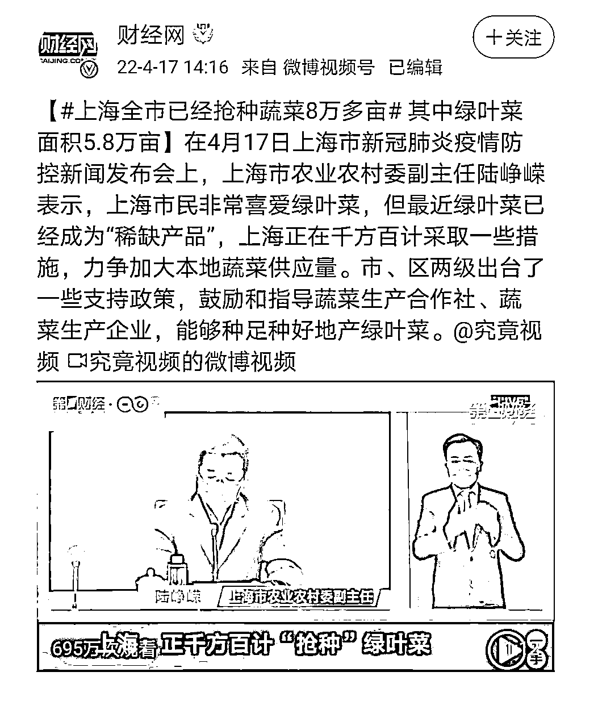
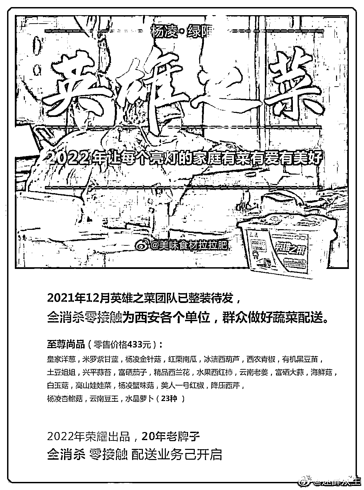

# 上海买菜为什么这么难？我给西安 433 元的“英雄之菜”道歉

> 原文：[`mp.weixin.qq.com/s?__biz=MzIyMDYwMTk0Mw==&mid=2247534023&idx=1&sn=1d3dbc889ac34d9bdacec913d7d9485b&chksm=97cb8effa0bc07e9f130ad709fdca8c58e2bead2ea6d8b07e170e535f7ad96c6a438092a16bb&scene=27#wechat_redirect`](http://mp.weixin.qq.com/s?__biz=MzIyMDYwMTk0Mw==&mid=2247534023&idx=1&sn=1d3dbc889ac34d9bdacec913d7d9485b&chksm=97cb8effa0bc07e9f130ad709fdca8c58e2bead2ea6d8b07e170e535f7ad96c6a438092a16bb&scene=27#wechat_redirect)

有人吃不起进口的天价药，有人吃不起天价的团购菜。图源丨电影《我不是药神》 

4 月 17 日，上海市农业农村委副主任陆峥嵘表示，上海市民非常喜爱绿叶菜，但最近绿叶菜已经成为“稀缺产品”。**目前，全市已经抢种蔬菜 8 万多亩。**

这个新闻，看得我哭笑不得。

绿叶菜也需要生长周期，不是你今天种了明天就能长来。

**问题是，上海真的缺菜吗？**

**-1-**

**有人在扔菜，****更多人没菜吃**

很多上海被封控的人喊“没菜吃”，给了大家一种同样的概念：**城里人，缺菜。**

上海真的缺菜吗？

很多人看到一个视频：工作人员不停地把蔬菜铲进垃圾桶，里面可能有些菜坏了，但肯定不是全都坏了。

[`mp.weixin.qq.com/mp/readtemplate?t=pages/video_player_tmpl&action=mpvideo&auto=0&vid=wxv_2360178515268206593`](https://mp.weixin.qq.com/mp/readtemplate?t=pages/video_player_tmpl&action=mpvideo&auto=0&vid=wxv_2360178515268206593)

其中一个工作人员人正在地上捡菜，旁边一个人说道：

**“你要捡去拿去吃啊？基本都是好的。”**

**“找一箱给你，基本上都是好的。”**

**“全是好的就丢掉了，可惜啊造孽啊。”**

请问这些菜哪来的？为什么隔离小区的人还要天价买菜，而这里的菜却在腐烂变质？

从视频上来看，车牌是沪 F，穿的衣服恒健建设。

搜了一下，这个公司确实在上海有个分公司，注册信息如下：

****

**在工作人员眼中，估计这些菜还不如包装的纸盒值钱。**

当我又刷到上海一个郊县菜农的视频，又陷入沉思。

[`mp.weixin.qq.com/mp/readtemplate?t=pages/video_player_tmpl&action=mpvideo&auto=0&vid=wxv_2360069056919437313`](https://mp.weixin.qq.com/mp/readtemplate?t=pages/video_player_tmpl&action=mpvideo&auto=0&vid=wxv_2360069056919437313)

所有种植的工作人员都是核酸正常，蔬菜基地的菜却一棵都卖不掉，烂地里没人要，而城里人却没菜吃！ 

**一边扔菜，一边烂菜，一边种菜，真的是迷惑本惑了！**

**-2-**

**“英雄之菜”在团购菜面前也得爬**

去年年底的时候，西安疫情曝光了一批社区团购的天价菜。 

我当时特意写了篇文章怒怼：[《西安，逮住了盒马：天天热搜被骂也不是事，喷个资本家吧》](http://mp.weixin.qq.com/s?__biz=MzIyMDYwMTk0Mw==&mid=2247527395&idx=2&sn=79ee36a4c1c11f629fd2f75fd56180c2&chksm=97cba0dba0bc29cdc3f7818c85b337b610b4c86128d709e02c8ed51fb7d4a1c8b804c4f2cc08&scene=21#wechat_redirect)

西安 433 元一箱的英雄之菜，有 23 种蔬菜，配送到家，当时我还觉得巨贵！ 

不好意思，我给西安道歉——这菜良心价啊。

**现在要让上海人民看见，估计能一秒抢空！这么多种类才 400 多，能接受！**

4 月 15 日，上海一骑手代购 6 桶泡面 20 个鸡蛋，要价 900 元！

20 个鸡蛋 6 桶方便面卖 570 元，外加 330 元跑腿，总共收你 900 还不给小票。

好在警方很快到场，将此人带走调查。

对比下 433 元免配送费的“英雄之菜”，西安这未免太良心了，在此我都想道歉—— 

**比割韭菜，还是上海狠啊。**

谁也不会想到号称世界前几大的城市，竟然持续 1 个多月地闹菜荒，买菜难成了大部分人的心头大事。

此刻打开上海抗疫求助超话，还能看到这么多关于物资的求助信息。

4 月 16 日：**“天天都是泡面，快饿死了。”**

4 月 16 日：**“目前能吃上，但物价很贵，不舍得吃，都吃馒头。也希望给那被困的 900 位农民工发些求助物资吧！”**

4 月 14 日：**“12 天了没有任何物资发放。”**

**所以疫情下，人在上海是买不到菜，还是买不起菜？**

**-3-**

**上海团购的货源很充足**

**控制住了渠道独家供货**

1958 年，上海市领导以直辖市需要有副食品供应基地为由向中央请示，江苏省同意一年内先后把十个郊县（上海县、嘉定县、宝山县、松江县、金山县、川沙县、南汇县、奉贤县、青浦县）划归上海。

**从此，上海的主副食品有了长期稳定供应的基地。**

想不到时隔 64 年，上海因一场大疫情现在近千万家庭居民、企事业单位、高校、机关等，普遍缺少食品供应。

**可事实是，上海不缺生活物资。** 

有菜，有米，也有肉。

**只是原来是网购、菜场、超市，现在是团，贵几倍。**

**团购的货源很充足，上海郊区也有农场菜地，就是控制住了渠道，全部独家供货。**

**从宏观看，就是销售方式变了，价格变了。**

上海物价是疫情前的 5 倍。

我们早就听过了“上海生活物资供应充足”，需要解决的就是“最后一公里”的问题。

可是两周过去了，很明显这个问题还没有被完全解决：

很多人还是没有领取到外省的物资。

很多人甚至还是处于物资紧缺，不知该如何保障物资的情况。

为什么都两周了，这最后一公里还没打通？

**为什么居委会派出了大量人员看守每个小区的出入口，只允许政府认可的“保供单位”的商品进小区？**

**以及居委会干部自己“认证过的”的各种来路不明的供应商？**

解释就是其他机构运来的货物就是不让运进小区，说是有毒会传染新冠。

这两天跨省救援的京东小哥感动全中国，但红头文件都搞不到的保供，为什么一个本地天价团购就能轻而易举拿到的？ 

京东送不进来，天价团购为什么能送进来？ 

**很明显的是，一是上面的指挥调度效率低，二是下面有人中饱私囊。**

为什么广州的蔬菜包只卖 10 元一袋还不限量供应？你上海物价贵点我理解，有这么贵？ 

10 元的蔬菜有 4 种还给你搭上葱姜，有的市民也还收到政府的免费菜。

而在魔幻的上海，大灾当前，总有些社会渣滓想要抓住发财时机，总有人想着如何从中捞一笔。

**我一直认为发国难财的人绝对不止一个两个，那些各种野路子进货、神通广大保供的团购经销商有没有问题？一些牵扯其中的干部有没有问题？**

**上海，该查查了。**

来源：昌南大队长

← 向右滑动与灰产圈互动交流 →

