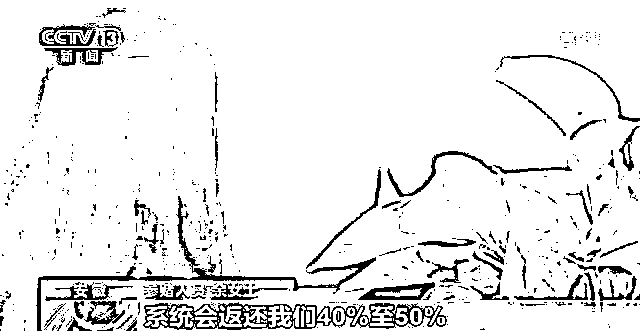

# 边玩游戏边赚钱，获利百万的陷阱值得所有人警惕

> 原文：[`mp.weixin.qq.com/s?__biz=MzIyMDYwMTk0Mw==&mid=2247534023&idx=3&sn=fe29752126e1affec6fad6b7cf7acd9a&chksm=97cb8effa0bc07e973b13c247f58d760bcdef50b9e8d212b44e7d786be3d50a99838ee0e2530&scene=27#wechat_redirect`](http://mp.weixin.qq.com/s?__biz=MzIyMDYwMTk0Mw==&mid=2247534023&idx=3&sn=fe29752126e1affec6fad6b7cf7acd9a&chksm=97cb8effa0bc07e973b13c247f58d760bcdef50b9e8d212b44e7d786be3d50a99838ee0e2530&scene=27#wechat_redirect)

“注册会员就送代币”

“即充即玩随时提现”

“打打游戏稳赢上万”

……

一边娱乐一边赢钱的广告话术，看似诱人，让想要借游戏打发时间，顺便捞一笔的网友蠢蠢欲动。

殊不知这些都是骗子精心设计的陷阱：**表面上是能娱乐能赚钱的小游戏，实则是让你一把就上瘾的网络赌博。**不法分子通过一个“可控可操作”的游戏平台，让你沦陷其中倾家荡产，甚至走向违法犯罪的深渊。

来自安徽的余女士，就是其中典型。

**令人沉迷的“游戏”**

**环环相扣的陷阱**

作为一名家庭主妇，余女士平日比较空闲，爱和朋友打打麻将。这天，朋友给她推荐了一个麻将 APP，余女士便抱着玩玩看的想法下载并注册了账号。

（图源：央视新闻）

“要想开始游戏，得向拉我进去的人上分。”余女士说道。

“上分”即是要给介绍推荐人转账充值，一块钱兑换一分，兑换越多，赌博筹码越多。

这种**不受时间限制，不受空间约束，随时随地都能拿起手机参与游戏**的“快感”让余女士越来越上头。

从最开始的 100 元，到后来的 5 万元，输得是越来越多，余女士依旧没有收手，继续做着下一局就能连本带利赢回来的美梦。

**而这，只是网赌游戏陷阱的开始。**

（图源：不良资产管理圈）

当余女士得知，只要成为该游戏 APP 的推广员，拉人成功注册会员并参与赌博便可从中获得高额返利。

她心动了。

为了赚取更多的赌资，余女士不断向自己的亲朋好友推广这款游戏 APP，再通过系统提成换取分值继续赌博，在网赌的游戏世界中越走越远，直到被抓。

（图源：央视新闻） 

游戏用来放松消遣本没有问题，但被不法分子盯上用作网赌的幌子，心智薄弱的朋友们可要小心了。

赌瘾如毒瘾，任何带有赌博性质的游戏，一旦沉迷，就会很容易进入**“充值→赌博→输钱→帮助推广→获取提成→再充值”**的循环中，越陷越深。

科普一下，赌博犯法众所周知，但通过宣传推广、招揽客户等行为间接扩大赌博影响范围的行为，也属违法犯罪。

这种看似躺平赚钱的捷径，很可能让你面临牢狱之灾，成为网赌诈骗的帮凶。

**资深玩家变幕后庄家** 

**“赌场帝国”终将破灭**

披着游戏外衣的网赌世界让不少人迷了眼，同时也有一部分人瞄准赌徒心态，建立起自己的“赌场帝国”。

正如 41 岁的五金店店主唐某，因业余时间喜欢在 APP 上玩棋牌游戏，认识不少牌友。为了赚点“快钱”，唐某便筹划在某游戏 APP 上自建俱乐部，采用注册会员的方式招揽赌客在网上赌博，从中牟利。

靠着以往的牌友关系，唐某从资深玩家摇身一变成了赌场小老板。

（图源：央视新闻）

一段时间后，另一个游戏俱乐部的“同行”找到了他，表示只要将两个俱乐部打通，就能扩大利益抽成，这个提议正中唐某下怀。

为了方便牟利，唐某还提出了**积分制**：

玩家注册账号后，必须充值购买积分才能在 APP 内打牌，一个积分是一块钱，打牌的最低积分为 60 个积分，即玩家最低要花 60 块钱买积分才有资格打牌。

输了后，要继续购买积分才能继续打牌。

此外，为了进一步扩大俱乐部的影响力，唐某还会采取线上线下的推广模式：**先在网上挂链骗点击，后打着某游戏 APP 的知名度吸引不明真相的群众下载并引流至自家俱乐部。**

与此同时，唐某开始大量招募客服，雇用工作人员负责赌客充值、提现，同时监控赌客输赢情况，操控后台等等。 

该俱乐部使用的游戏 APP，具备了**研发、自动结算、自动抽水、上下分**等赌博功能，毫无疑问就是一款赌博软件。 

（图源：央视新闻）

经查，仅短短一年，唐某的游戏俱乐部就接受了赌客赌资 697 万余元，唐某等 9 人非法获利 300 万余元。对此，法院以“开设赌场罪”分别判处唐某等 9 人有期徒刑四年六个月至十个月不等，各并处相应罚金。

**一场赌博一场梦，披着游戏外衣的网赌行为，不管对于玩家还是庄家，必将是“竹篮打水一场空”。**

**非法引流花样重重** 

**请你入瓮**套路层层****

网上冲浪时的不明弹窗、好友推荐的陌生游戏注册链接、看直播时下载的非正规游戏软件……当我们在生活中，遇到这些通过非法引流诱导你下载使用的不正规网站、APP 游戏，可要当心了。

不法分子不仅非法引流的手段花样重重，请你入瓮的陷阱也是套路层层。

**第一步：虚假宣传。**以“即冲即玩”“随时提现”等虚假宣传标语，在聊天群组、指定网站进行投放，吸引赌客通过网络网站或下载 APP 边玩边赌。

**第二步：施以小利。**起初群组或游戏赌博平台会给赌客尝一点甜头，让赌客赢一点钱并顺利提现，建立信任感。 

**第三步：大额下注。**通过蝇头小利尝到甜头后，赌客一般会成功“入套”继续大额下注，并不断上头。

**第四步：操控赌局。**机会是留给有“后台的人”，不法分子通过作弊软件操控赌局，让赌客“进了来就出不去”。 

**第五步：十赌十输。**当赌客想收手时，就会发现提现之路困难重重，甚至会遇上账号冻结的情况，被要求追加账号解封费用的敲诈行为。

（图源：央视新闻）

“网络赌博，十赌十输”这句劝诫大家并不陌生，但总有人怀着一夜暴富的想法以身试险。

守哥提醒大家，游戏赌博在违法的同时也极易落入诈骗陷阱。面对虚假宣传的网赌游戏平台要高度警惕，切勿因贪图新鲜刺激和蝇头小利而遭受财产损失。同时，也要注意个人信息的保护，不可随意注册游戏网站、填写手机号或银行卡号等隐私信息。 

若发现被骗，及时报警，并保留好证据提交给警方。如果在 QQ/微信平台上遇到此类诈骗，请保留相关证据前往腾讯卫士小程序进行举报。

**在网赌的游戏世界里，你理想的“单车”永远变不来“摩托”，搏来的只是让你失去所有的陷阱。**

← 向右滑动与灰产圈互动交流 →

