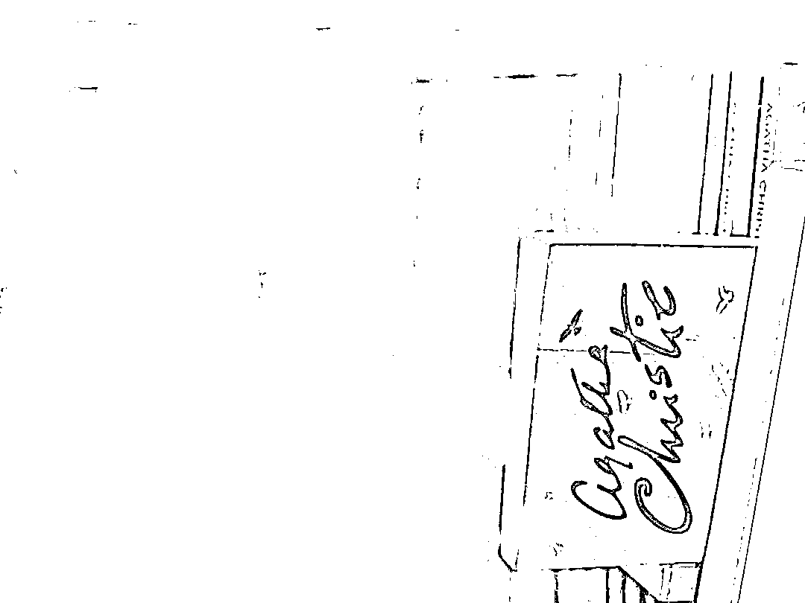
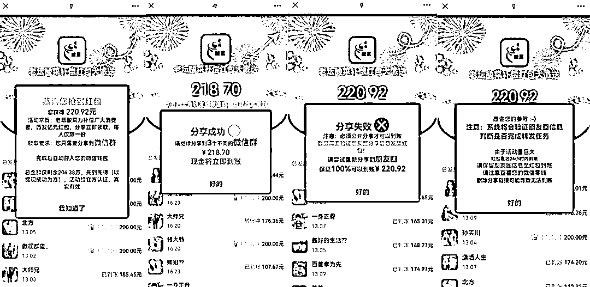
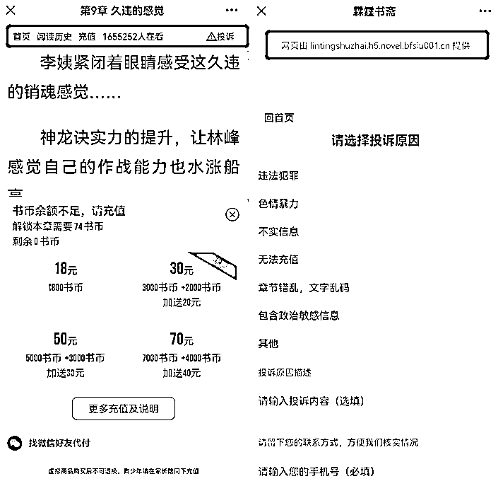

# 老耘酸菜发道歉红包？微信热转链接背后，暗藏小黄文产业链

> 原文：[`mp.weixin.qq.com/s?__biz=MzIyMDYwMTk0Mw==&mid=2247534023&idx=4&sn=8adba7af56d654fcf818d7ab083de755&chksm=97cb8effa0bc07e9cfb13a17313b396cef65e53e8b39903f8bc4e9cdd0be8fd0574f277de461&scene=27#wechat_redirect`](http://mp.weixin.qq.com/s?__biz=MzIyMDYwMTk0Mw==&mid=2247534023&idx=4&sn=8adba7af56d654fcf818d7ab083de755&chksm=97cb8effa0bc07e9cfb13a17313b396cef65e53e8b39903f8bc4e9cdd0be8fd0574f277de461&scene=27#wechat_redirect)

小黄文代理平台层出不穷，套路却也十分相似，广大网民还需擦亮双眼，谨记“网上没有免费得来的红包”。

“到此为止吧，小黄文。”早在 2019 年，微信官方就曾发文，对通过低俗小说诱导用户关注公众号等行为进行揭露，但时至今日，相关现象不仅并未消失，反而变得更为“隐蔽”。

日前，一个名为“老耘酸菜道歉红包”的链接，在微信朋友圈里疯转。但经过体验后雷达财经发现，其不仅抢不到钱，还会将兴冲冲点进来的用户引流至一些软色情甚至淫秽小说网站，并用付费小说的模式“掏空”你的钱包。

雷达财经对该链接进行了投诉，截至发稿，该链接已被微信屏蔽，但用浏览器依然能打开。

对此，北京市中闻律师事务所律师王维维指出，低俗小说本身界定需要区分，如果仅仅是内容层次不高，迎合一部分读者的休闲需求的话，也是合理的。但如果构成色情信息，且以牟利为目的，则可能构成刑法上的传播淫秽物品牟利罪等罪名，应被追究刑事责任。

**老坛酸菜发补偿了？** 

2022 年的 315 晚会，让曾经风靡全国的老坛酸菜成为了众矢之的。

根据央视调查，市面上很多方便面的老坛酸菜包，虽号称“老坛工艺，足时发酵”，但实际上却是源自农田土坑腌制。记者实地探访土坑时，坑中的工人们有的穿着拖鞋，有的直接光脚踩在酸菜上，还有相关人员透露，土坑中的杂质包括树枝、田螺、羽毛、烟蒂……

晚会曝光后，连锁反应接踵而至。虽然统一、康师傅等企业纷纷发布声明致歉，但其在民众心中已经留下了深刻的印记。以至于当上海疫情愈发严重，商超中大量食品被抢购一空时，不买老坛酸菜成了上海市民最后的倔强。

在此背景下，一个名为“老耘酸菜道歉红包”的微信链接，近段时间在微信朋友圈大量传播，多位微信用户告诉雷达财经，一开始还以为是老坛酸菜。

雷达财经体验发现，点进链接后，页面便提示可在限定时间内上滑手机屏幕抢红包，每人有两次机会，金额累积可以提现。页面最上方还有一行字赫然标注着“活动经官方认证，真实有效”。

当抢完红包点击提现时，该页面则显示：老坛酸菜为补偿广大消费者，颁发亿元红包，分享立即领取，每人仅限一份。下方红色标注的醒目字体还提示总金额仅剩余 206.38 万。

这只是“任务”的开始，继要求用户分享至微信群后，系统还会陆续将“任务”更新为“分享至 3 个微信群”、“分享至朋友圈”。与此同时，下方会不断弹出有用户红包到账的消息，刺激分享者。

而当朋友圈也分享完毕，弹出的提示则变为：系统将会验证朋友圈信息判断是否完成转发任务，请保留朋友圈信息至红包到账，删除分享链接可能导致无法到账。

不过，与点击“返回”后的内容相比，上述流程均只能算是“诱饵”。一旦点击返回，就会出现带有淫秽动图的小故事，且阅读到关键点剧情就会戛然而止，并出现一段提示，伴以带有性暗示的留言和图片，诱导用户点击“继续阅读”跳转链接。

当雷达财经用手机尝试跳转后，便进入到了一个名为“文 X 阅读”的快应用界面。根据界面内容，这段“小故事”源自小说“XX 神医”，该小说共 1149 章，只有前 8 章可以免费阅读，此后每阅读一章都需缴纳至少 50 书币。

用户可以通过充值换取书币，最低充值 18 元换 1800 书币，充值越多优惠越多，如充 100 元加送 7000 书币，充 200 元加送 20000 书币。

据此计算，看一章至少需要 5 毛钱，若想读完这部小说至少需要花费 57050 书币，约充值 300 元人民币。相比之下，目前起点中文网畅销榜首位的小说全部订阅约需要 110 元。

虽然用户也可以借助每日签到、福利转盘、完成每日任务等方式免费获得书币，但这些与读完一部小说所需的总量来比只能算杯水车薪。更何况，一章小说的篇幅极短，大部分仅有七八百字，对于想尽快阅读的读者来说，仅靠免费渠道获得的书币很难“止渴”。

值得一提的是，文 X 阅读可能只是小说“分销商”的其中之一。

雷达财经注意到，文 X 阅读的开发者是福州卫思立 XXX 有限公司。据天眼查，该公司拥有软件著作权的阅读器还包括最爱 XX 等。

此外，该公司还有多个网站备案，多数点开后已无法显示，在“weisiliXXX”的域名下，会有对文 X 阅读的导流页面。

雷达财经尝试拨打天眼查中福州卫思立 XXX 有限公司的电话进行核实，但该电话已停机。

**背后是新三板上市公司？**

与手机用户相比，电脑用户在“返回”后的小故事界面点击“继续阅读”后是另一番景象。

系统会自动弹出一个微信二维码，扫描后即跳转到了一个名为“霖霆 XX”的公众号。想要继续阅读文章的读者关注后即可根据提示继续跳转。

相较文 X 阅读，霖霆 XX 的阅读界面还多了“投诉”的选项。但点击后即可发现，尽管相似度很高，但该投诉页面并非微信官方提供。真正的官方投诉网址是 mp.weixin.qq.com，如果在霖霆 XX 给出的页面投诉，不仅无法起到该有的效果，还可能泄露自己的手机号等关键信息。

而在充值面额方面，霖霆 XX 则与文 X 阅读相近，只不过多出了“年费 VIP 会员”这一选项，一次性花费 499 元，即可免费看平台中的所有小说。

雷达财经搜索发现，霖霆 XX 公众号的认证主体是广州尚远 XX 有限公司。天眼查显示，后者成立于 2021 年 8 月 22 日，法定代表人为刘 XX。

而刘 XX 担任法定代表人的公司多达 40 家，担任股东的公司更是有 80 家，且这些企业出现了惊人的统一性：其名称的命名格式全部为“广州 xx 教育咨询有限公司”；成立日期也集中在 2021 年 8 月 21 日或 22 日；注册地址全部在广州市天河区员村一横路；也均在 2022 年 1 月 26 日因“通过登记的住所或者经营场所无法联系”被广州市天河区市监局列入经营异常名录。

另外，在霖霆 XX 中阅读小说，每一章的底部都会附带一张伴有“点击进入”标识的美女图片，点击后会随机链接到公众号“麦麦 XX”或“悠悠 XX 夜读”。

两者的认证主体分别是上海麦广 XXXX 有限公司、海南 XXX 传媒有限公司。而这两家公司背后，则是一家新三板挂牌公司。

**低俗小说引流屡禁不止**

事实上，文 X 阅读和霖霆 XX 的引流手段已非首次出现。

2021 年 3 月，江苏省连云港市灌南县公安局就曾接到群众举报，称有人在微信群中发送“疫情补贴红包”、“假日补贴红包”等链接，诱人转发至多个微信群，最后却引流至软色情网络小说。

彼时据灌南县公安局网安大队案件中队副中队长吴伟介绍，为了吸引读者花更多钱阅读，不法分子会在故事情节关键点突然提示付费，付费模式分月会员、季度会员、年会员，续费时间越长，“性价比越高”。“以我们查处的案件为例，淫秽网络小说有 400 多部，涉案金额高达 2000 余万元。”

此外，一些涉淫秽内容的网络书城创建者还会以免费阅读一些章节为诱饵，引诱阅读人填写个人身份证号、手机号等信息，这些信息很快就会以一条 30 元左右的价格在网络上倒卖。

而这只是小说相关灰产链条中的一个缩影。除微信公众号外，微博、短视频、甚至短信都可能成为小说平台引流的工具。

另据《差评》报道，小说网站还有派单、代理等模式，适合有大量活跃好友的个人号。

派单模式只需个人把小说转发到朋友圈，产生的收益一般是和小说网站 82 分成，派单者拿 80%，小说网站会专门开一个后台监测通过派单者链接点击而产生的消费；代理则是在前者的基础上，朋友圈有人对这个赚钱方法感兴趣，就成为派单者的“下家”。

对于这类灰产，包括微信官方、全国扫黄打非办等在内的监管层一直在进行打击和清除，但却始终无法根治。

早在 2016 年 3 月，国家新闻出版广电总局、工业和信息化部就已开始施行《网络出版服务管理规定》。其中提到，从事网络出版服务，必须依法经过出版行政主管部门批准，取得《网络出版服务许可证》。

此后，大量未持有网络出版服务许可证，且刊载的内容涉嫌低俗色情的公众号被封。

2018 年中国新闻出版广电报的一篇报道就提到，重庆市文化执法总队经调查发现，微信公众号“摘星小说”不定期推送文字低俗的小说标题及片段，吸引用户点击阅读“掌中云”小说平台提供的网络小说，并通过用户充值分成的方式获利。经查，“摘星小说”的运营者重庆舍映子文化传媒有限公司未持有网络出版服务许可证。监管依法责令该公司删除全部相关网络出版物，没收违法所得 59249.88 元，并处罚款 329166 元。

2019 年，微信官方还曾发布《到此为止吧，小黄文》，在揭示低俗小说引流的全套产业链的同时，也公布了官方的处罚结果：2019 年的前 7 个月，微信团队处理违规小说账号 6.6w+。其中能力短封 3.7W，能力永久 2.4w，永久封禁 3.9k。

但 2021 年全国扫黄打非办公布的“净网”典型案例中，仍不乏犯罪团伙搭建“某原创内容分销系统”网络平台，通过微信公众号推广淫秽色情小说链接，诱导网民充值牟利的情况。

这一次，违法的 6 人因犯传播淫秽物品牟利罪，被十堰市房县人民法院分别判处有期徒刑六年至六个月不等。

在行业人士看来，严打之下色情小说依旧猖狂，说明了解决问题的困难程度。

一方面，微信公众号虽然要经过实名认证，但由于信息泄露等原因，网络上批量倒卖公众号的生意屡禁不止，群成员众多的微信群可以通过购买特定成员的微信号打入内部，问题链接再以红包等形式伪装，淫秽书刊就能以非常隐蔽的方式裂变传播。

另一方面，从鉴定的角度来说，当前不少网络小说动辄数万甚至十几万字，必须整部读完才能综合认定，执法难度较大。

不过，代理平台层出不穷，套路却也十分相似，广大网民还需擦亮双眼，谨记“网上没有免费得来的红包”。

来源：雷达财经

← 向右滑动与灰产圈互动交流 →

