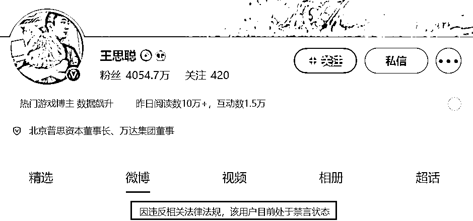
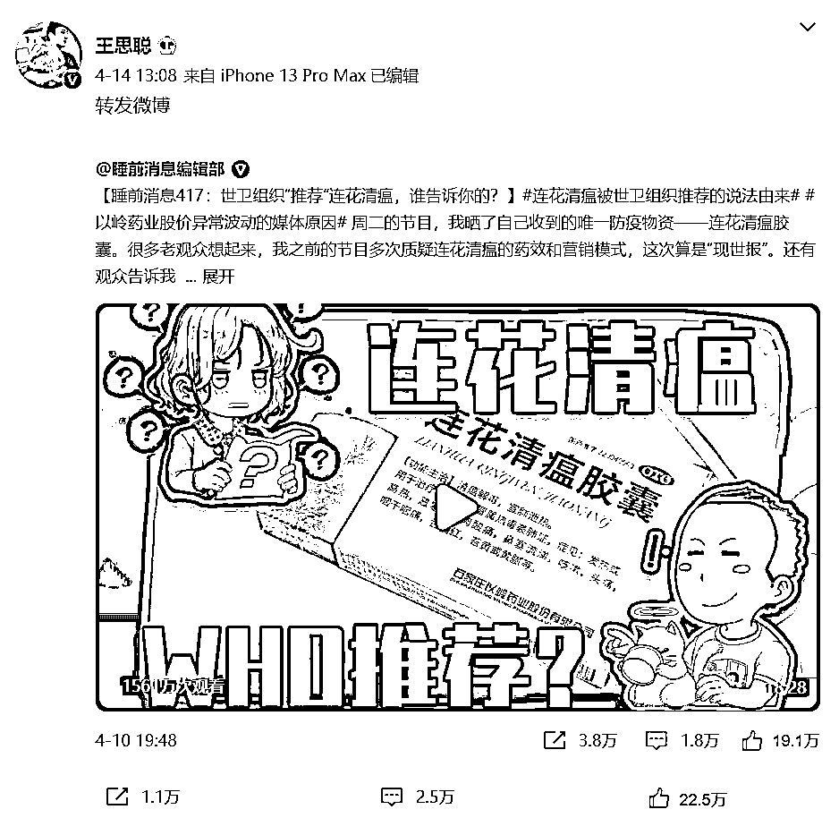
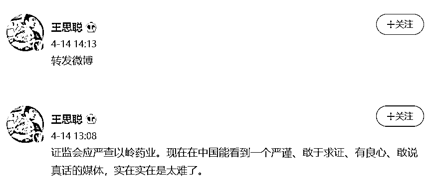
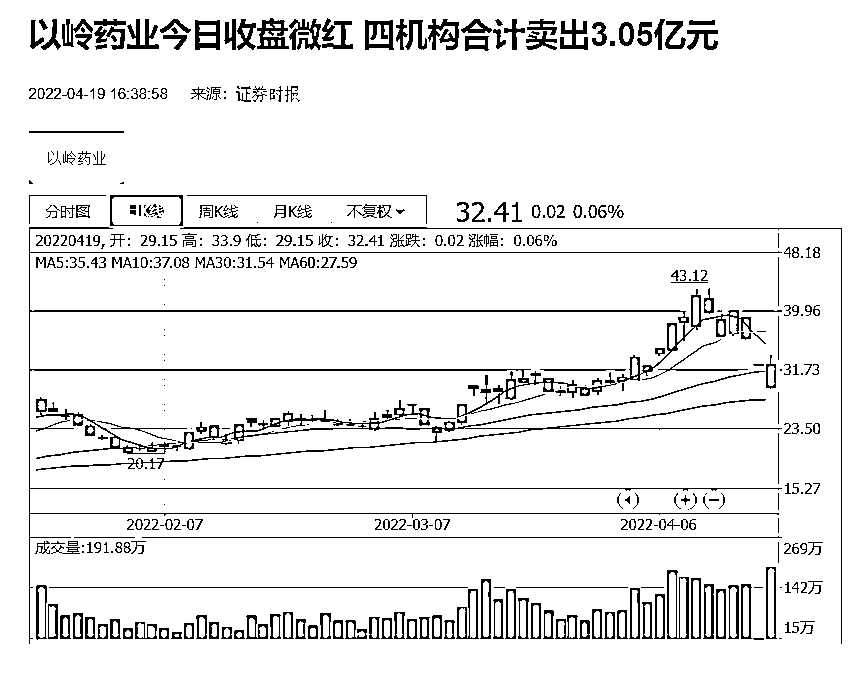

# 王思聪微博账号被禁言

> 原文：[`mp.weixin.qq.com/s?__biz=MzIyMDYwMTk0Mw==&mid=2247534023&idx=5&sn=39fc927446543c44ddeb72f588108b8e&chksm=97cb8effa0bc07e9c47dc2bb42d72352bcabf9551ce0b63d5b70a10967a2451cb0e7b315e374&scene=27#wechat_redirect`](http://mp.weixin.qq.com/s?__biz=MzIyMDYwMTk0Mw==&mid=2247534023&idx=5&sn=39fc927446543c44ddeb72f588108b8e&chksm=97cb8effa0bc07e9c47dc2bb42d72352bcabf9551ce0b63d5b70a10967a2451cb0e7b315e374&scene=27#wechat_redirect)

4 月 19 日下午，王思聪微博账号页面显示：因违反相关法律法规，**该用户目前处于禁言状态**。 

IT 之家了解到，王思聪 4 月 14 日转发了一条质疑“世卫组织是否推荐连花清瘟”的视频。

据证券时报报道，4 月 15 日与 4 月 18 日，以岭药业**连续两个交易日跌停**。截至今日（4 月 19 日）收盘，以岭药业（002603.SZ）微涨，收报 32.41 元，涨幅 0.06%。

来源：IT 之家

← 向右滑动与灰产圈互动交流 →

