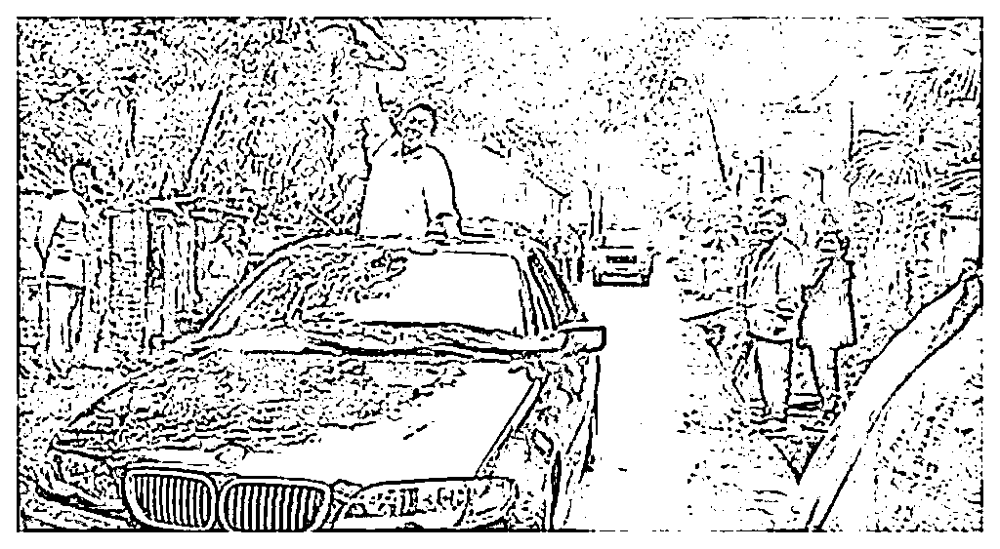

# 中得头奖反被起诉？小伙以死明志牵扯出彩票大骗局

> 原文：[`mp.weixin.qq.com/s?__biz=MzIyMDYwMTk0Mw==&mid=2247534023&idx=6&sn=e11156433b8b82e1d1d84deb7d02c415&chksm=97cb8effa0bc07e9098c14786ae9a035eb9d3a27581bd1507b1129ca8c21e67835fbd8b5d24e&scene=27#wechat_redirect`](http://mp.weixin.qq.com/s?__biz=MzIyMDYwMTk0Mw==&mid=2247534023&idx=6&sn=e11156433b8b82e1d1d84deb7d02c415&chksm=97cb8effa0bc07e9098c14786ae9a035eb9d3a27581bd1507b1129ca8c21e67835fbd8b5d24e&scene=27#wechat_redirect)

今天讲一个改变了中国彩票史的骗局故事。

**这个骗局的发生、经过、结果都堪称离奇，**

**若不是这一连串的巧合，有些秘密可能永远不会被人知道。** 

**开始之前还是要强调一下：**

***这是真实的案件，所有素材都真实可查。*** 

**让我们把时间拨回到 2004 年。**

****01****

****小伙以死证清白****

**2004 年 3 月 25 日下午，西安某体育彩票销售中心门外。**

**一名男子毫无征兆地爬上了销售中心的广告牌，威胁要跳下自杀，引发了大量群众围观。**

********

**他是谁？又为什么要自杀呢？**

**此刻正趴在广告牌上的男子名叫刘亮，17 岁，是当地的一位农村小伙。** 

****

**刘亮**

**小伙子运气不错，前两天买的一张即开型体育彩票中了特等奖，奖品是**一辆宝马汽车和 12 万元现金，总价值 60 万元。****

****中了大奖应该开心才对，为什么会闹到跳楼呢？**** 

****原来就在刚才，陕西体彩中心通知他：****

****他所持有的彩票是伪造的假货，奖品是一分都没有了，而且还要以伪造罪起诉他，让他负刑事责任。**** 

****刘亮一听，不仅宝马没了，说不定还得坐牢，情绪激动之下就爬上了广告牌，要以死明志，证明自己的清白。****

****围观群众见此，赶紧报了警，警方迅速赶到现场，了解原因后，经过一番劝说，刘亮才从广告牌上爬下来。****

************

******02******

******意气风发中大奖******

****时间再往回倒两天。****

****3 月 23 号，这天刘亮兴冲冲地来到西安市东安街的体彩销售现场，他准备赶时髦买上几注“即开式彩票”玩玩。****

****所谓「即开式彩票」是当时一种十分流行的彩票形式。****

****主办方会租下一大块空地，将奖品（主要是汽车、摩托等大件物品）摆在主席台上，诱使老百姓前来购买。****

****彩票刮开后的图案如果与中奖图案一致，就可以当场领走奖品。****

************

****人头攒动的购奖现场****

****刘亮也想来凑个热闹，他买来 10 块钱的彩票，其中一张刮开，出现了“草花 K”的图案（记住这个草花 K），****

****主席台上的中奖图案里也正好有草花 K，而且还是一等奖。****

****这可把小伙高兴坏了，中了一等奖可以拿现金不说，更重要的是可以上台参与第二轮抽奖，**** 

****如果第二轮再中就是特等奖，能拿到宝马车和 12 万元现金。**** 

****刘亮意气风发地走到台上，从 1、2、9、10 四个信封中潇洒的抽出了 9 号，**** 

****在工作人员的监督下，他当场打开 9 号信封，里面赫然写着**“宝马”！******

******刘亮这下成牛逼了，他直接中了特等奖。****** 

******刚开完奖，小伙立马被人围上，现场的工作人员给他戴上大红花，让他在美女模特的陪同下，在市里巡游了 3 个小时，可算是给彩票做足了宣传。****** 

****************

******活动都做完，刘亮开心地回到家里，就等着体育中心来电话通知他去领奖了。****** 

******谁知道，两天之后，等来的不是兑奖通知，而是伪造警告。******

********03********

********针锋相对，谁在说谎******** 

******刘亮以死明志引发了巨大的社会反响，老百姓普遍相信少年的话，怀疑体育彩票中心作假。******

******仅仅一天之后，3 月 26 号，陕西省体彩中心召开新闻发布会，宣布：******

******经国家体彩管理中心鉴定，刘亮所持的**“草花 K”由“草花 2”涂改而成，系假彩票，此次中奖结果作废。********

******又过了一天，27 号，刘亮在自己家也开了个新闻发布会，他表示：****** 

******自己绝对没有伪造，**体彩中心检测的彩票，不是自己购买的那张。********

****************

******哦吼，事情到这里已经变成了罗生门，陕西体彩中心和刘亮，一定有一方在撒谎。******

******争锋相对的两边僵持不下，陕西体彩中心选择报警。******

******接到报案之后，警方决定先找本次体彩销售的负责人孙承贵了解情况，******

******然而，在被警方询问过后，**孙承贵竟然失踪了！********

******这一下可就尬住了，关键证人消失，检方等于没了人证。******

******现在是证明刘亮伪造的证据不足，证明体彩中心伪造的证据也不足，案件僵住了。****** 

************

******调查虽然僵住，但媒体的关注度却不见下降，******

******随着事件的不断发酵，包括央视在内的各大媒体都汇聚到西安，******

******阵容空前的记者团，形成了一个滴水不漏的调查网。******

******很快，央视记者就发现了一个从未爆出的猛料：****** 

********西安即开型彩票的销售其实早就被“承包”出去了。********

******承包商是浙江湖州人，杨永明。👇******

****************

******杨永明，百度百科都能搜到他******

******杨永明原本是专门给陕西省体彩中心提供奖品的，由于这个原因，他能很方便地疏通陕西体彩中心的上下关系。******

******1997 年开始，他就将当时陕西地区全部的即开型体彩的发售给承包了。******

********而消失的孙承贵就是他的手下。********

********04********

********真相大白******** 

******媒体的曝光，给西安警方指明了调查方向，4 月下旬，警方开始彻查整场事件。******

******这一查就不对劲了。****** 

************

******这一期即开型彩票一共销售了 1700 万元，产生了 4 位宝马大奖得主，分别是：******

******3 月 20 日中奖的杨小兵；******

******3 月 22 日中奖的刘晓莉；******

******3 月 23 日中奖的刘亮；******

******3 月 24 日中奖的王军。******

******然而这 4 个人的身份却大有问题，******

******最早中奖的杨小兵和最后中奖的王军，一个和身份信息完全不符，另一个身份证号直接少了一位，******

********而且两人所留的电话都是空号。********

******身份不对，联系方式也没有，也就是说这俩人就此联系不到了。******

******唯独刘晓莉确有其人，她也成为本案唯一的线索。******

******在正式询问之前，警方先是调取了她的通话记录，却发现一件意想不到的事。******

********刘晓莉在中奖之前和孙承贵有大量的通话往来。********

******一个随机的中奖者会这么巧刚好和彩票承包商认识吗？****** 

************

******警方赶紧找到刘晓莉了解情况。****** 

******刚开始，她表示自己是凭运气中的奖，不认识什么孙承贵，就算面对央视记者的采访她也坚持自己的说法。****** 

******直到警方将通话记录摆在她眼前，她才不得不交代了事情的经过：******

******原来，她和孙承贵早就认识，中奖前几天孙找到她，表示愿意出 2000 元钱，请她到西安做个“宣传”。****** 

******孙提前给她准备了一张“草花 K”，让她进入第二轮抽奖，并在孙的暗示下选中带有宝马的信封，从而中得特等奖。****** 

******四位中特等奖的幸运儿，三位都是托儿，但是只有刘晓莉单纯的留下了真实信息…****** 

******根据刘的口供，警方立即逮捕了承包商杨永明。****** 

************

******经过审讯得知，这场即开型彩票完全就是彻头彻尾的骗局。******

********05********

********大骗局抵不过巧中巧******** 

******来看看这个骗局是如何实施的。******

******首先，孙承贵会取来之前中奖者兑过的“草花 K”，交给托儿，让其进入二次抽奖。******

******在二次抽奖环节中，孙再拿出几个信封，其中一个信封里有宝马纸条，他会暗示托儿去抽这个信封，从而骗取大奖。******

******“草花 K”好取，但是放着宝马纸条的信封是经过公证的，他是如何知道的呢？****** 

******原来中奖信封虽然是在公证处监督下密封的，但是保管者却是孙承贵的老板杨永明。******

******杨永明在保管时用灯泡照信封，就能看出哪个存着宝马纸条，****** 

******然后记住这个信封的编号，就可以选择中奖者了。******

****************

******真正抽中“草花 K”的中奖者登台时，拿出的都是没奖的信封，谁也抽不走宝马。******

******托儿上台时才拿出有奖的信封，让托儿来抽取，如此一来自然百发百中、天衣无缝了。******

******如此天衣无缝的骗局又怎么会出错呢？****** 

******这就只能说是天意了。******

************

******开奖那天杨永明恰巧记错了信封编号，在刘亮上台时就拿出了特等奖，好巧不巧的是，幸运儿刘亮又刚好抽中了信封。****** 

******因为一次失误，刘亮“意外”中得大奖。******

******这下事情清楚了，杨孙二人找托儿合伙诈骗，策划了彩票案。****** 

******如果事情到此结束，那不是冯仔的风格，更大的巧合还在后面呢！****** 

********06********

********巧中巧中巧******** 

******杨孙二人在被抓之后，仍然坚持刘亮伪造了彩票，******

********因为当天收上来的彩票中的确有一张是假的。********

******但是他们二人找托儿都是用真彩票，根本没必要作假。******

******在刘亮意外中得特等奖后，愤愤不平的杨孙二人核实了所有一等奖的奖券，赫然发现有一张是伪造的。******

******更巧的是，中奖者通常需要当场留下指纹存档，但是在所有中奖者中唯有刘亮没有留下指纹。****** 

******两人一合计，卧槽，咱俩该不会被这家伙给诈了吧？******

******他一定是做贼心虚，所以才不敢留下指纹。******

******俩人越想越觉得有可能，于是决定上报体彩中心，逼“做贼心虚”的刘亮放弃领奖。******

******没想到这下搬起石头砸自己的脚，刘亮以死明志，把事情闹到了无法收拾的地步。****** 

****************

******警方也相信了两人的说法，事到如今他们牢是坐定了，也没必要为这事撒谎。****** 

******于是警方继续调查这张假的“草花 K”。****** 

******经过调查，刘亮虽没有留下指纹存档，但是在真的中奖券上有他的指纹，所以他没有撒谎。******

******又经过更细致的调查发现，当天另一个中了一等奖的刘先魁有重大嫌疑。******

******通过警方审讯，刘先魁对造假事实供认不讳。******

******刘先魁事先得知抽到“草花 K”可以换大奖，于是便伪造了彩票，而且巧中巧中巧的是刚好在 23 号那天前去兑奖，刚好和刘亮撞到一块。******

******这才混进了当天的一等奖奖券中，让杨、孙二人误以为刘亮伪造，才有了后续的事。****** 

******整场事件环环相扣，完全是巧合拼凑，但凡有一点错漏，这个骗局可能永远都不会揭开。****** 

******由于影响太大，**国家体育总局在全国范围内停止销售即开型体育彩票。********

******风靡一时的彩票形式从此湮灭在历史之中。******

******来源：黑白呸******************

******← 向右滑动与灰产圈互动交流 →******

************