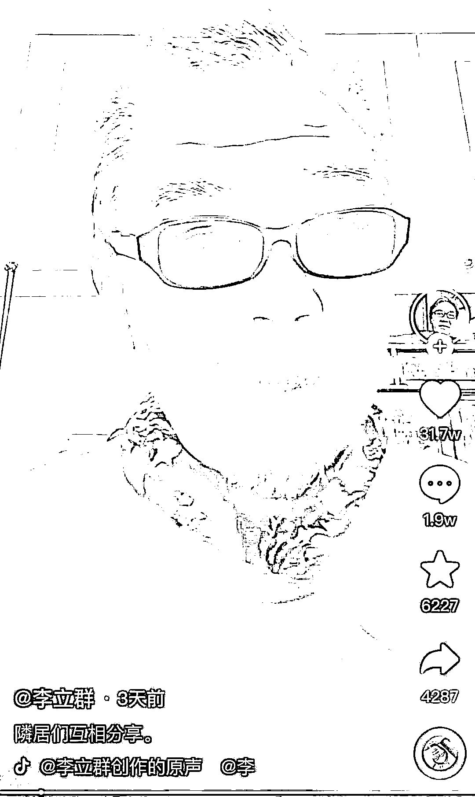
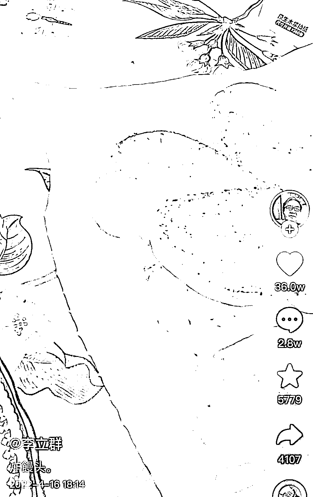
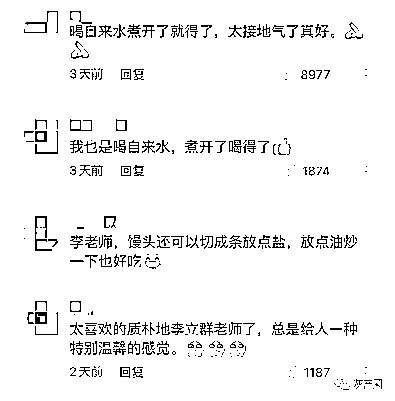
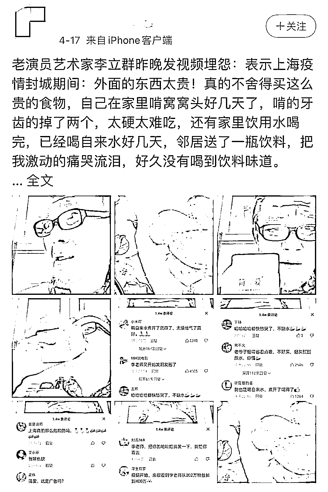

# 断水断粮喝饮料喝到哭？李立群还原实情

> 原文：[`mp.weixin.qq.com/s?__biz=MzIyMDYwMTk0Mw==&mid=2247534023&idx=7&sn=e83233494d492feb8ec2799c5919a46f&chksm=97cb8effa0bc07e91f0f86d6968f91b84f9c601bf8ed7d381e73df1f77f96d61cc5dec4d741e&scene=27#wechat_redirect`](http://mp.weixin.qq.com/s?__biz=MzIyMDYwMTk0Mw==&mid=2247534023&idx=7&sn=e83233494d492feb8ec2799c5919a46f&chksm=97cb8effa0bc07e91f0f86d6968f91b84f9c601bf8ed7d381e73df1f77f96d61cc5dec4d741e&scene=27#wechat_redirect)

演员李立群遭遇恶意剪辑事件。近日，有自媒体博主发帖称，李立群在上海封控期间生活凄惨，靠啃窝窝头、喝自来水度日，收到邻居送来的饮料后一度痛哭流涕，昨晚（18 日），**李立群在个人抖音发帖辟谣，表示相关视频是“扭曲事实、断章取义”，自己从未说过这些话。**

[`mp.weixin.qq.com/mp/readtemplate?t=pages/video_player_tmpl&action=mpvideo&auto=0&vid=wxv_2361906787022569472`](https://mp.weixin.qq.com/mp/readtemplate?t=pages/video_player_tmpl&action=mpvideo&auto=0&vid=wxv_2361906787022569472)

李立群，1952 年出生于台湾新竹，因《春光灿烂猪八戒》《大秦帝国》《温州一家人》等剧受到关注，早前移居上海。 

上海封控期间，李立群经常在抖音分享个人居家琐碎日常，晒太阳、做饭、吃饭、参与团购、做核酸等，还贡献了不少段子，“再封个几天，估计就要化成一股青烟，袅袅而去”“烟要少抽，不是为了健康，主要是怕断货”“专心吃饭，待会再来口小酒”“居委会太给力，我就坐享其劳”……在各种视频里，李立群永远是一副乐呵呵的样子，其乐观的精神感染了不少人，相关视频也多次出圈。

“物资够不够？”“烟酒够吗哈哈哈哈”，李立群的短视频下方，类似的评论多次刷屏，12 日，他还专门发布了一条“澄清”视频，表示“有一件事儿很不好意思跟大家说，其实我的烟够，我只是怕不够，结果有几十个朋友来问我说，你的烟够不够？”

他还喊话热心民众，“虽然我们家也没有很多物资，但吃完饭人没法动，我还长胖了。可别再问我菜够不够，烟够不够，我可太够了，给那些需要的人吧。”

15 日，他发布视频介绍，封控期间因为买东西不方便，所以经常与邻居们互相分享，“现在买什么东西不好买，邻居们就互相送来送去，我把多出来的肉、菜送给他们，他们就给我送红酒、稻米、油啊，油我也不缺，矿泉水我也不缺，我都是喝自来水，煮开了就得了。”

大约 30 分钟后，他又发布鼓励大家想办法一起度过难关，直言艰难时刻，中国人的民族性总是“油然而生”，大家很乐观地抵抗，定能战胜困难。

次日（16 日），他又分享了一段吃炸馒头和炸午餐肉的视频，透露午餐肉是居委会发的、馒头是邻居给的，“我就想，小时候馒头不是经常会炸吗？挺不错，我今天把重心放在炸馒头上，真的是好久不吃了。”

两段视频在抖音引发热议，点赞量近 70 万，不少网友一边点赞李立群“接地气”，一边为其加油。

然而，17 日，一些自媒体博主突然发帖，称李立群抱怨居家生活，“饮用水喝完，已经喝自来水好几天，邻居送了一瓶饮料，把我激动的痛哭流泪，好久没有喝到饮料味道。”

帖子所使用的的图全部来自前述两条视频，“故事”却大相径庭——习惯喝烧开自来水变“只能喝自来水”、炸馒头变“窝窝头”、皱眉表情变“痛哭流泪”……

其中一博主发的帖子有 4000 多条评论，一小部分人被带节奏，也有人怒斥其造谣，但目前，该博主仍未将帖子删除。

昨晚，李立群在抖音发布视频辟谣，他无奈表示，**“有一些（视频）就很奇怪，它会扭曲事实、断章取义，把我的几个抖音剪接过以后变成他的意思，比方说什么我封城期间，只喝自来水，有邻居送来饮料喝得我痛哭流涕，这些话我都没有说过呀，特此声明一下。看抖音呢，就当个乐趣看看谣言止于智者，大家也不要太听信了。”**

来源：观察者网 文/郭肖

← 向右滑动与灰产圈互动交流 →

