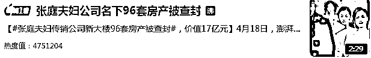
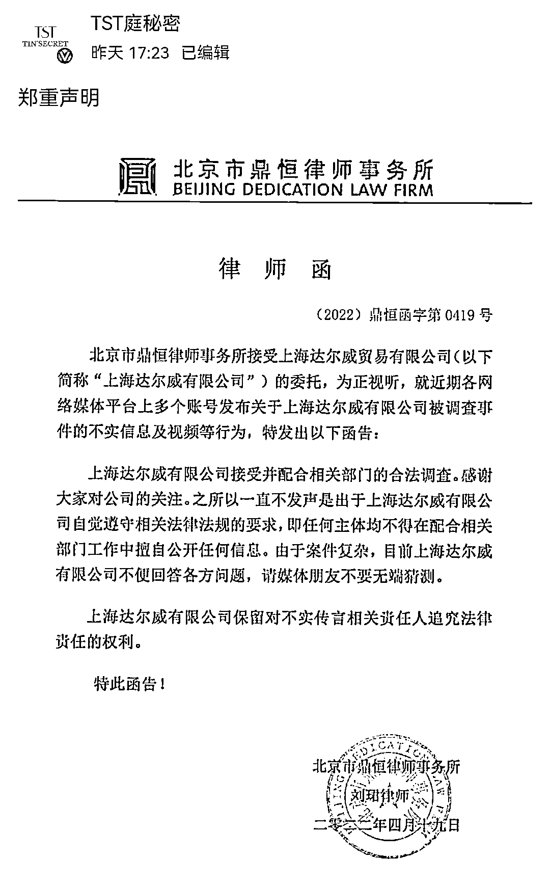
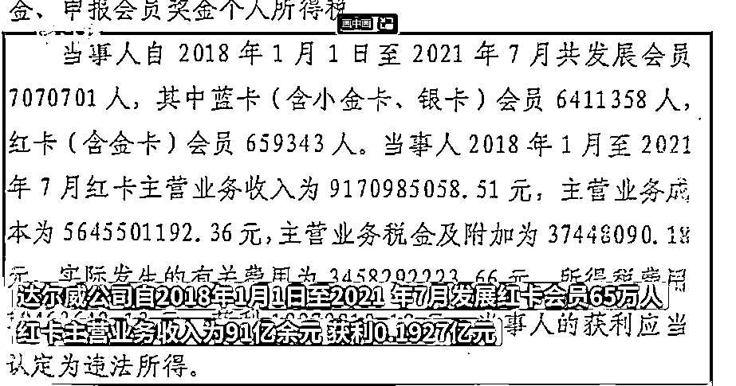
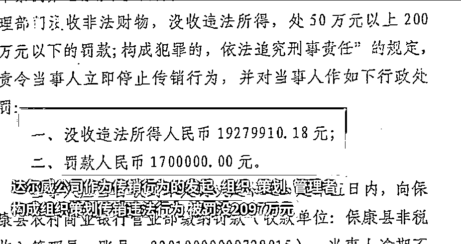
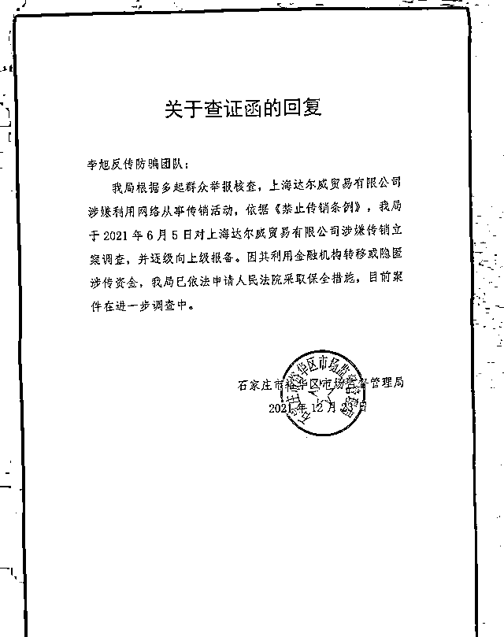
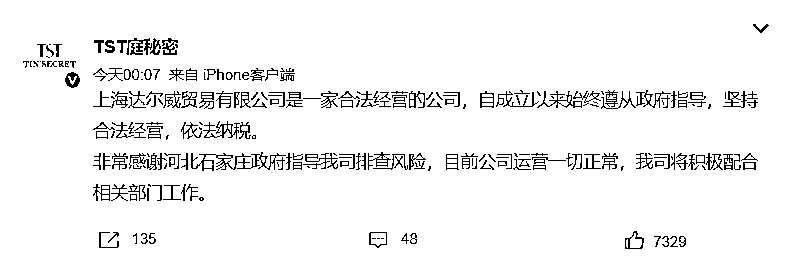
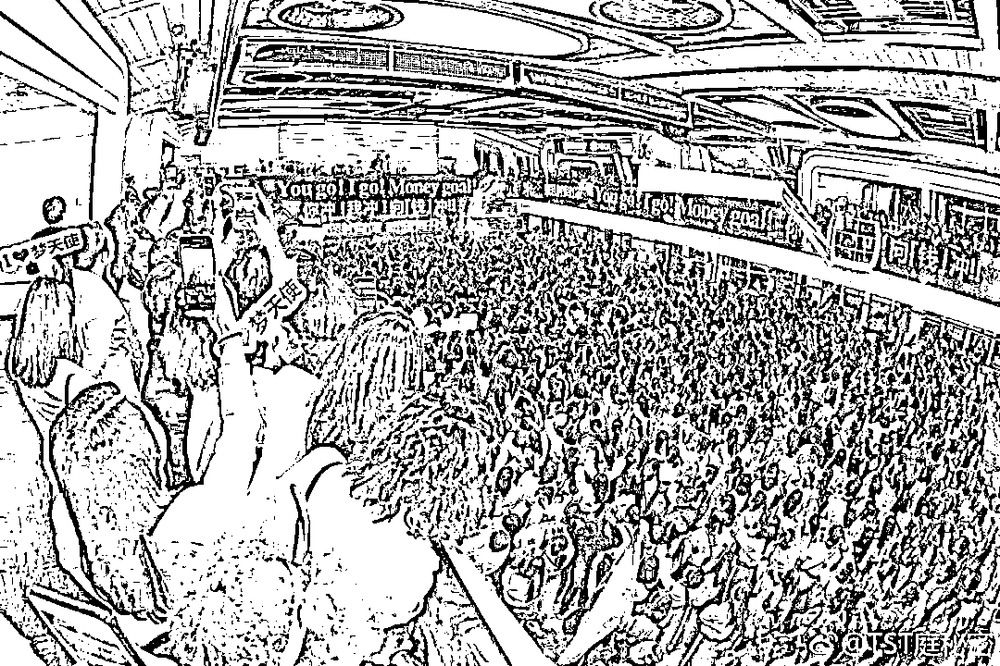

# 张庭夫妇名下的 96 套房产，会不会给“家人”们住？

> 原文：[`mp.weixin.qq.com/s?__biz=MzIyMDYwMTk0Mw==&mid=2247534089&idx=3&sn=c5d13d091ea1742614326309c32ca37f&chksm=97cb8d31a0bc04279bd464c57b87f8b98fe6d5b2d3ab69cdf0a8ecc77d1ef0408b7a58cc2604&scene=27#wechat_redirect`](http://mp.weixin.qq.com/s?__biz=MzIyMDYwMTk0Mw==&mid=2247534089&idx=3&sn=c5d13d091ea1742614326309c32ca37f&chksm=97cb8d31a0bc04279bd464c57b87f8b98fe6d5b2d3ab69cdf0a8ecc77d1ef0408b7a58cc2604&scene=27#wechat_redirect)

4 月 19 日，“张庭夫妇公司名下 96 套房产被查封”话题登上微博热搜第一，引发广泛关注。 

4 月 19 日稍晚时，演员张庭、林瑞阳夫妇所持品牌“TST 庭秘密”通过官方微博发布公告称，公司接受并配合相关部门的合法调查，目前不便回答各方问题。

**冲上热搜：明星夫妇 96 套房产被查封**

**4 月 18 日，有媒体从权威渠道获悉，**张庭、林瑞阳夫妇创办、经营的****达尔威公司因从事传销活动，导致公司名下**价值 17 亿元**的 96 套房产被石家庄裕华区市场监督管理局查封，查封日期为 2021 年 7 月 20 日。**** 

**此外，据媒体报道，湖北保康县市场监督管理局认定**达尔威公司自 2018 年 1 月 1 日至 2021 年 7 月发展红卡会员 65 万人，红卡主营业务收入为 91 亿余元，获利 1927.99 万元。达尔威公司作为传销行为的发起、组织、策划、管理者，构成组织策划传销违法行为，被罚没 2097 万元。****

****

****

****此前报道：“TST 庭秘密”涉嫌传销****

****2021 年 12 月，演员张庭、林瑞阳的公司“TST 庭秘密”因涉嫌传销被调查，在网络掀起轩然大波。****

****石家庄市裕华区市场监督管理局以查证函回复的形式，通报**知名日化品牌“TST 庭秘密”（以下简称“TST”）运营主体上海达尔威贸易有限公司涉嫌利用网络从事传销活动**，已于 2021 年 6 月 5 日对其进行立案调查。****

********

****对此，“TST 庭秘密”发布微博称，**公司自成立以来始终遵从政府指导，坚持合法经营，依法纳税。******

********

****然而，有报道称，在发布了该条微博后不久，TST 创始人张庭、林瑞阳夫妇和“TST 庭秘密”微博均被禁言。此外，张庭抖音账号亦被禁止发布作品。****

******“TST 微商帝国”的****“家人”们，******

********只是一门生意？********

******被查封的大楼位于黄浦江边，由张庭在 2020 年豪掷 17 亿购买。这种风格我们并不陌生。微信里 A 字打头的微商们，朋友圈里同样充斥着“喜提”、“炫富”等字眼，编织出的财富梦让“潜在下线”们心动。而张庭夫妇的豪气和明星光环，又为他们的“TST 微商帝国”添了份可信度。****** 

******据代理商爆料，在帝国围墙内，**林瑞阳是“大哥”，张庭是“娘娘”，而他们被称作“家人”。**每一个代理都在刷爆信用卡掏钱囤货，为了一个能和“大哥”“娘娘”拍照的指标，也为了成为“董事长”、月入数十万的梦想。******

************

******然而，“TST 微商帝国”围墙之外，是被毁容的消费者和亏本囤货的代理商们的愤怒。例如，TST 产品“烂脸”的消息每隔一段时间都会传出一次；张庭、林瑞阳的抖音作品下，在带有“TST 家族”字眼的 ID 一片赞美声中，“作秀”“没下限”等评论因为高点赞数被顶到最前排。******

******有 TST 前代理商在接受媒体采访时表示，TST 还经常做活动，以“全年最低价”、“仅售几小时”的名义变相让代理商大量囤货。**“他们都是各种套路你，让你囤货，说是什么‘零风险’‘零囤货’，其实都是假的。**”代理商们为了发展下线、成为“家人”、进入“精英群”而疯狂囤货，“**到最后也没挣到钱**”。******

******微商们纸醉金迷的朋友圈、传销者“零投资”、“加入了就是家人”的宣传，精准命中人性弱点，很容易将一些信息匮乏、精神空虚或经济紧张的人“拉下水”。在《禁止传销条例》第七条规定中，明确指出**“交入门费”“拉人头”“组成层级团队计酬”**是传销的三个特征。******

******不管传销组织如何伪装自己，只要**同时具备以下两点**就可以断定涉嫌传销：******

*   ********让你交纳一定资金或购买一定数量的产品，获得加入资格——“交入门费”；********

*   ********让你发展他人加入其中，形成上下线的层级关系，并以直接或间接发展的下线所交纳的资金或者销售业绩为计算报酬的依据——“拉人头”。********

******因此，大家在日常生活中要擦亮眼睛，挣钱的正规渠道有很多，勿要落入传销陷阱。你以为下家拉的够多就能成为公司“股东”，实则成为别人 17 亿大楼的“**精神股东**”。******

*********张庭夫妇的明星光环，*********

*********难掩公司“涉传”的本质；*********

*********一声声“家人”叫得亲切，*********

*********96 套房产，*********

*********可曾分给“家人”们半间？*********

******来源：央视网综合澎湃新闻、红星新闻、南方都市报、中国新闻网、“李旭反传防骗团队”公众号、“TST 庭秘密”微博******

************

******← 向右滑动与灰产圈互动交流 →******

************