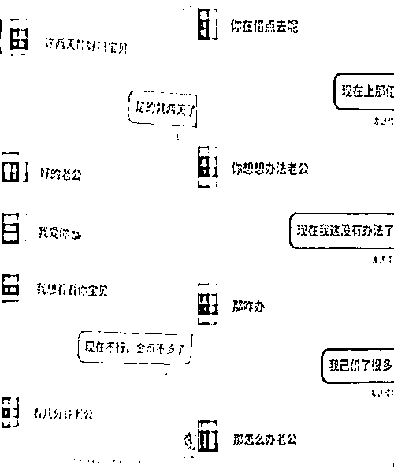

# 付费交友 APP，盯上了中老年人…

> 原文：[`mp.weixin.qq.com/s?__biz=MzIyMDYwMTk0Mw==&mid=2247534089&idx=4&sn=58d98bf16a4f0b3c9b9c87d3154df2d7&chksm=97cb8d31a0bc0427371178e33c1f6a715d5974c7be45f72d17b4d1f55329f464b611d43dfd41&scene=27#wechat_redirect`](http://mp.weixin.qq.com/s?__biz=MzIyMDYwMTk0Mw==&mid=2247534089&idx=4&sn=58d98bf16a4f0b3c9b9c87d3154df2d7&chksm=97cb8d31a0bc0427371178e33c1f6a715d5974c7be45f72d17b4d1f55329f464b611d43dfd41&scene=27#wechat_redirect)

客厅灯光昏暗，智能手机的荧光照在李健民脸上。屏幕里，一名面容姣好的中年女性与他言笑晏晏。

深夜看到这幕，刘军知道，老丈人又在和交友 APP 上认识的对象视频了。白天，老人要接送两个外孙女上学，包揽一家五口的三餐，现在正是他的私人时间。

“咱能加个微信吗？这样聊太费钱了。”反转来得很突然。眼前的“岁月静好”突变惊雷：和什么样的“对象”视频要花钱？

“只有引导视频才能快速升温，视频价格很高。不能给对方任何联系方式。你要和他谈对象吗？”另一边，一群自称推广员的人招募、“培训”聊天员，设法在奔爱、聊呀、心田等多款交友 APP 上“搞钱”。推广员发送的招聘海报宣称，聊聊天便可轻松日赚数百元。

近年来，各类交友 APP 不断涌现，它们号称同城交友、真人相亲，依靠短视频等高流量平台推送广告引流、付费聊天的模式喂养出一批企图借此“割韭菜”的人。中国人民大学人口与发展研究中心副教授靳永爱认为，**中老年人对互联网信息真伪辨别能力整体较弱，更容易成为背后灰产的受害者。**

**  贷款交友**

**在交友平台，66 岁的李健民似乎格外抢手。有人说他性格好，还有人说就喜欢他这样年纪大的。但老人不知道的是，这些甜言蜜语早被暗中标好了价格。**

**“视频 5 元 1 分钟，语音 3 元 1 分钟，文字消息 0.2 元每条。”李健民回忆，自己是在短视频平台看到交友广告，稀里糊涂下载了软件。注册后，不断有人主动打招呼，言辞暧昧，他回复了几条，页面就显示需要购买虚拟币。**

**从回复海量的打招呼消息，到成为亲密好友后日常语音、视频，李健民与“对象”们的关系在虚拟币的消耗中一点点升温。与此同时，充值由 19 元开始，单笔量并不大，但短短数月已累积近 2 万元。**

**亲密止步于现实世界。几万元花出去了，李健民从没成功“奔现”过，连拿到平台以外的联系方式都很难。有一次，“对象”称，每收到 300 元礼物就报 3 位手机号码，剩最后几位时，又变成一个一个报。李健民觉得不对劲，中途放弃了。**

**他算了算，加一个微信大概要花六七百元。通常加上没几天，对方就一改在平台上的热情，嫌他这不好那不好，然后失联。几次三番，李健民怀疑过，但依旧心存侥幸，期待下一个会是真心和他相处的人。**

**“一上来就叫老公、亲爱的，但就是死活不加微信，这正常吗？”女婿刘军觉得这是骗局，又不知道如何劝说老人，更怕他为此去借高利贷。**

**王华的父亲王强就走上了这条路。他记得，父亲也是通过短视频平台下载的交友软件，名字大概是“附近”“密聊”之类，都是付费聊天。**

****

**交友 APP 上的“对象”催促借款、视频。受访者供图**

**聊天记录中，与王强往来最密的用户总是问他什么时候发工资，催他视频。后来，王强表示实在没钱充值了，对方便让他想办法去借。于是，2021 年 12 月，搭进去 3 万多元工资后，王强又借下了一万多元的网贷，至今还在分期还款。**

****  聊天赚钱****

****列表里，那些资料上写着四五十岁、头像美颜明显的账号总是发来“想你了”“能不能看看你”，却几乎没有人主动向李健民发起视频。****

****李健民说，2021 年初以来，他先后下载过六七款交友软件，目前用的是一款名为“觅缘”的 APP，注册一个多月以来，充值了近千元。****

****在觅缘，记者未经实名及真人认证，注册了一个 61 岁的男性账号。登录后，该账号随即收到大量打招呼消息，内容暧昧。****

****女性账号的画风则有所不同。记者注册登录后，页面弹出的“每日任务”显示，女用户可通过视频、收取礼物、邀请男性用户首充等方式获得相应积分。****

****在后台，用户可设置“别人发信息、语音、视频呼叫你所需花费的金币数”，文字信息 2 金币/条，语音 30 金币/分钟，视频 50 金币/分钟。****

****平台客服称，男女用户均可自主设置，收益情况可查看积分明细。记者将状态设置为收费，收到一条文字消息获得了 200 积分。根据平台规则，不考虑优惠活动，1 元可充值 10 金币，19 元起充；2 万积分可兑换 7 元。每周积分达到一定等级，还可获得额外奖励。依此计算，付费方发一条文字消息约需 0.2 元，而收费方约可获得 0.07 元。****

****针对声称获取联系方式或见面需要达到亲密等级、赠送大量礼物，由此骗取钱财等行为，《平台声明》称，未设置任何消费条件限制发送平台以外的联系方式，用户发现违规行为可向客服举报。****

****记者实测发现，不少交友软件采用类似的聊天奖励机制。一软件开发商对这类系统成品的报价是 39800 元，“交友的基本都是这样玩，付费视频、礼物收益。”****

******  培训上岗******

****付费交友的玩法喂养出一个名为“聊天员”的群体。****

****在百度“聊天员吧”，记者随机联系到数名招募聊天员的用户，他们称自己为推广员。他们发来的招聘海报对聊天员的描述则是“年满 18 周岁，会聊天即可，每天利用空闲时间做聊天，轻松日赚 100-300（元）”。****

********

****推广员发送的招募海报。微信截图****

****“注意，一定别设置免费的。”新手聊天员交流群里，推广员提醒要将聊天设置为收费。****

****通过推广员发送的邀请码，记者下载并注册了奔爱、聊呀、心田 3 款交友软件。各平台的具体规则有所差异，但赚钱逻辑大体相似：靠和用户文字聊天、语音、视频、收取礼物等方式获得收益。****

****“平台很多，总有一个适合你。厉害的聊天员每天收入三四万元，不厉害的百八十元。”有推广员不定期在朋友圈晒“业绩”，他宣称，有新手第一天就收入近千元。****

****一名自称从业一年多的推广员提醒记者，聊天不能涉黄、诈骗。但他发来的“资料”里却写着“轻微低俗、弱色情、擦边偶尔可行”。不仅如此，这些“资料”还囊括了打如何招呼、回复，引导视频，要礼物，应付对方要微信，甚至分手善后等全步骤话术技巧。****

********

****聊天员“培训资料”。文档截图****

****例如，视频的时候穿着尽量清凉；要不时让男方觉得你有要见他的意思，如对他说“我去找你玩”；聊天的时候要演戏，用洋葱和眼药水逼自己哭......****

****“尽量不要和同城的聊，认出你了咋弄？”这名推广员还建议，可以先注册一个男性账号，看看其他女生是怎么回复的。****

******  公会运作******

****“某平台已于 3 月 29 日凌晨投放信息流，目前男用户增长已达 10 倍（后续优化后还会加量）。”3 月 29 日中午，微信群发来通知，很快有人提出要加入。群里的推广员解释，信息流是投放在短视频等平台的推广流量，也就是广告。****

****这些通知是同入一个公会才能共享的“福利”。据推广员介绍，公会可以理解为一个团队、公司，多层代理，上级享受下级的业绩提成。他们晒出的业绩截图显示，最大的团队有 8000 多人。****

********

****推广员晒“业绩”。微信截图****

****在推广员引导下，记者注册了一个名为“新环球国际”的公会。“新环球国际”规定，女性既可以当聊天员，也能做推广，男性只能负责推广。上级想要招募推广员，只需在代理中心选择“我要推广”生成一张带有专属二维码的海报，让其扫码注册即可。****

****对于应聘聊天员的女用户，上级还要引导她们通过后台生成的二维码和邀请码，下载相应交友软件，奔爱、聊呀均在其中。聊天员注册认证后，上级将交友软件上的 ID 和手机号发给客服，客服回复已绑定，代表入职成功。****

****推广员的总业绩对应不同等级，等级提升，提成比例随之提高。在“新环球国际”，具体级别划分和提成比例如何，各交友平台之间有所差异。“新环球国际”客服称，推广员最高可拿 32%团队业绩佣金。****

****多名推广员叮嘱，系统批量推送的男用户打招呼消息一定要回复。****

****“这可以说是公会的福利，不回复以后就不会给你推了。咱公会跟官方签约，只要冲咱公会注册的，平台就给特殊照顾，点位高、流量好。”一名自称隶属“新环球国际”的推广员在指导记者招募聊天员时如此宣传，他还说“新环球国际”和“环球国际”是一家。****

****心田、聊呀、奔爱均设有相关防诈骗提示。4 月 11 日，记者分别询问 3 个平台客服，是否支持公会入驻。****

****“超级推广员团队的妹子才会有资源，自己玩的普通妹子是没有任何资源的。”心田客服回复，平台有合作的公会但仅开通定向邀请，申请团队入驻需添加微信，备注“超级推广员”。记者添加相应微信后，对方表示“超级推广员”本人可享受团队 45%的收益，下级代理收益分配平台不干涉，团队用户享有系统分发推送男用户打招呼等资源。****

****奔爱客服称不与公会合作，随后有自称是奔爱商务咨询的人员拨打记者在该平台绑定的电话，表示奔爱没有公会，但有“超级推荐人”，并询问了记者团队规模、每周流水等信息。“环球国际总的模式是走量，不太在乎质量。”对方评价。****

****聊呀客服表示，不和公会合作、不招募聊天员，但想推荐获取一定流量可以留下联系方式，有专人联系。截至 4 月 15 日，记者未收到进一步回复。****

******  中老年入圈******

****“空虚老人对这些一点防御力都没有。”王华说，父亲平时在外面跑货运，一两周才回一趟家。年近六十，智能手机是他主要的消遣工具。****

****根据中国互联网络信息中心发布的第 49 次《中国互联网络发展状况统计报告》，截至 2021 年 12 月，我国 10.32 亿网民中 50 岁及以上网民群体占比达 26.8%。****

****中国人民大学人口与发展研究中心副教授靳永爱认为，互联网容易滋生谣言、虚假广告等不良信息并加速传播，而中老年人整体辨别互联网信息真伪的能力较弱，这使得他们更易成为受害者。****

****2020 年底，宁波鄞州法院审结一起网络诈骗案。涉案公司通过社交 APP 筛选，专门以 50 岁左右的中老年单身男性为目标，安排业务员将自己包装成中年丧偶女性，再以自己的“女儿”做直播要完成考核任务为由，诱导这些男性去直播间充值打赏，有的业务员甚至一人分饰母女两角。****

****湖南金州律师事务所高级合伙人、律师邢鑫分析，**公会招募女聊天员，用套路吸引用户充值，并对收益进行分成的，该行为已涉嫌以非法占有为目的，利用电信网络技术手段诈骗公私财物，金额超过 3000 元的，应以诈骗罪追究公会相关人员的刑事责任，女聊天员则构成诈骗罪共犯。******

******“聊天员虚构事实，例如谎称刷多少礼物就见面，让对方信以为真付了钱，在公安机关立案抓人前，没有退回去的，就可能被定为诈骗。”**广东广强律师事务所律师王如僧表示，**“若交友平台在此过程中主动参与或者知情，则根据实际情况判定其承担相应的法律后果。”******

******“一方面平台应加强实名制审核，设置醒目的风险提示；另一方面政府、社区、家人多方应一起帮助中老年人提升数字素养，提高防止上当受骗的意识。”靳永爱认为。******

******李健民说，最近认识了一位投缘的女士，在平台上有克制地付费视频，两人约定，等疫情过去之后见面。******

******（文中李健民、刘军、王华、王强为化名）******

******来源：人民网，利箭在行动******

************

******← 向右滑动与灰产圈互动交流 →******

************