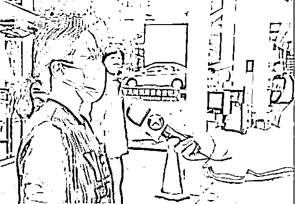
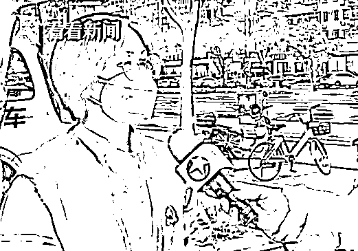

# 上海女子频繁现身新闻被传"第一群演"，本人回应

> 原文：[`mp.weixin.qq.com/s?__biz=MzIyMDYwMTk0Mw==&mid=2247534089&idx=5&sn=42c721231c24883eeba8ffe04f2dd55f&chksm=97cb8d31a0bc04277dfbca974748682230196ab2a6a18c74235f8bd116c3f2d367df2d459c83&scene=27#wechat_redirect`](http://mp.weixin.qq.com/s?__biz=MzIyMDYwMTk0Mw==&mid=2247534089&idx=5&sn=42c721231c24883eeba8ffe04f2dd55f&chksm=97cb8d31a0bc04277dfbca974748682230196ab2a6a18c74235f8bd116c3f2d367df2d459c83&scene=27#wechat_redirect)

这两天
一段关于新闻播出的聊天记录在微信群里流传好端端的一条新闻怎么就被说成是摆拍？

近期，上海金山“防范区”里的小区采取“一户一证”的方式，让各小区居民分时段到指定商超采购物资。就在上周五（4 月 15 日）的时候，**金山区卫清西路上的“山鑫公寓”也开启了小区居民分时错峰的购物通道。**

从这条新闻的标题我们也可以看出，内容是说的是“金山防范区有序开放 限时限流购物”。

小区分时开放，那周边当然要有相应的商超供给。**距离“山鑫公寓”520 米的“华润万家”超市也开门了。**终于可以“出关”了！小区居民的激动之情可想而知，记者也立马出动去感受一波居民们的“热情”。

**可谁想到，拍摄到的一位居民直接被网传为“金山第一群演”？**为了彻底说明白，4 月 19 日记者又到现场做了一番调查。

该视频号不可引用

[`v.qq.com/iframe/preview.html?width=500&height=375&auto=0&vid=h3333alzl54`](https://v.qq.com/iframe/preview.html?width=500&height=375&auto=0&vid=h3333alzl54)

**网传疑点一，她是谁？为何在一段新闻里反复出现？**

记者找到了这位被网友关注的“女主角”吴女士，她说自己是居住在山鑫公寓的上海石化退休员工，**谈到自己的意外被“走红”，吴女士是既无奈又委屈。**

吴女士：**是托吗？我说怎么可能呢？**网上都是乱喷的，那天我们一解封，我就马上套件衣服出去了，就是怕超市里人多，想早去早回。

超市里我也没注意（拍摄），只顾着自己拿东西，回来之后就是正好他们在拍摄。我家里的人住在浦东的，我妹夫什么的，他都发给我了说，他们经理说我是居委书记。我问他你帮我澄清了吗，他说澄清了呀。我觉得很可笑，太滑稽了！

看到妻子被人误解，**吴女士的丈夫十分气愤，4 月 18 日中午也在小区业主群里帮着妻子澄清了事实。**

**网传疑点二，就这么巧？老是拍到她？她是记的“托”吗？**

超市监控画面显示，被质疑是“群演”的居民吴女士是在当天下午 2 点 55 分左右进入超市。

而记者是在当天下午 2 点 58 分左右进入超市。**时间间隔将近 3 分钟，并非网友所说事先安排好一起进入超市。**

为了彻底弄清此事，记者随后又赶到了这家超市内，在先后问了 4 位顾客后，终于找到了一位在 4 月 15 号当天也曾来过的消费者。

**

顾客张女士：15 号的时候是可以正常出来购物的，我来的时候，在门口排队大概十来分钟的样子，进来的时候人流量也是比较少的情况。**确实是有这些顾客来买，我觉得不存在摆拍的情况，我觉得没有必要摆拍。因为如果真的是好的话，不管怎么样展现出来都是好的，没有必要去作秀。4 月 15 日我也来到这边，就是这里。**

那为什么在超市拍完，小区门口又拍到这位居民？

根据导航显示，**记者拍摄的小区距离超市仅 520 米，刚巧该居民和记者的节奏重合了，**记者拍完超市购物，再到小区门口拍摄居民有序返回的时候，又拍到了吴女士。

住在小区沿街楼栋上的宋阿婆，当时正好目睹了小区门口采访拍摄的整个过程。

宋阿婆：肯定是真实的，因为我就住在这个楼上，看得清清楚楚的，因为外面不能出来，我就趴在前面看，正好看见他们这样（拍摄），我就住在这个三楼。

**网传疑点三，播出时，身份条字幕显示，她是当地的书记？**

其实如果网友们看完整个报道，是不会有这个疑问的。当天记者采访的卫清居民区的党总支书记寿玲妹。

**

寿玲妹 卫清居民区党总支书记：我是卫清居民区的党总支书记，她只是我们小区里的一位居民。

那为什么当吴女士出现的时候，会有“石化街道卫清居民区党总支书记”的身份条呢？**其实这属于电视新闻常用的剪辑方式。**为防止一段采访太长画面单调，我们会在采访视频中插入相关画面。

吴女士出现的画面其实就是辅助性画面，当大家看到这幅画面的时候，是可以听到石化街道卫清居民区党总支书记寿玲妹的采访实况声，所以，大家看到的画面上的身份字幕指的是被采访者，也就是后来画面中出现的寿玲妹书记本人形象，并延续至采访结束。

事情的来龙去脉就是这样！

随着封控时间延长

人们生活不便、心情也颇烦躁

看到防范区的居民们可以走出家门购物

羡慕之余犯嘀咕、有疑虑可以理解

但是，在未经证实的情况下

把疑虑当成“事实”发到网上就太不负责任

把正常购物的市民称为“群演”

也要考虑对他人造成的伤害

上海一警察背居民上楼背的是假人？

这种揣测是一种伤害

近日，网络上流传一则关于上海闵行区的新闻报道，讲述的是警察深夜帮助一位患病居民回家并背上四楼的故事。有网友指出，画面一开始，这位居民全身看起来是白色的，随后在背上楼的过程中，全身又变成了黑色。据此，网友认为是拍摄方在造假，背的可能是“假人”。

[`mp.weixin.qq.com/mp/readtemplate?t=pages/video_player_tmpl&action=mpvideo&auto=0&vid=wxv_2361841909528215552`](https://mp.weixin.qq.com/mp/readtemplate?t=pages/video_player_tmpl&action=mpvideo&auto=0&vid=wxv_2361841909528215552)

△ 网友质疑的视频片段

为此，上海辟谣平台向视频的拍摄方闵行区融媒体中心求证，对方表示，拍摄现场均为真人真事，并非道具“假人”。之所以造成误解，是因为**警察执法记录仪运用的是热成像的工作原理，开启的是白热模式**，这意味着当光线不足时，所有热体呈现白色，便于在黑夜中寻找目标。当光线足够时，就会转为正常拍摄，于是正常物体的颜色又显示出来。而老式小区楼道一般采用感应式灯光，因此拍摄模式随着灯光的出现和关闭，不断切换白热模式和正常模式，让大家误认为画面在“造假”。

闵行区方面还提供了警察执法记录仪记录的完整视频内容。上海辟谣平台查看了这段 1 分 48 秒的执法记录，**发生在 4 月 8 日晚上 21 时 59 分左右**。视频显示，身着防护服的警察和患病居民均显示为白色，镜头内的景物均呈现黑白两色。进入楼栋口不久的第 46 秒，画面突然显现了楼道内一角的黄色灯光以及另一处的白色照明灯灯光。还能清晰地看出周边邻居的棕色大门、红色对联。紧接着看到画面里出现的这位居民，实际上身着的是黑色衣服、红色鞋子。

以下是执法记录仪记录的完整视频内容：

[`mp.weixin.qq.com/mp/readtemplate?t=pages/video_player_tmpl&action=mpvideo&auto=0&vid=wxv_2361828351557976068`](https://mp.weixin.qq.com/mp/readtemplate?t=pages/video_player_tmpl&action=mpvideo&auto=0&vid=wxv_2361828351557976068)

**希望网友们不要在毫无根据的情况下，随意揣测**，要知道这种揣测会给那些在抗疫一线付出的人们，带来巨大的伤害。

司机开救护车进上海一小区买烟？

非上海 120 系统车辆，司机已开除

# 近日，有网友发布一则视频。视频显示：4 月 17 日下午 3 时左右，在上海七宝镇吴宝路一小区内，有一辆救护车称救人开进小区，后被居民发现车上司机是在小区内买烟，居民随即报警。

4 月 19 日，记者多方核实，**该救护车并非属于上海 120 系统车辆，属于上海蓝十字脑科医院**。院方透露，该车辆为医院负责接送医护人员和运送物资的后勤保障车辆，经调查，当日这名司机在值班期间将车辆挪为私用购买香烟。该事件为司机个人行为，因严重违反医院的规章制度，目前医院已对其作出开除处理。下一步，院方将会加强对车辆和人员的管理和教育，引以为戒。

京东快递进不了上海康城小区？

莘庄镇回应

**“上海康城办公室不给京东卸货送货，**

**导致我们住户**

**很多东西进不来或被强制退款退货，**

**请帮解决这个问题……”**

4 月 18 日下午

记者收到了闵行区莘庄镇

一名上海康城小区居民戚女士的求助

该居民反映

▽

上海康城办公室不给京东卸货送货，周围别的小区都可以，唯独康城办拒绝卸货送货，导致康城住户团购的很多东西进不来，或被强制退款退货，打 12345 也没用，居民们都很着急。

记者留意到

网上反映京东快递进不了康城的网友

并非戚女士一人

网友“Carolyn H”说：本人坐标康城，下午也接到了京东电话，通知“小区不让京东的物流卸货，让我退单”。康城作为全上海最大的小区，人口大约 4 万人，在隔离的日子里基本靠小区里唯一的营业超市、团长们和跑腿小哥过活。好不容易京东采用采用“自杀式”物流可以配送了，却被小区物业和所谓的康办拒绝卸货。

有网友晒出了自己收到的京东短信，短信上说：您好京东快递，由于你小区物业原因不让我们快递进去送，物业不允许你们下来拿，小区志愿者不给送……由于整个康城订单积压比较大，现在只能为您操作拒收，疫情过后如果你有需要的话，请您再次购买。

网友“文甲吴”求助说：本人在京东购买了很多婴幼儿必需用品，包括尿不湿、奶粉等，我们小区康办却阻止京东在小区卸货，希望上级政府能够重视当下老百姓平价刚需物资保障的需求。

18 日晚，记者联系了闵行区莘庄镇。镇里反馈说，鉴于康城内居民人数众多，康城社区中心于 4 月 9 日起制定了《关于进一步加强康城社区团购报备工作的通知》，规范社区内团购行为，要求报备物资信息、核酸证明等一系列流程。经镇里了解，**4 月 17 日晚，京东快递未通过报备流程，也未与康城社区中心提前取得联系，直接将大批货物运送到康城南门卸货。****因不符合康城团购规定，鉴于康城目前疫情形势，物业无法开展配送服务。****而京东向居民发的告知拒收短信，内容存在偏差和歧义，引起居民误解。**

 **莘庄镇透露，针对这一情况，康城社区中心正积极与京东康城片区进行沟通，希望京东按照康城社区团购流程进行报备。4 月 17 日晚当日送达康城南门的所有京东快递，康城物业和志愿者们一直在积极协调人手帮忙派送。18 日凌晨 3 点，所有这批快递已经全部送至居民所在的楼洞。**到目前为止，康城南门已经没有京东的快递积压，这一情况，与京东发给团购居民的短信内容是有出入的。****

 **19 日上午，莘庄镇对记者表示，由于是疫情期间，没有报备的快递大批量进入居民小区，容易造成安全隐患。基于此，康城物业已经与京东新桥站负责人进行了沟通，并于 18 日专门召开了座谈会，**要求京东方面给出后续快递物流派送的方案，其中包括控制团购品类、履行非必要不团购不下单的要求，对团购物品分期、分类配送，不要一次性大批量配送，以减轻小区物业和志愿者人手不足的压力。**“我们会根据京东给出的后续快递物流派送方案，然后还需要最后敲定，今天双方还要再进一步沟通。”莘庄镇相关人士说。**

 **19 日中午，负责上海康城社区配送的京东快递站点负责人向记者表示，**此前早已和社区进行了送货相关的报备，**4 月 16 日、17 日也有在送货，但送货量非常小，18 日接到通知说要暂停配送。他表示，**期间一直在和社区沟通，看能否安排快递员或者志愿者在社区内部协助配送，但一直未有反馈，**4 月 18 日，在与上海康城社区方面临时一起开了个沟通会，**社区方面要求给出具体的方案以及道歉信。****

**来源：看看新闻综合新闻坊、上海网络辟谣、东方网、澎湃新闻**

****

**← 向右滑动与灰产圈互动交流 →**

****