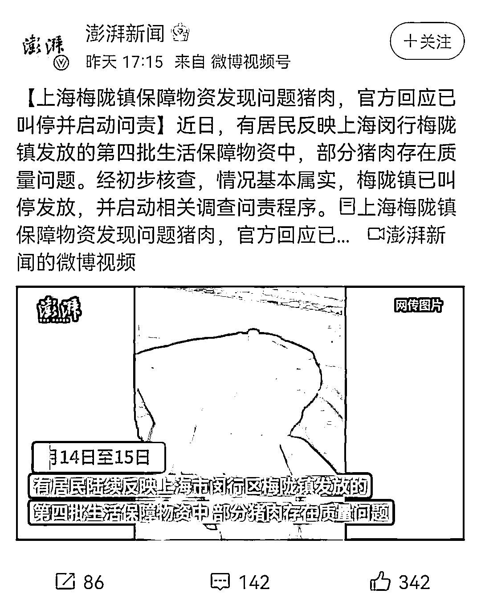
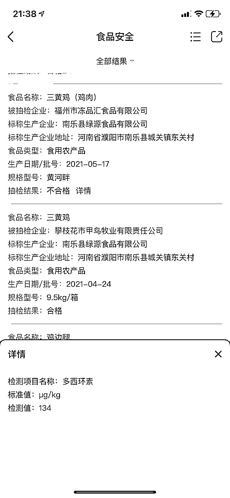

# 老坛酸菜牛肉面在上海笑而不语！

> 原文：[`mp.weixin.qq.com/s?__biz=MzIyMDYwMTk0Mw==&mid=2247534168&idx=1&sn=4754004046b43248eafcf3ee31617e83&chksm=97cb8d60a0bc0476c62442e321009667071365431ca8d7f51aecdd77c298cca8129cdbf8c4c9&scene=27#wechat_redirect`](http://mp.weixin.qq.com/s?__biz=MzIyMDYwMTk0Mw==&mid=2247534168&idx=1&sn=4754004046b43248eafcf3ee31617e83&chksm=97cb8d60a0bc0476c62442e321009667071365431ca8d7f51aecdd77c298cca8129cdbf8c4c9&scene=27#wechat_redirect)

朋友圈上海 315 的事情，这个题，其实一直是在跟进的，四天前我们这个号界面的最后一篇文章就是：[说说梅陇镇那优美的人性！](http://mp.weixin.qq.com/s?__biz=MzIyMDYwMTk0Mw==&mid=2247533909&idx=1&sn=33c2aea048138d19a2a382fc8c25e5e7&chksm=97cb8e6da0bc077b73d7bb01bc885fc4850114ff144b7640d4a1b9683a3235c1bbf9aa93b928&scene=21#wechat_redirect)

在上篇文章中，我们知道了下面的劣质奶头猪肉！

但很遗憾的是，这起事件发生的时候，对于网上的声音，相关部门采取了淡化处理。虽然也对相关人员进行了处理，也对不法分子采取刑事强制措施，但在澎湃的的报道上，当我看到下面这张还算美观的配图的时候，就知道该事件没有引起重视，一定还会有有后续！

**发到居民手里的被曝光的** 

到今天，我们看到了，从油，盐，鸡鸭，粉丝，口罩，洗护用品等等一系列的保障物资，都先后被扒出问题，具体的图片都能搜到，在这里只放我们号里读者提供的自家小区， 

具体图片如下：

很多社区居民已经吃了；

另一个三黄鸡； 

企业的存在抽检不合格问题； 

检测项目名称，多西环素；

百度了一下，是抗生素； 

就是说，我们可以看到的是，无论是上一次的劣质猪肉，还是这一次被大面积曝光的保障物资，他们的一个共性是，基本都有黑料，而毋庸置疑，为何政府指派的这些负责保障的企业要去选择这些有黑料，质量不过关的垃圾产品运回来？

答案其实只有一个，那就是利润，傻子也该知道，这些东西的质量严重不过关的价格肯定比正品便宜，下面这个龙啥玩意粉丝，也肯定没有正宗的龙口粉丝贵！

写至此，无论是上海人，还是全国各地的朋友，我们需要厘清的一个概念，大家一定要知道，这些保障物资，凡是免费的，都是财政拨款，而毋庸置疑，政府是没有那么大的人力去一一监督采购救援物资，那么就要安排给下面的一些企业，也就是一些指定的保障企业，由他们负责采购。

此次事件后，有网友也扒出了上海的一些保供企业，譬如下面这俩，经营多年，却没有任何实缴资本！

               

               

再譬如下面俩个，没有实缴资本，跟梅陇镇那个弄劣质猪肉的公司一样，都是 0 社保的空壳公司！

写到这里，其实我们需要问的是什么，看过大明王朝的都知道，每一次的朝廷赈灾，都会有一些官宦，皇亲国戚在里面横插一脚，将朝廷赈灾的银钱，都买了掺了沙子的大米，还克扣一多半，最终导致灾民饿的饿死，朝廷也一脸懵逼，怎么钱都下发了，还出现这种惨剧？

答案是被侵吞了。

古时候的赈灾，和当下的上海疫情，其实从性质上也是一样的，无论是上海政府还是中央财政播拨下的保障物资款项，肯定都不是少的，起码是与居民的人数相匹配，经过认真调研的。但问题出来了，同样的灾情，差不多的等级隔离，有的地方封禁二十天收到了不下五次物资，而有的地方封禁一个半月，只有一次物资，那么问题就出来了，发的多的肯定是比较清明的地方，发的少的地方，肯定存在蛀虫，就这么简单。

而当下的这些劣质产品，也跟古代的往大米里面掺沙子一样，被蛀虫拿着本该买精米的钱买回来一多半的沙子。问题是一样的，只是换了个形式而已。

也所以，根本的问题出来后，那么很多人好奇了，以史为鉴，这么浅显的问题，为何不能制止，为何还要用这些 0 社保，无缴纳资金的空壳公司作为政府保障许可企业呢？

其实这个问题，我也想知道，很多网友也想知道，京东进来了，为何反倒得罪了人？

那个自由派沈万三去赈灾，花了自家的钱，做了好事，省了国库，为何最后还掉了脑袋

就不说的太透了，知者自知。

因为说了也没用吗，哈耶克早在 20 世纪就曾说过：商品市场没有自由竞争，质次价低的企业就会鸠占鹊巢；思想市场没有自由竞争，错误的思想就会流毒人间。

如果读到这里，很多人还是骂人性，骂无良企业的话，那就是没脑子了，也所以，无论是那个龙什么粉丝，还是抗生素超标的鸡厂，他们都不应该在这件事上被骂，最该骂的是拿钱去买他们东西的人，以及这个买家背后的那个大蛀虫！

包括外地支援上海的一些杂牌物资，很多人不理解人家支援你就不错了，还挑三拣四。各位，这个性质是不一样的，全国人民支援上海，全国各地下发的物资救援资金，也可是要买正品的钱，如此买来了三无产品，那最受伤的是支援方的人民。打个最浅显的比喻，咱们村与隔壁村世代相较，结果隔壁村失火损失惨重，村民都吃不上饭，然后村长号召大家捐一点钱给隔壁村买米，用于援助。而后村长把收上来的钱，交给会计去买米买面，会计呢留了一点，然后让自己的小舅子去负责购买，结果小舅子拿着一百万的钱，只买了价值 20 万的劣质米面送到隔壁村，那么，如此，最受伤的又该是谁？

这样讲，是不是又说得太透了！

最后，那个北京原公安局长，司法部部长傅政华刚刚被批捕了，反腐倡廉依旧在路上，打不完啊！

来源：我会永远在你身后

← 向右滑动与灰产圈互动交流 →

