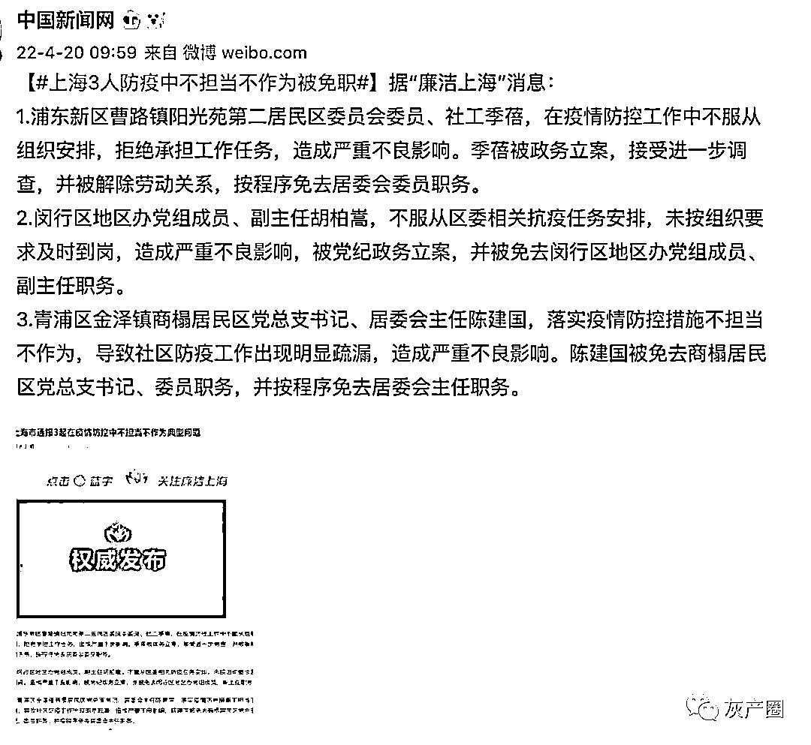
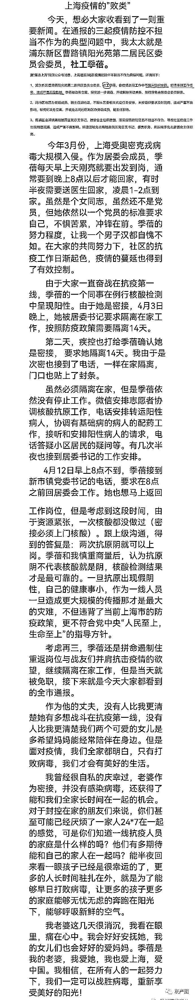
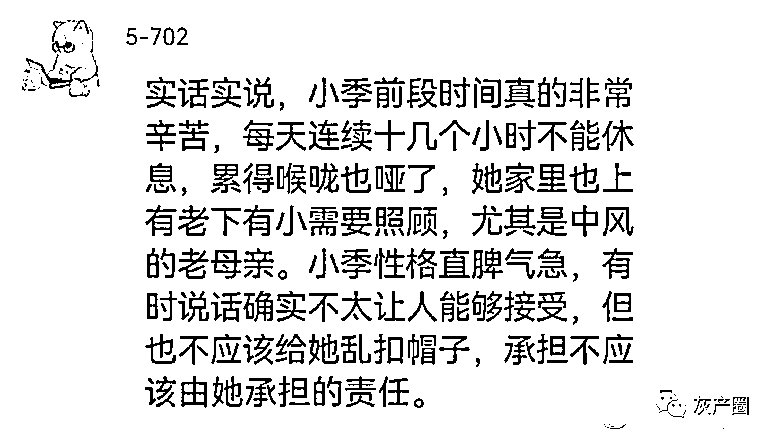
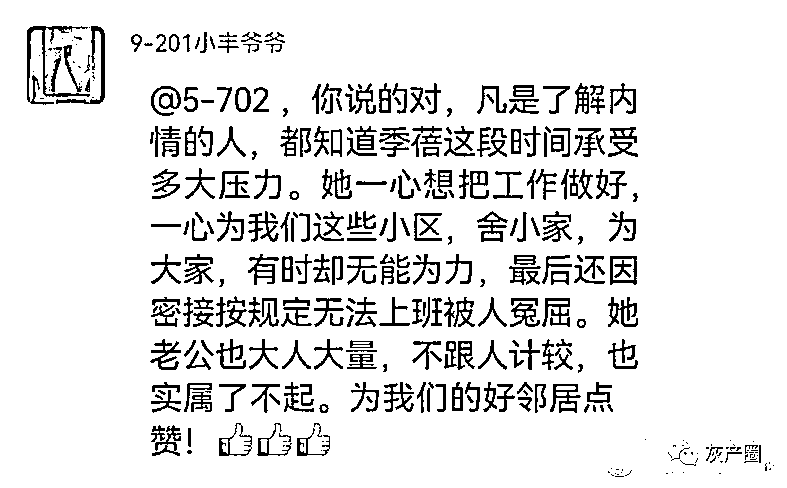
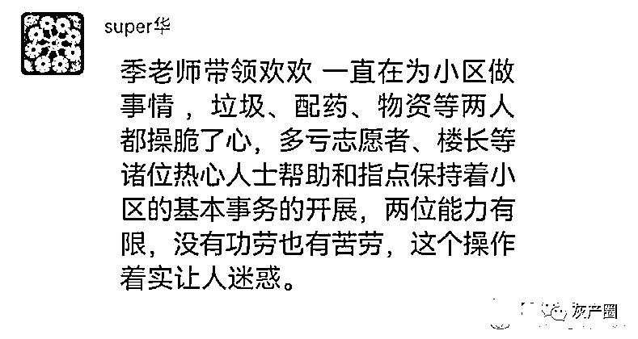
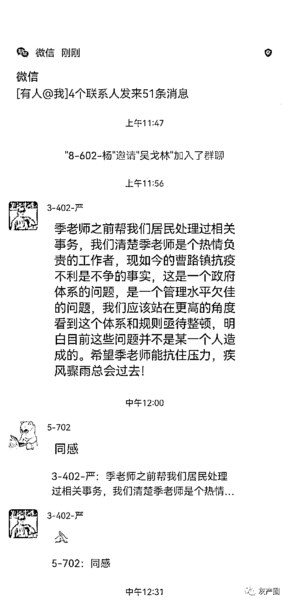
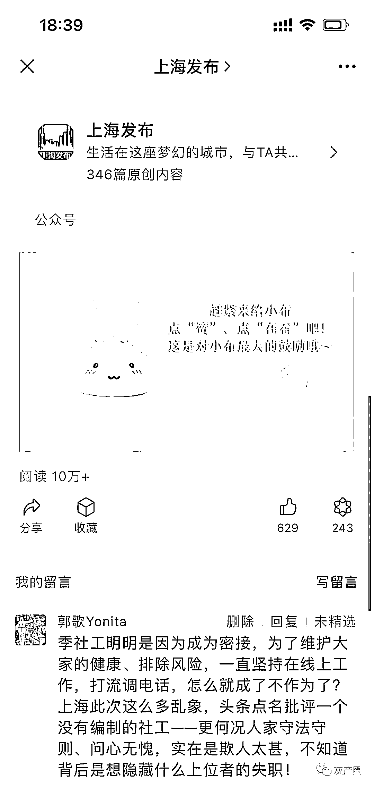
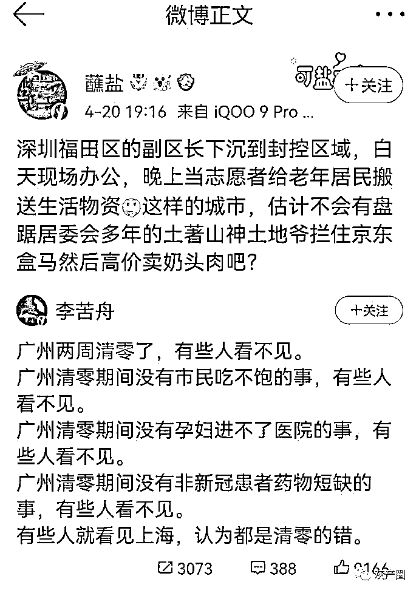
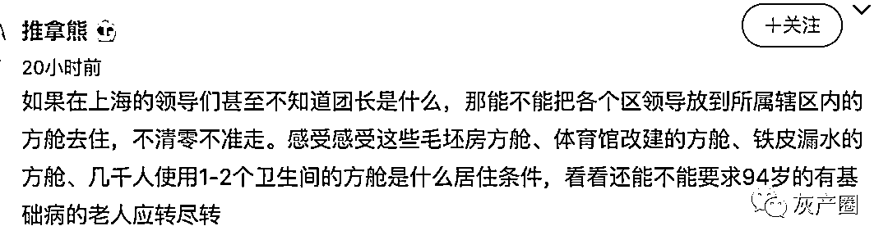

# 上海处理了一名“不听话”的社工，家属不干了！没这么欺负人的！

> 原文：[`mp.weixin.qq.com/s?__biz=MzIyMDYwMTk0Mw==&mid=2247534168&idx=4&sn=6e40dff2dab8eccc70ecb998383ff8d5&chksm=97cb8d60a0bc0476084de9e1602b364cfcb22947b95c50d897d4c6ae3af6b9adb824a4d27694&scene=27#wechat_redirect`](http://mp.weixin.qq.com/s?__biz=MzIyMDYwMTk0Mw==&mid=2247534168&idx=4&sn=6e40dff2dab8eccc70ecb998383ff8d5&chksm=97cb8d60a0bc0476084de9e1602b364cfcb22947b95c50d897d4c6ae3af6b9adb824a4d27694&scene=27#wechat_redirect)

20 日，上海市通报 3 起在疫情防控中不担当不作为典型问题。其中一位社工引发网友热议。

上海这查的够细的，连社工都查出来了，但是社工家属觉得冤枉，在微博上为自己老婆鸣不平：一线工作者密接，需按防疫规定自我居家隔离，也跟直属上级报备过居家办公，但行政管理层以她消极怠工通报批评。

网友对此也很不满

原来三个社区委员就能把上海弄成这个地步？看看人深圳是怎么做的？

* * *

睡衣帝 :基层工作人员也是压力大，社工不服从工作调配，都要全国通报，并且上热搜。。。。

11 号瓶 _ 一串花朵:看那个通报的架势，我还以为上海现在这个鬼样子都是这个社工害的呢。保供资质是她盖章定的，通行证是她卖的，猪咪咪肉是她联系的，援沪的菜是她扔的，是吧？

土豆牛肉高粱:不是，抛开这段文字的真假……抛开截图的真假…… 上海乱成这样抓到的典型就这？不对吧！

来源：微博那些事儿

← 向右滑动与灰产圈互动交流 →

