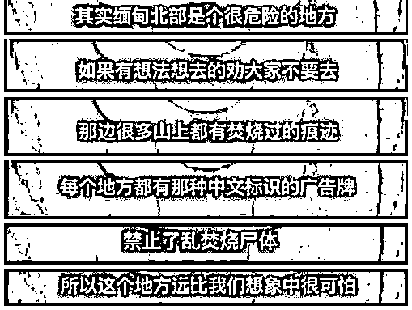
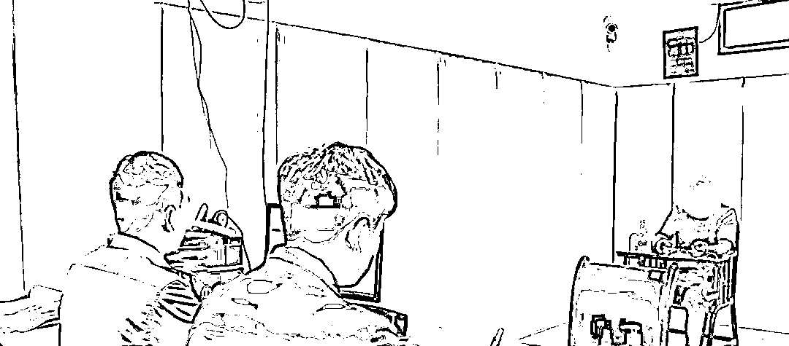

# “那里的山上都竖着牌子：禁止乱焚烧尸体！”

> 原文：[`mp.weixin.qq.com/s?__biz=MzIyMDYwMTk0Mw==&mid=2247534168&idx=5&sn=422d20d95da0560f4399bf550ab7c382&chksm=97cb8d60a0bc04768d8429c6328bf741c45bb8b435b17918a4cf9ffc783e06bd92051df88dfb&scene=27#wechat_redirect`](http://mp.weixin.qq.com/s?__biz=MzIyMDYwMTk0Mw==&mid=2247534168&idx=5&sn=422d20d95da0560f4399bf550ab7c382&chksm=97cb8d60a0bc04768d8429c6328bf741c45bb8b435b17918a4cf9ffc783e06bd92051df88dfb&scene=27#wechat_redirect)

**“山上都有焚烧过的痕迹**

每个地方都有那种中文标识的广告牌

**上面写着：**

**禁止乱焚烧尸体**

这个地方远比我们想象得要可怕！**”**

********

****近日**** 

****蚌埠龙子湖刑侦大队民警****

****发现辖区居民李某****

******曾偷越国边境******

******前往缅甸从事诈骗工作******

****民警经过缜密侦查****

****将其抓捕****

 ****[`mp.weixin.qq.com/mp/readtemplate?t=pages/video_player_tmpl&action=mpvideo&auto=0&vid=wxv_2364495524067704833`](https://mp.weixin.qq.com/mp/readtemplate?t=pages/video_player_tmpl&action=mpvideo&auto=0&vid=wxv_2364495524067704833)**** 

****00:****

****李某供述自己****

****从 2021 年 5 月起****

****在缅甸的一家诈骗公司****

****从事“杀猪盘”电信网络诈骗****

****李某在诈骗团伙中****

****负责引流阶段****

****其任务是在各大社交平台****

******以优质单身男青年（身份）******

******与女性聊感情、聊投资******

****并将女性****

****引入到他们自制的虚假投资平台上****

********

****经过进一步审讯****

****李某交代****

****有另外几名犯罪嫌疑人****

****和他一同偷渡出境从事诈骗活动****

******目前******

******涉案的七名犯罪嫌疑人******

******都已被刑事拘留******

****案件正在进一步审理中****

********

****来源： 市公安局龙子湖分局****

********

****← 向右滑动与灰产圈互动交流 →****

********