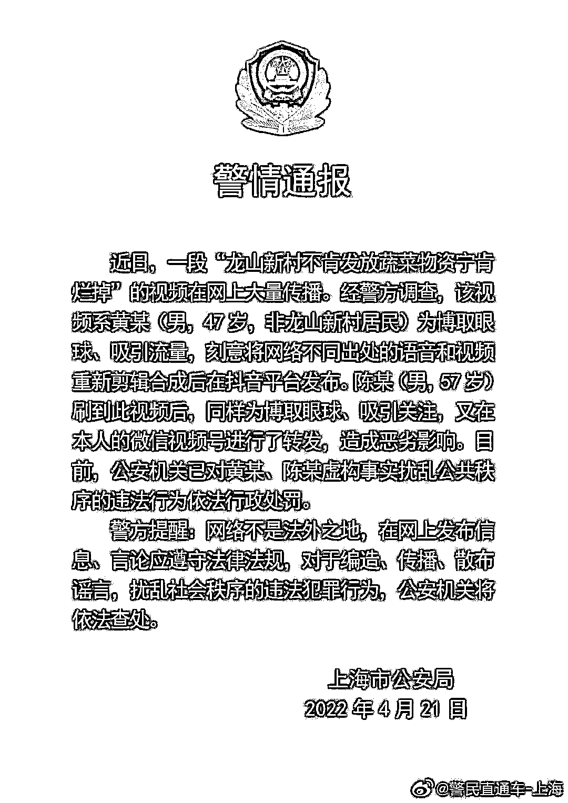
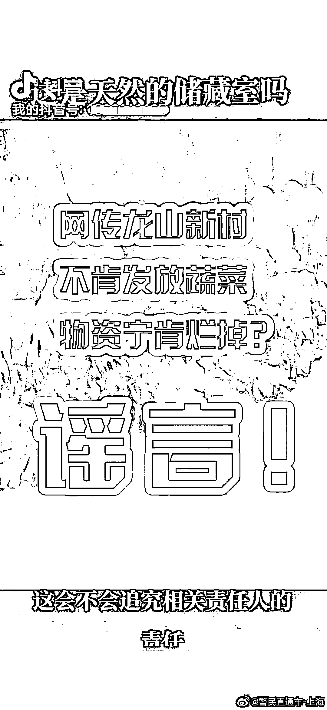

# 宁肯烂掉也不发蔬菜物资？上海警方通报！

> 原文：[`mp.weixin.qq.com/s?__biz=MzIyMDYwMTk0Mw==&mid=2247534168&idx=6&sn=ee26a64474db80b415ae418507dfae10&chksm=97cb8d60a0bc04766783243508b294481f8b53a33c2f733c71c3c2a8397b07e4655138b4f720&scene=27#wechat_redirect`](http://mp.weixin.qq.com/s?__biz=MzIyMDYwMTk0Mw==&mid=2247534168&idx=6&sn=ee26a64474db80b415ae418507dfae10&chksm=97cb8d60a0bc04766783243508b294481f8b53a33c2f733c71c3c2a8397b07e4655138b4f720&scene=27#wechat_redirect)

据@警民直通车-上海 4 月 21 日消息，近日，一段“龙山新村不肯发放蔬菜物资宁肯烂掉”的视频在网上大量传播。经警方调查，**该视频系黄某（男，47 岁，非龙山新村居民）为博取眼球、吸引流量，刻意将网络不同出处的语音和视频重新剪辑合成后在抖音平台发布。**陈某（男，57 岁）刷到此视频后，同样为博取眼球、吸引关注，又在本人的微信视频号进行了转发，造成恶劣影响。目前，公安机关已对黄某、陈某虚构事实扰乱公共秩序的违法行为依法行政处罚。

图自@警民直通车-上海

图自@警民直通车-上海

来源：@警民直通车-上海

← 向右滑动与灰产圈互动交流 →

