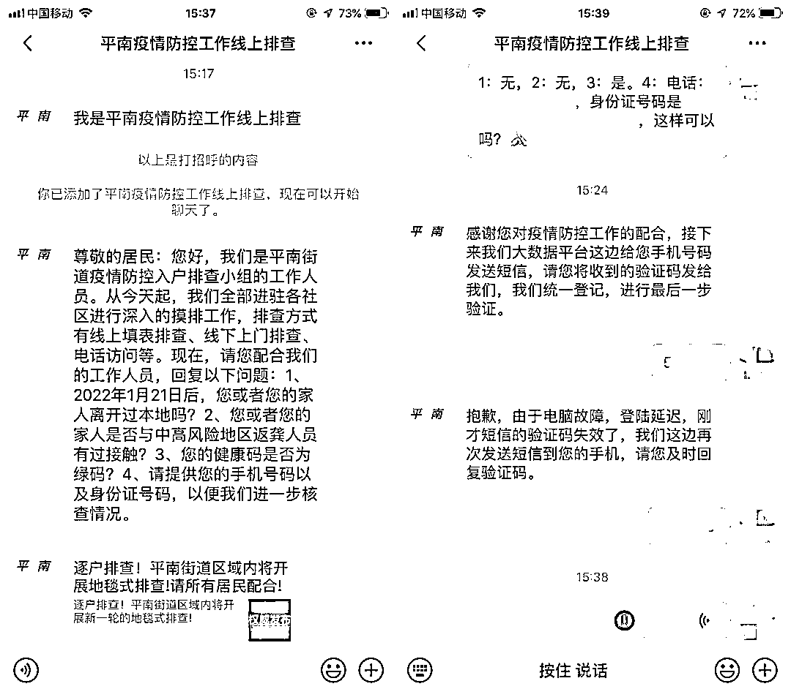
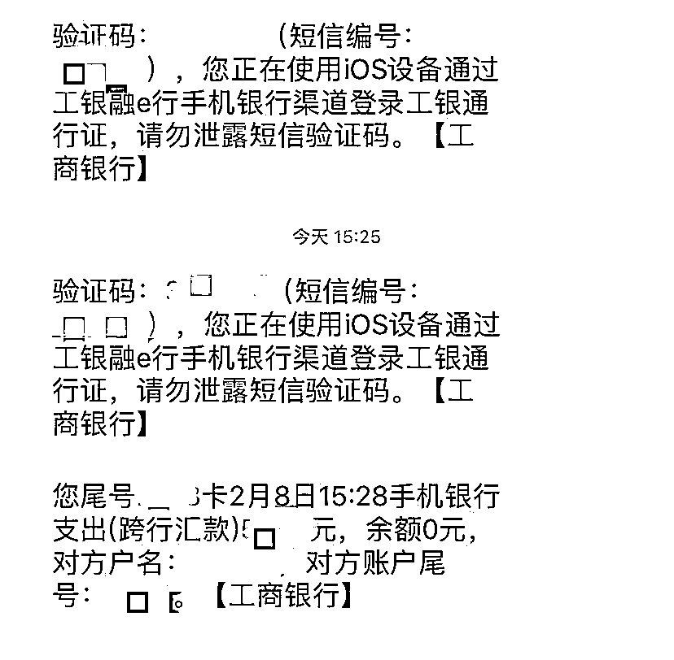
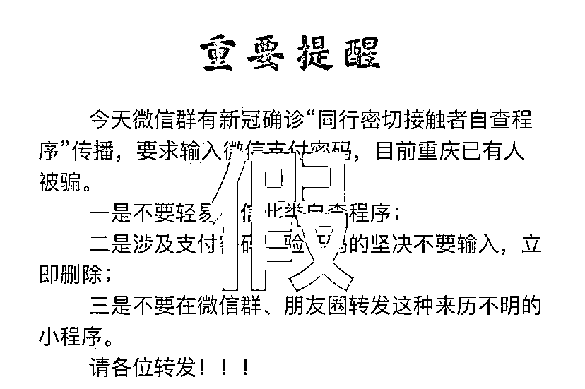
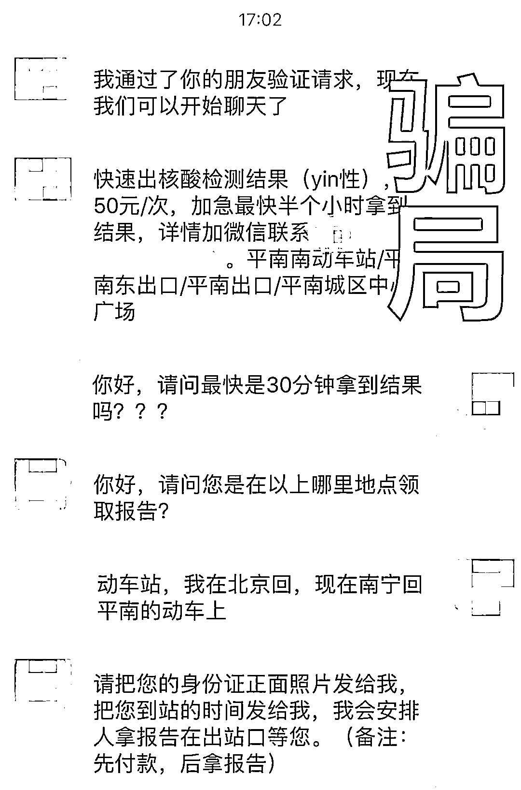
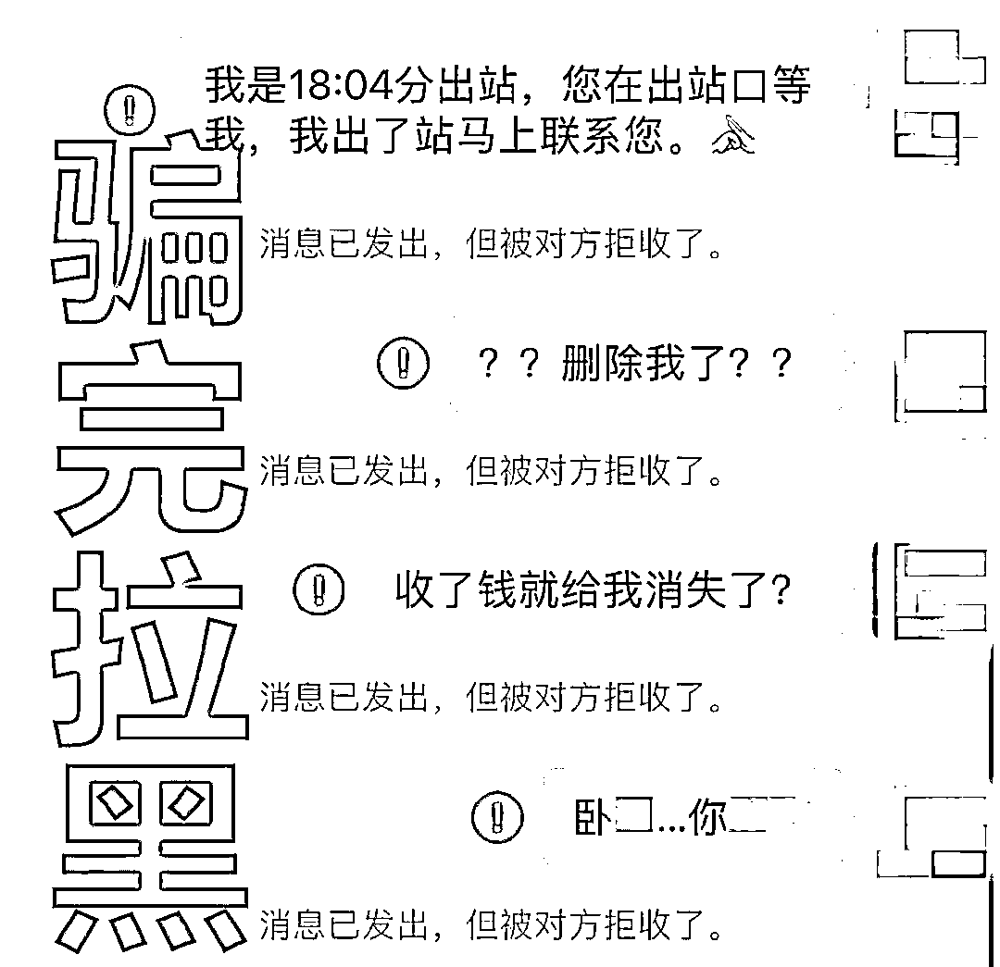
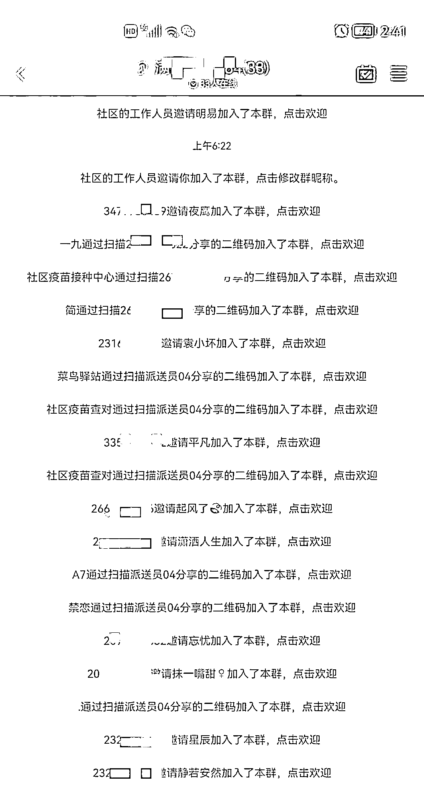
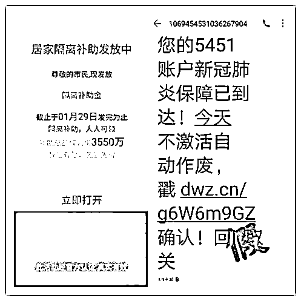
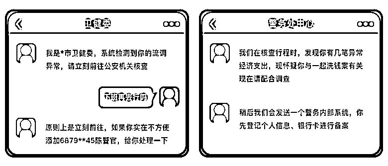

# 紧急扩散：遇到，立即拉黑！

> 原文：[`mp.weixin.qq.com/s?__biz=MzIyMDYwMTk0Mw==&mid=2247534168&idx=7&sn=9fa2844ba8c9da1ffb81b9fd6d99df88&chksm=97cb8d60a0bc047648de1db5f23831a70cc059b1567017f3257f1bc705ddffd21b9b408c5a42&scene=27#wechat_redirect`](http://mp.weixin.qq.com/s?__biz=MzIyMDYwMTk0Mw==&mid=2247534168&idx=7&sn=9fa2844ba8c9da1ffb81b9fd6d99df88&chksm=97cb8d60a0bc047648de1db5f23831a70cc059b1567017f3257f1bc705ddffd21b9b408c5a42&scene=27#wechat_redirect)

近期，各地出现多起涉疫情骗局 

一起了解骗局“套路”

提高警惕

**“疫情排查”类诈骗**

**诈骗分子伪装成“疫情防控中心”或“卫健委”工作人员，谎称进行线上排查，要求受害人提供重要个人信息，从而盗取受害者银行卡内资金。**

****

****

****防骗提醒****

**诈骗分子对于防疫的要求措施，往往说得头头是道，让人一下难以分辨。需要注意的是，**排查工作组不会收集您的银行卡号、网银账户密码等敏感信息**，问到这些的时候，就要警惕了。**

******虚假“密接信息”类诈骗******

**诈骗分子冒充防疫中心工作人员，以受害者是“密切接触者”为由，向受害者发送冒充“自查程序”的钓鱼链接，要求受害者填写个人信息和支付密码等。** 

****

****防骗提醒****

**不明链接不要点！如果收到相关短信，可以在国家卫生健康委推出的**“同行密接人员自查”的小程序里先自行筛查。****

******“快速核酸检测结果”******

**聊天群里出现“快速出核酸检测结果”“加急最快半个小时”“家里也能做核酸检测”的信息，只要额外付费便能办到，这是骗钱的套路。** 

****

****防骗提醒****

******核酸结果一定要在经卫健部门认证的具备资质的医院、专业医疗机构或第三方检测机构进行检测**，不要轻信所谓“私人渠道”。这不仅可能影响自身正常出行，更有可能落入骗局。****

********“核酸结果查询群”诈骗********

****诈骗分子通过号商批量购买账号，伪装成“疫苗接种普查调查员”或“回访员”，以社区工作人员的名义添加好友，再将受害人拉群。群内发布刷单、赌博等违法违规信息，最终被做任务拿返利的诱惑落入刷单诈骗。****

********

******防骗提醒******

********刷单是违法行为**，大家要提高警惕，勿心存侥幸。此外，骗子多通过手机号码添加好友，一定要注意保护个人信息。******

**********“领取居家隔离补贴”骗局**********

******诈骗分子冒充公司人事、财务部门或通过邮箱向公司员工群发邮件，称现根据国家政策发放工资补贴，需及时扫码登记领取，将被害人引流至“钓鱼网站”，骗取资料后，对被害人的银行卡实施盗刷。****** 

************

********防骗提醒********

********请勿点击电子邮件或短信中与资金补贴有关的链接。政府和职能部门不会通过电子邮件、电话或短信等形式与您取得联系，不会要求您提供个人或银行等详细信息，对于主动联系您的一定要心存戒备，并**拨打官方电话进行核实。**********

************流调异常类诈骗************

********骗子冒充防疫工作人员，要求当事人必须在一定时间内到某地点进行核酸检验，否则将要承担一定的法律责任。骗子甚至会主动提出将电话转接至“公安局”，要求当事人按提示输入个人身份证、银行卡密码等重要信息，以清查资金洗清嫌疑为由诈骗钱财。********

****************

**********防骗提醒**********

**********公安机关不会线上办案，更不会与涉案人员有金钱往来**，以涉拐、经济犯罪、非法提取社保、阻碍疫情防控等理由要求清查资金的都是诈骗，切勿轻信。********

## **********这个电话，再晚都要接！**********

## **********但这 7 个问题别回答**********

********4 月 17 日，广州市疾控中心副主任袁俊提醒市民，若在深夜接到流调电话，请一定要耐心接听。********

********<mpvideosnap class="js_uneditable custom_select_card channels_iframe" data-pluginname="videosnap" data-id="export/UzFfAgtgekIEAQAAAAAA2B8mbLrwYgAAAAstQy6ubaLX4KHWvLEZgBPEzKMQaHtiXuqDzNPgMIuoACbQf8qBwZ1fGgr29a7y" data-url="https://findermp.video.qq.com/251/20304/stodownload?encfilekey=rjD5jyTuFrIpZ2ibE8T7Ym3K77SEULgkiaYJPv8hibILLHMlbALtsicEQgiafic4xugyysicBB0t7alsRWxZvMxQLbYKicUmicHv0XaVbljqwqhP4Y37gPJJmygDabw&amp;adaptivelytrans=0&amp;bizid=1023&amp;dotrans=0&amp;hy=SZ&amp;idx=1&amp;m=&amp;scene=0&amp;token=AxricY7RBHdWhpUUBVXfLBala3MSvf88yHFxW2d1wlSO0oJbH6HEUT1bRZggWKwibAnIks88ibHnFM" data-headimgurl="http://wx.qlogo.cn/finderhead/hrwpjMZ0opdo0MdrUjnJiansbzRloWOlUh97RBW9708Q/0" data-username="v2_060000231003b20faec8c4ea8c1cc0dcc601e534b0773aa9603eca02504c0157bc3a7309cd07@finder" data-nickname="南方日报" data-desc="广州疾控：本次疫情目前取得了阶段性成果，病毒传播基本被阻断，但仍需进一步巩固来之不易的成果。#疫情防控 #广州疫情" data-nonceid="2244797902998828768" data-type="video"></mpvideosnap>********

********这个电话很重要********

********但也容易被骗子利用******** 

**********01**********

**********什么是流调？**********

********流调的全称是流行病学调查，就是要搞明白：在过去重要时间段里，你走过的路、遇到的人和发生的那些事儿，是否有传播疾病的可能或被传染疾病的风险。********

********这过程，其实就跟福尔摩斯探案一样，抽丝剥茧，通过线索弄清传播链条：发现密接和次密接人群，并找出引起疾病流行的主要原因，采取精准的防控措施。********

**********02**********

**********流调都问些啥？**********

**********个人信息**********

********姓名、年龄、家住哪里、家里有几人、现在位置……********

**********健康状况**********

********近期可有不适？近期是否就医？是否有发烧咳嗽等异常情况，是否做过核酸检测……********

**********疫区旅游史**********

********是否去疫区旅行过、经停过，走过的路，到过的地方……********

**********疫区居住史**********

********你的老家在哪？回去住了没？********

**********病例密切接触史**********

********同乘旅客、近距离交流、居家成员、同事同学、围观群众……********

**********交通工具**********

********是否乘坐飞机、火车、汽车、轮船……********

**********其他必要信息**********

********对疾病防控有用的信息。********

**********03**********

**********流调员打你电话，该咋办？**********

********接到流调电话时，先稳住、不要慌。被流调，不等于被感染。********

********遇到流调人员登门拜访或电话、微信询问时，请一定配合，仔细回顾近期行程，如实回答。********

********流调人员只有获得真实、有效的人群信息，才能科学评估疫情动态，采取正确的防控措施。拒不配合，故意隐瞒情况，造成疫情传播的还会被依法依规惩处。********

**********04**********

**********流调会保护隐私吗？**********

********必须的！流调过程中，公民的个人信息和隐私是受法律保护的，所获得的所有信息都严格保密。********

**********05**********

**********这 7 个问题，流调员绝对不会问！**********

********如何辨别流调员的电话？注意了！真正的流调工作人员，并不会：********

********1\. 询问财产等与疾病传播不相关的问题；********

********2. 以任何理由发送二维码让你扫描；********

********3. 找你索要银行卡号、密码或验证码；********

********4. 以任何理由发送链接让你点击；********

********5. 推销任何产品或以任何理由要求你付费；********

********6. 以任何理由要求你加入 QQ 群、微信群；********

********7. 以任何理由让你转账和进行所谓的“资金核查”。********

**********擦亮眼睛，注意鉴别********** 

**********勿掉入骗子陷阱！**********

********来源 ：公安部网安局、广州卫健委、南方+客户端、潇湘晨报************************

********← 向右滑动与灰产圈互动交流 →********

****************