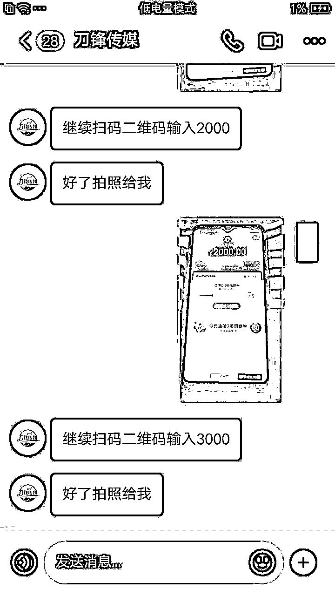

# 骗子是没有底线的！连小学生都骗！

> 原文：[`mp.weixin.qq.com/s?__biz=MzIyMDYwMTk0Mw==&mid=2247507077&idx=2&sn=f1a5577def91f8770b75b5332eb54b34&chksm=97cb17bda0bc9eabab2de0378ddba62d703df12cd95cb735f2bead02cf46a561540343c1ecdd&scene=27#wechat_redirect`](http://mp.weixin.qq.com/s?__biz=MzIyMDYwMTk0Mw==&mid=2247507077&idx=2&sn=f1a5577def91f8770b75b5332eb54b34&chksm=97cb17bda0bc9eabab2de0378ddba62d703df12cd95cb735f2bead02cf46a561540343c1ecdd&scene=27#wechat_redirect)

点击蓝字“**灰产圈**”关注我们！

因为喜欢刷一些短视频平台也喜欢发短视频，杭州的一名小学生小 D 每天做完作业都会玩上一两个小时的手机，粉丝数也从最初的几人涨到现在的 300 多人。

12 月中旬的一天，小 D 在刷小视频的时候看到了有个叫“刀锋传媒”（该账号主人并非骗子，账号被盗目前已拿回）的人加了关注并发来一张**人民警察证照片**，证件上有**清晰的警察照、属地单位和警号**等。

这位自称是刑侦民警的人质问小 D：**你最近有没有做什么违法的事情？**还称：**我们警方检测出最近你个人信息存在诈骗行为，请你立刻配合我们调查，否则将会承担刑事责任，甚至会严重到“坐牢”！**小 D 一头雾水，但是信以为真了，他天真地以为自己的账号被人盗用实施了诈骗。为了自证清白，小 D 答应配合民警开展调查，并不将这件事情告诉大人。

“警察”先让小 D 拿来妈妈的手机，但是因为妈妈要出门没拿成。小 D 拿来了爷爷的手机，并在“警察”的指挥下加入了名为“警方检测”的微信群。

在对方的指挥下，小 D 拿着爷爷的手机打开了支付宝，通过扫描“检测群”中的收款二维码，刷脸支付了 5 笔:分别是**1000、2000、3000、5000、8000**。为什么小 D 能成功解锁支付?因为**彼时的爷爷正在午睡，在“警察”叔叔的指挥下，小 D 摇醒了爷爷。**因为小 D 经常玩爷爷手机，爷爷便没有询问，在爷爷**半梦半醒中**，小 D 将手机对着迷迷糊糊的爷爷，完成了一次次汇款。

期间，小 D 也不止一次跟“警察”叔叔确认：检测好之后，钱是否能还给爷爷，都得到了对方肯定的回复。在全程紧张的转账之后，“警察”还成功劝说小 D 在“检测群”中连续发了**9 个 200 元**的红包…… 

后来的后来，小 D 也渐渐觉得不对劲了，告诉了爷爷转账的事情。当晚，还是一脸懵的小 D 在爷爷陪同下到派出所报了案，目前案件正在调查中。

**骗子套路**

1

在抖音平台上寻找合适的作案对象。

2

假冒警察，发来虚假证件，让小朋友信以为真。

3

各种套路让小朋友拿来家长的手机向骗子转账，教小朋友找理由骗大人刷脸。

4

口吻严厉，频繁使用“立刻”、“马上”这些词汇，让小朋友产生紧张、畏惧的心理。

虚拟的网络世界充斥着各种骗局，而每一个骗子都是深谙心理学的行家里手。老师和家长一定要加强对孩子的反诈骗教育：来历不明的电话、短信、链接一律不管不看不点，不要贪图小便宜，不能轻信中奖、赚外快等说辞，对于陌生人任何理由的转账、汇款，坚决不听不信不转账。 

在此，也呼吁家长朋友们，千万保管好自己的手机，尤其不要将各种支付密码告诉小朋友。

来源：平安西湖，杭州防诈骗，利箭在行动

← 向右滑动与灰产圈互动交流 

