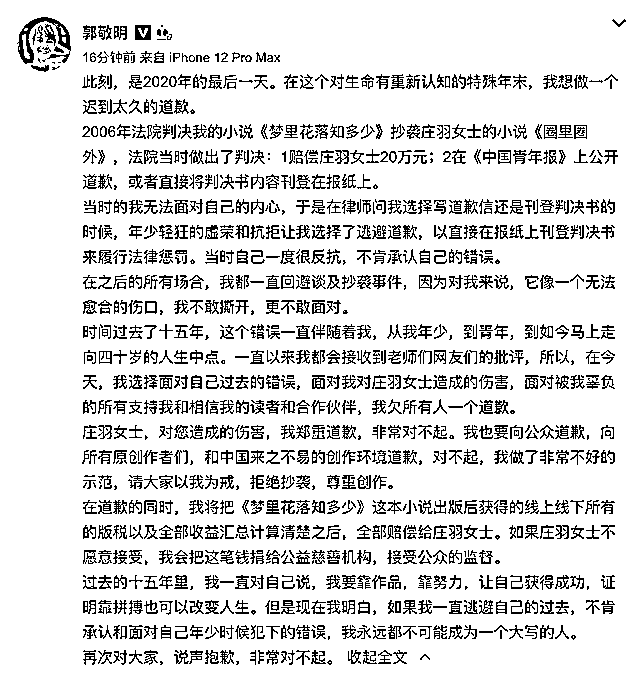
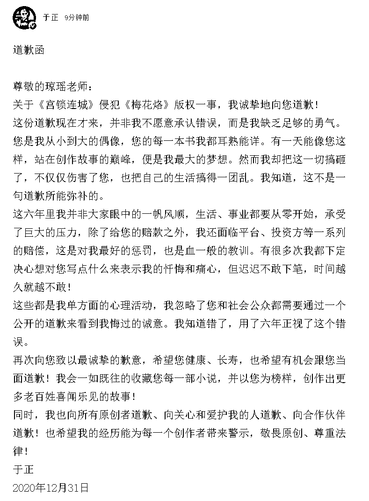
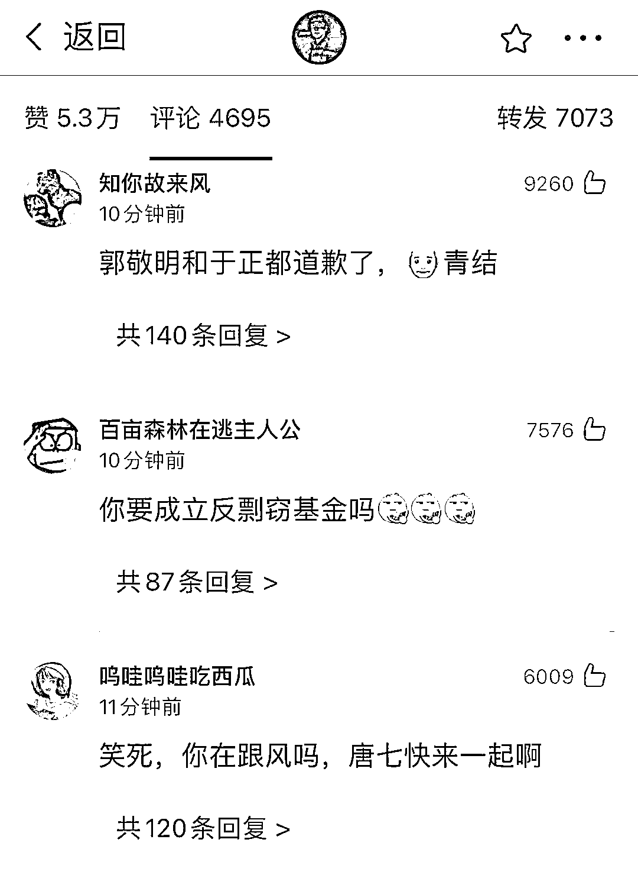
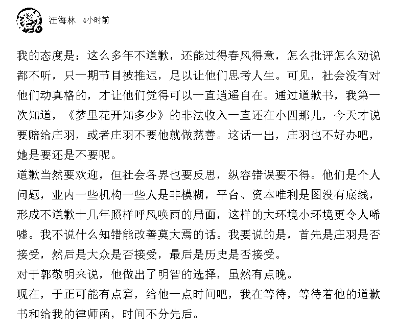
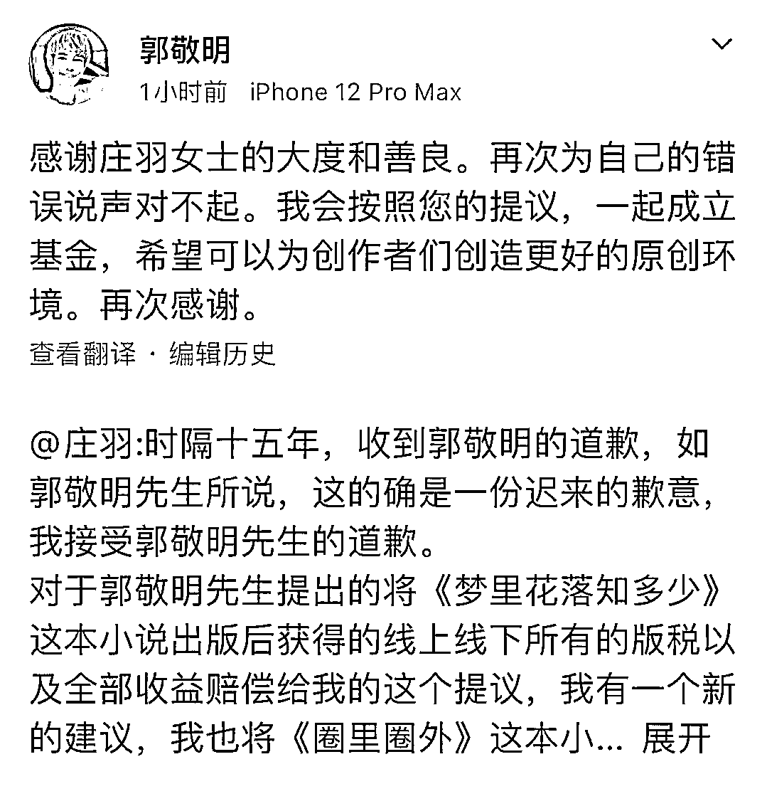
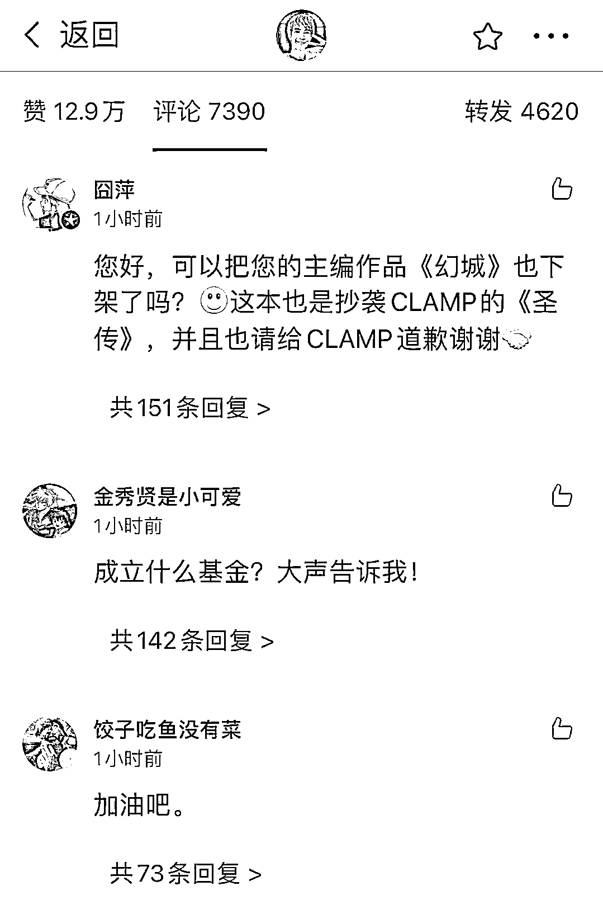

# 郭敬明之后，于正也道歉了

> 原文：[`mp.weixin.qq.com/s?__biz=MzIyMDYwMTk0Mw==&mid=2247507104&idx=1&sn=b25051dd73c62456939df6d366044db7&chksm=97cb1798a0bc9e8e5a33db6d84cde86a1215bef69c0e8610f67f916f351166b6e45268160d2e&scene=27#wechat_redirect`](http://mp.weixin.qq.com/s?__biz=MzIyMDYwMTk0Mw==&mid=2247507104&idx=1&sn=b25051dd73c62456939df6d366044db7&chksm=97cb1798a0bc9e8e5a33db6d84cde86a1215bef69c0e8610f67f916f351166b6e45268160d2e&scene=27#wechat_redirect)

点击蓝字“**灰产圈**”关注我们！

12 月 31 日凌晨，郭敬明通过个人微博发文称，在这个对生命有重新认知的特殊年末，他想做一个迟到太久的道歉。

郭敬明表示，“在今天，我选择面对自己过去的错误，面对我对庄羽女士造成的伤害，面对被我辜负的所有支持我和相信我的读者和合作伙伴，我欠所有人一个道歉。”

郭敬明说，“在道歉的同时，我将把《梦里花落知多少》这本小说**出版后获得的线上线下所有的版税以及全部收益汇总计算清楚之后，全部赔偿给庄羽女士。”**

****正如很多人所****“****预测**”**的那般，在郭敬明凌晨洋洋洒洒一篇长文道歉之后，另一位也在 2020 年的最后一天，公开道歉了。12 月 31 日临近中午，于正在其个人微博上发布文章，向琼瑶老师道歉。**** 

在道歉文中，于正向琼瑶老师致以最诚挚的歉意，并希望她健康、长寿，也希望有机会跟她当面道歉。会一如既往收藏琼瑶老师的每一部小说，并以她为榜样，创作出更多老百姓喜闻乐见的故事。

于正老师的道歉，网友们接受程度如何，目前顶在最上面的三条，应该可以看出一些端倪。

2020 年 12 月 21 日晚，编剧余飞、宋方金等发布 111 位编剧、导演、制片人、作家的联名信，直指有抄袭劣迹的郭敬明、于正出现在综艺中进行话题炒作，以此追逐点击率、收视率的做法，引起了相关从业者和社会各界的反感，呼吁不给抄袭剽窃者提供舞台，多宣传德艺双馨的艺术家，尊重原创。次日这封联名信上的署名人员增加至 156 位。

2020 年 12 月 31 日零时，**郭敬明就当年小说《梦里花落知多少》抄袭庄羽的作品《圈里圈外》一事在微博上道歉，并表示将把《梦里花落知多少》的版权收入全部赔偿给庄羽**。

而在 12 月 31 日一早，**编剧汪海林老师在看到郭敬明的道歉之后，也通过微博表达了自己的观点，并提及给于正一点时间，等待他的道歉书**。不知现在于正的这番道歉，是否能让汪老师感受到诚意与愧疚。

至于郭敬明，**在庄羽发微博回应他的道歉之后，也是第一时间转发，并表示会一起成立基金**，为创作者们创造更好的原创环境。

这条转发庄羽的微博，楼下网友们也是各抒己见，群策群力。

郭敬明道歉了，于正道歉了，在上百位影视从业人员的集体努力下，时隔多年，当事人终于等到了那句迟来的抱歉。

来源：中国青年报、新浪微博

← 向右滑动与灰产圈互动交流 →

