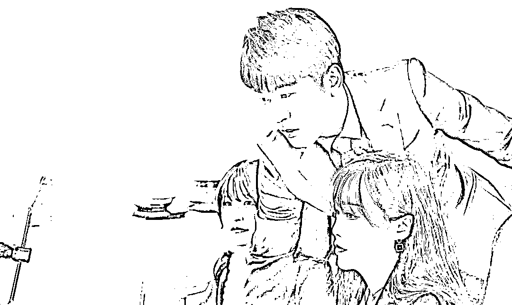
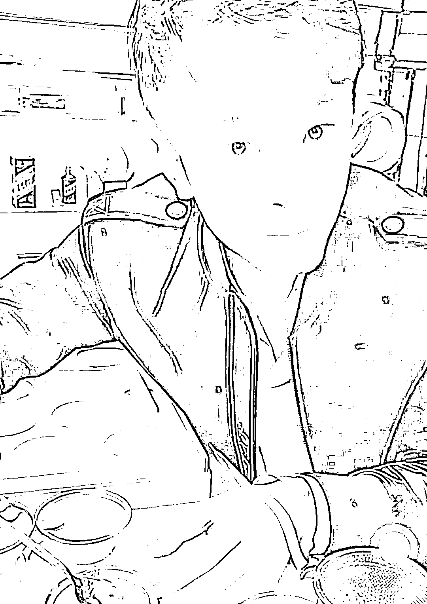
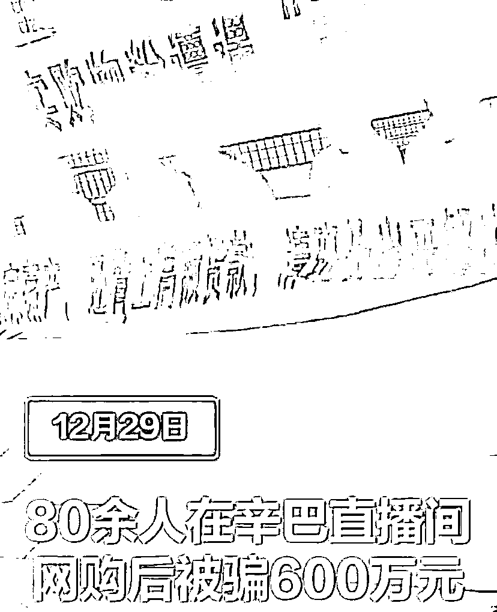
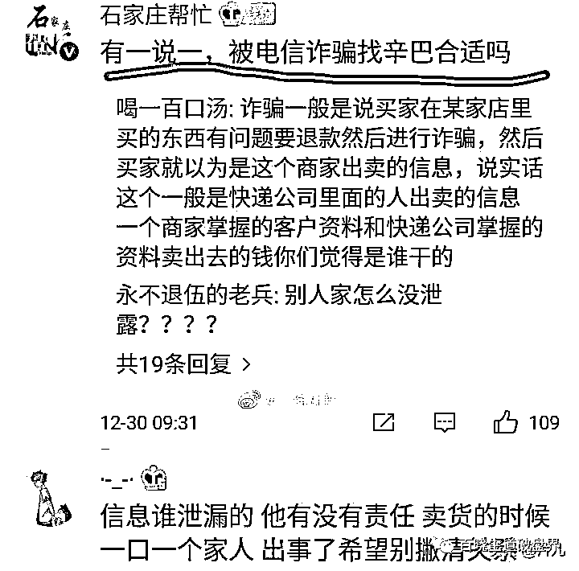
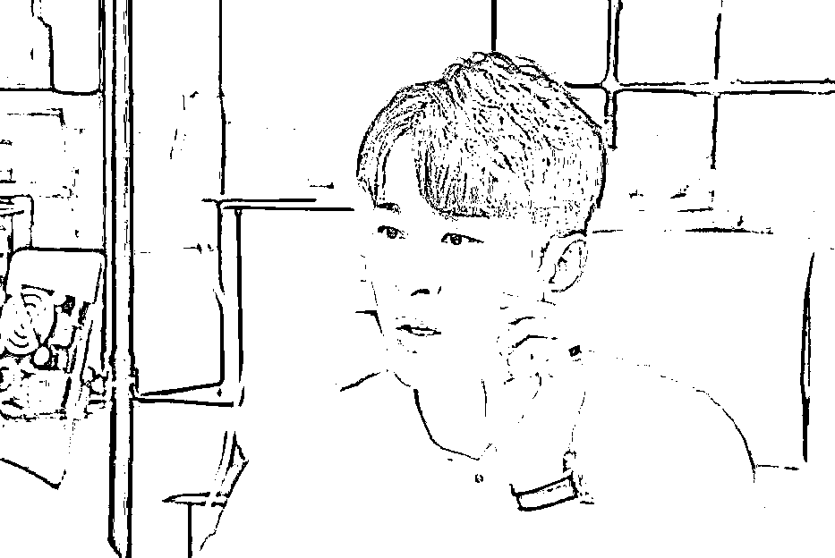
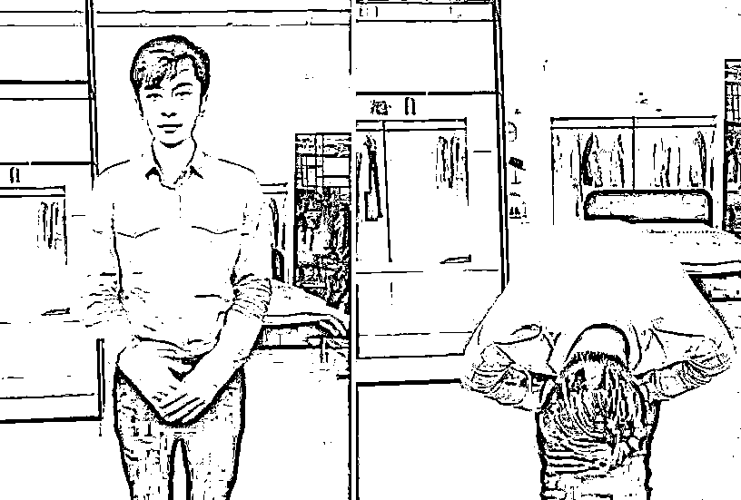
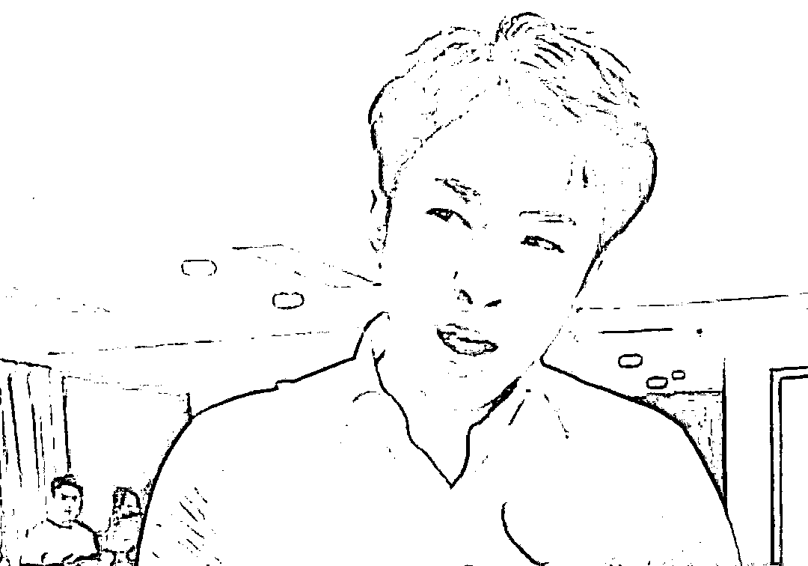
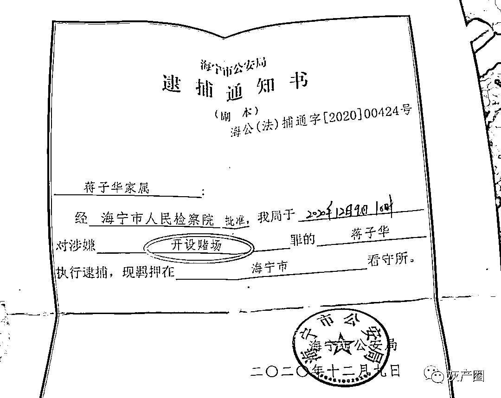
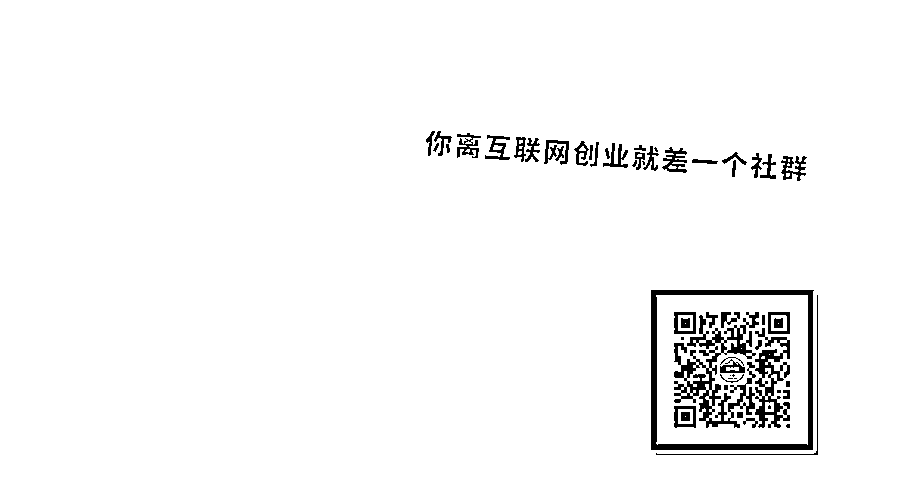
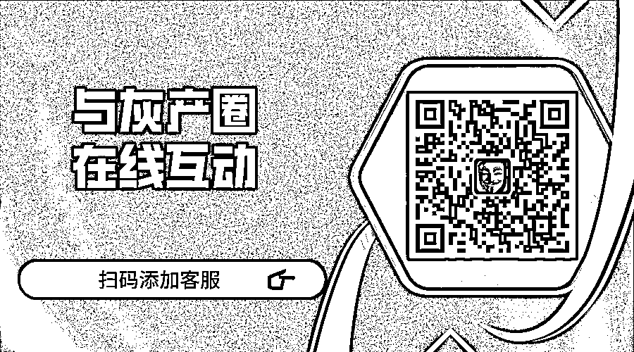

# “辛巴直播间”网购后，80 余人被电信诈骗 600 万元，受害者围堵辛巴公司！！

> 原文：[`mp.weixin.qq.com/s?__biz=MzIyMDYwMTk0Mw==&mid=2247507104&idx=2&sn=057c14f3e22c6b52b31d0278f5b94853&chksm=97cb1798a0bc9e8ecda1c0495d7ad2b7e6bb97a284e00a3e2c13c87ab6c2ee328afec463b69d&scene=27#wechat_redirect`](http://mp.weixin.qq.com/s?__biz=MzIyMDYwMTk0Mw==&mid=2247507104&idx=2&sn=057c14f3e22c6b52b31d0278f5b94853&chksm=97cb1798a0bc9e8ecda1c0495d7ad2b7e6bb97a284e00a3e2c13c87ab6c2ee328afec463b69d&scene=27#wechat_redirect)

点击蓝字“**灰产圈**”关注我们！

自网红主播带货兴起，辛巴、薇娅、李佳琦依然成为了该行业的翘楚，不但很快俘获了大量粉丝的支持，而且通过直播带货，以上三人也很快实现了大家梦想的“财务自由”。

归其原因，购物粉丝信任主播，主播通过粉丝的信任快速变现获利。

不久前，辛巴被曝因为“糖水燕窝”事件翻车，不但屡遭职业打假人王海的质疑，而且事后还被罚款 90 万元，并且团队被封禁直播。

对于主播来说，封禁 60 天会丢掉很多信赖他的“老铁”，毕竟带货主播的人设，堪比信用一样。虽然如此，但是辛巴团队的是非仿佛还没有结束。 

12 月 30 日，有媒体爆料，辛巴公司被电信诈骗的 80 余名受害者堵门，他们统一的共性就是曾在辛巴直播间网购。据悉，受害者中除了有宝妈、全职主妇外，甚至还有普通工薪阶层和大学生。此外，受害者被骗的数额从千元甚至数万元不等，其中最高甚至达到了 51 万余元。 

辛巴再次“雪上加霜”！多名女粉丝现身辛选基地拉横幅讨要说法，写着：诈骗倾家荡产，还背上高额贷款，请班长出来解决问题，让你的粉丝能够活下来！

[`mp.weixin.qq.com/mp/readtemplate?t=pages/video_player_tmpl&action=mpvideo&auto=0&vid=wxv_1673079192785092609`](https://mp.weixin.qq.com/mp/readtemplate?t=pages/video_player_tmpl&action=mpvideo&auto=0&vid=wxv_1673079192785092609)

虽然辛巴再次遭遇危机，但是不少力挺辛巴的粉丝在网上留言表示，被骗者不是因为购买到假货被骗，而是通过电话诈骗被骗，所以不应该把责任归罪辛巴。

针对力挺辛巴的粉丝，有疑似了解详情的网友留言，因为在辛巴直播间购物，购物信息被泄露才导致被骗，而且被骗的名义是购物后退款。同时，媒体也披露，绝大多数受害者受骗时间均集中在 11 月中下旬和 12 月初，被骗原因疑似是在辛巴直播间购物后退款。

面对众人讨说法，辛巴并没有露面回应，同时，网络上针对辛巴团队的“声讨”也络绎不绝。按常理，电信诈骗真的是老套路，那为何还有这么多人被忽悠？

其实，究其原因就是辛巴在售卖产品后，确实偶有退款甚至贴补其它产品的行为，所以让不少受害者信以为真。按道理来讲，受害者都是成年人，应该有辨别能力，但是辛巴方到底有无责任，只能让相关部门来界定了。

辛巴团队因为燕窝“翻车”后，主播辛巴也曾露面。辛巴表示，没有任何一个人、一个企业不会犯错，感谢大众的监督。虽然辛巴说的不无道理，但是对比辛巴此前的狂傲状态，确实让人觉得略有反感。

此前，辛巴背后“神秘豪爷”蒋子华先前就割过粉丝韭菜，后因开设赌场被抓，这一波未平一波又起，辛巴的 2020 真的是坎坷。

此外，在辛巴团队集体被封的背后，辛巴此前确实也做过很多公益。比如疫情期间捐款、捐物，主动销售助农产品。但是针对此事，你觉得受害者被骗跟辛巴团队关系大吗？

来源：百晓生道破盘界

← 向右滑动与灰产圈互动交流 →

