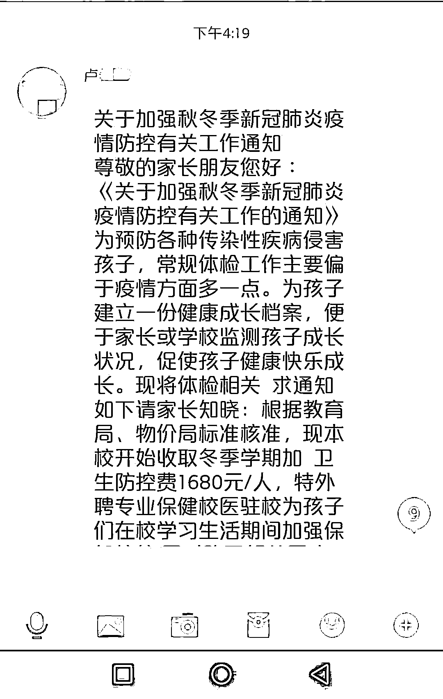
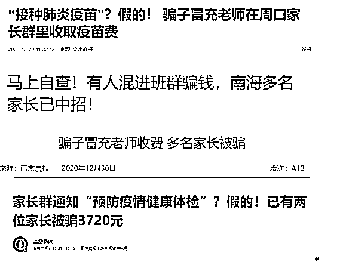
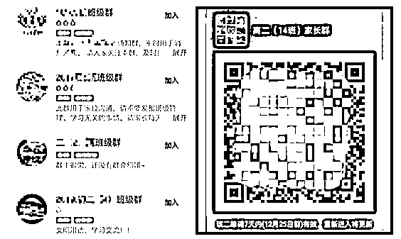
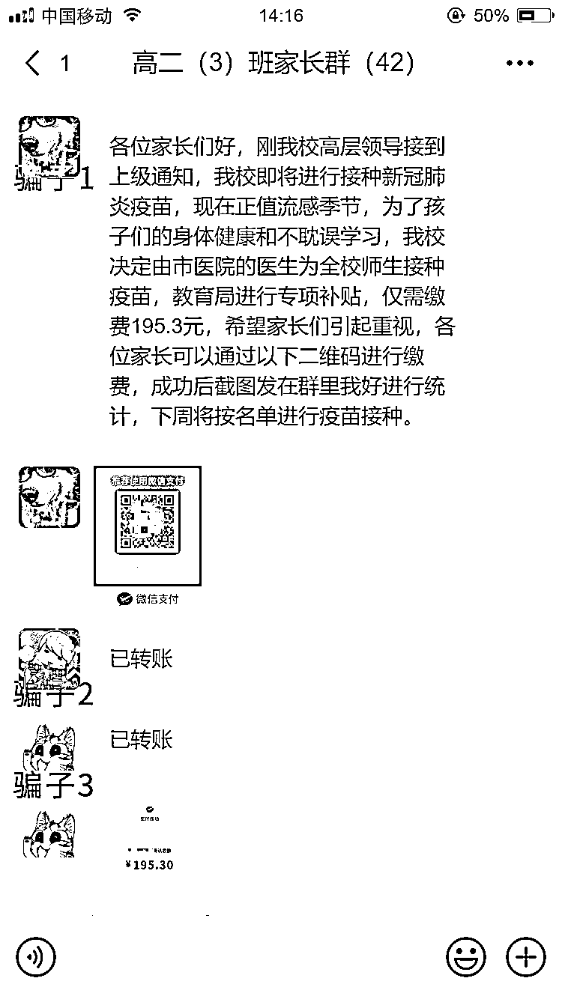
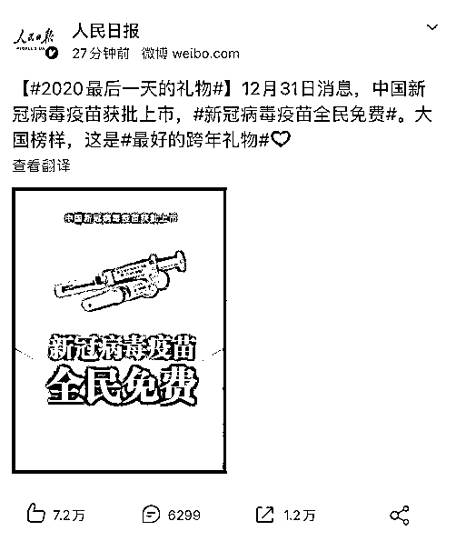
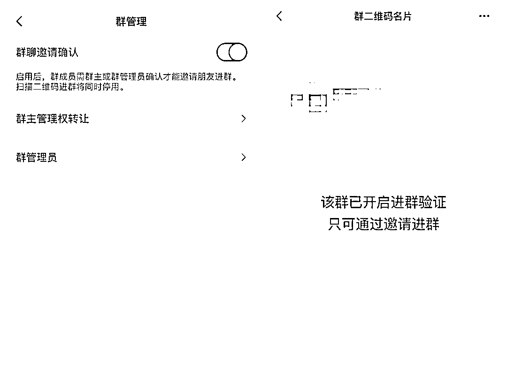

# 班级群里收“新冠疫苗费”？小心是骗子！

> 原文：[`mp.weixin.qq.com/s?__biz=MzIyMDYwMTk0Mw==&mid=2247507104&idx=3&sn=91e099992bf9de0c00b5fa519cf4271e&chksm=97cb1798a0bc9e8e731918db8a9cba270257f1fedbbe07d60b11b53c22f160e5bca91eb0671d&scene=27#wechat_redirect`](http://mp.weixin.qq.com/s?__biz=MzIyMDYwMTk0Mw==&mid=2247507104&idx=3&sn=91e099992bf9de0c00b5fa519cf4271e&chksm=97cb1798a0bc9e8e731918db8a9cba270257f1fedbbe07d60b11b53c22f160e5bca91eb0671d&scene=27#wechat_redirect)

点击蓝字“**灰产圈**”关注我们！

近期，新冠疫情又在各地有了零星的病例

同时新冠疫苗的问世也成为了热门话题

不少骗子也紧跟“热点”

浑水摸鱼混进了各地学校的班级群

冒充老师对家长收取“体检费”“新冠疫苗费”

 

***▲骗子冒充老师发布的虚假收费通知▲***

一哥随便搜了一下报道

就已经看到有不少家长上当受骗

骗子的套路一般是这样的

先是在网上搜索**“班级群”“家长群”**等关键词

或者通过不小心泄露的**群名片、微信号**等

找到这些班级群

再以某位家长的名义申请加入群聊进行“潜伏”

等骗子摸清楚老师的上课规律

**再趁老师不在线的****时间复制他们的头像、名称**

并往群里发布此类**伪造的收费通知**

以及收款二维码

更狡猾的是，**这些骗子可能还会组团作案**

几个人同时混进家长群

**在“假班主任”发布收款信息后**

**另外几个“假家长”就带头发布已转账的消息**

当不明真相的家长看到已经有人交款

可能就放心地跟着转账了

等到被人发现不对

骗子就马上改名并退群开溜

根据人民日报最新的消息

新冠疫苗将免费为全民提供

以后再看到收取“新冠疫苗费”的

肯定是骗子无误

为了防止这类仿冒骗局再次发生

群管理员在核实群成员的同时

也可以加强入群审核

在微信群管理打开**“群聊邀请确认”**

每次有人加入时都要经过群主或管理员的确认

防止群二维码不慎泄露后被陌生人进入

家长们在群里收到任何二维码或转账缴费信息

一定要直接与班主任或学校进行核实

切勿急于支付，谨防上当受骗

如遭遇诈骗，请第一时间拨打 110 报警求助

**并在微信客户端或进行投诉**

年底了，骗子们都开始蠢蠢欲动

我们一定要多留个心眼

平安顺遂地跨过 2020

来源：微信 110

← 向右滑动与灰产圈互动交流 →

