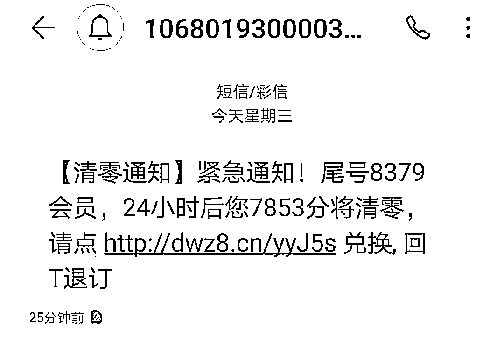

# 年关将近，充值诈骗和积分兑换诈骗又来了！

> 原文：[`mp.weixin.qq.com/s?__biz=MzIyMDYwMTk0Mw==&mid=2247507104&idx=4&sn=f3aa97346dd13c67c4c5f2ec534c3185&chksm=97cb1798a0bc9e8e24ff63bd84ed44af7bcf3f3fa7729bd529521762c09736d93f1449f238e8&scene=27#wechat_redirect`](http://mp.weixin.qq.com/s?__biz=MzIyMDYwMTk0Mw==&mid=2247507104&idx=4&sn=f3aa97346dd13c67c4c5f2ec534c3185&chksm=97cb1798a0bc9e8e24ff63bd84ed44af7bcf3f3fa7729bd529521762c09736d93f1449f238e8&scene=27#wechat_redirect)

点击蓝字“**灰产圈**”关注我们！

**紧急提醒：**年关将近，各平台各商场的积分兑换活动开启，紧随着新型诈骗手段层出不穷，分为**充值诈骗**和**积分兑换诈骗**等，迷惑性超强，请转发警惕！

充值诈骗

近日

有人陆续收到

充 100 送 200

充 200 送 500 的

充值特惠活动短信

**这是诈骗短信！**

经警方核实

这类短信息

实际上是诈骗分子

利用**非法设备**和**改号软件**

发出的诈骗短信

短信内链接的网页

并非正规客服官方网站

而是诈骗分子制作的**木马链接**

具体内容如下

↓↓↓

看着有这等好事，

真的很容易心动想点进去充值！

**且慢！**

如果你足够细心

你应该可以发现

虽然该短信由“10086”发出

**但其结尾处的****[中国移动]**

**↓↓↓**

诈骗短信截图

**与官方短信结尾处的****【中国移动】**

官方短信截图

**还是有所明显不同的**

假如你点进短信链接

它就会带你进入到一个充值界面

**填写完手机号码等信息后**

**页面居然要你输入**

**银行卡号、身份证号、支付密码****！**

**↓↓↓**

一般用手机进行网上充值

正规的页面是这样的

**↓↓↓**

**填写银行卡号**

**预留号码不需要手动输入**

而在电脑上选择银行卡充值后

会直接跳转到银行官方支付页面

不需要填写

**完整卡号和身份证号**

**↓↓↓**

**提醒您**

大家要提高警惕。由于冒充客服号码发送的信息迷惑性很强，收到任何含有网页链接和电话号码的优惠促销类短信息时，切不可轻易点击链接或致电其中的陌生号码，应先致电运营商官方客服电话，或通过官方客服网站进行确认。

积分兑换

还有很多网友反映，收到**积分兑换也是诈骗信息。**登陆提示的网站操作险些上当。后经咨询人工客服后发现短信内容并非官方所发，而是有人冒充，移动方面称近期也接到多次类似情况的反映，但目前尚无应对办法，只能机主自己加强防范。

关于移动积分兑换，目前只有通过官网积分商城一种方式，并且一般是话费、礼品等，绝不会以现金形式，更不会要求用户提供银行账号、身份证、密码等个人信息。”，类似网址尽量不要点击，以防中毒后个人信息泄露造成损失。网友出现了受骗的情况，移动公司表示非常同情和理解，但是移动公司也是受害者，对于这样的冒充诈骗行为也没有办法，只能建议网友报警。

**短信发射器藏匿酒店客房  未央警方查缴 1600 余张电话卡**

[`mp.weixin.qq.com/mp/readtemplate?t=pages/video_player_tmpl&action=mpvideo&auto=0&vid=wxv_1662581686972268547`](https://mp.weixin.qq.com/mp/readtemplate?t=pages/video_player_tmpl&action=mpvideo&auto=0&vid=wxv_1662581686972268547)

**提醒您**

大家要提高警惕。由于伪基站冒充客服号码发送的信息迷惑性很强，收到任何含有网页链接和电话号码的优惠促销类短信息时，切不可轻易点击链接或致电其中的陌生号码，**应先致电运营商官方客服电话，或通过官方客服网站进行确认。**

来源：邯郸市反电信网络诈骗中心

← 向右滑动与灰产圈互动交流 →

