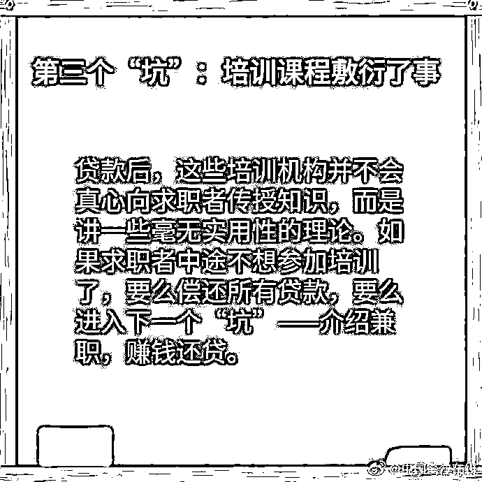
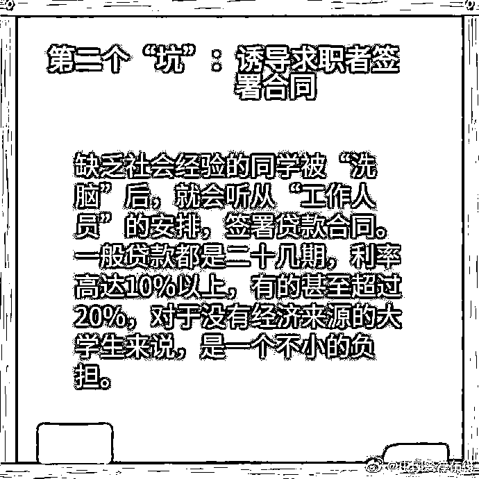
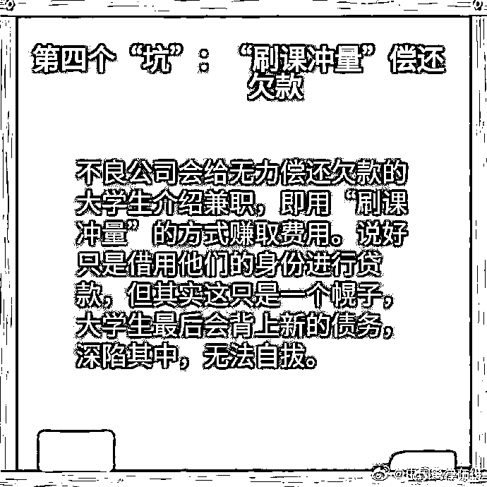
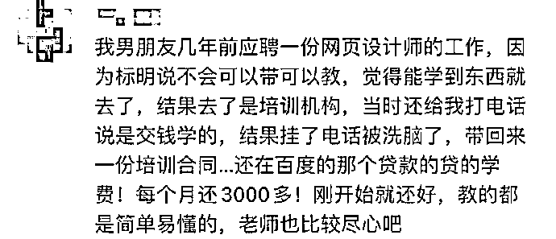

# 找工作的小伙伴请注意！参加培训也可能陷入贷款骗局……

> 原文：[`mp.weixin.qq.com/s?__biz=MzIyMDYwMTk0Mw==&mid=2247507175&idx=1&sn=4ad83a76296ebfba06438d465a465094&chksm=97cb17dfa0bc9ec9265b38e4345d00ee43e157ac7a6e50cd0a49e85db930108a1eb2ee08d162&scene=27#wechat_redirect`](http://mp.weixin.qq.com/s?__biz=MzIyMDYwMTk0Mw==&mid=2247507175&idx=1&sn=4ad83a76296ebfba06438d465a465094&chksm=97cb17dfa0bc9ec9265b38e4345d00ee43e157ac7a6e50cd0a49e85db930108a1eb2ee08d162&scene=27#wechat_redirect)

点击蓝字“**灰产圈**”关注我们！

2020 年因为疫情及全球局势 

将成为“最难就业季”

面临毕业学子们都想在毕业之前

签下一份满意的工作

**可是在这种关键的时候**

**有些不法分子又有新的套路出现**

应届毕业生小张毕业后应聘了一家通信工程公司，公司以储备人才为由要求小张缴纳培训费，承诺之后会分两年补给小张。为了顺利拿到 offer，小张与公司签订了一份《就业保障及实训合同》。

由于刚毕业没钱交培训费，公司就推荐小张贷款，并通过公司与贷款机构签约。

这笔钱由贷款机构直接打进公司账户，我要负责分 24 期偿还本息共 1 万余元。我想公司之后会补偿给我，还承诺试用期有 2500 到 3500 元的工资，每月几百元的贷款本息也能承受，所以就同意了。

小张

随后小张被公司派到外地工作，其间公司经理以微信转账的形式给小张转了培训补助 1300 元，但一直未发放约定的工资。“询问后，经理却说之前的 1300 元就是工资，至于培训补偿对方则提都不提。”

该拿的钱没拿到还背上了上万元的贷款，小张很憋屈，“但我没有那么多时间和精力去纠缠这个事，只能认栽。”

这种以招聘为由让求职者办理贷款缴纳培训费的行为存在一定欺骗性，求职者有疑惑应及时向劳动部门咨询了解，避免上当受骗。

这就是今天蜀黍要说的

不法分子的新套路

**“培训贷”**

**什么是“培训贷”？**

培训贷一般指培训机构和 P2P 网络贷款机构进行合作，**对培训者进行借贷，培训者以分期付款的方式进行还款。**现在招聘公司(实则为培训机构)多借助招聘网站以招聘的形式对求职者进行有偿高额培训。

作为互联网金融的一个细分领域，培训贷服务对象是教育培训机构的学员，公司一般以应聘者能力不达标或招聘要求极低，要求应聘者进行岗前培训，产生上万的培训费(另加高额利息)，后续通过贷款软件进行分期还款。**然而培训完之后并不会入职，而是要求应聘者另找工作。**

在培训期间，学生往往没有资金一次付清，之后被要求分期付清。

不少学生在找工作时，被要求“贷款培训”一些不良的培训贷机构以招聘为幌子，**诱导求职者贷款培训**，利率超过 10%。如果中途“退学”，还需要交违约金。

**而小张的遭遇也不是个例**

**在此之前已有许多人上当受骗过**

不仅仅是刚出社会的学生

还有许多社会人士以及跨越各行各业

不少网友也说出了自己的经历

↓↓↓

“培训贷”中的陷阱重重

不法分子一步步引诱求职者

**进行贷款分期操作**

**从而导致欠下巨款**

**如何认清“培训贷”常用套路？**

***套路一：求职变贷款培训***

一些无良的培训机构和培训公司会在网络上发布所谓的“招聘信息”、关于职场培训的“XXA 计划”等，其实只是以此为幌子吸引求职者和求职大学生，并约其到指定公司“面试”，面试后就要求求职者贷款培训。或者就如上文中，开始填写伪装注册 app 的贷款流程。

***套路二：洗脑或直接要求培训***

学生来到这些指定公司后，有相关的人员对其进行洗脑灌输，一般灌输的思想是：就业难、掌握一门技术的重要性、独立就业等内容。除了灌输这些思想外，有的机构还承诺培训后一定能找到工作，月薪在几千甚至上万。主见能力差的学生自然被成功洗脑了。当然也有一些机构比较直接，面试后告诉求职者其能力不足，要求其培训，培训会产生一定的费用。

***套路三：诱导求职者签署合同***

一般学生在被“洗脑”之后都稀里糊涂的，相关人员会“步步紧逼”，使得求职者没有太多时间来思考就稀里糊涂的签署了贷款合同。一般贷款都是二十几期还款，利率甚至超过 20%。对于没有经济来源的大学生或者初入社会的学生来说，是一个不小的负担。

***套路四：培训课程敷衍了事***

一些专门骗贷的培训机构是不会真心向求职者传授知识，一般都是敷衍了事，向求职者讲一些实用性不强的理论。如果求职者中途不想参加培训了，就会被要求偿还所有贷款或者赔付一定的违约金。

找工作的小伙伴们

一定要提高警惕

看清机构资质和合同条款

**当心掉进“培训贷”大坑哦**

**#转发给身边的朋友吧#**

来源：深圳罗湖公安、虹口区政法委、唐山人才就业、龙岗青年

← 向右滑动与灰产圈互动交流 

