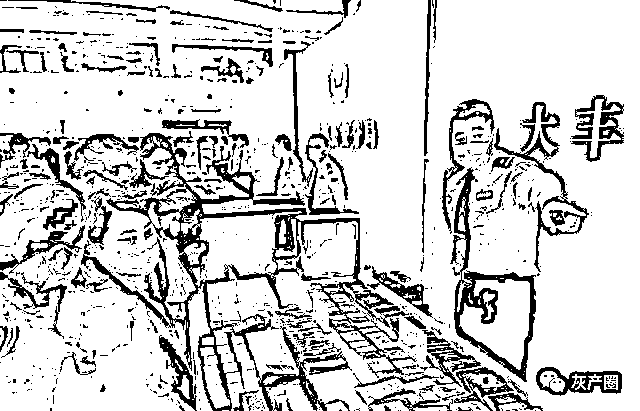

# 只要帮取钱就能赚佣金，“洗钱”团伙两个多月洗钱近 3000 万元

> 原文：[`mp.weixin.qq.com/s?__biz=MzIyMDYwMTk0Mw==&mid=2247507175&idx=2&sn=0a2b8d536544093313c12bc894a005c0&chksm=97cb17dfa0bc9ec9a68ff85971028534af24acfc6bf1e5bcfc7ffe5e92db1e04ec7ac22a1371&scene=27#wechat_redirect`](http://mp.weixin.qq.com/s?__biz=MzIyMDYwMTk0Mw==&mid=2247507175&idx=2&sn=0a2b8d536544093313c12bc894a005c0&chksm=97cb17dfa0bc9ec9a68ff85971028534af24acfc6bf1e5bcfc7ffe5e92db1e04ec7ac22a1371&scene=27#wechat_redirect)

点击蓝字“**灰产圈**”关注我们！

导语

帮人取钱，快速赚取佣金，这活计听起来挺轻松。但请警惕“好事”背后，极有可能隐藏黑幕。

[`mp.weixin.qq.com/mp/readtemplate?t=pages/video_player_tmpl&action=mpvideo&auto=0&vid=wxv_1674797004683591685`](https://mp.weixin.qq.com/mp/readtemplate?t=pages/video_player_tmpl&action=mpvideo&auto=0&vid=wxv_1674797004683591685)

近日，从盐城市大丰区公安局获悉，该局在开展“断卡行动”过程中，通过缜密侦查，跨省奔赴广州、长沙等地，成功捣毁一个“洗钱”犯罪团伙，抓获犯罪嫌疑人 13 名，扣押赃款 120 余万元，缴获涉案银行卡 200 余张，电脑、POS 机 20 余部。

神秘流水

交易日超百万

今年 10 月初，受害人马女士被通讯网络诈骗损失 12 万元，大丰警方在对其银行流水分析时，发现部分赃款曾在一名男子数张银行卡中流入流出。

“深入研判后发现，该男子名下多张银行卡涉及无锡、苏州等市公安机关接报的通讯网络诈骗案件。”经民警调查，从中关联 50 余张涉案银行卡，这些账户之间资金流水往来频繁，流水交易日均 50 多万元，甚至日超百万元，可谓名副其实的“日进斗金”。

很快，一个名叫“XX 支付”的第四方支付平台浮出水面。据警方调查，该平台服务器设在国外，在未获国家支付结算许可的情况下，依托支付宝、财付通等正规合法支付平台，通过大量注册个人账户非法搭建支付通道。

警方根据以往侦办类似案件的经验，判断使用这类非法支付平台的大多是一些网络赌博、诈骗和淫秽色情犯罪团伙，他们通过此类平台进行层层转账，以实现资金快速分拆转移和规避监管的目的。

那么洗钱的究竟是什么人？随着侦查工作的深入，一家暗藏于居民小区单元楼中的某科技网络公司及两名负责人进入警方视线。调查显示，二人曾分别因诈骗、抢劫被公安机关依法处理过，而在他们成立公司的两个多月里，每天都有大量资金通过“XX 支付”被快速分拆到平台内众多银行卡中，或者干脆直接转入公司负责人的银行卡中。

然后，再经他人银行卡提现流出，其中部分资金除涉及江苏省内多地通讯网络诈骗案件外，还牵涉广东、福建、辽宁、上海等地相关案件。至此，一个涉嫌为通讯网络犯罪拆分取现的犯罪团伙初见端倪。

奔袭千里

跨省抓捕 13 人

该案的突破口要从一名身处广州的“技术专家”说起。

“此人明知代码编程技术员圈内的行规——不能碰第四方支付平台，但他仍铤而走险与犯罪团伙频繁对接，收钱搭建支付平台，从事违法犯罪活动。”办案民警说。洗钱团伙藏匿在湖南省长沙市，分散租住在长沙火车站附近的小区和宾馆里，以异地取现的方式来躲避警方打击。

11 月 5 日晚，根据前期侦查的线索，大丰警方兵分两路，奔赴广东和湖南两省开展抓捕行动。在广东省广州市白云区，警方掌握的“技术专家”白天是写字楼里的技术蓝领，晚上是蜗居在城中村里的单身“码农”。民警连续多天追踪其活动轨迹，最终锁定一处群聚租住房，静待抓捕指令。而在湖南长沙，抓捕小组 14 人抵达后，各自分组摸排每个嫌疑人的落脚点，只待指挥部一声令下实施抓捕。

11 月 10 日凌晨，抓捕条件成熟，指挥部发出统一指令：“广州和长沙一起行动！”

凌晨 0 时 50 分，广州白云区抓捕小组首战告捷。在当地警方的协助下，民警敲门进入将毫无防备的“技术专家”抓获，当场缴获其为支付平台编码的笔记本一台。随后，湖南长沙多个小组也陆续取得战果，大多数犯罪嫌疑人在半梦半醒中就被抓捕人员戴上了手铐。

行动中也出现过波折。凌晨 3 点，“金主”拒不开门负隅顽抗，抓捕小组在喊话无果后请来开锁人员采取强制措施，从其家中洗衣机、微波炉、床底、窗台、衣柜等处，搜出涉案现金近百万元。

“‘金主’在境外开通一些赌博网站，实施电信网络诈骗，将来历不明的钱，通过国内一些非法支付平台或个人做结算。”民警说，“技术员扮演的角色比较重要，他们负责搭建和维护相应的洗钱平台。”最终，13 名涉案人员全部落网。

帮人取钱

取来牢狱之灾

“今年 8 月份，我听朋友说帮人‘取钱’，可以轻松赚取手续费，来钱很快……”面对公安机关的审查，该犯罪团伙成员交代了作案流程，“赚手续费前，要先交一笔现金给‘金主’当保证金，然后由‘金主’通过银行卡将钱打给我，我再从银行将钱取出来，赚取手续费。”

“说是帮人取钱，其实他们心知肚明这就是‘洗钱’，挣的都是不义之财。”办案民警表示，在非法利益的诱惑下，不法分子除不断发展团伙成员，还利用“发展网络科技”的名义组建空壳公司，从事诈骗等各类违法犯罪活动。由于涉及领域广泛，扰乱了经济秩序，危害了经济安全，其破坏力不容小觑。

值得一提的是，警方通过深挖发现，犯罪嫌疑人为规避打击，或降低被公安机关查获的风险，他们不满足于简单的卡对卡拆分赃款进行洗钱，而是挖空心思设计出一种能自由抓取最长时间未动用的银行卡，自动记录赃款流向的支付平台，通过租借设在国外的服务器，实施犯罪活动。经查，该犯罪团伙在 2 个多月的时间里，共协助上游通讯网络诈骗和网络赌博团伙取现赃款 2000 多万元，非法获取手续费 120 余万元。

警方提醒市民：买卖、出借对公账户以及银行卡、电话卡等是违法行为，违法违规行为会记录到个人征信报告，影响贷款、办理支付业务，还可能涉嫌犯罪，在此提醒广大群众千万不能贪图私利触碰法律底线。如果遗失身份证、手机卡、银行卡，应及时排查风险隐患，注重个人信息保护，不给犯罪分子任何可乘之机。

同时，警方也告诫那些参与非法开办贩卖“两卡”的违法犯罪分子要悬崖勒马，主动到公安机关投案自首，争取宽大处理。

来源：江苏新闻，利箭在出击

← 向右滑动与灰产圈互动交流 

