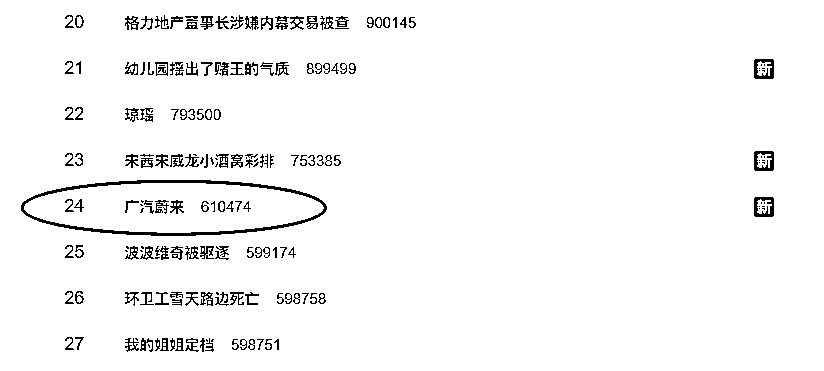
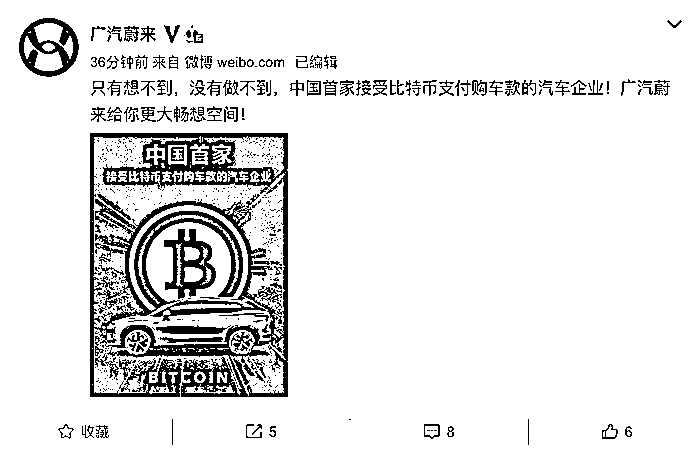
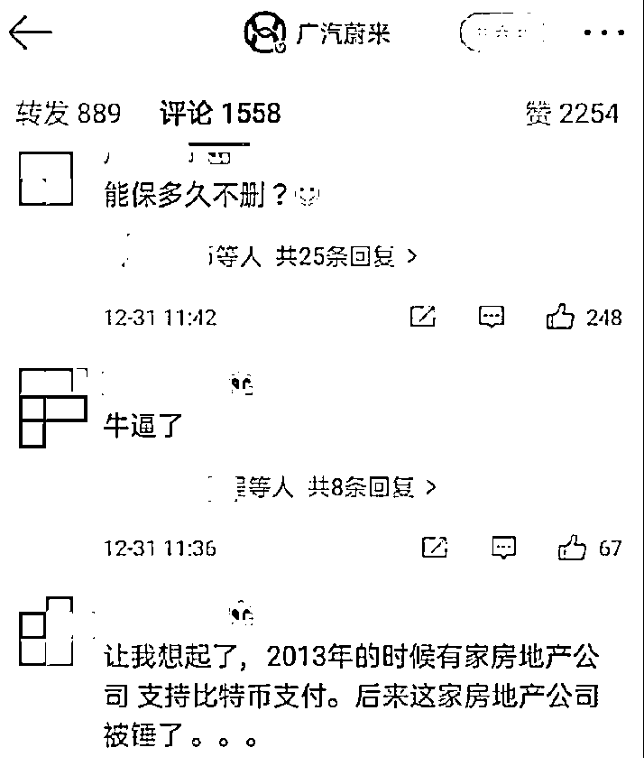
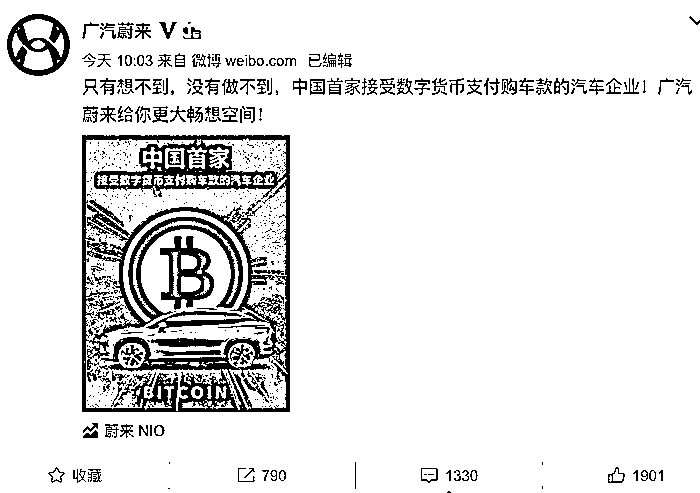
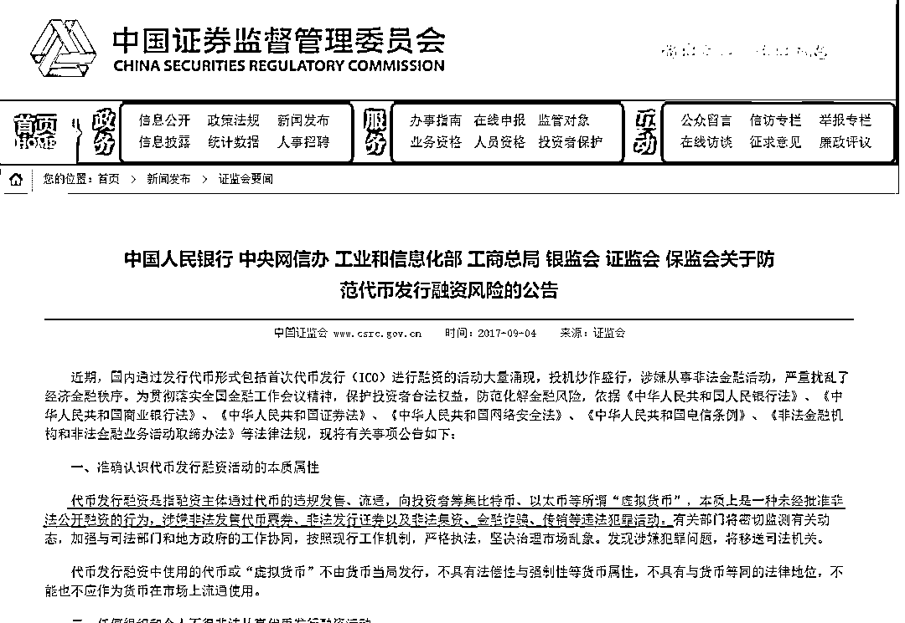
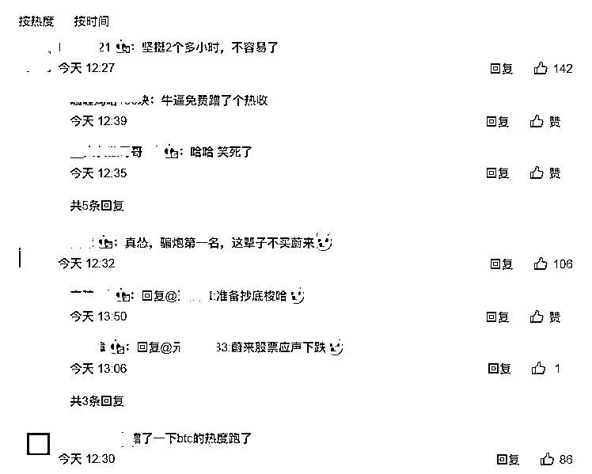
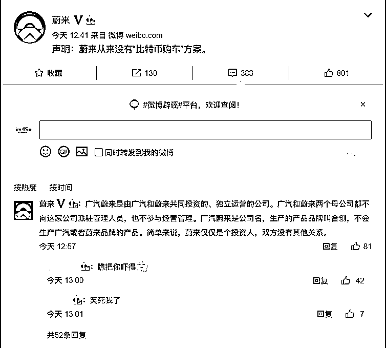
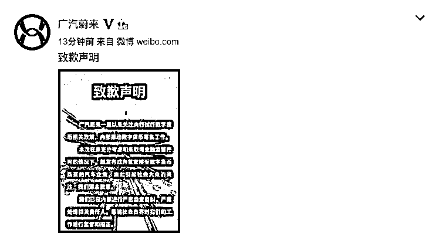
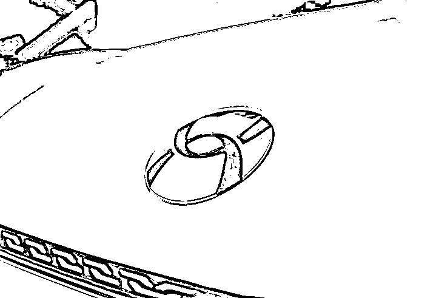

# 广汽蔚来,道歉了!

> 原文：[`mp.weixin.qq.com/s?__biz=MzIyMDYwMTk0Mw==&mid=2247507175&idx=3&sn=5144631988fcb66d528cbcf8b74eab03&chksm=97cb17dfa0bc9ec9df8a30f12f5c8bb7205a55f33a73f03dc35aa9f1346e8b8a6d69ce97f038&scene=27#wechat_redirect`](http://mp.weixin.qq.com/s?__biz=MzIyMDYwMTk0Mw==&mid=2247507175&idx=3&sn=5144631988fcb66d528cbcf8b74eab03&chksm=97cb17dfa0bc9ec9df8a30f12f5c8bb7205a55f33a73f03dc35aa9f1346e8b8a6d69ce97f038&scene=27#wechat_redirect)

点击蓝字“**灰产圈**”关注我们！

在 2020 年的最后一天，广汽蔚来的一条微博成功吸引了众多网友的注意，“广汽蔚来”一度成为微博热搜关键词。

12 月 31 日，广汽蔚来在其官方微博发布了一条推文，内容为“只有想不到，没有做不到，中国首家接受比特币支付购车款的汽车企业！广汽蔚来给你更大的畅想空间”。推文配图“中国首家 接受比特币支付购车款的汽车企业”一行大字肉眼可见，下方附带比特币标识以及广汽蔚来 HYCAN 007 产品图片。

广汽蔚来的这一波操作很快引起了网友的热议，在该微博下方有网友评论称“能保多久不删？”、“认怂删了！就是孙子”…… 

随着广汽蔚来“比特币购车”的相关报道持续发酵，官方删除了原来的推文，并重新发布推文，将“接受比特币”改为“接受数字货币”，但几分钟后又迅速删除了该推文。

百度百科资料显示，比特币是一种 P2P 形式的虚拟的加密数字货币，最初由中本聪在 2008 年 11 月 1 日提出，并于 2009 年 1 月 3 日正式诞生。据多家媒体报道，比特币于北京时间 12 月 30 日上午达到了历史新高的 29211.89 美元。

相关人士表示，该行为或涉嫌违法，目前人民币是中国唯一的法定货币，由中国人民银行设计、印制和发行的。央行等多部门早已明令禁止比特币等虚拟货币参与支付行为，如果企业允许比特币参与支付行为，将涉嫌违法。

一波操作下来，广汽蔚来彻底引起了关注，并迅速登上微博热搜。不少网友在其此前发布的推文中评论“坚挺 2 个多小时，不容易了”、“蹭了一下 btc 热度，巅峰时刻两小时，唯一一条评论破千的微博”、“这么大个公司，居然国家基本政策都不知道，无知！”…… 

另外，部分不知情的网友将“广汽蔚来”错以为是“蔚来”，对蔚来品牌造成一定的影响，而蔚来方面也表现出较强的“求生欲”。在广汽蔚来删除推文不久之后，蔚来汽车官微发布声明：蔚来从来没有“比特币购车”方案。

在网络舆论的影响下，广汽蔚来正式发布致歉声明：本次在未充分考虑和未取得金融监管许可的情况下，就发布成为首家接受数字货币购买的汽车企业，由此引起社会大众的关注，深表歉意。已在内部进行严密自查自纠，严肃处理相关责任人。

资料显示，广汽蔚来成立于 2018 年 4 月，“广汽系”和“蔚来系”分别占股 45%，其它股东占比 10%。

不过，蔚来汽车方面表示：“广汽蔚来是由广汽和蔚来共同投资的、独立运营的公司。广汽和蔚来两个母公司都不向这家公司派驻管理人员，也不参与经营管理。广汽蔚来是公司名，生产的产品品牌叫合创，不会生产广汽或者蔚来品牌的产品。简单来说，蔚来仅仅是个投资人，双方没有其他关系。”

**这波打脸，属实太快了!**

← 向右滑动与灰产圈互动交流 

