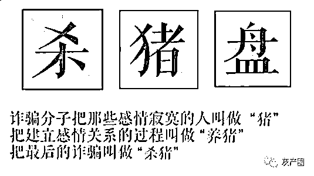

# 因歌生情陷入甜蜜陷阱，一个月为慷慨投资 61 万

> 原文：[`mp.weixin.qq.com/s?__biz=MzIyMDYwMTk0Mw==&mid=2247507221&idx=1&sn=633df4f1eb05e45559adae2b0a944971&chksm=97cb162da0bc9f3bbfb364404dd444ff24b7ed8d1d701cddaf4ef3f7ffb8c5fabe4d90f75a50&scene=27#wechat_redirect`](http://mp.weixin.qq.com/s?__biz=MzIyMDYwMTk0Mw==&mid=2247507221&idx=1&sn=633df4f1eb05e45559adae2b0a944971&chksm=97cb162da0bc9f3bbfb364404dd444ff24b7ed8d1d701cddaf4ef3f7ffb8c5fabe4d90f75a50&scene=27#wechat_redirect)

点击蓝字“**灰产圈**”关注我们！

近日根据腾讯 110 的统计

在今年接受举报的所有的诈骗类别中

“杀猪盘诈骗”受害者受损金额最大

并且近 70%的举报者是女性

** 什么是“杀猪盘”？**

**“杀猪盘”有多可怕？**

前段时间，**“杀猪盘”**这个话题再上热搜一度冲上了热搜榜第六，阅读量达 3.2 亿！

近日，根据腾讯 110 的统计，在今年接受举报的所有诈骗的类别中，“杀猪盘”受害者的受损金额最大，70%是女性举报。

杀猪盘的特点就是“养猪”周期长、“杀猪”金额多。不法分子多通过婚恋平台、交友软件寻找目标，精准定位受害者，然后通过甜言蜜语取得受害者信任，将目标诱入爱情的“屠宰场”。

杀猪盘在 2019 年尤为突出，今年在 4-5 月最高发，目前在多方宣教和深度治理下，逐步下降。

昆明女子因歌生情 却被骗 61 万余元

11 月 16 日,昆明 29 岁的余女士报警称自己被骗子骗了 61 万余元，而这笔“巨额财产”都是余女士自己在一个月之内陆续分数次主动转过去的。

事情开始于 10 月 19 日，余女士在家中通过网易云和一个陌生网友因为一首歌进行了互动。同样的歌曲爱好让余女士对对方渐生好感。之后，余女士相互添加了对方的微信 Star 继续聊天。

10 月 22 日，Star 在微信上告诉余女士，可以带她在网上购买外汇投资，并说自己有“门路”绝对稳赚不赔。

在对方的甜言蜜语中，余女士逐渐动心，并同意了投资的要求。

次日，双方在蝙蝠聊天软件互加了好友，之后，对方推送了一个网址 http://zxwp.a95598.com（骗子的假网站）。余女士注册账号后按照对方要求用自己的银行卡在 10 月 23 日至 11 月 13 日分别向该网址客服提供的银行卡账号转款共计 617000 元。

没想到之后，该网址一直无法登陆。

11 月 16 日，于女士既登不上网站，又联系不上 Star，终于发现自己被骗，于是报警。

**那么杀猪盘的诈骗流程是怎样的？**

**第一步**

搭讪加好友，双方迅速坠入爱河，进入热恋期。

**第二步**

让受害人觉得自己出手阔绰，但其实和本身经济情况不符，激起受害人好奇心，顺势介绍虚假赌博网站。

通常，骗子会先问受害者钱够不够用，告诉对方自己从事赌博网站技术维护工作，称自己近期发现技术漏洞，可以利用这个漏洞、修改后台赔率，稳赚不赔。

一开始会先引诱受害者投入小额资金，比如 500 元、3000 元，不到一个小时让你赚 100 元、1000 元，并且能成功提现。

感情诱骗也是惯用手法。若受害者表达不愿再投钱的想法，骗子就会打出感情牌，给受害者描绘赚钱之后一起买房买车、养孩子旅游的美好生活，受害者基于对美好未来的向往以及对“恋人”的信任，往往难以自拔。

**第三步**

受害者尝完甜头后，骗子称漏洞马上就要修复，来笔大的。

这个时候也是收网的时候了，骗子会要求受害者拿出所有积蓄，并怂恿受害者借钱、贷款，受害者在冲昏头脑、有利可图的情况下，借、贷、凑个 100 万一起投进去，之后第二天便会发现已经联系不上心目中的他，受害者被骗子拉黑取关了。

**杀猪盘诈骗周期是多长？**

相比一般诈骗周期比较长，因为感情培养需要时间。一般半个月到 20 天左右。

骗子会将受害者分为 ABD 三类，表示对博彩感兴趣的受害者被归入“A 类”，是重点诈骗对象；表示有点意思的受害者被归入“B 类”，是可发展对象；反应平淡则被归入“D 类”，骗子将放弃行骗。********

**反诈民警提醒：**

傻姑娘们，别再为这样的爱情倾家荡产！

来源：昆明市反电信网络诈骗中心

← 向右滑动与灰产圈互动交流 

