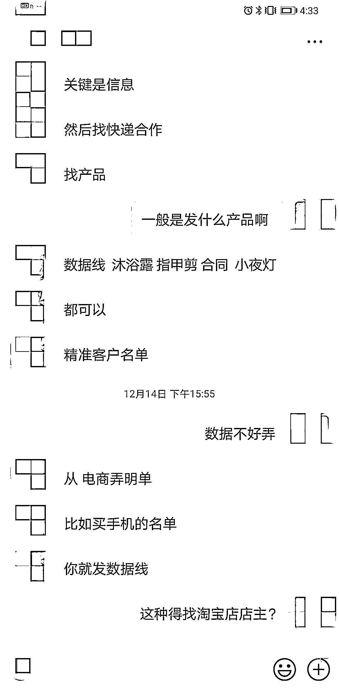
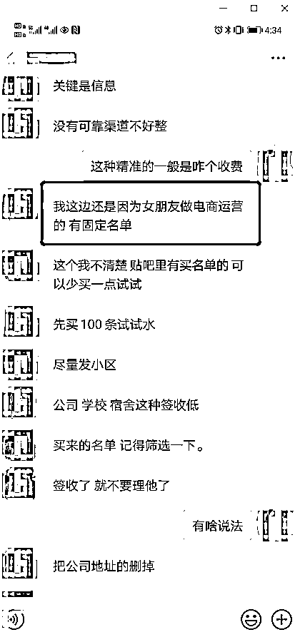

# 未购物却收到“到付快递”，拆开发现不对劲……

> 原文：[`mp.weixin.qq.com/s?__biz=MzIyMDYwMTk0Mw==&mid=2247507221&idx=4&sn=05cb23ae23b1d8da42878626faf59c51&chksm=97cb162da0bc9f3b50fa5ff14084530ac0268487771caf25c66010c52ab0074acf089fcea391&scene=27#wechat_redirect`](http://mp.weixin.qq.com/s?__biz=MzIyMDYwMTk0Mw==&mid=2247507221&idx=4&sn=05cb23ae23b1d8da42878626faf59c51&chksm=97cb162da0bc9f3b50fa5ff14084530ac0268487771caf25c66010c52ab0074acf089fcea391&scene=27#wechat_redirect)

点击蓝字“**灰产圈**”关注我们！

近日，新华社“全民拍”栏目接到多个报料：最近没有买东西，却收到一个到付快递，打开快递却发现无非是一些几块钱的地摊货，价值远远低于到付款。

记者对此线索追踪发现，这种快递背后是一条涉及购买个人信息、盲发快递、外包客服的黑色产业链。业内人士和专家提醒，来源不明的货到付款快递不要签收，接收快件时最好当场验货，同时呼吁尽快建立个人隐私保护机制。

**************40 元到付快递打开却是“镀金戒指”**

**近日，家在广州的袁女士在公司收到一个圆通到付的快递，到付款 40 元。一开始她很疑惑，但看到收件名是自己的淘宝昵称，又考虑到平时也有些客户会寄到付件，袁女士没细想就付了 40 元签收。**

**打开快递后，她发现是个红色小盒子，里面有个“镀金戒指”，“这种毫无用处又无美感的东西电商平台上也就几块钱，自己绝不可能买。”**

****袁女士立马打电话给快递单上的寄件人，结果是空号**。同时，快递员和客服都告知她到付件付款后，钱已直接打到总公司，他们都退不了。**

**无独有偶，成都的周先生也有类似经历。没有网购的他收到一个写着“防疫产品”的快递，以为是外地朋友寄的，付款 56 元后，却发现是 20 个口罩，“一看就是劣质商品，没有厂家信息，一股很浓的味道。”他想联系寄件人，**却发现快递上的电话中间四位数被隐去**。**

**记者发现，受害者一般会收到数据线、沐浴露、指甲剪、毛绒玩具，**甚至是几张废纸**。少数人考虑到没有网购拒签快递，然而大部分人以为是家人、朋友购买，或是自己下单后忘记了而选择付款签收。**

****

**据了解，这是叫“盲发快递”的常见诈骗手法。诈骗分子通过不同渠道获取客户信息后，不需要客户下单购买产品就发货，再利用到付款和实际货品的价格差获利。**

**记者暗访了解到，有人从 50 单开始发货测试，等签收率稳定下来后每天稳定发货在 1000 至 2000 单，“干一个月后就把快递后台发货系统注销掉。”**

**************记者暗访：合作快递、买“料”、外包客服一条龙**

****“盲发快递”涉及不法分子泄露交易用户个人信息，合作快递企业睁一只眼闭一只眼，外包企业专门负责用户退单等多个环节。****

****内部人士告诉记者，做盲发首先要找一个快递公司合作，安装快递后台发货系统。****

****记者假装做盲发，联系申通等多个快递公司，**当快递员明知道记者要做什么时仍然提供合作报价**。“他们有提成，当然希望发件越多越好。”内部人士告诉记者，做盲发时，他们一般与揽件快递员沟通，发货人和地址都填假的。****

****下一步是需要买“料”，即用户个人信息。记者暗访发现，**大量个人信息在贴吧、QQ 群等平台被交易**，一条被卖到 1.5 至 2 元。记者打开一个包含个人信息的文件发现，姓名、电话、家庭或公司地址等详细信息被严重泄露。****

********

****“一些个人信息来源于快递，电商平台也有‘内鬼’。”一内部人士告诉记者。暗访中，一个向记者卖“料”的人说“女朋友做电商运营，有固定名单”。****

******为了提高签收率，他们也有不少“技巧”**。如从电商弄名单签收率更高，比如针对买手机的名单就发数据线，买宠物用品的就发宠物玩具；买到“料”后尽量发小区，筛除公司、学校、宿舍等签收率低的地址；配合短信的操作，预通知客户有快递需要签收。****

****此外，还有专门负责客服的外包公司。发货方需要把每单定价告知外包公司，并将发货手机号设置来电转接至外包公司。“没有退回必要的话尽量降价让客户签收，如果客户 80 元签收的退 50 元，不行的话退 60、70 元。”一外包公司人员告诉记者。****

****************************亟待建立个人信息保护机制****

****“盲发快递”明显是精心设计的骗局。首先利用了人们误以为是家人或朋友所买快递的心理。其次，利用单次金额小与维权成本高的不对称性，许多消费者不愿运费自付或漫长的“折腾”而放弃退货，更鲜有报案。****

****北京市一法律师事务所律师周兆成认为，消费者主动签收商品后，快递公司称自己不再承担责任，**实则混淆了两类问题：一是侵权，二是违法**。“即便仅作为一次消费行为，那么‘签收即为验货概不退货’的做法，也属霸王条款，侵犯了消费者的合法权益。”****

****北京君众律师事务所律师芦云认为，快递公司知道寄出方在哪里，消费者如果提出让快递公司查询寄件方信息并退回商品的要求，快递公司理应主动配合并提供相关信息。若快递公司真存在泄露公民个人信息的情况，还要承担相应法律责任。****

****此外，骗子可以“精准”投递暴露出个人信息泄露形势严峻。大数据时代下，个人信息被暴露在电商、外卖等不同平台，快递面单、系统漏洞等给不法分子提供可乘之机。****

****受访专家建议，应从法律规范、行业标准、技术等方面持续做好个人信息保护工作，建立个人信息保护机制，严厉打击不法分子泄露、交易个人信息。****

****周兆成提醒消费者，**来源不明的货到付款快递不要签收**。接收快件时最好当场验货。网购填写收货地址时，建议不要填写自己的详细住址，避免个人居住信息的泄露。************

****来源：新华社****

****************

****← 向右滑动与灰产圈互动交流 ****

********