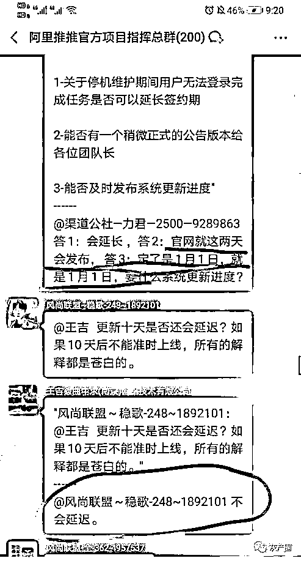
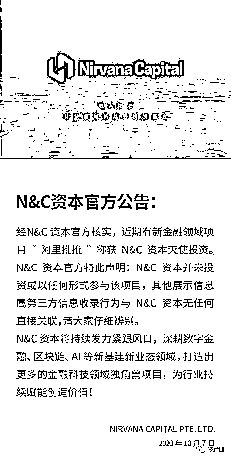
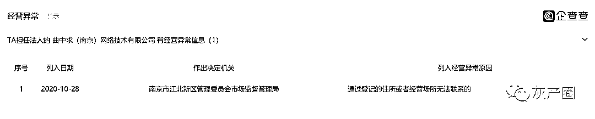
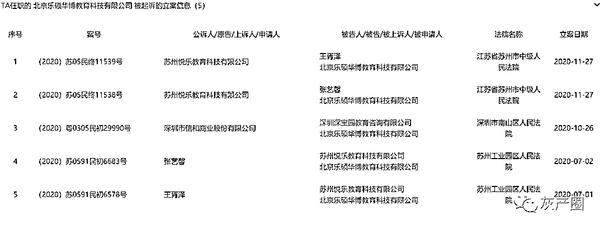
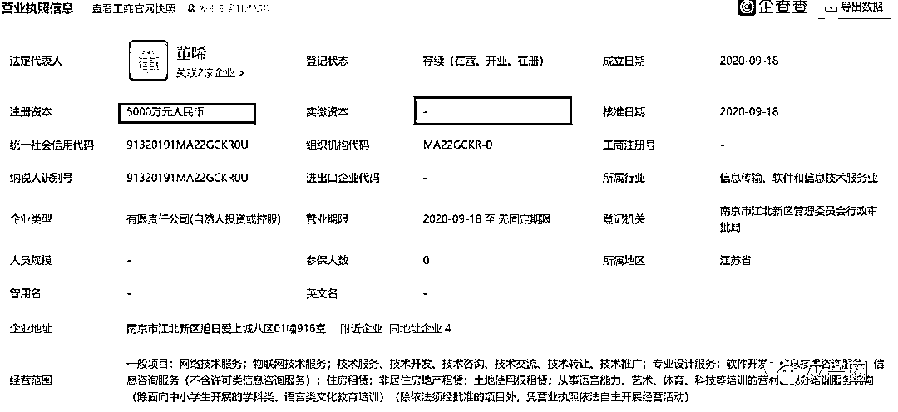
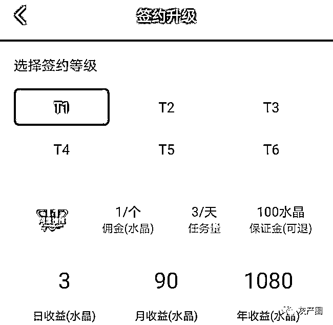
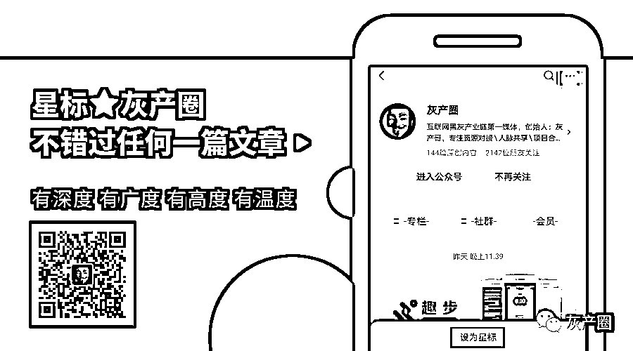
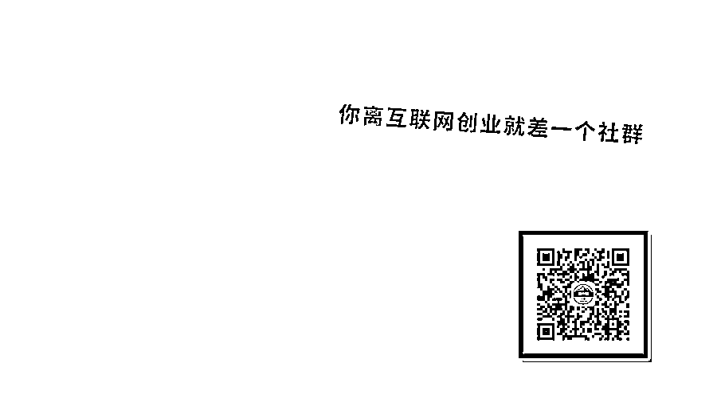
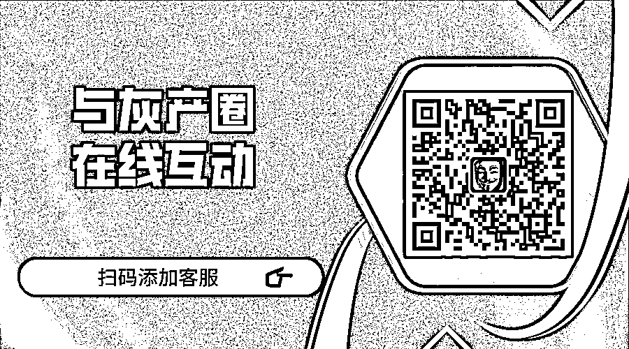

# 碰瓷阿里，圈钱无数！阿里推推正式关网跑路！

> 原文：[`mp.weixin.qq.com/s?__biz=MzIyMDYwMTk0Mw==&mid=2247507274&idx=2&sn=f34ca9223e9c61e8a6909a8ede2f4526&chksm=97cb1672a0bc9f64a1258f83dbebf9e22c18185f964e5c27fc74346db1bc0f790eb7262758e4&scene=27#wechat_redirect`](http://mp.weixin.qq.com/s?__biz=MzIyMDYwMTk0Mw==&mid=2247507274&idx=2&sn=f34ca9223e9c61e8a6909a8ede2f4526&chksm=97cb1672a0bc9f64a1258f83dbebf9e22c18185f964e5c27fc74346db1bc0f790eb7262758e4&scene=27#wechat_redirect)

点击蓝字“**灰产圈**”关注我们！

       阿里推推最新传出消息：更新版本，停机维护，为期 10 天。

　　项目就怕出现这样的情况，一提到升级维护，大都是跑路的信号，那么阿里推推是否也是同样的套路呢？

　　奇怪的是，这次更新并没有提前通知，说是怕引起躁动，你们信吗？

　　很多团队长也是往下传达，维稳，怕下面的人闹事。

　　

　　事实上这个阿里推推阿里巴巴毫无关系！只不过是名字比较像而已，猛地一看还以为是阿里巴巴的项目！其实没有任何鸟用！至于说合作关系！就连公厕门口卖卫生纸的都可以说自己和阿里巴巴强强联手！因为人家使用了支付宝！

　　开发公司是曲中求（南京）网络技术有限公司，而这个公司是 2020 年 9 月 18 日才成立的。

　　阿里推推还号称 N&C 资本投资了 1200 万美元，也是纯属胡扯，对此 N&C 资本已经于 10 月 17 日已经辟谣：

　　

　　另外 10 月 28 日南京市江北新区管理委员会市场监督管理局通告将他列入经营异常名单，原因是经营场所和登记住所无法联系！各位粉丝你们细品！更何况这是一个注册资本 2000 万实缴为零的公司！

　　

　　

　　 咱们再来看看这阿里推推号称给淘宝直播导流，是不是真的？

　　通过注册阿里推推 APP，实名认证后，可以完成一次转发任务，然后获得一个水晶。转发任务非常简单，你随便转发给自己都可以，不需要审核。

　　那这个平台是靠什么赚钱的呢？

　　其实是靠用户充值赚钱，签约用户是需要充值购买的，一个水晶一元。

　　

　　 T1 等级需要充值 100 元购买，然后每天可以获得 3 个水晶。等级越高，需要充值购买的价格就越多。

　　这种模式其实就是一个资金盘骗局，分红性质的，只不过是抖音点赞，淘宝甩单的一个变种！

　　这次升级是不是说明阿里推推真的出问题，或者要崩盘跑路了呢？

　　其实吧，只要你问出这样的问题，那么就证明，你知道阿里推推不是一个靠谱的项目。只有灰色非法的项目，才存在崩盘跑路一说。合规的项目最多是说经营不善倒闭。

　　从目前的信息来看，还不能确定，但停机 10 天，并且不做提前任何通知，从这点来看，操盘手对用户是非常藐视的。

　　他们纯属是把你们当韭菜，不顾及用户的感受，你想想，10 天内，有多少用户需要还信用卡，要还花呗借呗？

　　有人会说，阿里推推跑路对他们平台有什么好处，平台又没拿走什么钱。这种盘子平台想要赚钱，有太多方式了，一个中心化的平台，背后的操作，你们是完全不知道的。

　　一个非法的资金盘，不为搞钱，难道做慈善吗？

　　所以，不管阿里推推是真更新版本还是已经跑路，你现在都应该收集好证据，并找到一些投资较多的人，时刻准备维权报警。

　　10 天的时间，如果他们要跑路，也基本上跑没影了，除了警察叔叔可以帮你，也没有什么可做的了。

← 向右滑动与灰产圈互动交流 →

