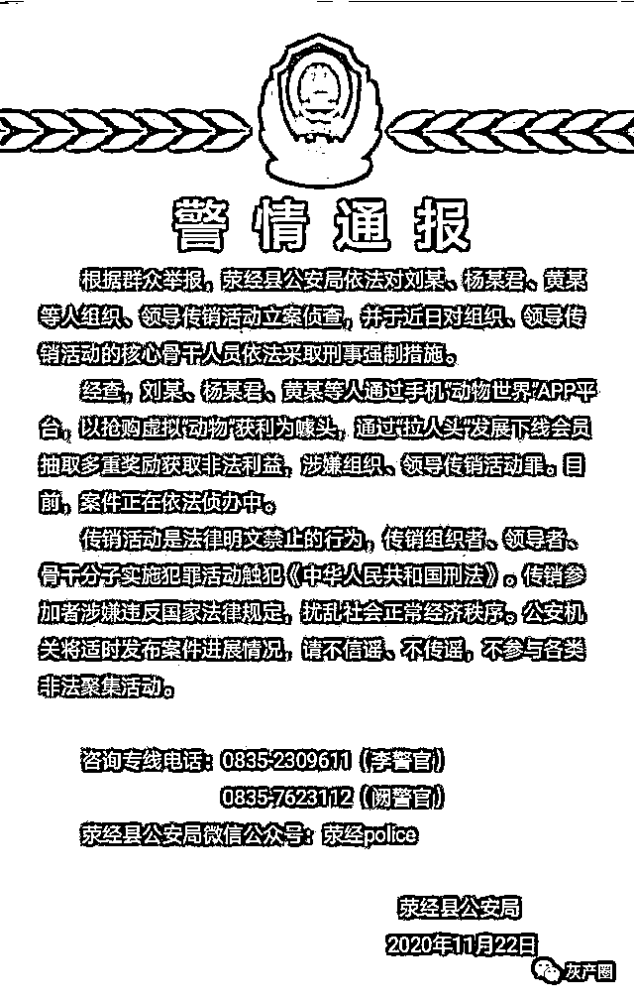
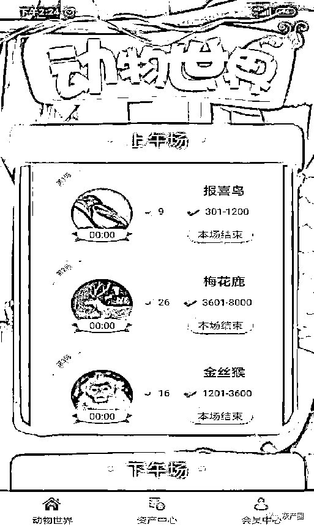
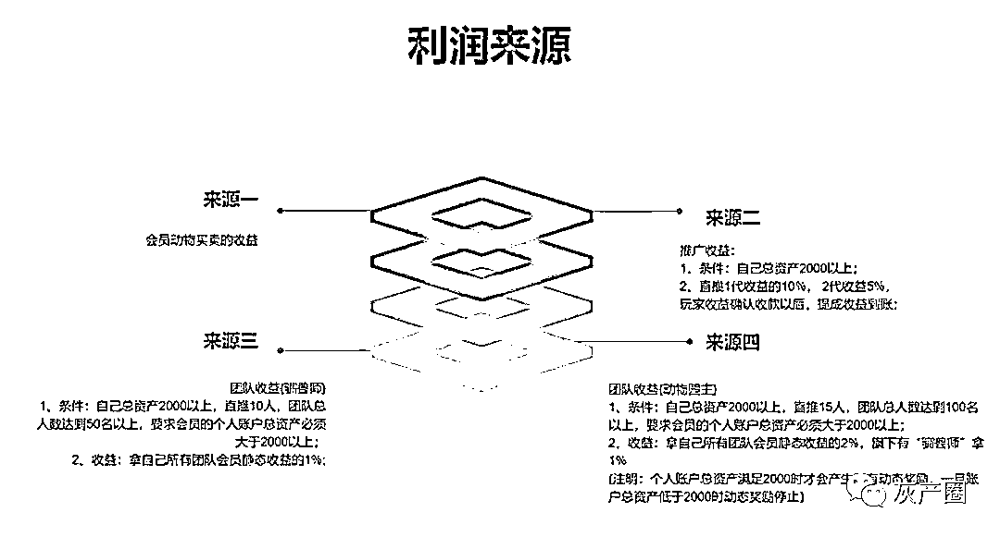
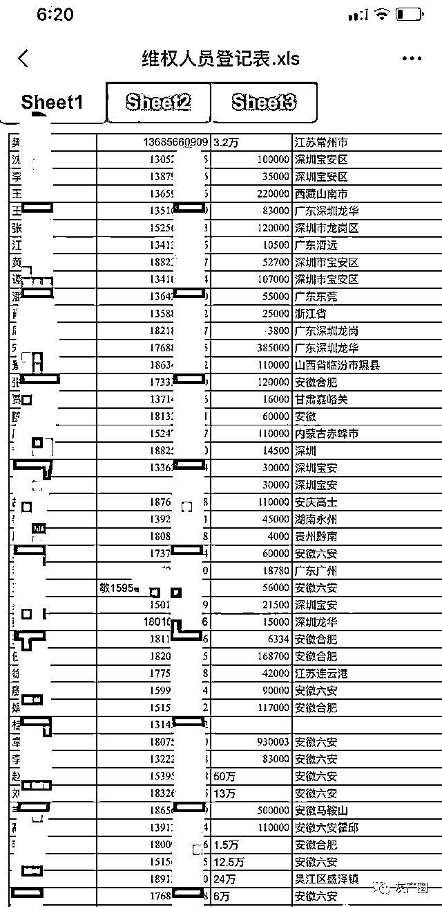

# “动物世界”APP 涉嫌传销：以网游为名发展下线

> 原文：[`mp.weixin.qq.com/s?__biz=MzIyMDYwMTk0Mw==&mid=2247507274&idx=3&sn=93989872500ce222bfe4404d268f4fda&chksm=97cb1672a0bc9f64a0000898186eb7f70ceb2ed83433080c0705c6346f601f61ac260c25715c&scene=27#wechat_redirect`](http://mp.weixin.qq.com/s?__biz=MzIyMDYwMTk0Mw==&mid=2247507274&idx=3&sn=93989872500ce222bfe4404d268f4fda&chksm=97cb1672a0bc9f64a0000898186eb7f70ceb2ed83433080c0705c6346f601f61ac260c25715c&scene=27#wechat_redirect)

点击蓝字“**灰产圈**”关注我们！

今年 11 月以来，全国多地警方针对一款名为“动物世界”APP 发出预警。

  这款网络游戏软件，打着“金融投资”的旗号，吸引了不少玩家参与。江苏省无锡市公安局锡山分局警方提示：“动物世界”APP 实际上是把购买虚拟动物作为快速投资理财产品，并通过短期高额回报让群众受骗。其中部分虚拟动物的年化收益率高达 1080%。

  用户在该款软件平台付款抢购“动物”，经特定的培养周期后将“动物”售出，可赚取差价获利，号称 5 天赚 15%，9 天赚 18%。玩家每天都需购买“太阳”后方可抢购“动物”。

  用户还可以通过发展下线赚取“管道收益”。根据每个人的资本和介绍人数不同，分为普通玩家、驯兽师、动物园园主、盟主、龙王等不同级别，可获得 1%~10%的收益提成。

  11 月 19 日，软件无法登录，玩家陆续报案。多地警方相继发出警情通报，以“组织、领导传销活动案”立案。据安徽六安市公安局官网消息，全国涉案地公安机关根据公安部部署，开展立案、侦办、抓捕等工作。

  无锡警方称，这类骗局往往利用网络通信工具迅速发展人员，聚拢网络资金，一旦投资者变少，平台就没有足够的现金流支付高额收益，就会停止运营。

  目前该案仍处于侦查阶段，相关组织者和核心骨干人员相继被警方控制。

  四川警方发布警情通报。图源官网

 以“培养动物”为噱头的网络传销

  11 月 19 日前后，每日固定的动物抢购时间，很多玩家发现，动物世界 APP 登录不上了。三天后，11 月 22 日，四川省雅安市荥经县公安局针对该情况发布了一则警情通报。

  荥经县公安局称，针对动物世界 APP 的情况，以组织和非法领导传销罪立案侦查，并对组织、领导传销活动的核心骨干人员依法采取刑事强制措施。

  荥经县公安局告诉新京报记者，该案目前仍在侦查中。自 11 月 22 日发布警情通报以来，已接到大量玩家的报警电话。

  佛山、无锡等多地公安局也接连发出警情通报，提醒用户注意和防止上当受骗。

  据安徽六安市公安局官网 12 月 21 日消息，针对该案，全国涉案地公安机关根据公安部部署，开展立案、侦办、抓捕等工作，主犯王某、檀某、张某、徐某等组织者已被四川警方抓获归案。

  该款 APP 崩盘后，玩家组建了大量维权群。记者获取的一份维权统计表格显示，一维权群中有近 200 人进行登记，其中被套牢资金最高的达 93 万元。

  如今该款 APP 被各网站禁止下载，软件页面也无法显示。据多位动物世界的玩家介绍，“动物世界”APP 出售包括“梅花鹿”、“金丝猴”、“中国龙”在内的 10 种虚拟动物，游戏明确规定每种动物的价值、合约时间和收益率，动物的培养周期从 1 天到 15 天不等，收益率最高的达 30%。所谓“培养”，即用户购买动物后等待固定周期，便能以更高价转手卖出，赚取差价。

“动物世界”APP 界面。图源受访者

  预约是第一步，用户花钱购买“太阳”后才有资格进行抢购预约，太阳只能通过私人转账的方式向自己的上级，即群主购买。平台每天会放出一定数量的不同种类虚拟动物，数量有限，一天固定的 10 场抢购时间，预约成功后，一个账号每个场次只能抢购一种动物。

  以平台价格最高昂的“中国龙”为例，用户消耗 48 个太阳(即 48 元)提前进行抢购预约后，每天 15:55 开抢，留给玩家的抢购时间仅有五分钟，“中国龙”金额在 8001 元到 24000 元不等，玩家抢到一条 8001 元的“中国龙”之后，经过 15 天的培养周期后若转手卖出，玩家能获得 30%的收益，即 2400 元。

  今年 7 月，在一个麻将群里，贵州贵阳的林燕燕第一次接触到“动物世界”APP。

  林燕燕花了 500 元试水，买了平台最便宜的动物——“报喜鸟”，三天的培养周期后，动物卖出，赚了 45 元。当天下午，她又立即花 8000 元买入一条“中国龙”，半个月后卖出，赚了 2000 多元。

平台实行等级制，发展下线获取收益提成

  林燕燕下载软件后，就被推荐人拉进名为“樊姐姐暴富区”微信群。

  每天一到抢购时间，玩家们都会守在手机前准备开抢。多位玩家提到，在 11 月之前，该款软件动物抢购堪称火爆，“到了那个(抢购)时间段，一直点，几天抢不到一个”，林燕燕说。

  群主会建议玩家注册多个账号同时抢购，微信群内还衍生出了代抢的业务，抢购成功收取特定佣金。“投资”资金不足，群主也会极力劝说成员进行网络借贷套取现款。

  为抢动物，林燕燕准备了两部手机、开了 8 个账号。她通常以购买龙为主，偶尔会买大红鹰、金丝猴，都是利润高的动物。收获丰富的时候，她光是每天辗转于 8 个账号间收付款，就要花上一个小时的时间。

  除卖动物获得的收益，拉人头也是一种获益方式。根据每个人的资本和介绍人数等因素，平台分为普通玩家、驯兽师、动物园园主、盟主、龙王等不同的级别，达到驯兽师的级别后，就可以拿到 1%~10%的“管道收益”。

“动物世界”APP 利润来源，图源受访者

  林燕燕所在的“樊姐姐富人区”的微信群中，群内有 500 人，按照动物世界的级别划分，群主樊芸属于团队中的“动物园园主”。

  抱着“有钱大家一起赚的想法”，林燕燕将自己的推荐二维码给了哥哥嫂子表妹等 5 位亲戚，将他们拉入“樊姐姐富人区”，他们都成为了樊芸的团队成员。

  按照平台规则，被林燕燕“拉入阵营”的这些人，他们卖动物获得的每笔收入林燕燕都能额外获得 10%的提成——任意一个人赚了 3000 元，她的个人账号上就能自动到账 30 元的“动态奖励”。

  “我想要每天收入破千，甚至是两千，就会想努力去推广了”，大学生杨琳最初加入的时候，5000 元的本金投入，一天能收益几百块。

  玩动物世界一个月后，她也把家里的亲戚、同学介绍进来。她的九位同学每人出几百上千元，凑了一万多元给杨琳共同“投资”，很快，杨琳发展了包括亲戚、同班同学在内的 10 多名“下线”。

  一份“动物世界”APP 内部使用说明称：所有跑路的平台，无一例外，都是钱被锁定在平台里不支持提现，或者系统不支持现有收益，平台才会圈钱跑路。

  而“动物世界”平台这种买家和卖家一对一实名付款，钱在会员之间流动的运作模式，被其用来为平台的安全性吹嘘：“公司不碰钱，没有圈钱的可能”。

  在多个“动物世界”APP 的微信群中，当玩家出现动摇心理的时候，群主都会向群成员介绍平台的三年规划：会发展虚拟货币，两三年后再继续发展实体，集成拥有巨大会员数量的团队，“那才是真正赚钱的时候”。

  在“团队长”的朋友圈内，不乏类似的“暴富”文案：“恭喜荣升驯兽大师，开启管道收益。一个月躺赚好几万妥妥的。”“买房了，首付 39 万，动物世界全报销。”

  11 月初，林燕燕一鼓作气追加投入：20 万元本金，此前四个月赚得的 8 万元利润，再用信用卡刷了 2.5 万元，总计超过 30 万元投入其中，“全部买龙”。她的 8 个账号里买了十几条“中国龙”，单价从 8 千元到 1 万 2 不等。

多地警方针对此类平台发预警信息

  杨琳既没有等到新投入的 12 万元利润的收获，也没有等到新发展的下线带来的利益收成，11 月 19 日，准备继续抢购的她发现软件登录不上。多个微信群里，玩家也都发现了这一情况。系统瘫痪后，“动物”卖不掉，成本收不回，众多用户的资金都被套牢在平台中。

  商州市公安局 11 月 23 日发出预警通告称，该平台运营公司位于安徽合肥。直到目前，该软件的众多玩家们仍无法查到 APP 的确切运营商，警方以涉嫌组织、领导传销活动罪控制了部分核心骨干人员。

  林燕燕所在群主樊芸告诉新京报记者，目前正在配合贵州警方接受调查。否认了自己拉人头的收益，并称自己同为受害者，在该款游戏中也损失几十万元，包括数万元的本金。

一个微信群内登记维权人员有 200 多人。图源受访者

  西安市公安局一负责该案的民警提到，类似的资金盘骗局十分常见，他提醒，投资者不要贪图小便宜，非银监局、证监会等正常监管的产品，其投资产品的涨跌、价格变化平台都可以自行操控，风险极高。

  事实上，在今年 11 月初，青海祁连县警方就“动物世界”“落马交易所”“拇信”等多款网络投资平台发出预警，称疑似涉嫌非法集资罪。在动物世界崩盘之前，今年 8 月，央视也曾曝光造成 6000 多人受骗，涉案金额达上亿元的云养猫“喵喵”APP，记者发现“动物世界”APP 与“喵喵”APP 有着如出一辙的运行规则。

  反传销人士李旭认为，该款游戏设置 2000 元的门槛、层层返利等情况符合传销缴纳入门费、拉人头、团队计酬的特征。

  “借新还旧，前面入场者赚取后面入场人的钱，一旦入场者速度慢或者人数减少，就会崩盘”。李旭称，该种资金盘也被称为互助盘，像击鼓传花一样，将入会者的钱层层传递，如果没有人接盘或者操盘者跑路，后面进场者就血本无归，也称庞氏骗局。

  李旭称，传销转战互联网，异地模式越来越少，网络传销门类也直线上升。常见的有互助盘，共享经济和打造区块链等资金盘。因为互联网传销传播速度快，跨区域、难取证。通过微信转账的方式也让其更加隐蔽。

  而像“动物世界”这类游戏中，采取“钱不经过平台，直接打入用户账户”的这种方式，实际上是平台方为规避风险，让后期警方追查时难以掌握其资金流向，“要是经过平台，就很容易查到钱转到哪里去了”，李旭称。但是平台能够通过用户购买“太阳”这种收取手续费的形式获利。

来源：新京报

           动物世界 APP 崩盘了，多人抢购虚拟动物投资被骗                              

[`v.qq.com/iframe/preview.html?width=500&height=375&auto=0&vid=w32084kjb46`](https://v.qq.com/iframe/preview.html?width=500&height=375&auto=0&vid=w32084kjb46)

← 向右滑动与灰产圈互动交流 →

