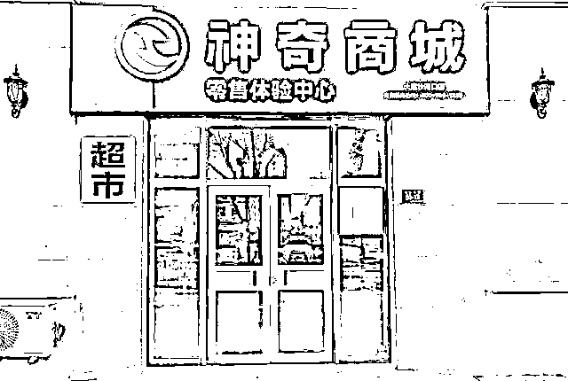

# 消费全返骗局又来？“神奇商城”涉嫌传销！

> 原文：[`mp.weixin.qq.com/s?__biz=MzIyMDYwMTk0Mw==&mid=2247507274&idx=4&sn=6e5f6c704dd684965592a000a767e364&chksm=97cb1672a0bc9f641ed744e814859453ec5cc7ae039bf9ea5f39b8052ba47317540e332025ca&scene=27#wechat_redirect`](http://mp.weixin.qq.com/s?__biz=MzIyMDYwMTk0Mw==&mid=2247507274&idx=4&sn=6e5f6c704dd684965592a000a767e364&chksm=97cb1672a0bc9f641ed744e814859453ec5cc7ae039bf9ea5f39b8052ba47317540e332025ca&scene=27#wechat_redirect)

点击蓝字“**灰产圈**”关注我们！

据重庆广电总台《第 1 眼》栏目近日报道，刘先生等人都通过朋友介绍，“神奇商城”卖的东西很少，价格比市场价贵十倍以上，那么，它的神奇之处在哪里呢？

（

题图：资料图

它宣称：用户在 APP 上进行高价购物，然后平台在 30 天内返还用户货款和利息。这样算下来，你买东西，不仅没花钱，反而赚了钱。那么，真有这样的好事吗？11 月 22 日，“神奇商城”突然停止了货款返还和返利，这让刘先生等用户损失惨重。

打开“神奇商城”APP，记者发现，里面的商品并不多，大多是一些礼品，也有部分电子产品，但无论是什么商品，神奇商城里的价格都贵的吓人，“比如华为 P30 pro 手机，外面大概六千左右，在商城里面接近 11 万，到了三十天之后会返还给我们 11 万 4000 多，另外加上手机本身值五到六千元，相对算下来，就赚了一万多块钱 ，月息接近 9 个点”，刘先生告诉记者。

说白了，神奇商城的神奇之处，就是先高价买东西，然后一个月之后，你花了多少钱，商城返你多少钱，而且还给你几千元的返利，这样算先来，你买东西不仅没花钱，还赚钱。

神奇商城 APP 的开发和运营方重庆造神可以优先责任公司对外宣称，这种看上去赔本赚吆喝的商业模式，是一种新型的共赢经济。那么，真的有这样的好事吗？

“公司 11 月 22 号之后，我买东西的货款已经到规定的返还时间了，但所有的款都没有退给我们”，刘先生说。（本文转自防骗大数据：FPData）

“联系不上他们的直接负责人，我们只能联系上朋友推荐人，我们接触商城也是朋友推荐的”，王先生说。

随后记者联系了推荐刘先生等人下载神奇商城的谭先生。他告诉记者，他也是通过朋友推荐接触的，从来没有去过这家公司的地址，也没有见过公司的任何员工。

“我是朋友推荐的，那个朋友也不知道内幕，他也让我们等，我也损失了十五万”，谭先生表示。

如今拨打重庆造神科技有限公司的 400 客服电话，无人接听，“神奇商城”的在线客服也没有回应。记者只好按照这家公司营业执照上的地址实地打探，可到了现场却发现，这里已经变成了另一家公司。

写字楼的物管人员介绍，这家公司已经搬走好几个月了，而通过这件事仔细回味，刘先生等人现在觉得，这种表面上看稳赚不赔的买卖，感觉像是拉人头的传销。

“基本上就是拉人头传销的模式”“感觉是诈骗，像非法集资那种”，刘先生等人说。

目前刘先生等人已经向警方报案，重庆造神科技有限公司的法人代表等，已被警方控制，案件正在进一步侦办之中。

                “神奇商城”够神奇，白送商品还返利？                                                         

[`v.qq.com/iframe/preview.html?width=500&height=375&auto=0&vid=z3210efozon`](https://v.qq.com/iframe/preview.html?width=500&height=375&auto=0&vid=z3210efozon)

来源：中国经济网

← 向右滑动与灰产圈互动交流 →

