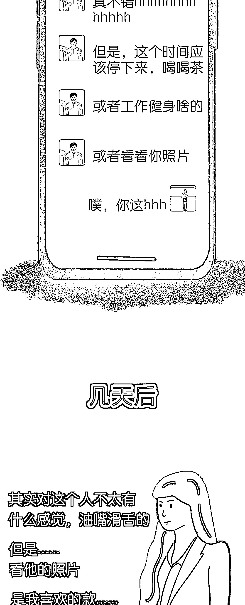
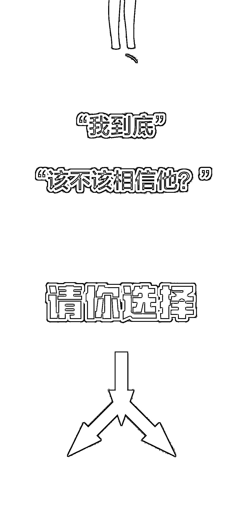
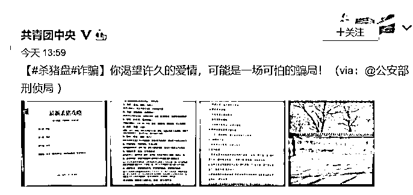

# “杀猪盘”诈骗流程大曝光！

> 原文：[`mp.weixin.qq.com/s?__biz=MzIyMDYwMTk0Mw==&mid=2247507315&idx=1&sn=e6968f4c4b2f87ab9b977899d2bbe89b&chksm=97cb164ba0bc9f5d665a81bbd6189d32860ad81aa55b5337482959912655bc2f045a7904becc&scene=27#wechat_redirect`](http://mp.weixin.qq.com/s?__biz=MzIyMDYwMTk0Mw==&mid=2247507315&idx=1&sn=e6968f4c4b2f87ab9b977899d2bbe89b&chksm=97cb164ba0bc9f5d665a81bbd6189d32860ad81aa55b5337482959912655bc2f045a7904becc&scene=27#wechat_redirect)

点击蓝字“**灰产圈**”关注我们！

****选择不相信**  ******选择相信  ****

从结婚多年内心躁动的大叔

再到进城务工

家人不在身边的小哥

工作没两年缺乏社会经验的

大学毕业生

还有一次没谈过恋爱的快递小哥

......

在这样一个“盘”里

那个操盘手

你永远不知道他是男是女

但

只要被骗者是女的

TA 们便“可以是”男的

只要被骗者是男的

TA 们便“可以是”女的

2019 年 8 月 5 日消息，重庆渝中警方“6·20”专案组首次在境内破获一起境外“杀猪盘”式特大跨境系列网络诈骗案。

据统计，截止案件破获时，**该案涉及受害人 1500 余人，涉案金额高达 3000 余万元。**

公安部“云剑行动”湖州南浔公安反诈 1 号专案组剿灭了一个全国特大“杀猪盘”——利用虚假彩票网站赌博行使诈骗，**成功捣毁 5 个作案窝点，抓获犯罪嫌疑人 40 余人，涉及全国受害人 1000 余人，涉案金额达 1000 余万元。**

2019 年 12 月 18 日消息，温州警方在全国 10 多个省(市)开展统一收网行动，截至当年 12 月 17 日，**在全国已抓获犯罪嫌疑人 102 名，破获案件 150 余起，涉案金额达 1000 余万元。**

事实上近些时日，杀猪盘事件频繁发生。据钱江晚报报道，36 岁企业员工遭遇“杀猪盘”被骗近千万元。据悉，9 月底，小琳（化名）通过交友软件结识了刘磊，确立网恋关系后，刘磊称对数字货币非常了解，且盈利颇丰。10 月 1 日，刘磊发来两个链接，让小琳下载软件，而后提币。交易初期，小琳赚了好几百万虚拟货币，并从平台成功提现 20 万元左右。11 月 16 日，小琳提币操作失败，选择报警。目前，杭州警方已经介入调查。 

据杭州市公安局反欺诈中心相关负责人介绍，所谓“杀猪盘”，是指诈骗分子利用网络交友，诱导投资人下载推送的诈骗 APP，在平台进行投资博彩、股票、期货甚至虚拟货币交易的网络诈骗。

在“杀猪盘”诈骗套路中，诈骗分子会提前准备好人设、交友套路等“猪饲料”，将社交平台称为“猪圈”，将诈骗对象称为“猪”。此外，他们还把与诈骗对象培养感情的过程叫做“养猪”。等感情培养到一定程度，一般是在一个月左右，骗子就会开始“杀猪”，而所谓的那些博彩网站、投资理财平台，大多都是诈骗分子自己搭建，他们可以自己后台修改程序，自行设置受害者账户的余额数据。

**共青团中央微博也发了相关预警**

在网上搜索“杀猪盘”

至今仍能看到很多受害者的留言

“杀猪盘”下

“有缘分的错觉”
“统一的话术”

“另辟蹊径的生财之道” 

......

**擦亮眼睛**

**不要再轻信“有缘人”**

**ps：**

**年关将至** 

**骗子们摩拳擦掌**

**活动更加频繁**

**大家提起 12 分小心！**

← 向右滑动与灰产圈互动交流 →

