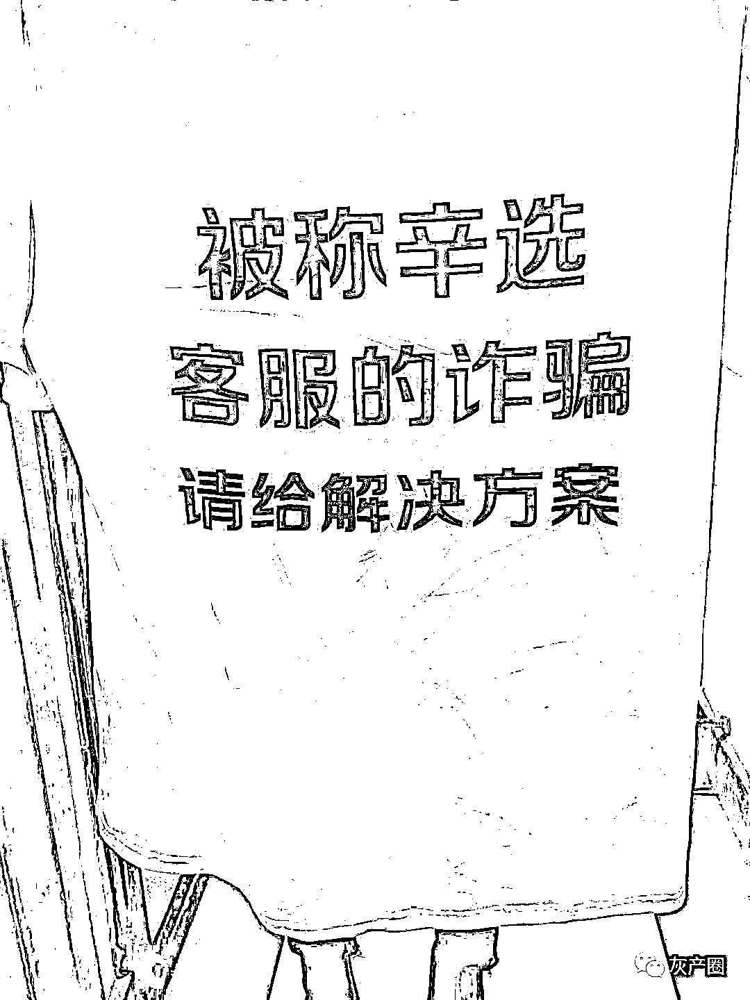
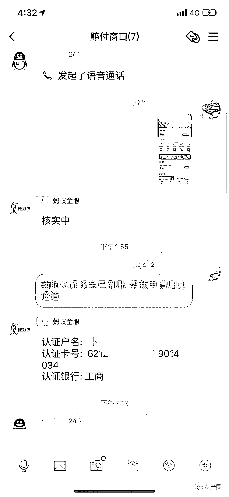
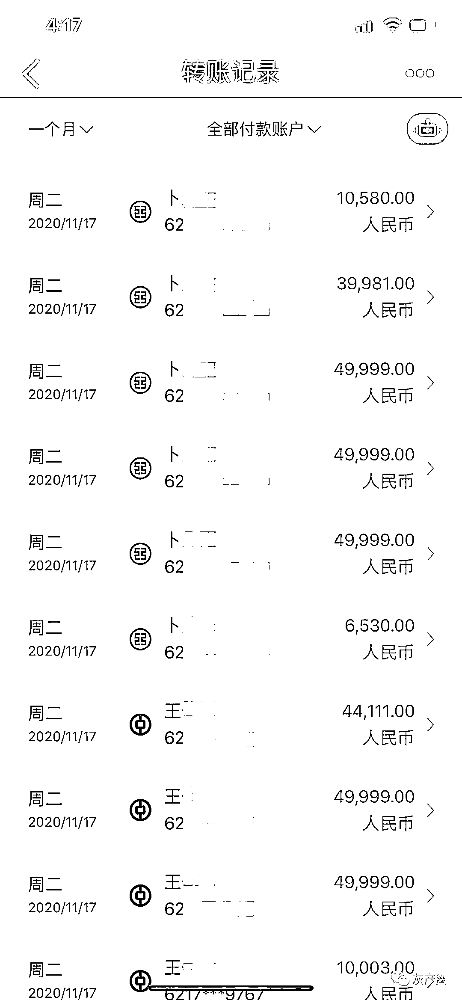
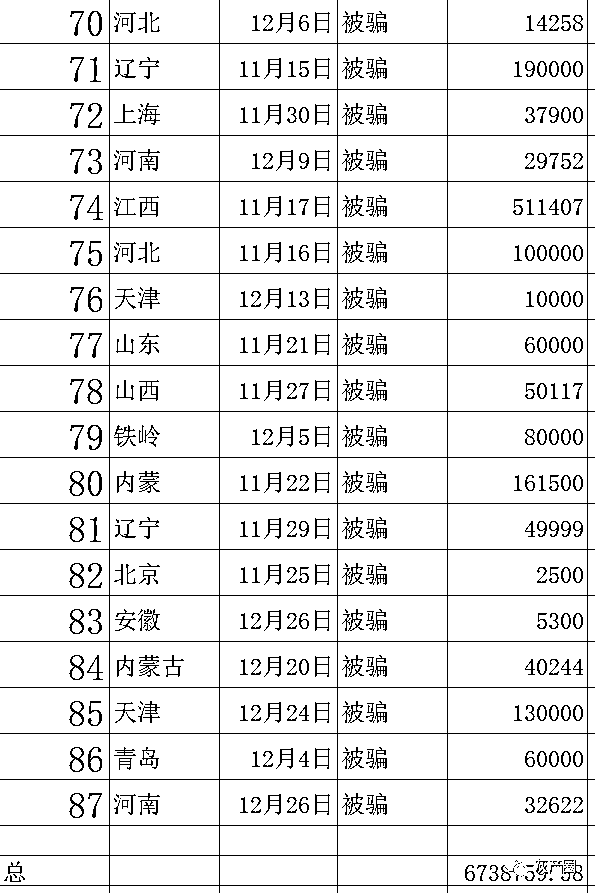

# 辛巴粉丝称遭诈骗数百万：购物信息疑遭泄露，骗完存款骗贷款

> 原文：[`mp.weixin.qq.com/s?__biz=MzIyMDYwMTk0Mw==&mid=2247507315&idx=2&sn=66001949d8005fe7462bc252c42aded8&chksm=97cb164ba0bc9f5da59c0d2653d2ec68e63f5f66d342eea98c44a0aea2da900b4c85478f0d3a&scene=27#wechat_redirect`](http://mp.weixin.qq.com/s?__biz=MzIyMDYwMTk0Mw==&mid=2247507315&idx=2&sn=66001949d8005fe7462bc252c42aded8&chksm=97cb164ba0bc9f5da59c0d2653d2ec68e63f5f66d342eea98c44a0aea2da900b4c85478f0d3a&scene=27#wechat_redirect)

点击蓝字“**灰产圈**”关注我们！

导语

直播带货红人辛巴（辛有志）再次陷入旋涡。

12 月 29 日，20 余人统一穿着印有“被称辛选客服的诈骗，请给解决方案”的白色 T 恤，在广州辛选直播基地门口拉起了横幅，横幅上写着“让你的粉丝活下去”。

12 月 29 日受害人穿统一 T 恤维权   本文图片均为受访者供图

他们都自称在辛选团队直播间购买产品后遭受了电信诈骗，诈骗者自称“辛选团队客服”，并可报出详细的购物信息，而后以理赔为名一步步诱导受害者转账，金额少则几千元，多则几十万元。

自称被骗者以 30 多岁的女性为主，部分人称，被骗的钱是自己的“全部家当”。

诈骗人员冒充“辛选团队”委托的工作人员进行诈骗 

早在 11 月中旬，陆续有网友开始在微博、快手等平台通过文字或视频的方式披露自己被以上述手段诈骗的经历。也有人在评论区留言后，通过“一个拽一个”的方式建起了维权群，每个人在进群后都会把自己被骗的证据发出来，每人以“省份-被骗时间-受骗金额”为备注。截至 12 月 30 日，该群有 87 人，自称被骗金额总计超过 673 万元。
他们称，在遭遇诈骗的过程中，对方均详细报出了他们的购物时间、订单号、发货地址、手机号等详细信息。
购物信息是如何泄露的？对此，12 月 30 日，辛选团队客服人员回应澎湃新闻称，目前正在配合警方调查之中，无法告知相关信息。 

“像是被洗脑一样言听计从”

 王敏（化名）自称是第 47 个进群的受害者。今年 50 岁的她说，她是辛巴直播间的忠实粉丝，“从去年 8 月就一直在辛巴直播间购物，几乎每场直播都看，全家人的生活用品都是在直播间买的，每月消费至少 2000 元”。然而，今年 11 月，她在购物后被骗走了 59901 元。
王敏称，11 月 6 日，她在辛巴直播间购买了一瓶价值 99.99 元的鱼子精华眼霜。6 天后，她接到了一个自称是辛选客服的电话,“客服”说，她购买的产品因出现质量问题，需要进行理赔。
王敏称，她一开始没有相信，但在与对方核实的过程中，对方准确无误地说出了她的姓名、住址，甚至购买产品的直播间、下单时间、价格和订单号。这让她深信不疑，按照指示添加了对方的 QQ 号，开始进行“理赔程序”。
回想起那天的经历，王敏觉得自己就像是“被洗脑了”，言听计从。“他表现得很可怜，说有什么任务标准，我就感觉自己有义务让人家按时下班似的，一步步按照他说的去做了。”
王敏说，加 QQ 后，对方随即发来了一个共享屏幕的二维码，同时通过电话指导她在扫码后显示的页面中输入自己的银行卡号、身份证号等信息，好接受理赔款项。最初，她填了两张没有存款的银行卡账号，但对方很快回复：“这两张卡的理赔程序进行得很慢，卡在 70%了，建议使用交通银行的卡”。她想到自己确实有张交通银行的卡，就用了。
“后来我才想起来，我扫描的共享屏幕二维码，对面能完全看到我的手机屏幕，包括我打什么字，每张卡里有多少钱，都能看到。”王敏说，这些细节，她事后才反应过来，“因为当时电话还通着，不然我可能每一步会多想一想”。
通话中的王敏似乎被迷惑了。她称，得到银行卡信息后，对方以每次 1 万元的方式将王敏银行卡中的活期存款及理财款尽数转入到了自己名下，共计 59901 元，而她因通着电话，对此浑然不觉。
按照王敏的说法，对方至此仍未满足。接着，对方又要求她在手机银行上以最高额度贷款 56000 元，再将这笔钱转入指定账户中。在这一次转账的二次确认时，她惊觉自己“是在将借的钱转到别人的账号中”，意识到自己可能被骗了，连忙挂断电话，查询银行卡后才发现余额已被转走，再打电话就已经无人接听了，随即王敏前往辖区派出所报案。
王敏说，自己被骗得比较早，骗子的话术还很简单，自己只被骗走了银行卡内的钱。但群里很多后期被骗的人称，骗子一开始就指导进行贷款、转账，不仅被骗了钱，还背上了高额贷款。 

“无法关闭”的备用金和“被系统卡住”的钱

 来自江西的孟梦（化名）自称是目前群内损失最大的一名受害者，足足被骗了 511407 元，其中有 30 余万是她多年来攒下的积蓄，原本打算用来付一套房子的首付；另一部分则是她在对方指导下，从各个贷款平台借出的款项。

孟梦的转账记录，共计被骗超 51 万元。

孟梦告诉澎湃新闻，10 月 24 日，她在“辛选赵梦澈直播间”购买了一款价值 9.99 元的面膜。11 月 17 日上午，她接到了一名自称是由辛选客服委托来处理这款面膜质量问题的蚂蚁金服工作人员的来电，对方主动提出要赔偿她 288 元。同样，由于对方准确说出了她所购产品的订单号、发货地址等所有相关信息，让她没有过多怀疑。
在添加了“客服”的 QQ 后，孟梦被拉入了一个理赔群。“里面有 5 个人。” 孟梦说，对方告诉她，288 元的赔款已经通过支付宝退了，“我说没收到，骗子就说钱款卡在通道里了”。此时，对方发来一个“分享屏幕”二维码，称指导孟梦把钱提出。
孟梦说，在对方的指引下，她在支付宝备用金中借出了 500 元，而她错以为这 500 元就是对方给自己打过来的理赔款。随后，对方又表示，“钱退多了，要还回去 210 元”。孟梦按要求转账后，对方紧接着发过来一张截图，显示孟梦的备用金服务关闭超时，必须强行关闭，否则会影响征信，还将面临每月 2 万元的还款。而要强行关闭系统，则需将所有的流动资金转入指定账户以保证资金安全，对方承诺“等关闭备用金后一并归还”。
孟梦称她被吓到了，立刻将银行卡、微信零钱、支付宝余额等金额全部转入对方名下。紧接着，对方又指导她通过“还呗”“小额贷”“美团”等多个平台进行贷款，并表示这些资金都是公司为她所放出来的临时款项。而在多次借贷并转账后，对方又以“没收到款项”，需要再转账一笔钱“冲”出这笔“卡住的”钱时，她意识到自己被骗了。
为了警告更多的人，孟梦戴着黑色帽子、口罩和墨镜拍视频讲述自己的被骗经历。她在视频中说，自己至今没敢告诉家人，在巨大的心理压力之下每天严重失眠、抑郁，甚至产生过轻生的念头。
和孟梦一样，河南的高女士称于 12 月 26 日接到了自称辛巴客服的理赔电话，在支付宝平台领取备用金后被告知无法关闭，于是下载了腾讯会议以方便对方“协助”自己关闭备用金服务，实际上却是在对方指导下一步步申请借款和贷款，然后转账。这一次，对方不断要求高女士转进更多的钱，以刺激程序的加载进度。最后，高女士在对方的要求下输入了一个“9407”的验证码，很快，她收到短信发现自己转出了 9407 元，意识到自己被骗了。 

辛选团队：已经配合警方进行调查

 多名受访者称，在骗术被识破后，骗子很快关闭了所有与受害者的联系渠道，电话关机、QQ 删除、微信拉黑。她们报警后都被告知，诈骗电话的 IP 地址在境外，钱也已经不在对方账户中，涉及跨省、跨国，追回的希望渺茫。
一个多月来，王敏坚持致电辛选团队客服，询问解决方案。她表示，群里姐妹们的诉求很一致，“大家都是相信辛选团队才被骗的，事到如今，希望他们能站出来给个说法，为什么骗子能这么迅速拿到我们的购物信息？”
12 月 30 日，在看到“辛巴直播间网购后 80 余人被骗 600 万元”的词条上微博热搜后，王敏再次致电辛选客服官方电话。客服表示：“我们没有泄露信息，同时一直在积极配合警方调查。”当问及骗子是如何得知用户购买信息时，客服则表示：“是诈骗团伙通过非法渠道取得了客户信息，这边也在等待警方调查结果。”
同日，澎湃新闻记者致电辛选团队官方客服电话，对方表示目前此事正在配合警方调查之中，无法告知相关的信息，将转接给公关部门，由公关人员进行回复。截至发稿，辛选团队尚未回应。
在维权群中，目前已有 87 个人，其中大多数为 30 岁左右的女性，“她们都是一些全职妈妈、单亲妈妈，既没有使用过任何借贷服务，也不了解支付宝‘备用金’功能。”在群中担任“大姐”这一角色的王敏说：“群里有很多低收入宝妈，现在真是痛苦，有的还不敢和家里人说，都不知道怎么活下去了。”

维权群内统计，被骗人数 87 人，总额近 674 万元

自称被骗 8 万元的梁女士认为，骗子能赢得信任，一部分原因源于此前的“假燕窝事件”。“这件事辛巴团队进行了退一赔三，在假燕窝事件铺垫下，我们接到理赔电话时，以为是现在辛选团队审核更严格了，燕窝都赔偿了，觉得这个好像也没有什么问题”。
在维权群中，大学生林琳（化名）是为数不多的年轻女性，她代表自己的母亲陈女士关注群里的维权动态。她告诉澎湃新闻，陈女士正是在燕窝事件发酵正烈时被自称辛选客服的人骗取了 6 万元。“我妈最近一直很自责，家里人也都尽量不再提这件事。”林琳说，“尽管她还会玩快手，但已经不再看辛巴家族的直播了。”

来源：澎湃新闻 

← 向右滑动与灰产圈互动交流 →

