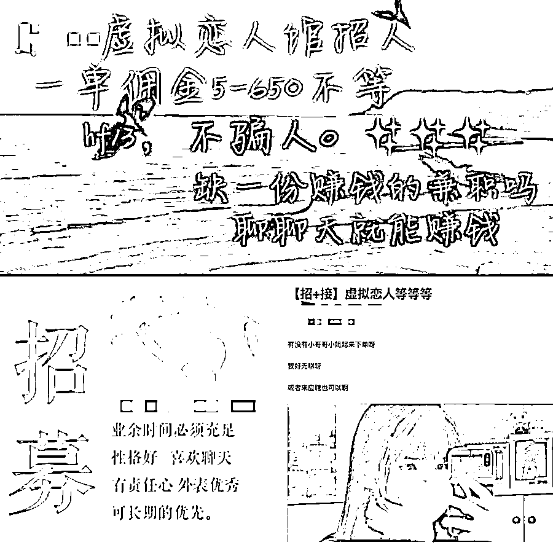
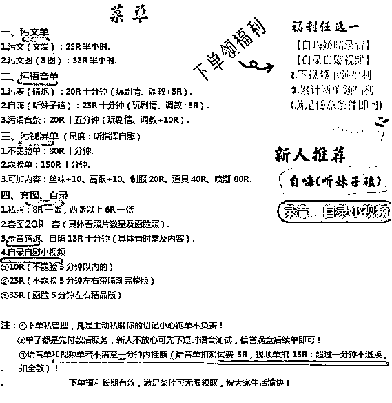
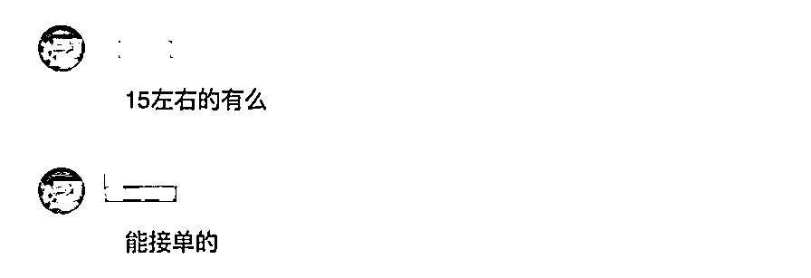
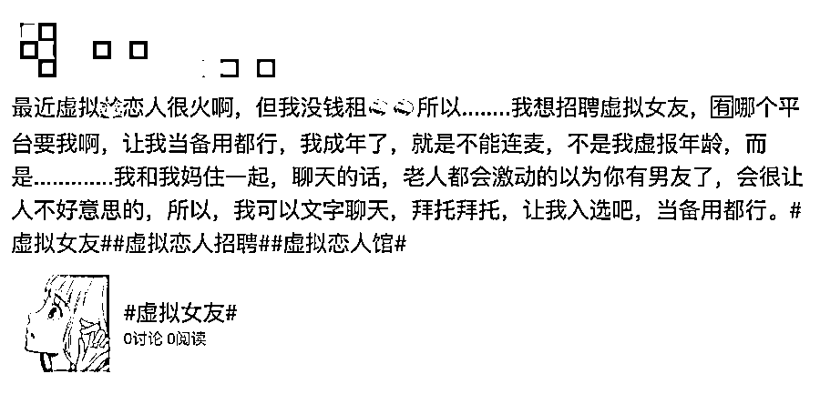
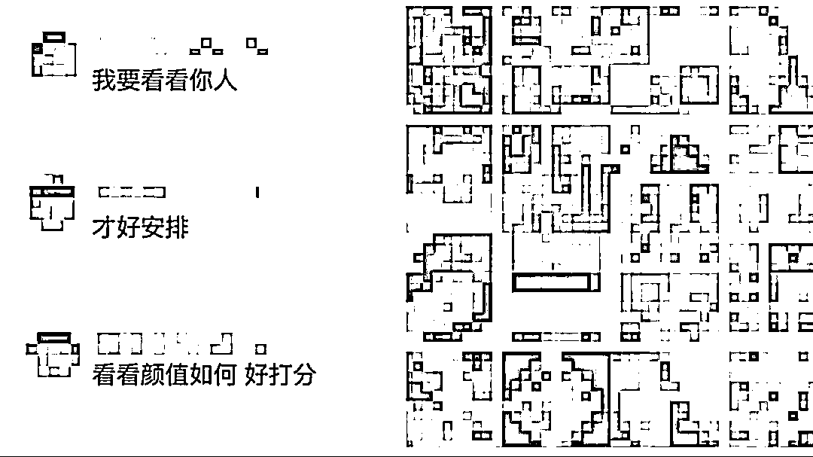

# “虚拟恋人”口述：我不想再当“帮凶”了

> 原文：[`mp.weixin.qq.com/s?__biz=MzIyMDYwMTk0Mw==&mid=2247507315&idx=4&sn=116906a3ffb6cad37455805ff20fcd2b&chksm=97cb164ba0bc9f5daab5b210f2e5b96ad9740aeb9a197537258ab6cc70862333a8529ed97529&scene=27#wechat_redirect`](http://mp.weixin.qq.com/s?__biz=MzIyMDYwMTk0Mw==&mid=2247507315&idx=4&sn=116906a3ffb6cad37455805ff20fcd2b&chksm=97cb164ba0bc9f5daab5b210f2e5b96ad9740aeb9a197537258ab6cc70862333a8529ed97529&scene=27#wechat_redirect)

点击蓝字“**灰产圈**”关注我们！

*打游戏没人陪？我们这里有带你上分的小哥哥！*

**想谈甜甜的恋爱？我们这里有专属虚拟恋人！**

*这是网络上某个虚拟恋人馆的广告词。**“虚拟恋人馆”，是存在于网络上提供情感服务的店铺**，只要在店铺下单，就能拥有一位“虚拟恋人”，除了不能见面，ta 可以和你聊天，陪你打游戏，叫你起床… *

*“虚拟恋人”无需经营，却能在需要的时候随时出现。近年来，这种模式越来越受欢迎，各个店铺也纷纷开始“扩招”，在很多平台上都能看到**虚拟恋人兼职**的招募广告。*

*▼*

**

*成为“虚拟恋人”看上去是份不错的兼职，**只需连连麦就能轻松领到工资**。*

*不少未成年人也正是被这一点吸引，他们加入了“虚拟恋人馆”，以为陪别人聊聊天就能赚到零花钱，却没想到从此踏进了**色情交易**的泥淖中…*

*****聊聊天而已？不存在的*****

*小玲是一名 15 岁的初中生，暑假期间，闲着没事想在网上找份兼职，刚好看到了招募“虚拟恋人”的帖子。聊天赚钱、游戏陪玩… 这么简单？她迫不及待地联系了发帖人。*

*交了 30 元入会费之后，小玲进了新人培训群，当晚 8 点，群管理员就拉起一轮语音培训。她告诉新人们：“想赚钱还不简单？现在单子这么多，你们没事的时候接一接，月入上千都不是问题！"*

*管理员的一句话，让小玲充满期待，但进了接单群后她才发现，事情有点不对劲——**所谓的“接单”并不只是“聊聊天”那么简单。***

*“**群聊天里全部都是污聊单和视频单**，之前招聘帖子上看到的游戏单和正常聊天单几乎没有。” *

*污聊单分为“污文单”和“污语音单”，视频单则有露脸单不露脸单的区别，所有的类型，都被制作成了“菜单”，明码标价。*

*▼*

**

*管理员声称，下单满一定的数额即可领取“福利”，有什么“特殊需求”也可以满足。小玲注意到，有部分客户甚至会直接**要求未成年人接单**。*

*▼*

**

*令她惊讶的是，这些单子很快就有人回应了。原来在接单群上，还有很多像小玲一样的未成年人，其中年纪最小的才 14 岁。* 

*****是“受害者”，还是“帮凶”？*****

*虽然年纪不大，但他们的经验非常丰富，微微就是其中之一。她加入恋人馆快半年，**已经从接单发展成为宣传团队的一员。***

*“接单的工资太少了。像污文单 25 块/半小时，我们最后能拿到手的只有 5 块，其他 20 块都是创始人的。拉人就简单很多，拉一个人我可以拿到 1/3 的提成。”*

*微微说，她一般会在各个社交平台上发布广告帖，等着有意向的人联系她。此外，也会通过关键词搜寻有意向的人，主动发送私信。*

**

*“想加入虚拟恋人馆的人还挺多的，有人是为了赚零花钱，有人是为了消磨时间，反正在家闲着也是闲着。”上半年疫情期间，很多学校延迟开学，微微有时候一天能拉到 10 个人入会。* 

*但最近，她也打算退出恋人馆，因为不想再继续当“帮凶"了。*

*“现在很多店铺都是这样，打着‘虚拟恋人’的名义，进行着各种线上色情服务。**如果是我的朋友，我是不会让他们加入的。**”*

*毕竟“虚拟恋人”这份兼职可能带来的伤害，远远不止于线上。*

*****“虚拟恋人”的真实风险*****

*虽然带着“虚拟”二字，“虚拟恋人馆”暗藏的风险却是真实存在的。**个人隐私泄漏**，就是其中的隐患之一。* 

*在接单前，管理员会要求所有人发布照片或者视频，根据‘“颜值”打分，如果不发的话，就没有“接单”的资格。为了能够接到单，大家纷纷发送照片和语音“推销”自己，将隐私暴露在陌生人面前。**而这些信息，极有可能会被不法分子利用。***

**

*除此之外，这其中还充斥着大量“污聊”“污视频”等不良内容。“虚拟恋人馆”的出现本来是为了“陪伴”和“传递温暖”，但在黑产分子的运作下，大部分的恋人馆早已背离了初衷。**不少曾经加入过“虚拟恋人馆”的未成年人甚至因为某些“污单”留下难以治愈的心理阴影。***

*****持续关注，持续守护*****

***在对话中我们发现， 未成年人并不是没有意识到“污聊”“污视频”是不好的行为，**但往往由于好奇，想消磨时间，又或者是被短期的利益吸引，从而忽略了事情的严重性。*****

***保护未成年人网络安全，我们要做的，除了把从他们把泥泞中拉出，**更重要的，是防患于未然，及时发现潜藏的风险。**针对网络色情不良信息，腾讯举报中心通过加强智能识别和策略覆盖进行打击。与第三季度相比，第四季度色情相关举报量级下降了**39.3**%。***

***与此同时，**加强未成年人性教育也同样重要。**绝大多数孩子第一次上网是在自己家里，家长正是孩子的最佳教师。让孩子学会提前预防性侵害，明白“污聊”背后可能意味着什么，才能更好地保护未成年人的网络安全。***

***▼***

 ***[`mp.weixin.qq.com/mp/readtemplate?t=pages/video_player_tmpl&action=mpvideo&auto=0&vid=wxv_1674590849944338435`](https://mp.weixin.qq.com/mp/readtemplate?t=pages/video_player_tmpl&action=mpvideo&auto=0&vid=wxv_1674590849944338435)*** 

***“虚拟恋人馆“只是大千网络世界的一隅，也是未成年人网络安全问题的缩影。关于未成年人的上网安全，我们将持续关注，持续守护，让每个孩子都能成为繁星，闪烁独一无二的光芒。***

************

***← 向右滑动与灰产圈互动交流 →***

******