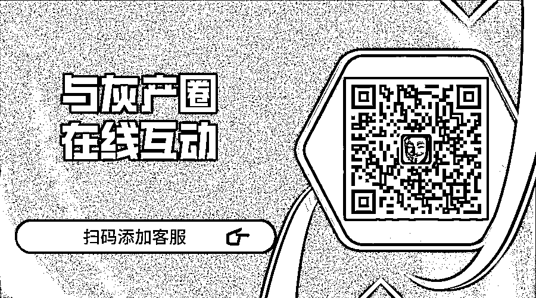

# 拼多多被知乎禁言了！遭知乎官方打脸后拼多多再次回应：系外包员工所为！

> 原文：[`mp.weixin.qq.com/s?__biz=MzIyMDYwMTk0Mw==&mid=2247507339&idx=1&sn=c0dccabde861f7ef4fe3d96a95f7ecda&chksm=97cb16b3a0bc9fa5daeccecef233402f8021bef360928acc1dfef3e135b6786c0751241d2038&scene=27#wechat_redirect`](http://mp.weixin.qq.com/s?__biz=MzIyMDYwMTk0Mw==&mid=2247507339&idx=1&sn=c0dccabde861f7ef4fe3d96a95f7ecda&chksm=97cb16b3a0bc9fa5daeccecef233402f8021bef360928acc1dfef3e135b6786c0751241d2038&scene=27#wechat_redirect)

点击蓝字“**灰产圈**”关注我们！

愿逝者安息吧 ”

1 月 4 日晚间消息，拼多多在知乎官方账号被永久禁言。知乎拼多多账号界面中显示，“由于违反知乎社区管理规定，该用户被永久禁言”。而 1 月 5 日早间，知乎网页显示，由于违反知乎社区管理规定，拼多多的知乎官方账号被禁言 15 天。目前用户在知乎搜索栏搜索拼多多关键词时，已不显示拼多多的官方账户。 

12 月 29 日凌晨，拼多多一位 23 岁女员工猝死。事情曝出后，迅速引起了网友的讨论。1 月 4 日，一张拼多多知乎官方留言的截图再度引爆舆论，并在网络上持续发酵。对此，拼多多回应称，1 月 4 日上午网传截图所说的“拼多多官方回应”不实。

随后，知乎通过官方微博发布消息称，拼多多系知乎注册用户，其身份真实无误。知乎有严格的身份认证流程和机制。晚间，拼多多承认网传截图，称该内容系拼多多营销合作供应商员工用个人手机发布，该言论不代表任何拼多多官方态度。

**细节如下**

就一位女生员工意外离世一事，拼多多终于给出了最新官方说明。

在官方说明中，拼多多表示，该员工不幸离世后，公司同事一直陪伴家属，并且遵父母意愿，逝者已经于 2021 年 1 月 3 日火化（很可惜，为死者哀悼）。

据财新报道，家属已经接受拼多多赔偿。

在这次说明中，拼多多否认了此前网传的各种截图和 "回应"——然而，知乎官方账号 "知乎小管家" 回应称：

> 「拼多多」系知乎注册用户，其身份真实无误。知乎有严格的身份认证流程和机制。
> 
> 4 日 8 时 19 分 49 秒，「拼多多」创建回答「你们看看底层的人民，哪一个不是用命换钱，我一直不以为是资本的问题，而是这个社会的问题，这是一个用命拼的时代，你可以选择安逸的日子，但你就要选择安逸带来的后果，人是可以控制自己的努力的，我们都可以」。
> 
> 4 日 8 时 20 分 17 秒，「拼多多」自行删除了上述回答。

另外，据北京青年报报道： 

> 4 日，记者从上海市长宁区劳动保障监察大队获悉，接到网络舆情后，劳动保障监察部门已对拼多多公司的劳动用工情况进行调查，会对该公司用人合同、用工时间等情况进行检查。

1

**拼多多员工离世，家属已接受赔偿**

2021 年 1 月 3 日，元旦假期第三天，一则 "拼多多新疆买菜妹子下班路上猝死" 的消息在网上流传发酵并登上热搜。

据传，该女孩才 23 岁。

根据拼多多最新的官方说明，该离世女孩的名字是张*霏，出生于 1998 年，她于 2019 年 7 月入职拼多多，在离世前为多多买菜业务员工。

北京时间 2020 年 12 月 29 日凌晨 1 点 30 分，该女孩在回家路上突然捂腹并晕厥倒地，最后被同事送至乌鲁木齐本地医院，在将近 6 个小时的抢救之后不幸离世。

对于女孩离世的具体原因，拼多多官方并未说明。

不过，从凌晨 1 点 30 下班的情况来看，逝者在拼多多的工作的确非常辛苦——对此，据财新引述拼多多方面的说法报道称，新疆的作息与北京不同，大概晚上 9 点吃晚饭，凌晨一点大约相当于北京时间十一点；不仅如此，买菜业务员工通常是前一晚收单，为第二天配送做准备，多为晚上上班。

在官方说明中，拼多多表示，在女孩离世后，公司同事一直陪伴家属，遵父母意愿，逝者已经在 1 月 3 日火化，公司也不对外发布公告。

值得一提的是，在征得逝者父母同意后，拼多多将逝者父亲的朋友圈截图附上，图中文案表示：

> 感谢大家对*霏的关心。我们已经带着*霏平安回到了家乡。最后一程，我们希望能安静地陪她走完。恳请大家不要让*霏卷入舆论是非中。*霏公司的同事们一直陪着我们，协助我们处理事情，也感谢*霏的公司和一直陪伴的同事们。

另据财新报道，逝者家属已经接受拼多多赔偿。

2

**拼多多回应**

在官方说明中，拼多多呼吁所有关心逝者的朋友和公众，不要相信各种网传截屏和所谓的 "拼多多回应"。

雷锋网注意到，1 月 4 日，在各大社交网络平台上，有一张类似于拼多多官方账号的知乎回应截图疯狂流传，截图显示拼多多就 “员工加班猝死” 一事称：

> **你们看看底层的人民，哪一个不是用命换的钱，我一直不以为是资本的问题，而是社会的问题，这是一个用命拼搏的时代，你可以选择安逸的日子，但你就要选择安逸带来的后果，人是可以控制自己的努力的，我们都可以。**

不过，对于这个截图的真实性，拼多多表示否认，表示从未发布过该截图所传的 "回应"——并对截图中的观点坚决反对。

但同时，在网络上也有大量声音质疑称，该截图的确是拼多多官方账号所发，并且还喊话知乎对截图进行证实或者证伪。

无论如何，这次的事件，再次引起了人们对于拼多多旗下多多买菜业务的关注。

雷锋网了解到，拼多多在 2020 年 8 月正式推出了多多买菜，并且开始了大举扩张力度。

在业务推出后，多多买菜通过“高补贴拉新、高频率拜访、高效率入驻”抢占流量，实现了短期用户的快速累积。另外，借助于拼多多的流量扶持，多多买菜一开始在前端就拥有了巨大优势。

有数据显示，在其样板城市南昌市，多多买菜的日单量约为 40~45 万单，远超美团优选和橙心优选。

对于多多买菜，2020 年 10 月，拼多多创始人黄峥在内部讲话中表示：

> 买菜是个好业务，是个苦业务，是个长期业务，也是我们拼多多人的试金石……买菜是个苦业务，别人睡觉的时候你在拣货，送货，这样消费者在要做饭前才能拿到新鲜的菜。人每天都要吃饭，我们每天都得送菜，的确很难做到每天都不睡觉，这里面的苦是显而易见的。

雷锋网获悉，2020 年 12 月初，多多买菜在乌鲁木齐正式开团，但从一开始就遭遇了反对的声音，在新疆，有一批实体店店主组建了 "实体店联盟"，要求停止向平台供货；尽管如此，多多买菜还在向其他地区继续扩张。

根据拼多多的官方说明，逝者在生前的内部账号上写道：为多多守边疆。

3 

**拼多多回应****对官方账号管控不严 向公众表示真诚歉意**

对于知乎平台的说法，昨天晚上 19 时许，拼多多通过官方微博 @拼多多 发布【关于拼多多同事张*霏意外离世的说明及知乎账号管控不严的致歉声明】。

拼多多表示网传截图显示，1 月 4 日早 8 时许，拼多多知乎官方账号突然发布一则疑似个人言论。该内容系拼多多营销合作供应商员工李某某用个人手机发布，该言论不代表任何拼多多官方态度。据拼多多透露，该员工参与了拼多多跨年晚会的内容运营等合作营销任务，用手机登陆了拼多多的知乎官方账户，并保持了登陆状态。 

拼多多称李某某用此前登陆留存的机构账号发表了个人看法，并附带了李某某的手写情况说明书。据李某某情况说明，今早 8 时 19 分（指 4 日），其在地铁上翻看新闻，想要发表一下自己的想法，于是用手机客户端进行了回复。回复后，李某某发现发布账户为此前登陆留存的机构账号，于是立即进行了删除处理。

拼多多表示，此事系对官方账号管控不严导致，向公众表示真诚歉意。

李某某的手写情况说明书。

致歉声明全文↓↓ 

值得关注的是，据相关媒体报道，上海市长宁区劳动保障监察大队接到网络舆情后，劳动保障监察部门已对拼多多公司的劳动用工情况进行调查，会对该公司用人合同、用工时间等情况进行检查。

来源：雷锋网 封面新闻综合南方都市报、新浪微博等 

← 向右滑动与灰产圈互动交流 →

