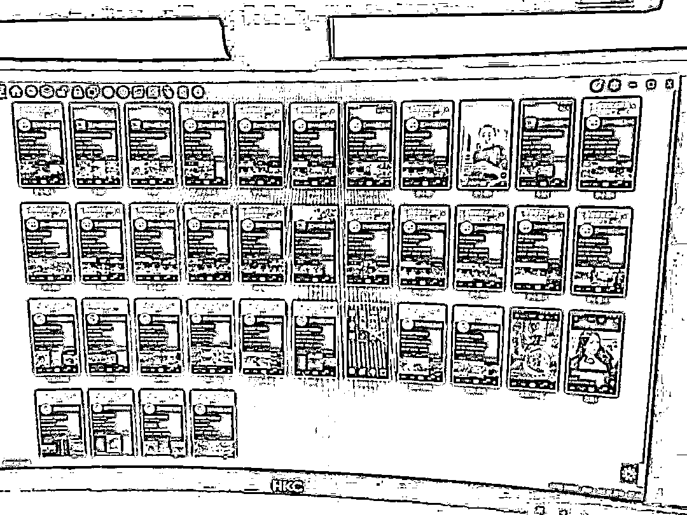
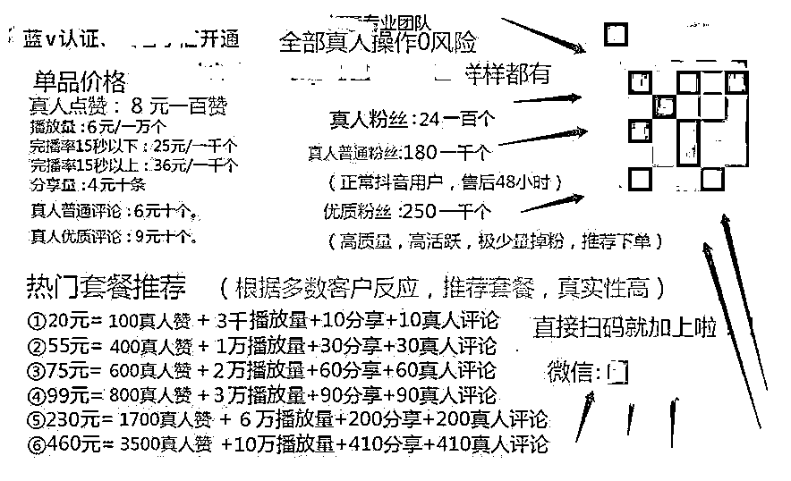
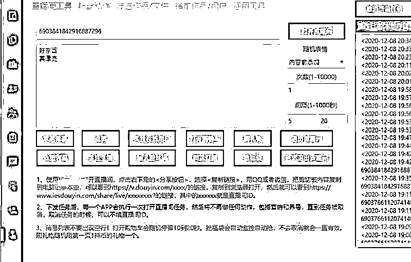
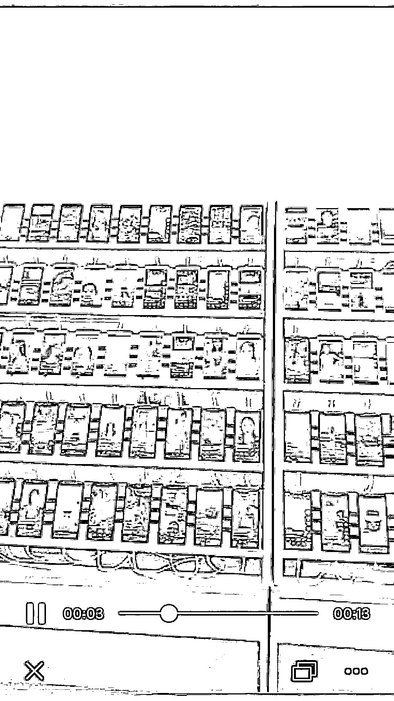

# 刷量系统操控的直播带货：90 元可买 500 个机器粉发言带节奏

> 原文：[`mp.weixin.qq.com/s?__biz=MzIyMDYwMTk0Mw==&mid=2247507339&idx=3&sn=c07a4c3beba2f415292578ee2f7586a3&chksm=97cb16b3a0bc9fa5f8dd9555440fd9df74fc29dc1edc4cdfed301ce78fa60c93c75acafe0620&scene=27#wechat_redirect`](http://mp.weixin.qq.com/s?__biz=MzIyMDYwMTk0Mw==&mid=2247507339&idx=3&sn=c07a4c3beba2f415292578ee2f7586a3&chksm=97cb16b3a0bc9fa5f8dd9555440fd9df74fc29dc1edc4cdfed301ce78fa60c93c75acafe0620&scene=27#wechat_redirect)

点击蓝字“**灰产圈**”关注我们！

> 如今直播带货出现了新的玩法，即花钱买机器粉进直播间观看、带节奏，制造“销售火爆”的假象。尽管平台进行了多轮清理，但这些灰产人士依然活跃在社交平台上。

“云控系统为直播引流，最多可以控制 2 万台手机，不需要人工操作，云端发布指令后，2000 条自定义发言自动发出，句句不重样。”河南郑州一家传媒公司的测试机房内，销售经理李飞正盯着眼前的上百台手机，向远道而来的客户讲解公司开发的云控系统如何控制直播间流量。

在他身后，技术人员一番操作，原本黑屏的手机齐刷刷进入同一个直播间。如果不出意外，这套系统能昼夜不歇地对支架上的所有手机，同时执行“关注主播”、“发言带节奏”、“点赞送灯牌”等命令。

▲销售人员展示的直播引流系统后台操作页面。受访者供图

2020 年，直播带货成为经济领域的新风口，各路网红、达人、明星纷纷挤进直播间，给消费者“种草”，也从中收割流量。在利益驱使下，像李飞这样批量炮制流量数据的灰产人士应运而生。在他们手中，流量数据被明码标价，90 元可买 500 个机器粉进直播间发言带节奏，包三个小时。使用者，大到孵化网红的中介 MCN(Multi-Channel Network 多频道网络)机构，小到田埂上的个体果农。

在流量数据至上的直播江湖里，主播手握漂亮的数据，与 MCN 机构、商家合作时往往拥有更大的筹码和议价权，头部主播向商家压价，争取“全网最低价”以吸引顾客；MCN 机构孵化主播的同时，还要防着主播绕过机构直接与商家合作。主播、MCN 机构、商家三者之间看似互利共赢，实则充满了较量与博弈。

2020 年下半年，多位头部主播卷入流量数据造假、虚假宣传的旋涡中。这些经过粉饰的直播间，终于暴露在公众面前。

直播数据“注水”

**带货七八分钟，成交 500 多单，这是深圳一家零食品牌今年试水带货直播的“战果”。没想到，直播结束后的经历让黄兴兴有种坐过山车的感觉。**

**2020 年 7 月，一家 MCN 机构找到她，希望进行合作。对方宣称，旗下有个主播即将在某短视频平台直播首秀，其很有可能达到千万粉丝级别，已经在该短视频平台官方推出的流量推广工具上花了不少钱。**

**双方商定，黄兴兴公司需付坑位费 2 万元，主播佣金按商品成交额的 20%收取。**

**黄兴兴回忆，这场直播持续了 4 个小时，因为是混播，只有七八分钟的时间是在介绍她公司的产品，当场成交了 500 多单，最终卖了两万多元。没想到，之后几天至少三分之二的消费者发起了无理由退款，黄兴兴要求主播补播，但对方说什么也不答应。黄兴兴怀疑可能有人在刷单，她认识的几个品牌方也同样遇到了“被刷单”的情况。**

**直播时“刷”出来的虚假繁荣，在直播后落在真金白银上，黄兴兴的公司损失了至少 1.5 万元。**

**如今直播带货出现了新的玩法，即花钱买机器粉进直播间观看、带节奏，制造“销售火爆”的假象。尽管平台进行了多轮清理，但这些灰产人士依然活跃在社交平台上。**

**在 QQ 群以“直播人气”作为关键词搜索，很容易找到提供刷量涨粉的卖家。新京报记者通过 QQ 群联系到了一位提供刷量服务的卖家李亮。他表示，只要告知直播间账号和开播时间，他们随时都能安排人气。**

**从李亮提供的报价单来看，“滚屏购买”3 小时 20 元，2000 个直播点赞 10 元，直播包人气 100 人 50 元一天，500 人围绕直播间互动 1 小时 90 元，“围绕直播间内容真发言”。**

****

**▲刷量人员在社交网络上发帖揽客的报价表。受访者供图**

**新京报记者选择了某短视频平台上一个正在卖暖风机的直播间，然后向李亮购买了 20 元包 3 个小时的“滚屏购买”，几分钟后，原本不太活跃的直播间隔几秒就会出现“XX 正在去购买”的弹窗。**

**正常情况下，用户未登录无法购买，但通过“滚屏购买”的刷量操作，即使不是真实观众也可以点击“正在购物”，给直播间营造出“销售火爆”的假象。**

**这种服务还能量身定做。另一位自称在广东的刷量人员许彬向记者提供了一段 4 秒钟的视频。画面中，几十部外观一致的手机摆在支架上，所有手机呈现出同一个直播间，工作人员在手机间来回切换，动作娴熟，一位女主播扯着嗓门喊，“这一款可以算是百搭了。”**

****************************批量炮制流量****

******刷观看人数、浏览购物车、发言带节奏等流量数据“注水”背后，已经野蛮生长出一条灰色产业链。在直播刷量产业链上，刷量人员许彬相当于代理商角色，处于中游环节，而链条的更上游，是云控系统开发商。******

******早在 2018 年，销售经理李飞所在的公司就开始研发为直播间引流的云控系统，“哪里有流量，我们就往哪里去。”******

******据销售人员介绍，“这套系统突破了短视频平台的机制算法，最多可以控制 2 万台 7.0 以上版本的手机，不需要人工操作，云端发布指令后，2000 条自定义发言，句句不重样，能够为直播间带来更多自然流量。”******

******但新账号一开始没有推荐权重，活跃一段时间，平台才会逐渐为账号打上某个垂直领域“活跃”的标签。技术人员小王介绍了一套速成的方法，简单来说，购买系统后，再批量进一些单价 300 元左右的山寨手机，然后用手机号注册短视频账号，之后按照他们揣摩算法得出的“经验”操作，三天左右，账号就会获得权重。******

******“主要是直播公会、MCN 机构和电商公司在买我们系统，很多大主播都在用。”李飞说，他们的客户专门给手下的主播涨粉刷量，闲置的时候就对外出租，或接一些个人散单，还有人将养肥的账号出售。******

******李飞估算过，客户按 100 台手机的数量来采购系统，要花 26000 元。但客户愿意为此投资，除了自己的主播可用，还可以接其他单，成为一个中间商，刨去买手机的钱，能很快回本，甚至巨额盈利。******

******虽然站在产业链上游，但李飞公司的机房只有一两百台手机，是用来测试系统稳定性的，他们原本不接刷量的活，因为卖系统的利润空间更大。但 2020 年初，直播带货一下子火了，刷量的主播明显增多，他这里就像是一个中转站，客户吃不下的单子，最终都汇聚到李飞手中，他再派给有机位的客户，从中赚取差价。******

******在行业内浸淫的时间长了，李飞发现，不同级别的主播，直播时需要刷出的发言内容也不一样。小主播的发言区主要是针对商品本身的疑问，或在砍价，“这典型就是为了卖货赚钱”。对于四五十万粉丝的主播，直播间里就有人负责带节奏了，“这个产品我买过了，效果挺好”。而千万级别的主播追求的是排面，一上播就喊话，“喜欢这款产品的先扣个 666”，“这说明产品很火，号召力一下子就建立起来了”。******

******李飞觉得，这种带节奏的方法很假，但是外行人看不出来，“都是真号，一机一号一 IP，根本不会被平台监测到。”据他了解，有些大主播买流量一天烧几十万都很正常，有实力的主播还花钱养粉丝团，拉群喊人到直播间带节奏，定期送福利。******

************

******▲在云控系统后台，可以随意设置直播间发言内容。受访者供图******

******这条灰色产业链的规模到底有多大？据媒体报道，2019 年 7 月 25 日，在腾讯安全沙龙上，腾讯网络安全与犯罪研究基地高级研究员张宝峰给出了一个数据，各类刷量平台在我国已超过 1000 家，处于头部的 100 家每个月流水有 200 多万元。******

******“受高额利润吸引，很多地下产业从业者也逐渐涌入这个行业，虚假流量已经进入整个互联网的肌理。”张宝峰说。******

******************************************流量焦虑背后的利益博弈******

******直播刷量泛滥的背后，是主播、MCN 机构，甚至品牌方对流量的焦虑。******

******李飞称，他们的系统也为明星服务过，有的品牌方和供货商担心直播“翻车”，会为明星主动买流量，“谁都希望数据好看。”在新京报记者的采访中，作为品牌方的黄兴兴也提到，主播流量的大小是他们合作与否的重要参考标准。******

******看上去，商家、主播和 MCN 机构是利益共同体，但现实中充满了较量与博弈。******

******一般而言，主播会按照商家的实际到账金额来进行佣金结算。但对于头部主播而言，在带货之前，充当经纪人角色的 MCN 机构与商家之间会约定坑位费，几千元到几万元不等，甚至更高，在支付坑位费的同时，商家也会要求 MCN 机构承诺保底销售额。******

******黄兴兴在一年内代表公司接触和拜访了 100 多家 MCN 机构，她发现很多 MCN 机构在议价时有一个套路，“商务总是把价格压得很低，动不动就要你打折促销，你要是不答应，商务就搬出其他大牌主播的报价单，非常强势，根本不给你议价的空间。”******

******低价，是打开直播间商品销量的黄金法则，主播也深谙这条规律，跟商家谈得价格越低，粉丝越喜欢，越容易成交，手握漂亮数据的主播和 MCN 机构，在下一轮谈判中就有了筹码，也意味着可以获得平台更大的流量扶持。******

******对于太强势的合作方，黄兴兴不肯低头，“对于我们这些中小商家来说，选择直播带货的目的很简单，就是多卖货，公司有成本、库存方面的考虑，如果处处让步，最终货带不出去，承担损失的是自己。”前期踩了一些坑，黄兴兴也总结了几点经验，“粉丝量不代表带货能力，要看转化能力，到底能不能把产品的卖点讲透。”******

******有些 MCN 机构为防止主播与商家对接后，绕过机构私下合作，一般与商家对接的工作都由机构的商务来完成，直到上播前给主播一份产品介绍，这就导致主播对商品了解不足，卖点讲不透。******

******黄兴兴现在更倾向于找那些没有被机构签约的达人合作。这项工作并不好做，因为现在商家太多，优质主播太少，资源分配严重不平衡。为了讨好达人，她曾连续一个月每天给人家发早安和晚安，希望寄一份样品过去，但没有收到过回复，圣诞节那天，她又发了一条私信，“不回消息我也要祝你圣诞节快乐！”******

******对于黄兴兴这样的中小品牌方，一位自称做了两年 MCN 机构的老板向新京报记者直言，“双方的出发点不同，很难合作，因为你们根本不懂种草和卖货的区别，以为找了个大主播就要卖出多少货，但现实中有很多复杂因素，不可能场场都成功，而且不同主播所追求的效果不同，大牌主播是为了做品宣，需要商家持续性投入，小商家不舍得投钱，这怎么玩得到一起？”******

******直播带货分混播和专播。在混播中，一个主播每场播几十种产品，看似给了更多商家露脸的机会，粉丝也多了选择，但实际上存在很多套路。******

******在郑州 MCN 机构“哲思互娱”做运营的王东征向新京报记者透露，一上播就推的肯定是引流的爆款，等人气到了高峰之后，再慢慢引入利润最高的产品，卖得差不多之后，人气会下降，然后再推标品、生活必需品，比如卫生纸，这种东西性价比高，粉丝很容易下单。******

******而主播为了数据好看，会把竞品安排在一起，运营在后台实时监控，根据直播间需要投入一些付费流量，这就导致了一个结果：好东西越卖越好，缺少竞争力的商家越卖越吃亏。******

************

******▲云控系统开发商展示为直播间刷量的场景。受访者供图******

******博弈不光存在于主播和商家之间，主播和 MCN 机构也有较量。王东征称，之前有一个规模较大的食品企业来谈合作，公司安排了自己孵化的主播去对接，带货效果很好，结果几个月后，主播被挖走了。******

******“自己孵化主播的话，需要机构倾注大量的资金和成本去打造，等到具有商业价值了，说不定就走了，那我不白培养了吗？”王东征觉得做这件事划不来，为了避免这样的情况出现，他们现在将更多精力放在做垂直短视频上，不会再把宝押在一两个主播身上。******

******王东征和同事去郑州当地的银基商贸城一家家进店敲门，教这里的服装批发商在短视频平台上开店，素材就是装卸货的日常，老板素颜进直播间推销，有合作意向的，公司提供运营服务，从老板们卖货赚到的钱中收取一定佣金。******

******“公司不需要捆绑主播，也不用担心主播被挖走，直接对接商家，没有坑位费，你什么时候直播，每天出多少单，都是自己的选择。”王东征不愿意细说这种模式，只是告诉记者，“就是正常的商业合作，有钱一起赚。”******

******************************************厘清主播、直播平台的责任******

******行业鱼龙混杂，套路真假难辨，带来的后果是消费投诉增多。******

******国家市场监督管理总局官网公布的数据显示，2020 年前三季度，全国 12315 平台共接收了 2.19 万件“直播”相关投诉举报，同比增长 479.60%。其中，“直播带货”诉求占比近六成，“直播”相关投诉举报数量排名前五的企业，均为头部电商平台和短视频平台。******

******近期，最高法公布了一则北京互联网法院的判例，许某某是某平台主播，2019 年 5 月 28 日，消费者王某某通过直播间购买许某某私下销售的一款手机。收货后发现手机系仿冒机，经沟通无果后，王某某以网络购物合同纠纷为由将许某某、直播平台诉至北京互联网法院。******

******2020 年 9 月 21 日，北京互联网法院对该案依法公开宣判，认定主播具有经营者身份，构成欺诈，应承担赔偿责任，直播平台尽到了相关义务不承担责任。******

******虽然这起案件中消费者维权胜利，但主播和直播平台的责任如何厘定，直播平台是否应该认定为电子商务平台仍存在争议。******

******“现在新兴平台出现了带货业务的延伸，但是不能因为平台上的主播有带货行为，就一概定性为电商平台，要区分引流和直接促成交易。如果交易在平台上发生，平台在这个过程中进行了实质性交易的撮合，那平台就应该履行电子商务平台经营者的责任和义务。”中国社会科学院大学互联网法治研究中心执行主任刘晓春接受新京报记者采访时表示。******

******针对直播平台应该承担什么样的法律责任，相关监管机制也在完善之中。2020 年 7 月 29 日，国家市场监督管理总局就《关于加强网络直播营销活动监管的指导意见（征求意见稿）》向社会公开征求意见。******

******《征求意见稿》指出，传统电商平台和短视频平台直播带货都被要求按照《电子商务法》规定履行电子商务平台经营者的责任和义务。******

******在刘晓春看来，直播带货可以看作是传统电商的一种延续，主播用个人形象吸引消费欲，达到流量变现和商品销售双重目的，这种新兴销售模式使得商家和个人的边界模糊化，整个业态发展还存在一些不太完善的地方，需要社会各界及时作出应对。******

******来源：新京报******

************************

******← 向右滑动与灰产圈互动交流 →******

************