# 揭秘 | 云数贸荼毒愈演愈烈，漏网之鱼以“张健”名义制作数字分红卡疯狂诈骗！

> 原文：[`mp.weixin.qq.com/s?__biz=MzIyMDYwMTk0Mw==&mid=2247507339&idx=4&sn=6df6601f2e36dc2fbbc4df46c38e82ab&chksm=97cb16b3a0bc9fa5c591d7f7ee5374c5a37dc99f46f921d1c8be72551634e426b1c473caa00c&scene=27#wechat_redirect`](http://mp.weixin.qq.com/s?__biz=MzIyMDYwMTk0Mw==&mid=2247507339&idx=4&sn=6df6601f2e36dc2fbbc4df46c38e82ab&chksm=97cb16b3a0bc9fa5c591d7f7ee5374c5a37dc99f46f921d1c8be72551634e426b1c473caa00c&scene=27#wechat_redirect)

点击蓝字“**灰产圈**”关注我们！

“大家看我面前的置物台上有这样一张卡，这张卡呢？看起来与银行卡大小一致，同样另有芯片卡号等信息。但是比较不同的是，这张卡的右上角印着一个男人的头像，左上角呢，还印有数字资产分红的字样，卡片的背后还有一个二维码可供扫描。”

[`v.qq.com/iframe/preview.html?width=500&height=375&auto=0&vid=u3218n8qsnq`](https://v.qq.com/iframe/preview.html?width=500&height=375&auto=0&vid=u3218n8qsnq)

这张小小的卡制作的成本不到一元钱，却被以 120 元/张的价格出售，而扫描背后的二维码之后，居然能够参与 3 亿的资产分红，分得 50 万到 100 万的现金，成本和收益差距这么大的一张卡，从哪里来的？卡片上的男性又是谁呢？这张小小的卡片究竟隐藏着什么样的故事呢？我们今天就一起来探寻一下！

家住黑龙江省双鸭山市饶河县的李阿姨，今年已经五十六了，丈夫去世后，她就独身一人拉扯一对儿女，文化水平不高的她，十几年前从当地纺织厂下岗，之后就一直以卖豆皮为生，起早贪黑，辛辛苦苦十多年，也没有攒下什么钱，日子过依旧贫苦。虽说自己依然不再年轻，对物质水平也没有什么太多的追求，可每当提到自己还没给儿子女儿备下一份彩礼，嫁妆钱的时候，李阿姨仍会泪湿眼眶。

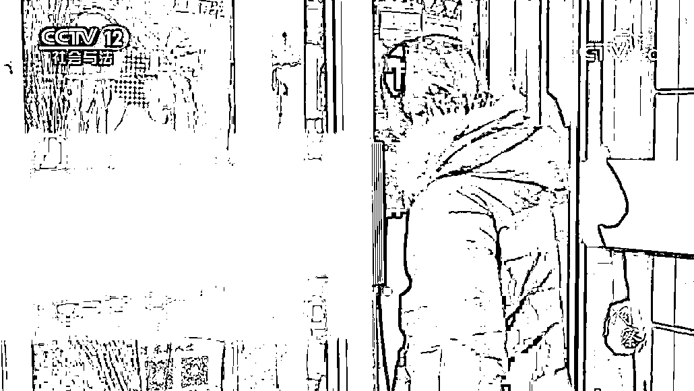

有时候她还会再路过彩票店的时候驻足停留，买上一两张彩票，幻想着有机会能一夜暴富，给一对儿女留下的积蓄。彩票馆的王姐和李阿姨关系很好，这一次听到李阿姨诉苦后，热心的王姐立马推荐了一个投资项目给李阿姨，这可谓是一下子点燃了她心里关于未来的全部希望。

辛苦了一辈子，临老仍旧惦记着儿女的未来，李阿姨的日子过得实在是不容易，到底有什么项目能给她带来全新的希望呢？我们今天就来现场联线一下她。

**主持人：**李阿姨，您好。

**李阿姨：**主持人，您好。

**主持人：**李阿姨，您辛苦了！听说王姐给您介绍了一个投资项目，您可以给我们具体介绍一下吗？

**李阿姨：**我也不是很懂啊，他们把我拉进一个群，里面跟我说什么“云数贸”什么“电子卡”的，我也听不懂，群里还有老师在专门讲这个事儿，大概意思就是可以花 120 块钱买他们那个发财卡。买完之后扫码，扫了码之后账户里就有 50 万到 100 万的钱了。

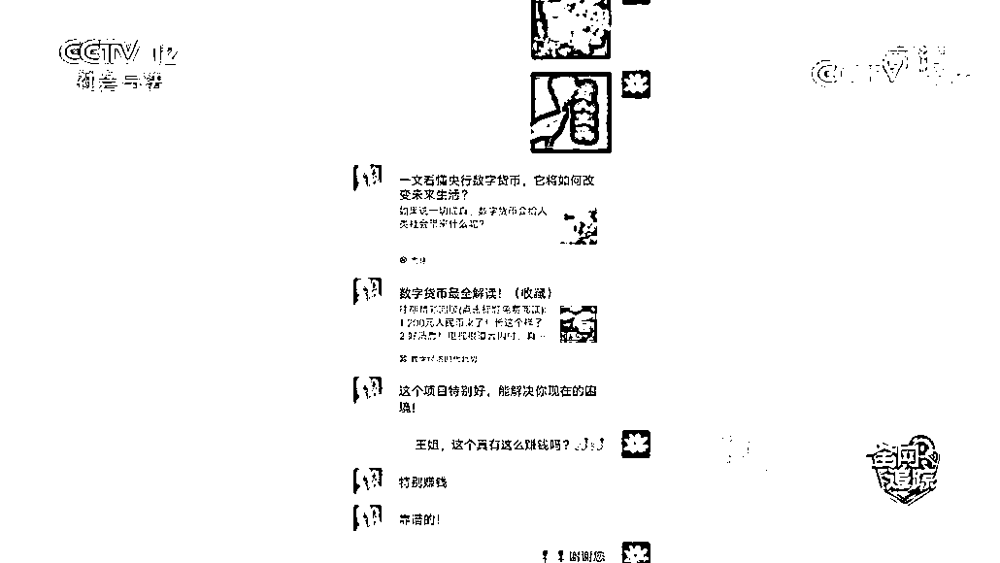

**主持人：**120 元钱换来 100 万元，这简直就是无稽之谈啊，您能相信吗？

**李阿姨：**不是的，是换 100 万的虚拟的数字货币，王姐告诉我说人民币怎么用这个钱就可以怎么用？她还给我看了她的卡。买了好多张，第二天还给我扫了码。看了他的账户，但我让她用用看，他就说得“开网”了才行。

**主持人：**开网是什么意思呢？

**李阿姨：**群里老师说开网就是打开共同网，是一个只存在于咱们国家的数字货币网，国家管控的。打开以后买的卡里的钱就能用了，但是只能在咱们国家用，因为这是国家为了扶贫才开展的。

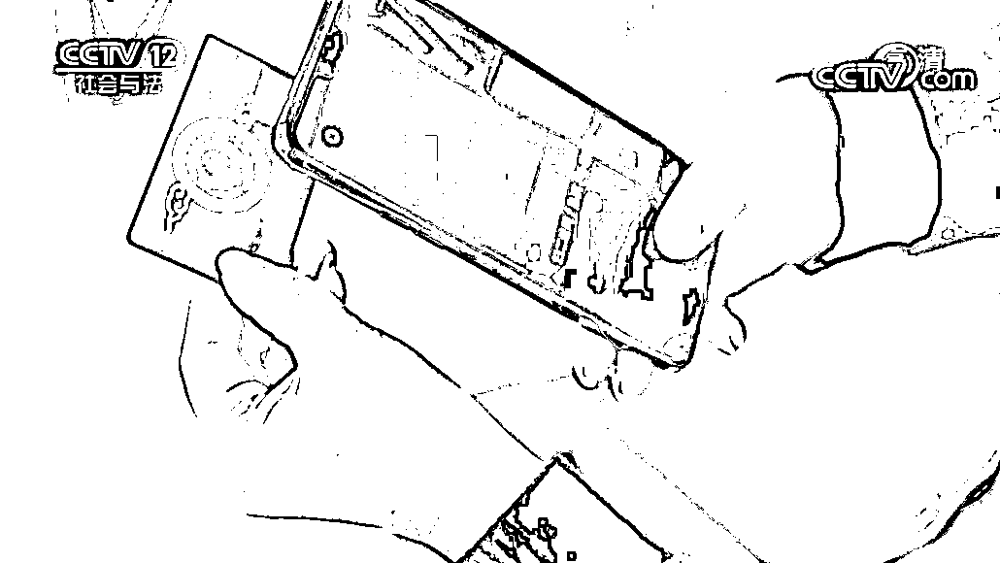

**主持人：**但是李阿姨我还是不太明白，用纸币买数字货币，如果真们所说是国家推行的政策，那这样做的目的又是什么呢？

**李阿姨：**这些群里都是有文件的，说因为国家要发行央行数字货币，现在这些都是为了回收人民币，纸币还要防止资金外流，所以就卖这种卡，王姐告诉我，这就是我遇上好事儿了。这个卡片背后可能就是云数贸集团和央行，那都是大企业，很靠谱。现在是因为知道这个消息的人还很少，听说后面开网了，卡片能涨到 2000 多呢。

**主持人：**好的，谢谢李阿姨。

对于年纪六旬的李阿姨来说，投资这个字眼实在是有些陌生，不过听王姐说这个项目很是赚钱，李阿姨还是忍不住动了心，试探性的拿出了 120 元，买了一张云数贸发财卡。

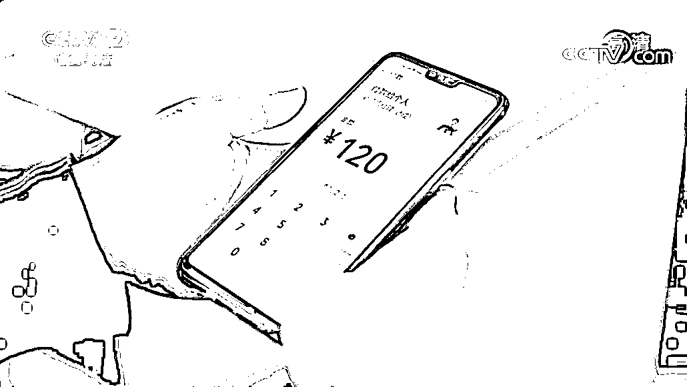

在经历了七天焦急的等待后，卡片终于到货了，她颤抖着手扫描了卡片背后的二维码，果真弹出了一个链接，里面写在 80 万现金分红的字样。

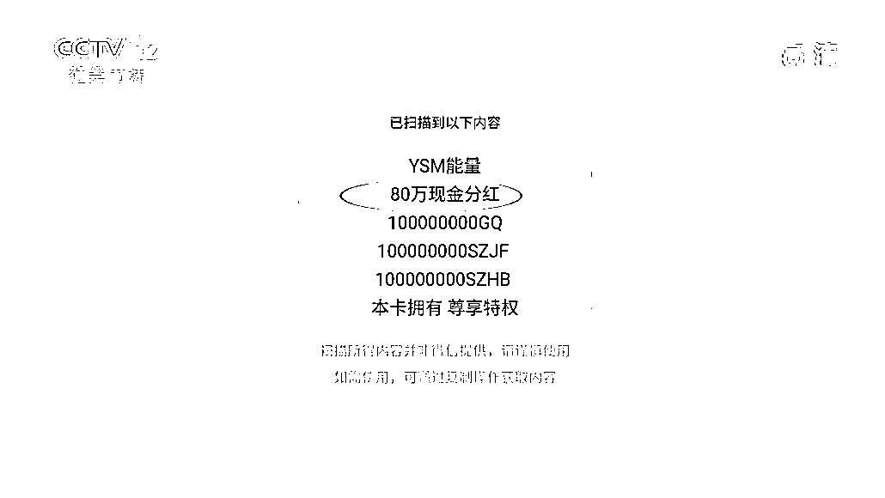

这让她又惊又喜，80 万现金，这是自己一辈子也没想过的好事，何况对于现在的他在经济状况来说，哪怕能返个五万元，也能让日子过得更好一些。可就当这时，群内老师的催促，又再次让她焦虑起来。

**骗子：**“发财卡”现在 120 元一张，随时涨价，想要的抓紧买了。

**李阿姨：**老师，卡拿到手需要激活吗？

**骗子：**12 月“开网”以后，咱们统一激活。

**李阿姨：**老师，我扫出来这个是不是开网后就能拿 80 万呀？

**骗子：**没错，你这运气也很不错。

**李阿姨：**真的吗？谢谢老师，那“开网”我还能买这个卡吗？

**骗子：**“开网”以后还能买，但是会涨价！2000 元甚至更高，要买就得现在抓紧买了！不买就晚了！

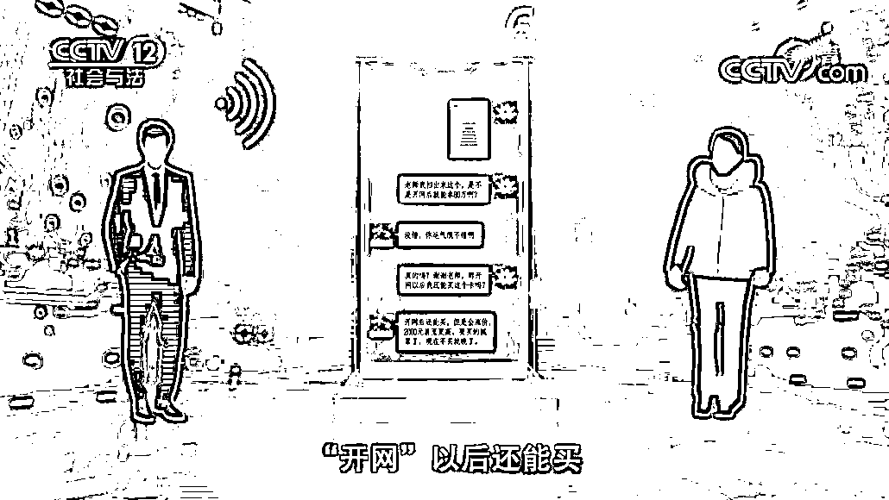

这个发财卡听起来挺玄乎，短短几个月就能从 120 元涨到 2000 多元，这里头究竟有什么秘密呢？我们接着来连线一下李阿姨。

**主持人：**李阿姨您好。

**李阿姨：**主持人您好。

**主持人：**李阿姨，您收到卡了吗？

**李阿姨：**收到了。

**主持人：**那您真的扫出钱来吗？

**李阿姨：**钱是没扫出来，但出来了一张图，老师说这里面的数字以后都能换成钱。

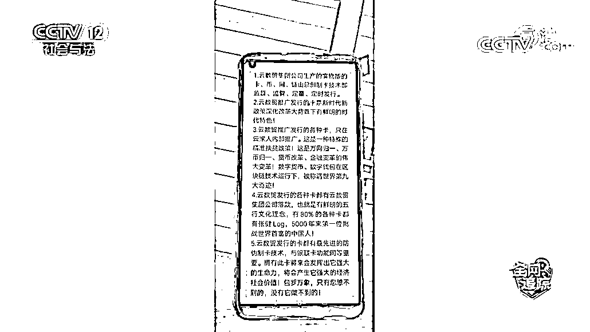

**主持人：**这个图我有点看不懂了，这个“YSM”、“SZJF”这些东西是什么意思呢？

**李阿姨：**杨老师说这个“YSM”就是云数贸的意思，然后后边分别就是“股权”“数字积分”和“数字货币”，也就是说我这张卡能达到 80 万的现金分红，还有 1 亿元的积分和数字货币。

**主持人：**这也太多了。

**李阿姨：**是啊，杨老师还说我的运气非常好，等到“开网”了，这些就都可以兑现了。我当时虽然表面上没说什么，但是心里真的特别高兴，没想到我一下子就发财了。

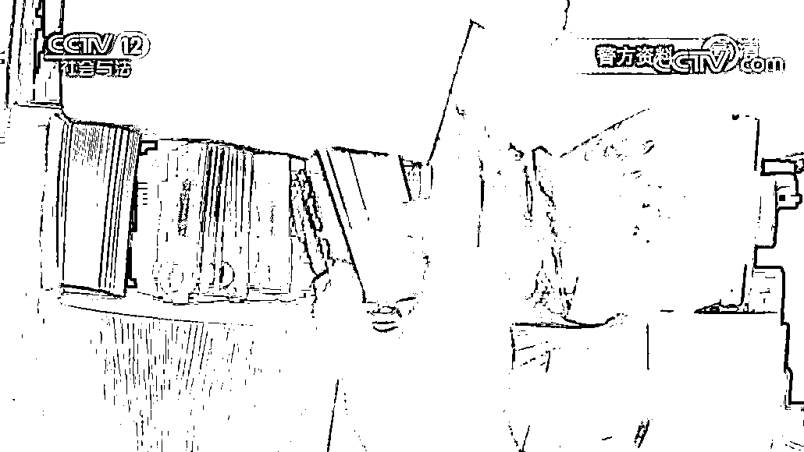

**主持人：**李阿姨，我看您的卡上印着一个男人的头像，这个人是谁啊？

**李阿姨：**群里人告诉我说这个人就是张健，就是云数贸集团的创始人，上了好多节目呢，可有名了！

**主持人：**您说这个项目背靠央行，这是真的假的呀？

**李阿姨：**准没错，我都看了，群里头都发了文件的，那个文件我也看不太懂，但都是大媒体发的，也都是提“数字货币”的，我心想，有这些肯定靠谱。

**主持人：**好，谢谢李阿姨。

听到发财卡会涨价的消息后，李阿姨的心又痒了起来，一张 120 元的卡就能换回 50 至 100 万元，如果自己多买一些，那不是可以完全解决自己的经济困境了。

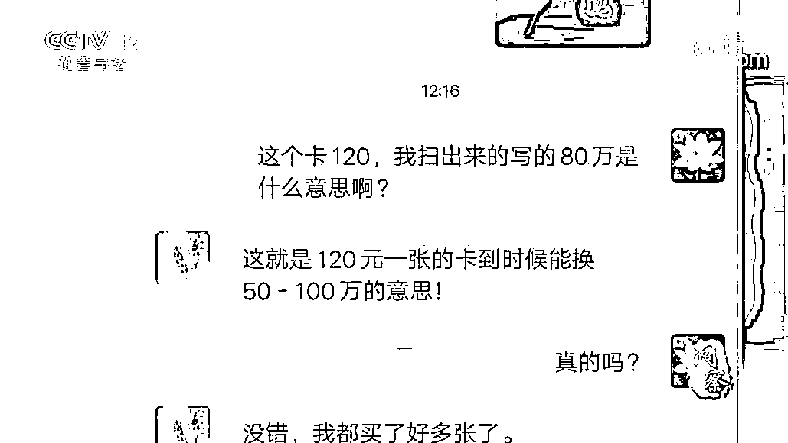

几天内群内老师又分享了多个央行计划发行数字货币的新闻，这也让她对这个项目再添了几分信任。

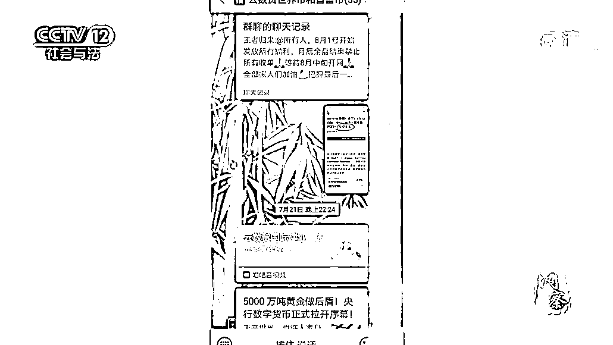

可话虽如此，她仍不敢轻易把辛苦赚来的血汗钱，就这么投资给根本不了解的电子商务领域。直到一天她接到儿子打来的电话，说女朋友家里催促二人年底结婚，李阿姨这才彻底下了决心，她变卖了多年佩戴的首饰，又问亲戚借了点钱，一咬牙又买了十张云数贸发财卡，期待年底“开网”后就能暴富。

正当李阿姨和群内其他成员一起做着发财美梦的时候，黑龙江省双鸭山市饶河县公安局却率先盯上了这个所谓的云数贸发财卡项目。原来李阿姨和群内成员做着的这个发财美梦，其实只是这个号称杨老师的人在微信群内以云数贸发财卡为名义组织实施的诈骗活动。

早在半年前，黑龙江省双鸭山市饶河县警方就已经接到举报，盯上了这个所谓的杨老师。在接到群众举报后，饶河警方立即成立专案组，委派老干警卧底进微信群，掌握第一手消息，民警先是购买了一张价值 120 元的数字财产分红卡，扫描了背后的二维码，果然如杨某所说，出现了 80 万现金分红的字样。

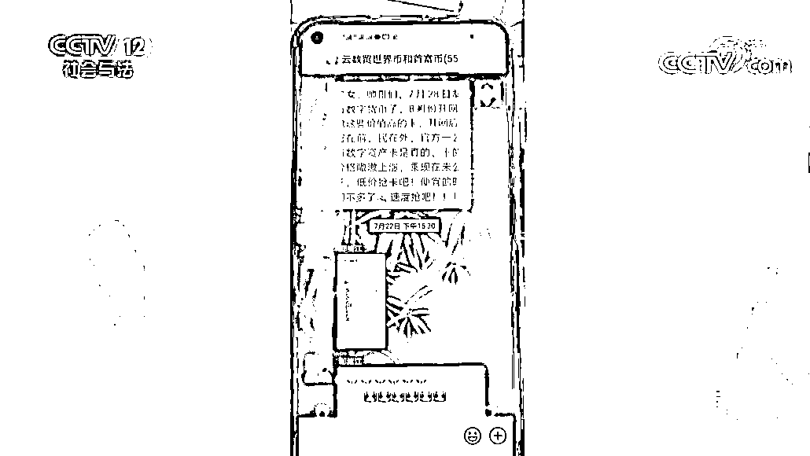

不仅如此，杨某还经常推送一些人民银行关于数字货币发行的相关报道来证明张健卡项目购卡兑换数字货币的真实性，民警查看文件来源后却意外的发现，这些相关的报道竟都是来源于一些非常有影响力的官方媒体账号。

消息来源可靠，难道央行真出台了这样的项目？只是我们不知道吗？这到底是怎么一回事呢？

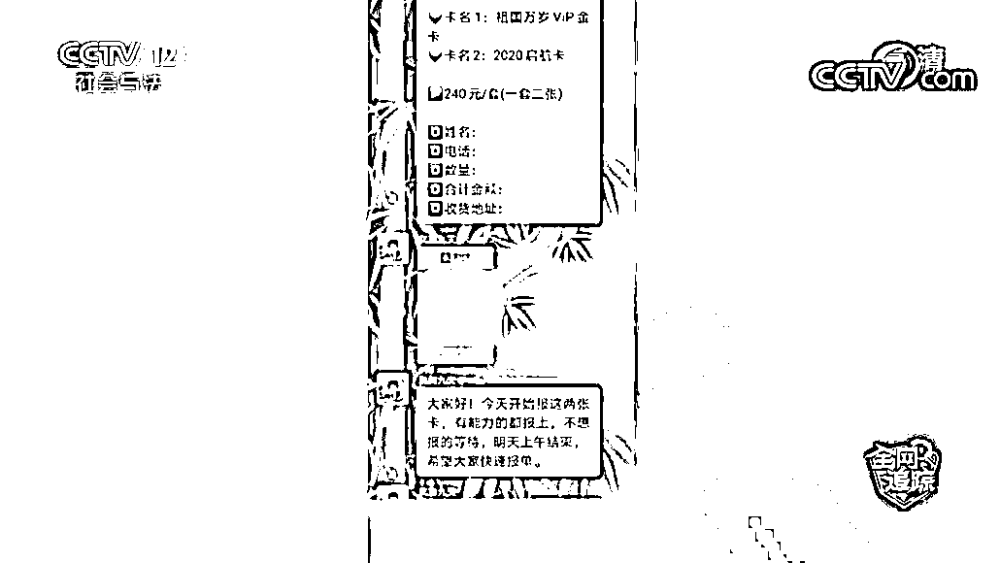

分析这些群内新闻后民警发现，这个杨某发在群里的新闻来源虽然真实，但都是经过他的剪切拼凑，他在官方媒体发布在各类新闻中挑选和数字货币物联网等概念有关的部分，再在中间插入云数贸发财卡有关的假消息，从而营造出一种自己的发财卡项目有官方背书的假象。

中国人民银行在 2018 年就对数字货币的相关谣言进行澄清，称数字货币的发行的确是未来的大趋势，但目前来看数字货币的推行仍有较大风险，技术安全方面有待提升，所以目前官方仍未宣布正式推出。所有市面上号称央行支持或发行的数字货币均为诈骗。

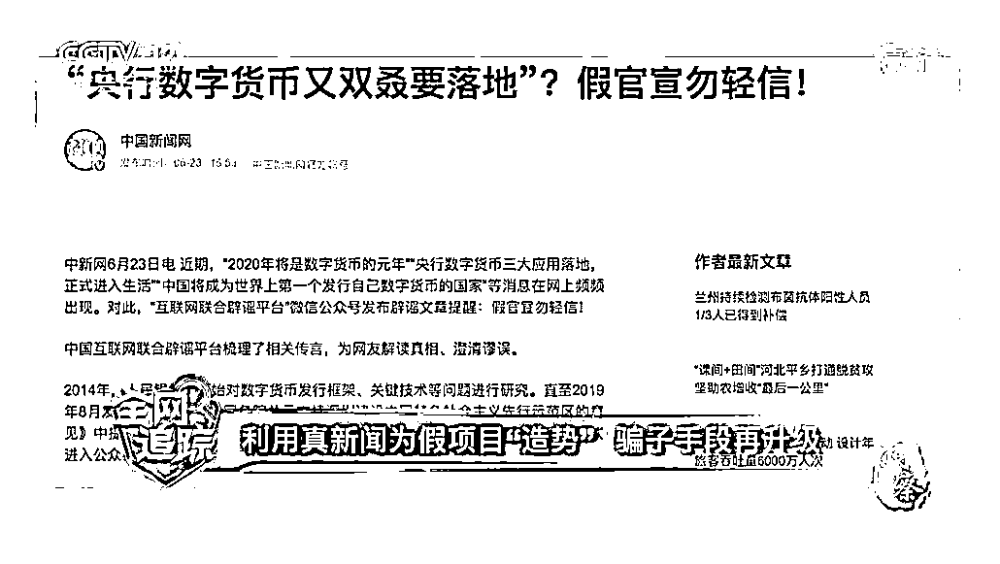

利用真新闻来增加诈骗项目的可信度，骗子这“挂羊头卖狗肉”的招数着实厉害，不过确定了项目是诈骗，那么这个打着国家名号的发财卡又是什么情况呢？我们接着往下看。

掌握了杨某在微信群内组织实施诈骗活动的证据后，饶河警方立即对其个人信息及资金往来展开秘密侦查，发现作为下岗无业职工的杨某，却在短期内存在多次大额款项其中转入转出的情况，警方于是对其展开了进一步调查，发现这个杨某上面还有陈某，李某，张某等上线数十人，根据这一线索，民警很快查到所有嫌疑人目前的所在地，决定对他们进行收网。

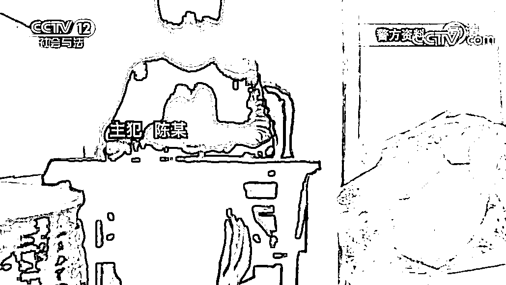

2020 年 8 月 3 日，专案组奔赴北京，重庆，内蒙古等省市进行抓获，共计抓获本案主犯陈某及其他层级代理人共 10 名，嫌犯全部到案后，民警却意外发现这个诈骗团伙的主犯陈某，早在多年前就参与过云数贸旗下的其他传销项目，只是因为当时没有直接与犯罪，所以并未对其进行处理。

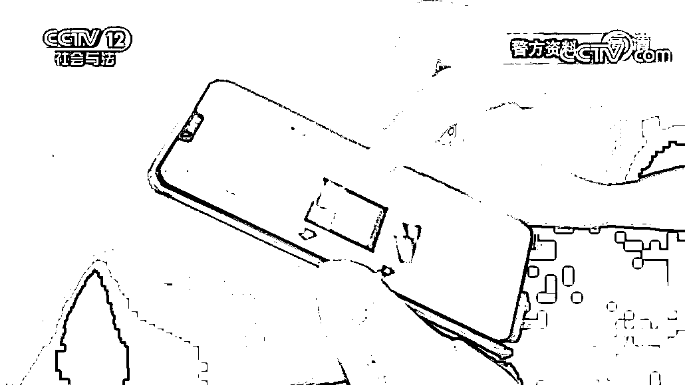

警方立即提审陈某，没想到陈某居然声称自己只是从云数贸集团购买发财卡，再进行转售从中赚取差价，而这些发财卡均经过云数贸领头人张健授意。

发财卡项目主谋是谁，虚假投资项目却依旧疑点重重，卡片上的男人究竟是谁？是谁在为这个贩卡团伙提供支持？这究竟隐藏着什么样的秘密？全网追踪，我们继续为您追踪。

大家看一下这张所谓的发财卡上印制的男性，其实就是张健本人。这个张健本名宋密秋，是“云数贸”概念的最初创始人。他所创立的“云数贸”是国内规模较大的一类传销模式，通常是采取倒卖项目卡，虚拟数字币投资缴费等方式，通过引诱、蛊惑、欺骗等手段，承诺参与分红和高额回报为诱饵吸引大量不明真相的人员参与其中。

但是“云数贸”概念下的所有项目早在 2017 年就被公安机关认定为传销诈骗，张健本人也因为领导组织传销罪被判处 13 年有期徒刑。可是现在张健仍在服刑，究竟如何才能做到继续在外行骗的呢？难道它是通过某种方式实现了对其他犯罪分子的遥控吗？

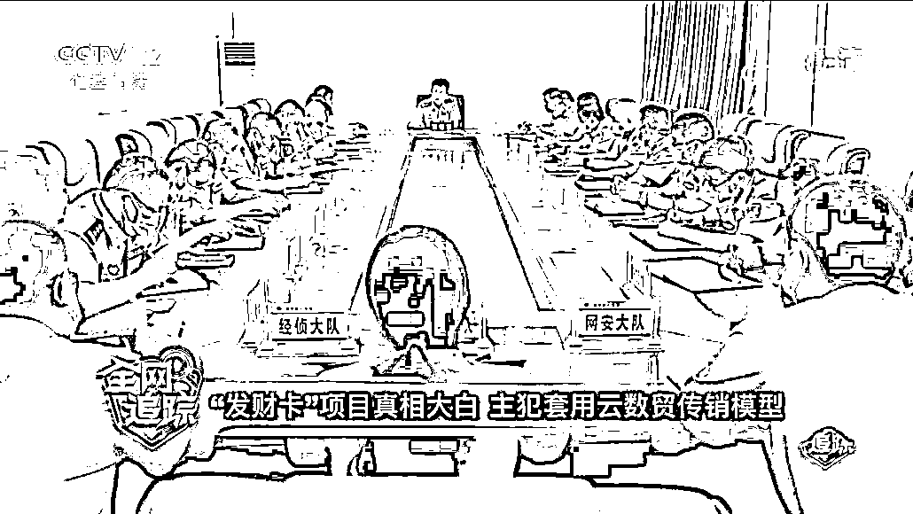

饶河警方经过深入侦查后，立即否认了这种可能性，一来张健本人并不存在作案条件，二来各项证据接显示，本案的主犯陈某与张健并不相识，陈某一定是在这个问题上说了谎。警方于是再度提审，陈某在确凿的证据面前，他终于交代出了实情。

原来所谓的云数贸发财卡，早在张健入狱前就已经存在，2018 年至 2019 年期间，陈某通过微信群购买了多张发财卡，最初只是打算储卡增值，但当他得知张健卡并不是真实的，且一张几百元的卡制作成本只有几毛钱后，便起了模仿犯罪的念头。

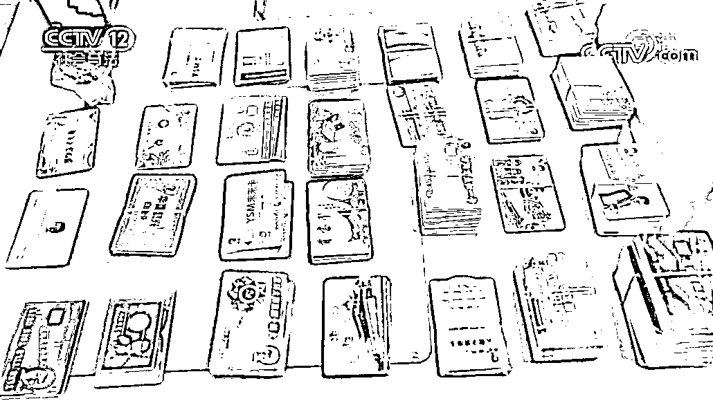

张健虽然入狱，但是他所创立的传销项目的影响力仍存，对于陈某来说，张健及“云数贸”传销的巨大影响力，以及“发财卡”项目现成的全套话术脚本可不就是一个送上门儿的“摇钱树”吗？但是脱离了张健及“云数贸”公司的支持，陈某又是如何在没有二维码和网页的情况下，做到制作发财卡的呢？

察觉到利用发财卡行骗能够获得巨额利益后，陈某决定也跟着试一试，首先需要的就是解决制卡的问题，2020 年初，陈某在微信朋友圈中看到了有人在发制卡广告，他立即添加了对方的微信好友，并咨询制卡的相关内容及金额，在确定好合作事宜后，他又通过网络上免费的二维码制作网页，自定义出来各种数额的数字分红页面，利用自己以往参加传销项目积攒下来的群聊资源将项目扩散了出去。

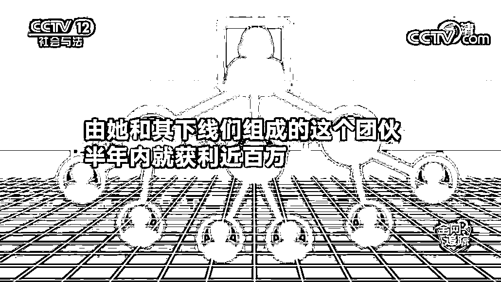

很快就有不少人通过微信陆续找到陈某询问发财卡相关信息，并提出购买，其中各有几人提出希望能够大批量进货转售。陈某正有此意，于是顺势发展了几个下线，以 35 元每张的价格卖给下级，下级代理人再抬高价格向下售卖赚取差价，而由他和其下线组成的这个团伙，半年内就获利百万。但是法网恢恢，疏而不漏，陈某及其团伙最终还是受到了法律的制裁。

嫌犯虽已经全部落网，但是李阿姨投进去的钱却很难再追回来了，这个云数贸项目到底有何玄机？为什么在全国各地警方的严打之下仍然猖獗不断呢？今天我们演播室就请到了黑龙江省双鸭山市饶河县公安局政委高军高警官，请高警官为我们现场答疑解惑。

**主持人：**高警官您好。

**高警官：**主持人您好。

**主持人：**高警官，您能给我们先简单介绍一下这个“云数贸”项目到底是个什么项目吗？

**高警官：**云数贸是国内规模较大的传销模式，是犯罪嫌疑人宋密秋也就是化名张健，创立的一个贸易概念。这个张健是黑龙江人，年轻的时候他开餐馆意外接触到了传销人员，意识到传销能在短时间内大量的获益，就产生了自己设计并组织开展传销活动骗钱的想法，他通过互联网学习了传销的各种模式和运作方法，设置出自己的一套传销制度，取名为“云计算数字贸易联盟”，简称为“云数贸”，比较出名的一个项目就是当年的“五行币”。

**主持人：**“五行币”这个传销项目我也听说过，我记得当时的诈骗金额好像是达到了十几亿之多呀，但是咱们前面也提到了这个张健已经入狱了，那为什么在他服刑期间，现在还有这么多人冒充他的名义进行诈骗呢？

高警官：张健 2014 年因为伪造证件在泰国入狱一次，2016 年出狱以后他又重操旧业，开始以“五行币”的噱头诈骗，2019 年被湖南桂阳人民法院判处了有期徒刑 12 年，但是这个张健虽然被抓了，冒充他的名义诈骗的犯罪团伙却是层出不穷，这两年甚至颇有卷土重来之势，我们各地公安机关一直在严打此类诈骗传销，像本案的这个“发财卡”其实只是冰山一角，如今打着张健“云数贸联盟”旗号诈骗的卡种就有 100 多类，这里面还不包括其他的股票融资项目，影响可谓是巨大。

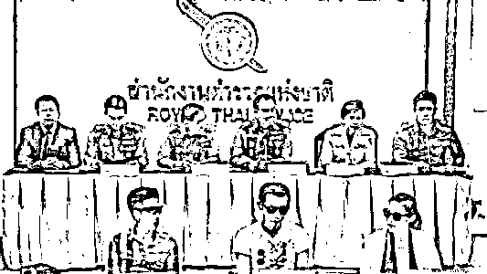

**主持人：**冒用一个已经入狱的人的名号来诈骗，这听起来并不是什么明智之举，而且受骗人不是上网一查就能查得到吗？

高警官：其实，像咱们这个案子就是典型的民族资产解冻类案件，犯罪分子冒用央行的名义诱骗受骗人投资他们所谓的数字货币，这类骗局主要的目标群体就是消息闭塞的中老年人，一方面是利用他们对国家和政府的信任，另一方面是这些老年人有一些退休金或者储蓄，也想着能给子孙后代留一点钱。

张健虽然被抓了，但是其手下，被洗脑的下线们还以此为豪，对外宣称张健自己预言自己会“五进五出监狱”，这一点也成为了他们另一个噱头，而且当年“云数贸”项目影响巨大，很多诈骗团伙挂靠这个虚假的公司直接引进“云数贸”的传销理念进行改进，更方便他们进行行骗。

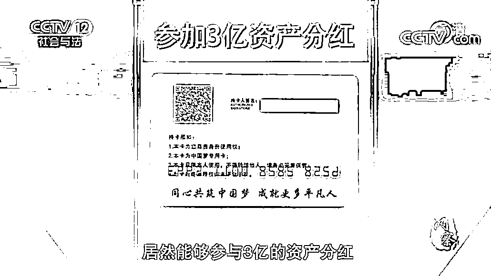

**主持人：**那高警官，这个“张健卡”项目和以往的网络传销类诈骗相比，有什么不一样的地方吗？

**高警官：**“张健卡”这个项目是传统网络传销及民族资产解冻类诈骗的一个升级版本，创新在哪儿呢？第一点就是传统的民族资产解冻，往往是一些文件和话术，没有一个真实的载体，更像是诈骗团伙吹了一个美好的泡泡。相比起来，“张健卡”这个项目有了一个可供衡量的载体，那就是他们的这个“发财卡”。

而且这种卡他们也不限制你可以购买的数量，只要你愿意，你可以购买上千张，上万张；第二正是因为他们的所谓这类项目带有投资的性质，而且也有实物载体，所以他们不像以往的民族资产解冻类项目一样，依赖熟人社交以及线下关系，摆脱了局部信任，也就导致了此类新型网络犯罪活动的扩散范围更大，危害更深。第三就是他们对传销诈骗的名目进行了改进，我们在这个案子里，常常可以看到犯罪分子引用国家的政策口号，吸引公众的眼球，用的文字内容也基本上都是一些真实的新闻，这些新闻经过他们裁剪、拼凑，再配上他们断章取义的理解，就会给受骗人带来一种有官方支持的感觉。

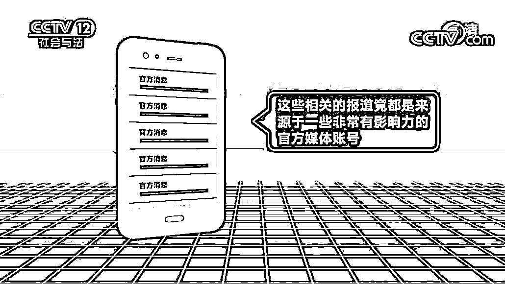

**主持人：**看来这些传销团伙歪曲事实的能力是不容小视，而这些受骗者们呢？信息闭塞容易被洗脑的特质也恰恰成为了导致他们被骗的死穴。

**高警官：**是的，其实从很多年以前开始，各大主流媒体都有对“云数贸”项目进行过大范围的披露和曝光，我们警方也经过多次“反诈骗 进社区”宣传活动，去报道跟进，但因为“云数贸”项目的洗脑程度确实严重，现在仍有大多数当年参与传销的老年人至今还对该传销深信不疑。

这些新的传销项目有动辄打着国家的旗号，用官方新闻搞噱头。还有就是因为我们国家的人口基数本来就比较大。狡猾的犯罪分子瞄准的又是文化水平较低，消息比较闭塞，判断能力也相对较弱的中老年人，尤其是集中在三四线城市及农村等等，利用信息差来行骗，受骗人往往也更容易被骗。

**主持人：**那么高警官，您能否咱们电视机前的观众朋友提几句忠告，教教他们如何分辨和防范此类骗局？

**高警官：**首先要提醒观众朋友和广大网民朋友的是，张健已经入狱，无法在组织和策划传销活动，而他说创立的“云数贸”项目也早已被公安机关定性为传销。所以，一旦看到打着“张健”、“云数贸”这两个名号忽悠你投资的项目，一律不要相信，全是诈骗！如果看到身边有亲戚朋友在做也要及时劝阻并积极想公安机关报案，如果看到了以打着公务机关的名号来诈骗的项目，最直接的方法就是去相关的部门问问是真是假。

不论是这种民族资产解冻类诈骗，还是现在市面上其他五花八门的投资荐股类诈骗，其实都是“新瓶装旧酒”，无论这些骗局披着多么华丽的外衣，只要切记一点，那就是“世上没有免费的午餐”，只有辛勤劳动才是收获财富的唯一途径，我们就能避免被骗，也能更有效的预防掉入骗子编制的各类陷阱中。

如今的“云数贸”荼毒愈演愈烈，正如节目中高警官所述，现在已经有了上百个“云数贸”的衍生骗局，真可谓是五花八门，但万变不离其宗，骗钱是最终目的，而管住自己钱袋子的最好方式，就是不要相信天上掉馅饼的美事儿，多想想“凭什么”！凭什么会找上自己？自己为国家做了哪些贡献，能获得如此巨大的“财富”？

来源：央视与法，防骗大数据，利箭在行动

← 向右滑动与灰产圈互动交流 →

