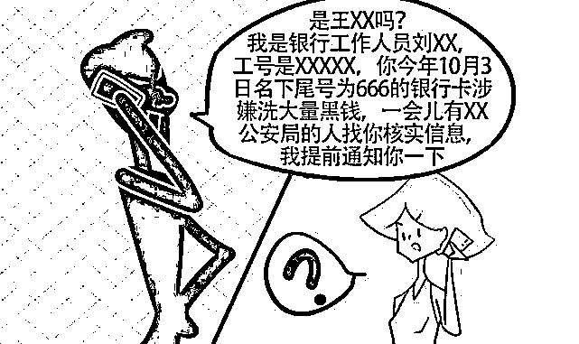
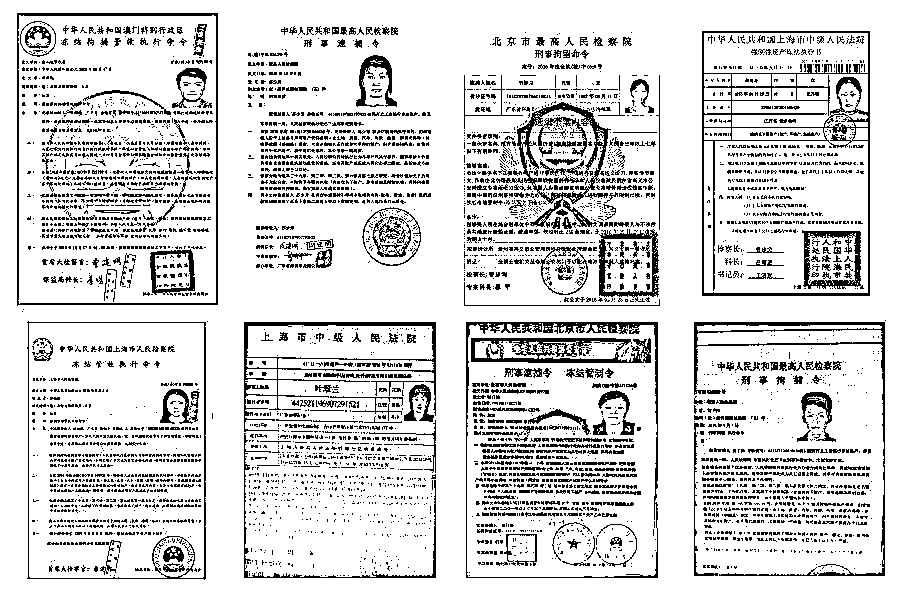

# “你涉嫌犯罪，请配合公安局开展调查，否则后果自负！”

> 原文：[`mp.weixin.qq.com/s?__biz=MzIyMDYwMTk0Mw==&mid=2247507403&idx=2&sn=437010d307a02011605d6492674c0c85&chksm=97cb16f3a0bc9fe540b8d14585a1deb8bc63ba6b65905c918e8a2593019b5aa7915ec188ef48&scene=27#wechat_redirect`](http://mp.weixin.qq.com/s?__biz=MzIyMDYwMTk0Mw==&mid=2247507403&idx=2&sn=437010d307a02011605d6492674c0c85&chksm=97cb16f3a0bc9fe540b8d14585a1deb8bc63ba6b65905c918e8a2593019b5aa7915ec188ef48&scene=27#wechat_redirect)

点击蓝字“**灰产圈**”关注我们！

“你涉嫌洗黑钱！”

“你涉嫌拐卖儿童！”

“你涉嫌一起诈骗案！”

接到这种电话，你是否会莫名其妙？

当别人准确说出你的名字、身份证号、手机号等信息时， 

你是否会疑惑？

当别人通过网络给你传来带有你的信息和照片的通缉令，

你是否会惧怕！

不要惧怕，这就是冒充公检法诈骗！

[`mp.weixin.qq.com/mp/readtemplate?t=pages/video_player_tmpl&action=mpvideo&auto=0&vid=wxv_1672987861429600264`](https://mp.weixin.qq.com/mp/readtemplate?t=pages/video_player_tmpl&action=mpvideo&auto=0&vid=wxv_1672987861429600264)

真实案例

市民程某报警称：上个月程某在家休息时，接到一个电话。对方称是武汉市通讯管理局工作人员，称程某在北京办理的手机卡涉嫌诈骗罪，需要接受北京朝阳警方处理，并给程某预留了 QQ 号。

程某通过 QQ 添加对方，对方同意后，自称“李警官”告诉程某，她的手机号和银行卡涉嫌一宗诈骗犯罪，对方还通过 QQ 给程某发通缉令照片等，随后对方让程某将手机呼叫转移并在 QQ 上以验资为由教其在各种 app 上贷款，随后程某将中国银行卡账号和密码告知对方，卡里的 15 万多元都被转到一个叫张某的银行卡上，后程某家人找到程某，意识到被骗了，遂报警。

作案特点

**一：是****作案手法隐蔽，诈骗分子编造各种虚假事由实施连环诈骗，作案手法不断变化。**诈骗分子往往通过改号软件，伪装成公检法单位的真实电话号码拨打受害人电话或发送短信，即使被害人通过 114 查号台进行核实，也难辨真伪。

**二：****是犯罪手段迷惑性强，涉案金额较高，受害者容易上当受骗。**诈骗分子冒充公检法机关人员身份，恐吓被害人涉嫌犯罪，并利用非法购买的公民信息伪造通缉令、逮捕令、资金冻结文书等迷惑受害者。诈骗分子能够准确说出被害人身份信息，大大增加了被害人对诈骗电话或短信的信任度，并且被害人因欠缺相关法律知识又急于证明清白，容易从思想上被犯罪分子控制。

警方提醒 01

**“公检法”不会通过电话做笔录、办案！**

**02**

**“拘捕令”、“通缉令”不会通过微信、QQ 下发！**

**03**

**“公检法”不会让人往某个“安全账户”打钱！更不会要求当事人以转账方式查验资产合法性!公检法部门绝不会以任何理由、任何方式向您索要钱财及银行卡信息和验证码等重要信息。**

**04**

**陌生人要求转账汇款，一定要做到不听不信不转账。**

**05**

**收到恐吓威胁的陌生短信或电话，不要惊慌失措，一定要核实信息的真实性。**

06

**如果发现被骗，请立即拨打 110 报警。**

来源：熊猫反诈

← 向右滑动与灰产圈互动交流 →

