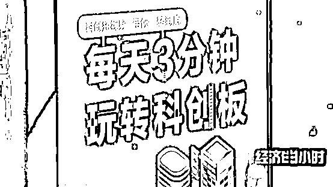
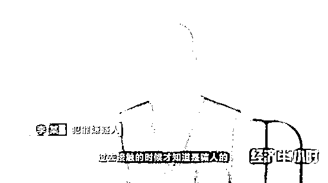
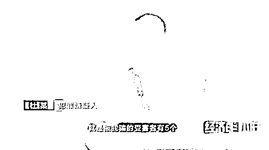
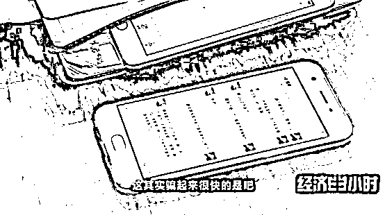
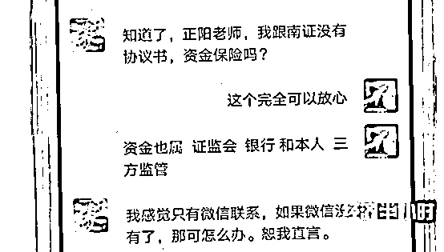
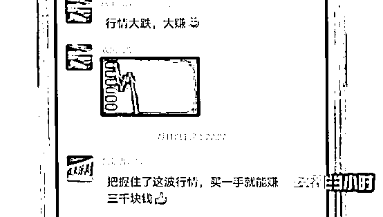

# 又骗感情又骗钱！有小姑娘被坑几十万！

> 原文：[`mp.weixin.qq.com/s?__biz=MzIyMDYwMTk0Mw==&mid=2247507403&idx=3&sn=78717d241d50657d3180839583373aa6&chksm=97cb16f3a0bc9fe5765affef7f708646f3c4395a8c18bfc14b80a54640943a4df9672dab830d&scene=27#wechat_redirect`](http://mp.weixin.qq.com/s?__biz=MzIyMDYwMTk0Mw==&mid=2247507403&idx=3&sn=78717d241d50657d3180839583373aa6&chksm=97cb16f3a0bc9fe5765affef7f708646f3c4395a8c18bfc14b80a54640943a4df9672dab830d&scene=27#wechat_redirect)

点击蓝字“**灰产圈**”关注我们！

年底是金融投资类诈骗的高峰期，为此，公安部近期重拳出击，破获了多起利用虚假期货和股票交易平台，抓获了实施诈骗的犯罪团伙。但公安机关也发出最新的提醒，和以往不同，最近破获的多起金融投资类诈骗案件，犯罪分子大多都是利用社交平台，而且披上“情感的外衣”实施诈骗，我们如何识别这些骗局呢？

本来以为要收获真爱，小姑娘投入几十万元之后傻了眼

[`mp.weixin.qq.com/mp/readtemplate?t=pages/video_player_tmpl&action=mpvideo&auto=0&vid=wxv_1681957829508661254`](https://mp.weixin.qq.com/mp/readtemplate?t=pages/video_player_tmpl&action=mpvideo&auto=0&vid=wxv_1681957829508661254)

2019 年初，浙江平阳姑娘秀秀在网上认识了一个名叫王伟的男孩，二人言谈甚欢。王玮甚至发来了自己的身份证，提出要以结婚为前提认真交往。

还没等到跟王伟见面，秀秀就收到了王伟请她帮忙的信息。王伟说自己平时跟一个亲戚在网络平台上做期货，每次都能赚点，今天亲戚出差了，需要秀秀用自己的手机帮忙登录操作一下。

拿着账号和密码，秀秀登录了一个网站，看到账户里有 10 万多元，也是从那时开始，她感觉自己正式相信王伟了。而王伟则告诉秀秀，这次操作，他赚了 1.5 万元。

王伟告诉秀秀，这是一个期货投资的网站，而他碰巧知道这个网站有漏洞，假如按照一些技巧来做投资，肯定都是包赚不赔的。就这样，秀秀跟着王伟开始充值，每次都有 10%的利润到账。

差不多同样的时间，在距离浙江 1000 多公里之外的广州，小菲也遭遇了同样的经历。同样是一个叫王伟的人和她相谈甚欢，最后也提出请小菲帮忙，给她账号和密码，让她登录一个网站，投资期货。

见到有利可图，小菲开始多次投钱，当她把卡里的钱还有父母的钱都投进去了之后，突然发现这个网站登不进去了。而浙江平阳的秀秀也在投入 10 万元之后，发现网站无法登录了。

客服人员告诉小菲，平台处于维护阶段，按照规定只有账面高于 30 万元的 VIP 客户才有提现金的权利。当小菲东拼西凑借了 30 万元充值之后，她发现男朋友王伟的聊天就开始变得很敷衍。秀秀也意识到不对劲，于是报了案。

警方调查发现，秀秀跟小菲遇到的“王伟”的确是同一个人，在欺骗这两个女孩的同时，“王伟”还在跟另外的两个受害者谈情说爱。

为了取得受害者的好感，“王伟”会将自己包装成一个“暖男”的形象。他使用假名字，制作假身份证，用假的照片伪造各种朋友圈假象。当他跟受害者的关系比较稳定后，就会以帮忙的名义，让受害者登录制作好的假网站，这些假网站模拟期货平台交易，一般人无法辨别真伪。

警方通过调查发现，“王伟”等人为了逃避打击，一直在境外实施诈骗，2019 年 7 月，这些人突然回国，警方迅速将几名主要犯罪嫌疑人抓获。

李某，就是秀秀和小菲的男朋友“王伟”，今年 19 岁，江西人。李某初中毕业后四处打工，他说自己是想着出国能赚到钱，才走到了今天这一步。

这个犯罪团伙的年龄都不大，杜某今年才 17 岁，已经是这个诈骗团伙的组长，也是这个团伙中业绩最好的成员，他骗了 5 个受害者。

骗钱骗感情，“杀猪盘”盯上中年富裕男

[`mp.weixin.qq.com/mp/readtemplate?t=pages/video_player_tmpl&action=mpvideo&auto=0&vid=wxv_1681957685862137857`](https://mp.weixin.qq.com/mp/readtemplate?t=pages/video_player_tmpl&action=mpvideo&auto=0&vid=wxv_1681957685862137857)

据不完全统计，2019 年，类似金融诈骗举报者中，男女比例接近一半一半，2020 年，此类诈骗举报者中男性占比是 31%，女性占比多达 69%。女性被骗用户增多的原因，是这些诈骗团伙瞄准了一些“容易为爱付出”的女性用户，抓住特定人群的特定心理，展开骗局。当然，此类金融诈骗不只是盯住“容易为爱付出”的女性，对于那些喜欢理财投资的男性，则另有其他的套路。

据浙江温州平阳警方统计，截至 2019 年 8 月底，他们接到过的“杀猪盘”类案件报警只占整个诈骗类案件的 10%，但受害者损失的金额能占到总金额的一半以上。受害者之所以损失巨大，是因为此类案件骗术花样和套数层出不穷，有的受害者最终都不知道自己是被骗了。

2019 年 3 月，家住浙江平阳县的曹先生，犹豫再三到派出所报了案，他怀疑自己被人骗了十几万。因为平时投资期货的网站打不开了，还说和他一起投资的王先生也是受害者。

原来，曹先生和王先生因为炒股在同一个股票群里认识，王先生股票投资盈利颇丰，还把他拉到了一个叫做“谈古论今”的微信群，每天都跟着一个老师学买股票，老师推荐的很多股票都赚钱。

大概过了一个多月，微信群里的老师说，最近股市走势不好，他推荐大家跟他学做期货，保证可以一起挣到钱。王先生说自己按照老师的指点投资了 15 万，一个小时左右就已经获利 10%了，在他的鼓励下，曹先生在网络平台上充值了十多万，但几次操作下来，他突然发现平台不能提现了。

曹先生报案后，警察很快就调查清楚了，曹先生遇到的就是“杀猪盘”类，针对股票用户的一种骗局，那位王先生，说白了就是个骗子的托儿。

2019 年 7 月，警方赶往广西南宁，抓获了 6 名“杀猪盘”诈骗的嫌疑人。在抓捕现场，警察查扣了大量的手机、电脑等作案工具，还有嫌疑人的日记本。 

在这个骗局中，嫌疑人要准备多个身份，他们专门去找跟曹先生一样，有经济实力的中年人下手。

采访中，曹先生说他一直把王先生当知己，现在得知了真相，觉得这比损失一笔钱还让自己难以接受。

曹先生

**【半小时观察】****莫贪小利 理性投资**

公安机关根据大数据，给这些虚假期货和股票投资的受害者进行了统计分析，数据发现，受害群体呈年轻化，主要集中在 20-29 岁。年轻人愿意尝试网络交友，而安全防范意识却相对薄弱，也容易被小恩小利所蒙蔽。而 40 岁以上的网民容易受骗的类型是金融信贷类、仿冒、低价利诱等。这个群体有一定的积蓄，渴望投资，但对虚假投资网站缺乏识别和防范。

此外，公安机关提醒，网络诈骗呈现跨平台化的趋势。像这种虚假期货和股票投资的诈骗案件，犯罪分子首先下手的地方，是社交平台，先谈感情，再层层诱导，最后再实施虚假金融投资平台的充值操作，时近年关，一些诈骗团伙再度活跃，公安机关严厉打击的同时，也提醒广大百姓，理性对待金融投资领域的各类产品，选择正规渠道，进行金融消费和投资。切莫贪利，上当受骗。

来源：央视财经

← 向右滑动与灰产圈互动交流 →

