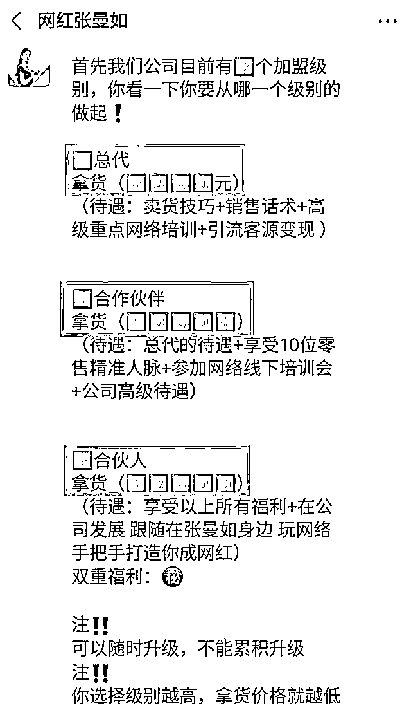

# 22 岁抖音最年轻董事长被爆造假：别再让这些“成功学”骗了！

> 原文：[`mp.weixin.qq.com/s?__biz=MzIyMDYwMTk0Mw==&mid=2247507432&idx=1&sn=6fe70ce0e200e9bac4d8eb0a6dd881e4&chksm=97cb16d0a0bc9fc6a71c78f35d4cd12aef27b4a7b2b8339a4a558be15a739f475f1215896af2&scene=27#wechat_redirect`](http://mp.weixin.qq.com/s?__biz=MzIyMDYwMTk0Mw==&mid=2247507432&idx=1&sn=6fe70ce0e200e9bac4d8eb0a6dd881e4&chksm=97cb16d0a0bc9fc6a71c78f35d4cd12aef27b4a7b2b8339a4a558be15a739f475f1215896af2&scene=27#wechat_redirect)

##  （暗指：网红

** 01 **

说一个抖音网红（不熟悉的看官，可以当个骗局例子看一看）。 

真名张曼如，网名小小如，1998 年生。

她在抖音上，拥有粉丝 604W，快手粉丝也有 362W。算是千万级别的大网红了。

**她自述的经历蛮“励志”的。**

**以下的**蓝字**都是她自述的（真相稍后托出）：**

她说自己小学没毕业，13 就辍学外出打工。 

一开始是在制衣厂打工，一天工作十几个小时，收入 100 块左右。

17 岁第一次接触到快手，开始拍起了当时很流行的土味视频。比如表演个什么胸口碎大石、徒手劈榴莲之类的。她靠此积攒了一些粉丝。

 

两年后，用当网红赚的钱开了一家服装店。

 

还创立了自己的化妆品品牌：诗如雅。

今年更是开了第二家公司，有着 1500 平的办公室，过百人的团队。

不但如此，从 18 到 20 岁这两年，还先后全款买下三套广州的房。

 

**自诩“一个改变了全家人命运的女孩子。”**

除了买房，21 岁就买了一辆法拉利。22 岁又喜提一辆劳斯莱斯古斯特，售价 500W+。

而以上全部都是一次性付全款。

截止今日，22 岁的自己身家已过 78 亿，名下 7 套广州的房，还有两家化妆品公司。**3 年内从憋屈厂妹成为抖音最年轻董事长。 **

那么，真实情况是什么样的呢，又是怎么被揭穿的呢？

她又为什么要在抖音，快手上装成这样呢？

** 02 **

**身价全靠编，成功全靠骗**

先来看看 78 亿身家，什么概念？

我特意去查了查《2020 胡润全球白手起家女富豪榜》，以张曼如的 78 亿资产，**就连董明珠都排在她之后 7 位。**

董明珠在格力混了 30 年，当了 8 年董事长的身价都不及她。

**这么离谱的资产介绍，终于在今年被戳破谎言了。**

**被爆过程也很简单，因为有个被她骗钱的受害者在留言区说出了真相。**

张曼如旗下有位宝妈，本着可以帮家里减轻负担的想法，**交了 6.6 万成为了张曼如公司的合伙人。（就是从张曼如这拿货，卖）**

可，张曼如收钱后就没了声息，宝妈从她那进的问题货全都压在手里卖不出去。

宝妈一气之下，天天跑到张曼如微博下骂。

 

骂着骂着，其他受害者、以及某些张曼如的前员工也找上门了。

真是不骂不知道，一骂吓一跳。

 

**豪掷千万买 7 套房？其中 5 套都是她无中生有、嘴里吹出来的。**张曼如团队销售爆料，她其实只买了两个 30 平的单身公寓，只付了 15W 的首付。

**吹的全款买的豪车也是租借来摆拍的，车管所根本查不到备案。**

因为诈骗问题，她后来还被请到警察局关了 7 天。

张曼如眼看自己的底要被曝光全网，立马开启**卖惨模式，使劲哭！**

 

不过，爆料还在继续。

据张曼如公司的前顾问爆料，她所谓的好几家公司，其实就是个空壳公司..**.根本没有任何资金。 ******

在张曼如直播间里，**标市场价 1280 元一套的护肤品，不要三四百，不要一两百，只卖 99。**

此外，产品盒明明标示着敏感肌不可用，在直播间却说孕妇、敏感肌统统可用。

**再来看看张曼如的代理模式——加盟。**

**初级总代，需拿货 3000 块；中级代理不叫代理，叫合作伙伴，需要拿货 1 万；高级代理叫合伙人，需要拿货 5.2 万。**

这模式就**是在赚加盟者的钱。**

**明眼人这会都该明白了，这就是微商套路吧？**

**可张曼如认为不是。**

她说：“我不是微商，我是创业者”，“成功是我自己有独特的模式”。

什么模式？

从她给自己打造人设就知道：“小学没毕业的董事长”、“品牌创始人”、“一个改变了全家人命运的女孩子”......

视频也常常是各种洗脑式喊口号迈向成功啥的，让人看了立刻满满斗志想加入她的事业。

这不过就是微商的惯用三件套：**白手起家，疯狂炫富和所谓的成功学。**

成功学的目的很简单，就是给心智不成熟的人洗脑，从而发展潜在用户。

而在张曼如的粉丝群里，多的是未成年人。

     

真心不想看到，这些涉世未深的孩子们，拿着爸妈辛苦赚来的钱被骗。

**可，尽管近些年成功学不再泛滥，但却从未消失，甚至从未停止猖狂。**

** 03 **

**成功学永不眠**

**“别人的成功是不可复制的，成功学都是些正确的废话……”**

这些道理并不难懂，可总有人被“成功学”弄得五迷三道。

前段时间，广为流传的一个视频中，16 岁的小姑娘身穿公司年会主持人式的对襟礼服裙，梳着成功女企业家专属贴头皮低马尾，**慷慨激昂地发表了一段关于“演讲改变人生”的演说。**

她的自述堪称离谱典范： 

> 成就中的“全球华人青少年领袖学习会”，**最终查无此会；** 
> 
> “出版”的两本诗集一本小说，**父亲证实是自己印了送朋友的，并不是出版刊物；** 
> 
> 一天能写 2000 首的诗，**也被网友们翻出来了：岑某诺在她担任副主任的“中国国际新闻杂志社”网站上，发布了自己的诗歌作品。（目前该网站已无法访问）**

为什么如此离谱的“成功学”贩卖，还有人为之疯狂，花钱追捧？

**因为他们的粉丝。都有一些相似的特点**。

**他们的认知都很有局限，而成功学就瞄准了他们的心理弱点。**

成功学大师们盯上的人，最好来自农村，小学初中学历，又有野心的人。上课学习交钱，再拉出几个所谓的“项目”，让人砸钱投资。

而知识这块，最多的是美而言之投资自己。

当然，在这个被各种信息左右和塑造的时代，面对被骗的人，我们也没有资格嘲笑。 

我们应该警惕的，是利用成功学忽悠我们的人。

没人不想成功，而我们更应该意识到，成功无法学。 

**所有不讲成功过程只讲结果，只有激情没有方法的成功，都是耍流氓。**

** 写在最后：** 

这个时代，很多人追求成功已经到达疯魔的地步，于是便出现了许许多多魔幻的成功学。而人们轻轻松松就被忽悠。 

可你一定要明白，成功没有捷径，并不是你上了几堂成功学你就能成功，脚踏实地才能通往成功。 

当然，平平安安、和心爱的人幸福过平平淡淡的日子，也不失为一种成功。

← 向右滑动与灰产圈互动交流 

