# 冒充领导诈骗升级版来了！

> 原文：[`mp.weixin.qq.com/s?__biz=MzIyMDYwMTk0Mw==&mid=2247507432&idx=3&sn=009dafe4a4d591087aa926c35c24e1a0&chksm=97cb16d0a0bc9fc60e75eeb2a8ca583eba308e1d5fabddbfe90d98e522bca8ece177b9d336ca&scene=27#wechat_redirect`](http://mp.weixin.qq.com/s?__biz=MzIyMDYwMTk0Mw==&mid=2247507432&idx=3&sn=009dafe4a4d591087aa926c35c24e1a0&chksm=97cb16d0a0bc9fc60e75eeb2a8ca583eba308e1d5fabddbfe90d98e522bca8ece177b9d336ca&scene=27#wechat_redirect)

点击蓝字“**灰产圈**”关注我们！

**“领导”突然主动加你“好友”**

**找你“帮忙”转账**

**还把钱先转你**

**这事没有那么简单**

**......**

　　近期，全国多地发生有不法分子**冒充党政领导干部**实施诈骗行为，且诈骗**套路升级**。从已发案件情况看，诈骗分子主要通过非法渠道获取受害人信息及领导信息，并将微信头像换成领导照片、微信昵称改成领导名字等形式，对受害人进行诈骗。

**近日肥乡区、矿区、临漳县、**

**磁县、****冀南新区、馆陶县等地**

**有市民收到了**

**冒充领导诈骗的诈骗信息**

**且已有人上当受骗**

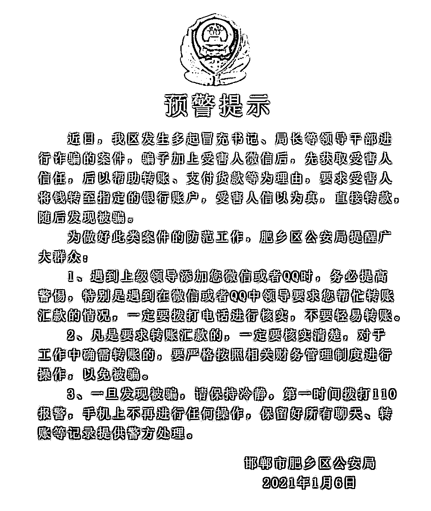

**市反诈中心提醒大家**

**多了解冒充领导诈骗套路**

**提高警惕**

**避免上当受骗**

**冒充领导诈骗升级版出现了！**

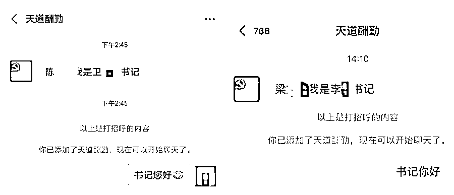

**▲身份多变的“书记”主动添加群众好友**

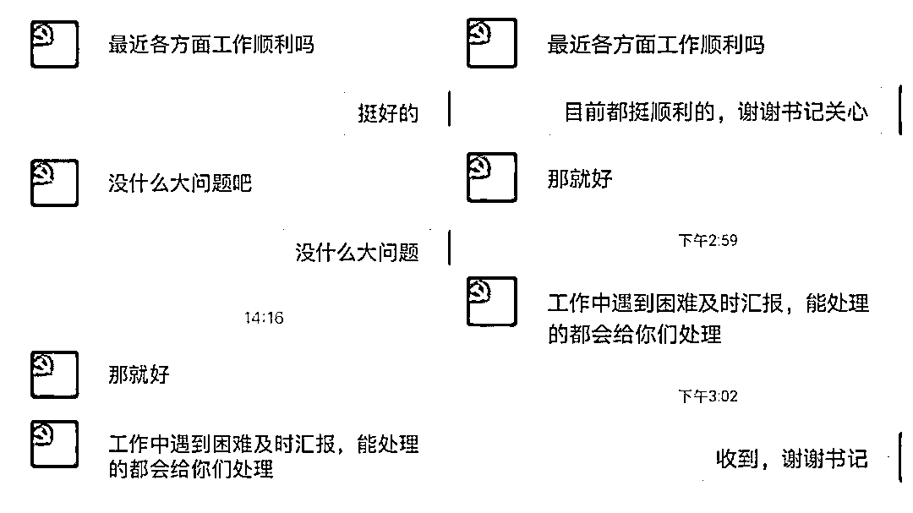

**▲“书记”关爱下属令人感动**

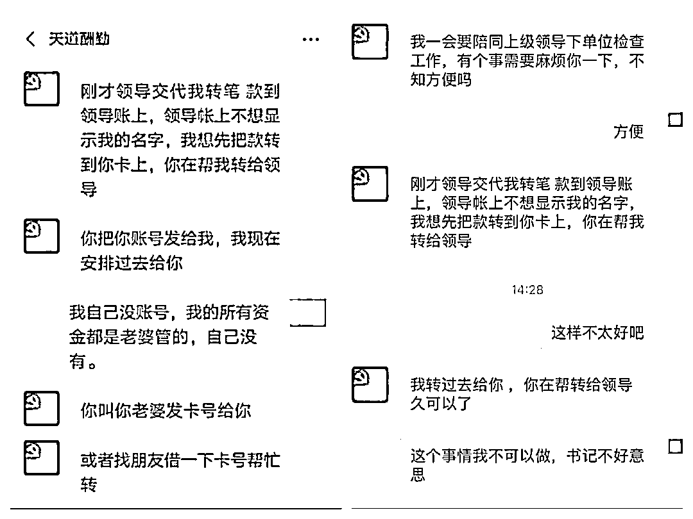

**▲转账汇款的要求从不迟到**

**注意了！！**

**这是新型冒充领导诈骗，升级版！** 

　　首先，骗子通过不法渠道，盗取群众手机通讯录上所有联系人的联系方式，随后精准发送信息，导致最后出现“一人信息泄露，全单位遭殃”的悲催情况。

　　由于单位内部通讯信息泄露，骗子对单位组织架构、人员组成、联络信息等了如指掌，一番伪装后，便通过微信大面积“撒网”添加相关工作人员为好友。

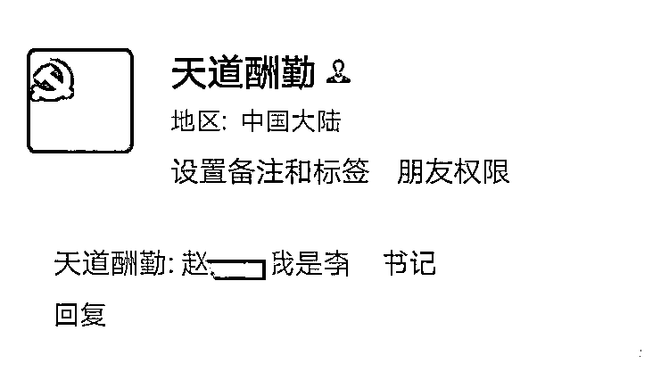

　　骗子可以伪装成有关领导，并叫的出你、以及你单位领导、高管的名字。

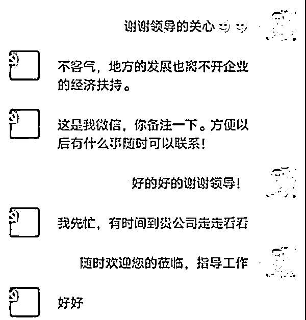

　　建立联系后骗子做的第一件事自然是博取受害人信任降低后者戒备心。骗子用关心下属工作的口吻，让受害人“如沐春风”，感到受宠若惊，以为自己的工作得到领导的肯定，极大降低戒备之心。

     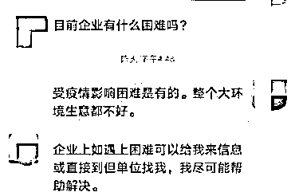

　　骗子主动提出帮助受害人解决困难，对话中暗藏“猫腻”，释放出朦胧信号，让受害人对个人及事业的未来发展浮想联翩......

**接下来，便到了下套的时候了** 

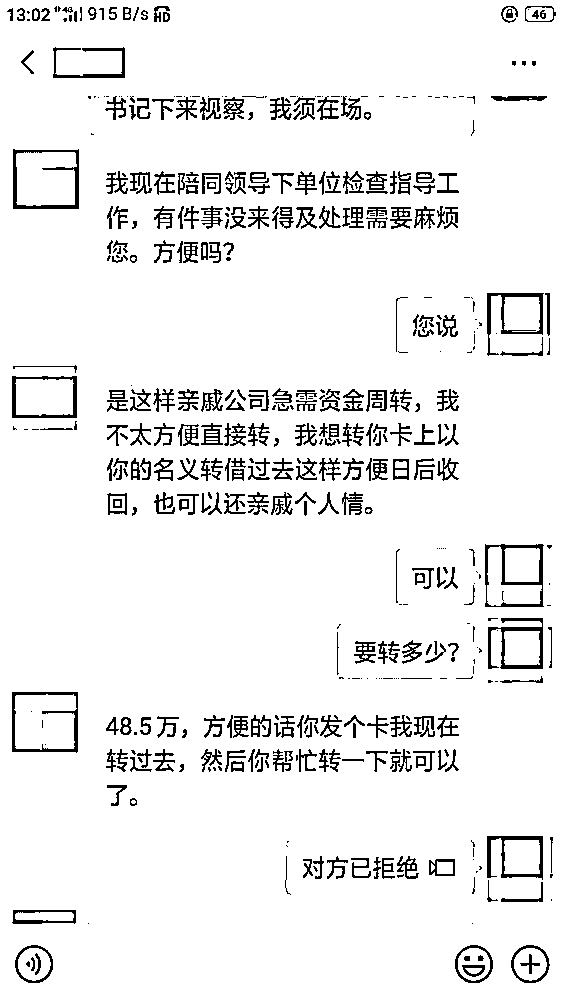

　　“书记”打着帮助亲戚公司、自己不方便出面的幌子，看起来很是信任受害人呢。

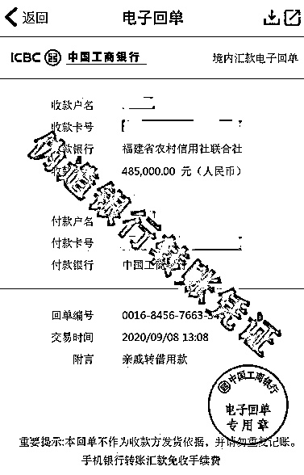

　　谎称已将钱转账，并发来了伪造转账截图。

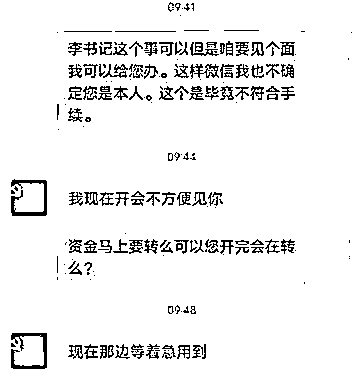

　　骗子抓住受害人对领导敬畏、不敢质疑的心理，频繁使用“尽快”“马上”“立即”这些催促性的词语，既营造了紧张气氛，又利用时间差降低受害人核实转账需求真假的可能性。

　　然后，大额的资金就这么被骗走了！！

　　又利用时间差降低受害人核实转账需求真假的可能性。

****

**骗子的套路那么多、那么深**

**该怎么预防被骗？**

警方支招

**1.** 如遇到自称领导通过短信、微信、QQ 等聊天工具添加好友，并要求转账汇款时要提高警惕，一定要核实对方身份和所发送信息的真实性。交流中，可委婉询问对方一些问题，如单位的人或事，核实对方身份。

**2.** 接到陌生号码来电时应该提高警惕，特别是外地号码时，更应想办法辨别对方身份。在未确认真伪的情况下，做到不透露、不轻信、不转账。

**3. **如果发现对方身份、信息可疑，或不幸被骗，务必保留当时的聊天记录和银行账号信息等作为证据，及时拨打 110 报警。

**4.**严格遵守请示汇报制度，养成多了解、多核实、多汇报的工作作风。

**5.** 注意保护个人及单位信息，以防被骗子掌握从而实施诈骗。

来源：邯郸市反电信网络诈骗中心

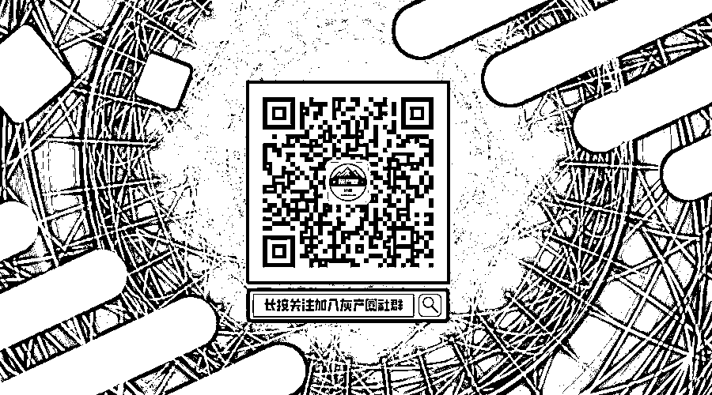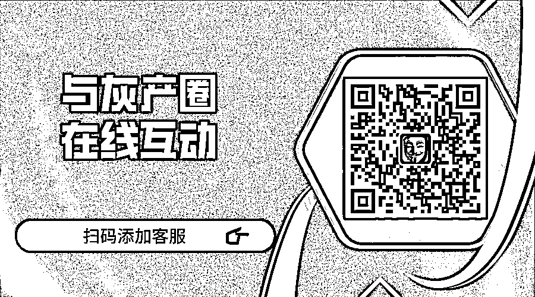

← 向右滑动与灰产圈互动交流 

