# 抖音又出事！因为主播存在性挑逗、性暗示

> 原文：[`mp.weixin.qq.com/s?__biz=MzIyMDYwMTk0Mw==&mid=2247507513&idx=1&sn=ccba5af059f0df37990dfa548fc91ed0&chksm=97cb1501a0bc9c1718302862984bee9755c0d71bfb1aea377454b818a5a4d23e3c6daf7ea90b&scene=27#wechat_redirect`](http://mp.weixin.qq.com/s?__biz=MzIyMDYwMTk0Mw==&mid=2247507513&idx=1&sn=ccba5af059f0df37990dfa548fc91ed0&chksm=97cb1501a0bc9c1718302862984bee9755c0d71bfb1aea377454b818a5a4d23e3c6daf7ea90b&scene=27#wechat_redirect)

导语

 边吃边看手机，吃饱了躺在床上继续刷抖音，到反应过来时，一两个小时就刷过去了。可是越来越多的网友发现：一些标题夺人眼球、内容却大肆传播色情的信息被大量推送。

近期，根据群众举报线索，北京市“扫黄打非”办公室指导北京市文化市场综合执法总队对“抖音”平台进行约谈，对其传播淫秽色情低俗信息行为作出顶格罚款的行政处罚。

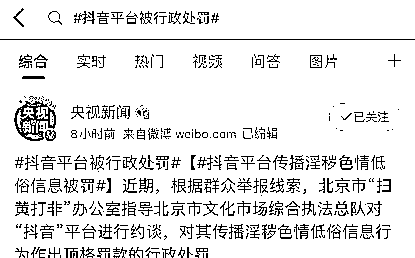

去年被举报 900 余条，抖音能“抖掉”低俗吗？

其实很久之前，就有不少网友在网上发问：“大家有没发现抖音有很多短视频很低俗？”

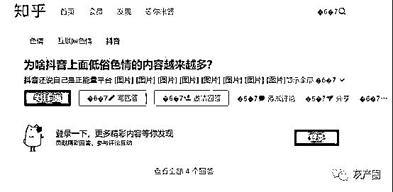

据统计，2020 年全国“扫黄打非”办公室举报中心共接到反映涉“抖音”平台传播色情低俗信息的举报线索 900 余条。

其中历数了抖音的几宗罪：经查，“抖音”平台中个别主播在直播中存在性挑逗、性暗示和抽烟、说脏话等行为，部分直播间评论弹幕存在低俗内容；

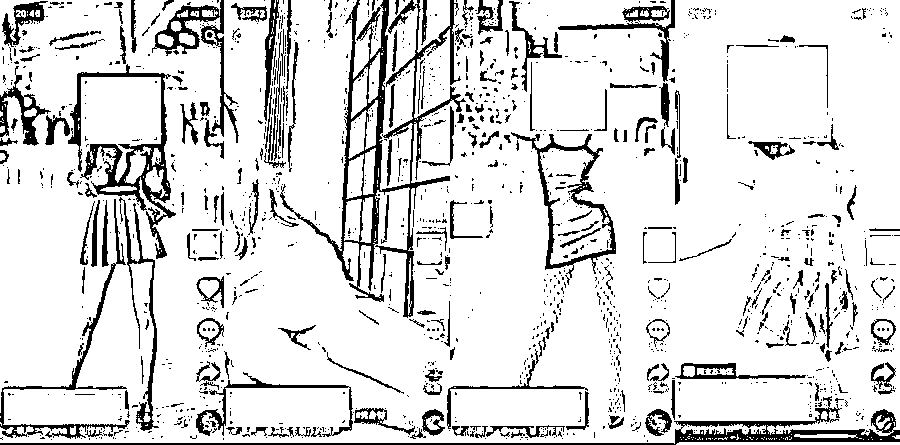

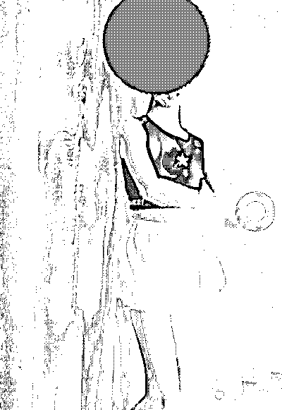

个别主播直播的游戏未经审批，且含有血腥、暴力、恐怖等内容；

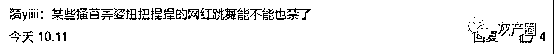

部分主播和平台用户通过发布微信号、二维码等方式引流到其他平台进行违法违规活动。

经执法人员勘验取证，相关内容属于“宣扬淫秽、赌博、暴力或者教唆犯罪”“危害社会公德或者民族优秀文化传统”。

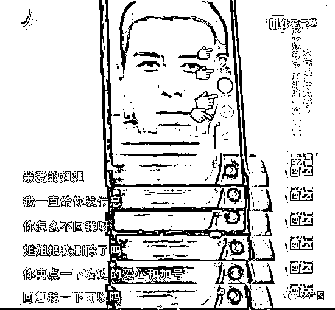

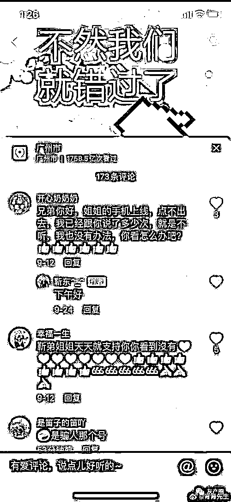

这还不算，抖音这阵子可没少惹祸。比如前阵子炒得很热的假靳东事件，江西赣州一六旬女子，因迷恋抖音中的假冒靳东而离家出走。女子认定自己在和靳东地下恋，还特意把头发剪短了，不出门，怕恋情曝光影响靳东的事业。

有网友吐槽，自己身边就有这类情况——

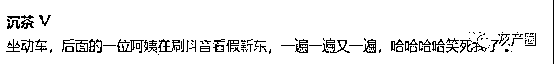

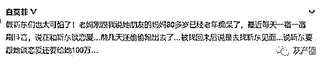

还有之前热议的京东白条事件，不少网友中招，其主要传播地也是抖音。

视频里，一位农民工打扮的乘客母亲在飞机上感到不适，一位老板模样的乘客称可以帮忙升舱，结果拿了农民工手机一番操作，在京东金融上进行了 15 万元的贷款。不少网友表示，该视频价值观不正且存在诱导借贷。

不少网友看到抖音被罚后，纷纷留言表示支持。

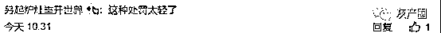

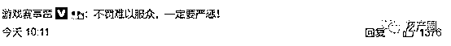

更有甚者，抖音还成了某些微商展示假冒化妆品、山寨奢侈品的橱窗。视频作者们通过留下微信号，将自制的三无产品出售牟利。

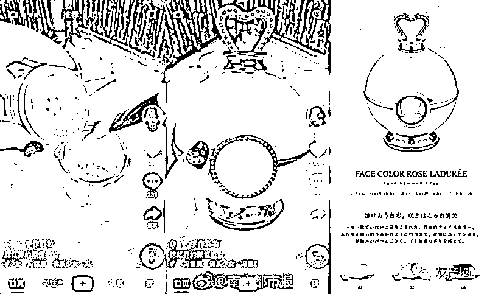

“你喜欢什么就给你提供什么”，这算法得管

接过低俗生意，裹上了算法外衣。一些网络平台正是利用了“尖叫效应”获取关注，而近年来盛行的基于算法导向的信息推荐技术，为实现“尖叫效应”带来了技术支持。

平台依托大数据和人工智能，对用户浏览记录、兴趣爱好等进行深度分析，通过技术手段打了个擦边球，在此基础上将更多契合“尖叫效应”的信息提供给用户，从而取悦受众，扩大平台用户基数。

很多网友都反映，难怪一刷抖音就上瘾，根本停不下来！

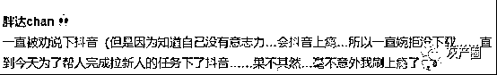

算法主导的信息推荐技术，很容易自动过滤掉“不感兴趣”“不认同”的信息，实现“看我想看，听我想听”。据报道，我国短视频用户日均使用时长 110 分钟，30 岁以下的用户占比 40%。按“8+8+8”的时间粗略划分（睡眠、工作/学习、休闲各占 8 小时），短视频占据了近 1/4 的休闲时长。

巨大的流量驱动之下，抖音的风格也在变化，从最初的技术流、慢风景，过渡到故事、剧情、模仿，继而到低俗色情，走上了歪路。其实，要避免这种低俗流行，优化算法推荐、加强内容审核已经到了刻不容缓的地步。短视频平台应通过优化技术，对不同类别的内容给予不同权重的算法推荐，少一些辣眼睛的内容乱象、多一些正能量的热播视频。

来源：杭州网

← 向右滑动与灰产圈互动交流 →

