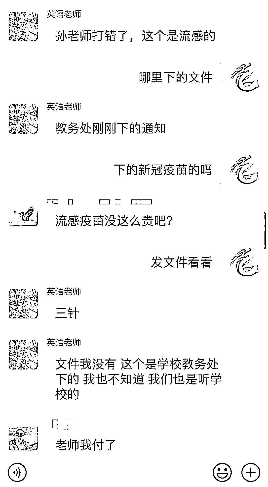

# 有人借“新冠疫苗”诈骗，已有人上当！

> 原文：[`mp.weixin.qq.com/s?__biz=MzIyMDYwMTk0Mw==&mid=2247507513&idx=2&sn=dcbc9746497f48f5682c472e91944ab4&chksm=97cb1501a0bc9c178100517f0758ce50e0a89017645b23e4139a2d322d12db46b0109cdacdd3&scene=27#wechat_redirect`](http://mp.weixin.qq.com/s?__biz=MzIyMDYwMTk0Mw==&mid=2247507513&idx=2&sn=dcbc9746497f48f5682c472e91944ab4&chksm=97cb1501a0bc9c178100517f0758ce50e0a89017645b23e4139a2d322d12db46b0109cdacdd3&scene=27#wechat_redirect)

最近一段时间，新冠疫苗成了大家关注的热点话题。但也有**一些不法分子借此发挥，以学校收取疫苗费用等方式进行诈骗。**

近日，就有诈骗分子冒充老师，悄悄潜入学校的班级群里，以收取新冠疫苗费用为由，对群内家长进行诈骗。

1 月 3 日下午，某地一学校班级群，有两位“老师”收“新冠疫苗费”，虽然有学生家长发现不对，而且老师也及时说明，仍有几位学生家长上当受骗！

详情，请看群聊记录：

骗子冒充两位老师（头像）在班级群里发布了一条消息，信息称：

***“@全体成员，各位家长你们好，现在是冬季了疫情慢慢又起来了，为了防范病毒卷入而来，学校领导 本市领导要求在校学习的学生，打新冠病毒疫苗针(每人 350 元整)疫苗是可以防范病毒传播到身体的，请各位家长配合(统一用支付宝付款，这样好统计）。”***

部分家长们出于对学生的关心和对学校的信任，并未质疑，直接打款。随后，有家长质疑，说打新冠病毒疫苗针，免费，骗子谎称打错了，是流感病毒。真正的老师发现了这一事件，立即在群内向家长解释，所幸发现及时，仅有数位家长受骗，金额达一千余元。

**解析骗子套路**

**1**

骗子在 QQ 内搜索“班级群”“通知群”“沟通群”等关键字，即可出现大量公开的群聊信息。

**2**

冒充家长申请入群后，潜伏在群内观察老师的活动规律，利用老师上课或者不在线的时间差，对群内家长实施诈骗。

**3**

克隆老师的头像和昵称，修改备注信息，冒充老师发布缴费信息，要求家长缴纳费用。

**4**

骗子收款后都会立即退群，等真老师上线后，骗子已经拿着银行卡里的钱逃之夭夭。

**温馨提醒**

各位家长在 QQ、微信群等网络平台**收到学校、老师的“交费”“转账”等通知信息时，可先通过电话等方式与学校、老师核实**，不要急于转账，以防被骗。

另外，QQ、微信群管理员，要将加群的方式设置为身份验证模式，并做好审核，不要轻易让不明身份人员混入，有可乘之机。

遭遇通讯网络诈骗，应及时拨打 110 报警，向警方提供如下内容：

受害者个人信息；

受害者转出现金的账号及开户行；

骗子的账号、用户名、开户行以及受骗时登录的网址链接；

汇款凭证和聊天记录截屏。

新冠疫情还没有结束，不法分子利用家长的关心和对老师的信赖，以预约新冠疫苗的名义对家长进行诈骗，行为已经触犯法律。 

老师和家长们都要提高警惕，谨防上当受骗！

来源：洛阳市反虚假信息诈骗中心

← 向右滑动与灰产圈互动交流 →

