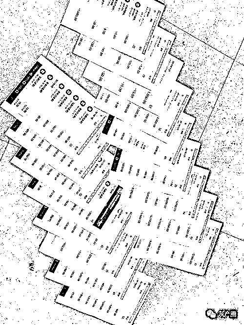

# 花了几万网上“养鸡”，“鸡飞蛋打”！公司都没影子了！

> 原文：[`mp.weixin.qq.com/s?__biz=MzIyMDYwMTk0Mw==&mid=2247507513&idx=3&sn=81b66021267de986f1dfadddecfbd789&chksm=97cb1501a0bc9c17fcce39043b6d917320c3e52ef2b75993453fa2baf0d4fdf7a83edacef6d9&scene=27#wechat_redirect`](http://mp.weixin.qq.com/s?__biz=MzIyMDYwMTk0Mw==&mid=2247507513&idx=3&sn=81b66021267de986f1dfadddecfbd789&chksm=97cb1501a0bc9c17fcce39043b6d917320c3e52ef2b75993453fa2baf0d4fdf7a83edacef6d9&scene=27#wechat_redirect)

导语

▲受害人谭女士先后投资近 10 万元进行网上养“鸡”。图为部分转账凭据

广西我的菜公司办公室已是人去楼空

发现广西我的菜公司办公室已搬空，两名受害者核对该公司的宣传资料搜集证据

　　花 2.3 元，在广西我的菜生态农业开发有限公司（以下简称我的菜公司）网上购买一只种鸡，在网上饲养 23 天，种鸡产下 3 只鸡蛋后“消失”。购买者再以 2 元/只的价格抛售鸡蛋，除去成本，能拿到 1.1 元的利润。南宁的谭女士（化名）认为回报挺高，便投资近 10 万元进行网上养鸡。结果，利润和成本没能拿回，我的菜公司就从南宁市科园西十路搬走，去向不明。而谭女士在网上购买的所谓“种鸡”“种蛋”，不过是网络虚拟物。工商质监部门昨日对此表示，他们会按程序在诚信系统里将我的菜公司列为“异常名录”，并将材料移交相关部门处理。

　　高利诱惑 投资者在虚拟理财平台加大投资

　　谭女士在南宁工作。2017 年 6 月，同学向她推荐一款网上虚拟理财平台“我的菜交易平台”。该平台由我的菜公司创办，投资者用手机扫描二维码，注册成为会员之后，平时就可以在平台上交易“鸡”和“蛋”两款商品。

　　据谭女士介绍，会员购买商品前，使用支付宝或者微信通过平台商城，把现金转换成同价的“菜票”，然后持“菜票”到平台菜市场交易。平台上，每只种鸡标价为 2.3 元。会员认购种鸡后，放到虚拟鸡场饲养。每只种鸡每天要 0.1 元饲料费，饲养到第 21 天，开始下蛋。种鸡在第 23 天下第三只蛋后，就消失了。

　　种鸡产下的 3 只鸡蛋，会员以 2 元/只的价格拿到平台上挂卖。除去成本和平台 5%的手续交易费，每只种鸡的净利润为 1.1 元。也就是说，投资 2.3 元在网上养一只种鸡，23 天时间就能拿到 1.1 元的利润。

　　另外，如果会员花 2 元购买一只种蛋放到平台孵化室孵化，7 天孵出种鸡后再以 2.3 元的价格卖掉。除去孵化温度等成本，一只种蛋可获利 0.185 元。同时，每孵出 10 只种鸡，或者每产出一只鸡蛋，我的菜公司就给会员 1 元钱奖励。

　　谭女士看到，在同学注册的平台和理财微信群里，经常有会员投入大量资金，或者有大量奖金进账的信息。“我当时觉得有风险，却认为玩小数额就可以了。”谭女士说，她先期投入 10 元钱尝到甜头后，于同年 7 月开通多个会员账号，并投资 5000 元。

发展下线 会员通过拉人头层层晋升获提成

　　在“我的菜交易平台”，除了养种鸡，会员还可以当“老板”，前提是要推荐其他人加入这个理财交易平台。谭女士说，只要会员招收到一名“徒弟”，会员就成为“师傅”，我的菜公司就给予同价 10 元的“菜票”奖励；当手下的“徒弟”和“徒子徒孙”发展到 300 人时，该会员就可以当上“师爷”，可以一次性获得同价 1000 元的“菜票”奖励；一旦“徒弟”中产生 10 名“师爷”，该会员便晋升为“盟主”。“盟主”平时可以拿到团队成员“种鸡”或“种蛋”交易额的 1%，以及鸡粮交易额的 2%提成等。

　　同样在这个平台投资成为会员的沈先生告诉记者，所谓的商品“鸡”和“蛋”，其实都是网上虚拟物。我的菜公司规定，每人每天每号限买 150 只“种鸡”饲养，限买 100 只“种蛋”孵化。只要每天按时到网上操作 5 分钟，以限制数量来算，每到 23 天就有 1668 元收入。“低风险，高回报，大家都想赚一把。”沈先生说，他也开了多个会员账号进行网上养鸡。

人去楼空

微信工作群被解散“师傅”失联

**　　其间，我的菜公司同意会员通过支付宝或银行来提现，提现手续费分别为 1%、3%。2017 年 12 月份，我的菜公司工作人员在微信群里敦促会员给“鸡”买饲料，并出现限量进行商品交易等情况。**

**　　2017 年 12 月 10 日，会员发现再也无法登录“我的菜交易平台”了。该公司工作人员在微信群里说，系统正在维护。**

**　　2018 年 9 月，微信群解散。包括谭女士在内，都跟自己的“师傅”失联了。**

**　　记者在国家企业信用信息公示系统上看到，我的菜公司 2017 年 7 月 20 日成立，同年 11 月 23 日办公地址变更到南宁市科园西十路 11 号 1 栋 3 楼 303-1 室。1 月 6 日，记者随同谭女士等受害人来到该处地址看到，我的菜公司已是人去楼空。**

**　　沈先生说，他在该平台除了拿到利润外，还有 30 余万元投资拿不回来。而谭女士也先后投入近 10 万元，他们的投资很可能会“鸡飞蛋打”。**

************

**相关部门　　**

**将列入严重失信黑名单进一步处理**

**　　记者了解到，在互联网上，《人民日报》于 2018 年 7 月通过官方微博发布“警惕！这些组织有风险”的信息，我的菜公司就名列其中。既然半年前已有示警，为何谭女士等人直到现在才发现上当？谭女士对此解释说，由于有朋友熟人推荐，另外也看到我的菜公司在微信群里晒出营业执照，大家就没有想那么多。**

**　　根据受害人提供的信息，记者打通曾在我的菜公司任职人员的电话。得知记者来意后，对方以“你打错电话了”或者“我根本没有在那里上班”等为由，挂掉电话。**

**　　据知情人透露，2018 年，相关部门接到我的菜公司涉嫌非法集资、涉嫌网络诈骗的举报之后，曾联合多部门执法人员上门进行执法检查。**

**　　对此，该栋大厦一名不愿具姓名的物业工作人员证实，执法人员来过几次之后，就很少见有人来我的菜公司了。2018 年 11 月 27 日，我的菜公司在办理相关手续后搬走，去向不明。**

**　　不过，在国家企业信用信息公示系统上，我的菜公司的办公地址仍然没有变更。对此，工商质监部门表示，他们会按照程序将我的菜公司列入严重违法失信企业黑名单，同时把材料移交给相关部门处理。**

 **[`v.qq.com/iframe/preview.html?width=500&height=375&auto=0&vid=g321852a61c`](https://v.qq.com/iframe/preview.html?width=500&height=375&auto=0&vid=g321852a61c)** 

**来源：南宁晚报**

********

**← 向右滑动与灰产圈互动交流 →**

****