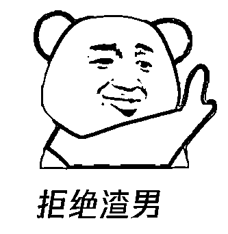
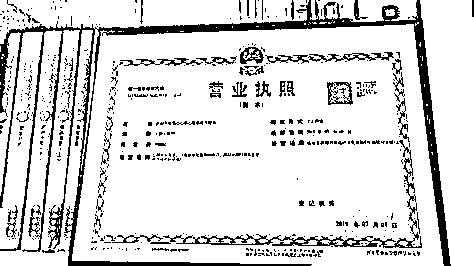

# “情感咨询”骗局揭秘：万金散尽后，她终究是错付了

> 原文：[`mp.weixin.qq.com/s?__biz=MzIyMDYwMTk0Mw==&mid=2247507513&idx=4&sn=503ff2ae37e6c699c428ba9001e8e772&chksm=97cb1501a0bc9c179b5fb76a7b755b3098538267113667fc020ec28ef82995ff689f4fe58f6b&scene=27#wechat_redirect`](http://mp.weixin.qq.com/s?__biz=MzIyMDYwMTk0Mw==&mid=2247507513&idx=4&sn=503ff2ae37e6c699c428ba9001e8e772&chksm=97cb1501a0bc9c179b5fb76a7b755b3098538267113667fc020ec28ef82995ff689f4fe58f6b&scene=27#wechat_redirect)

“**一个以为不会走，一个以为会挽留。**”这句话点出了多少因矛盾而分道扬镳的情侣们的心声。 可“**挽留**”又谈何容易？许多人因各种原因在纠结的十字路口停滞不前，或用错了方法，导致错过了最佳的挽留机会，追悔莫及。于是，为了帮助广大陷入情感问题的群众，一些**情感咨询机构**就应运而生了。 “挽回前任，原地结婚” “分离小三，替你分忧” “情感挽回率达 98%，最慢 10 天修复感情”可理想很丰满，现实很骨感，一些人尝试过后**不光感情没挽回，钱也没了**。 

**女子分手后求助“情感咨询”机构****万金散尽，终究是错付了**23 岁的小丽在和男友的一次争吵中闹了分手，事后小丽非常后悔。 “我们感情之前挺好的，分手也不是因为有其他人介入，所以我想挽回这段感情。” 于是，小丽随手在搜索引擎上输入了“**情感****挽回**”的关键词，然后就看到了一家自称可以挽回感情的心理咨询公司的广告。 “包你满意，你这种问题很容易解决，根据以往案例的结果统计挽回成功率最高可以达到 98%。”小丽与客服简单交流后，客服给出了这样自信的答复，并将公司的**工商经营许可证、老师们的相关咨询资格证书、个人简介**发了过来。客服给小丽报价为 5000 元，并称会提供一个月的服务。小丽对这份感情十分不舍，看见对方如此胸有成竹，机构及人员的资质也较为齐全，便认为可以一试。于是双方签署了一份**电子合同**，并在社交平台上添加了她专属的“**一对一导师**”。 当时小丽和男友还没有删去社交平台的好友，她把聊天截图发给了“导师”，随后导师打来电话询问了一些详细的情况，并传了几份“**资料**”，包含“男生的性格”、“如何变得有魅力”等内容，让她回去“好好研究”，**并告知不要心急联系男友**。导师告诉她“**先主动的就输了**”，最重要的一定是“**断联**”，不主动联系，让他产生“失去”的感觉， 在“冷落”了男友几天后，导师又提出“欲擒故纵”也不能太过，便让小丽写了一封**道歉信**。可男友反响平平，之后导师给出的几个方案也只是让两人关系略微缓和，男友并未回心转意。 眼见合同即将到期，小丽感到束手无策。可突然有一天，男友问小丽能不能给他买个电脑，这让小丽看到了一丝转机。

于是小丽连忙问导师“该怎么办，要不要答应他”。导师却表示“买电脑并不能解决两人之间的问题”，提出让小丽**把钱给她，增加一项服务**。 “你如果给他买了，他以后会索要更多，你们的感情还会出很多问题。” “你增加一项服务，我们会找一个专人接触他，开导他。” 小丽听信了，就又给导师转了 5000 元。 这次交费之后，导师还给了小丽一条建议。让她一改往日温和的脾气，给男友发一条“高冷”的信息，大致意思是“别找我了，我想通了，就这么断了吧”，小丽疑惑了一下，但还是按导师的意思发了过去。没想到，男友回了一句“好”后，**两人的关系彻底陷入僵局**。 小丽再问导师时，导师则表示希望小丽“按兵不动”、“静待时机”。这件事之后，导师对小丽回应越来越少，直到有一天发现被**拉黑**，才明白了这就是一个彻头彻尾的骗局。 **一套剧本诈骗 200 万元****专盯“痴男怨女”收割韭菜**   **男友没挽回，1 万元打了水漂。**小丽的惨痛教训揭露了一条以“**情感咨询、情感挽回**”为幌子的黑产。
事实上，情感咨询并不等于骗局，守哥在企业查询软件上以“**情感咨询**”为关键词进行搜索，共弹出数百个项目品牌，其中不乏有成立已久，融资额上十亿的大公司。 有需求，有市场，有投资，这些都说明，情感咨询服务本身是合理的，拥有正规执照及专业人员的机构确实能够在一定程度上缓解或解决情侣、夫妻间的感情问题。但行业“**进入门槛低****”**、“**网络上容易造假**”的特点使得这些情感咨询机构良莠不齐，从而滋生了许多骗局。 2020 年 10 月，湖北警方破获了一起情感咨询骗局。58 个人把自己包装为情感咨询师，从各种失恋男女中，共计诈骗了**200 多万**。 而这些所谓的“专业老师”，不少人原本的工作和情感、心理等学术领域毫无关系，经过公司的“培训”后，就摇身一变成为了“**情感专家**”，打着情感挽回的幌子大肆敛财，可谓“一本万利”。而他们的套路，不说千篇一律，但也算得上“异曲同工”。

01

自我包装，吸引流量

互联网时代的核心法则就是“**流量为王**”。只要吸引用户关注、点击，诈骗的“潘多拉魔盒”就总会被打开，骗子也秉承着“只要咨询的人够多就一定有人上当”的原则。
于是骗子就在“**包装**”上费尽了心思。
首先在广告页上，暖心的文案配上唯美的图片，不少人一下就被吸引了。 吸引受害者点击进入后，网页中成功帮助挽回感情的“**丰功伟绩**”、不断滚动的“**真实**”**案例**都让受害者极大程度上产生了“靠谱”的感觉。 而在一些短视频平台、社交平台上搜索“情感咨询”也可以看到大批拥有几十万、上百万粉丝的**情感咨询类账号**。短视频的内容集中于情感话题，视频的主角大多是一个穿着较职业化的“老师”，以及高度统一的视频内容制作。 而几分钟的短视频内容本身是免费的，可评论区留言回复的大多是“**建议私信**”、受害者一旦进行了私信，骗子就会要求添加社交平台账号，这也就正式进入了骗子设下的陷阱当中。

02

获取信任，诱导付费

双方添加了社交平台账号后，骗子会作为“导师”认真倾听受害者的情感经历和需求，列举其他成功的案例，指出还存在挽回的可能性。并出示一系列伪造的、盗取的营业资格证书、专业人员资格证书来证明机构的“**正规性**”，以获取受害者的信任。这时骗子就要求受害者支付费用，并许下“**一定能挽回**”的承诺。寻找情感咨询机构的受害者往往对这段感情有着极强的依赖性，不愿意就这么结束。在对感情不舍和急于挽回的心理作用下便选择了**付费**。 

03

给出剧本，运用缓兵之计

收到受害者转账的费用后，导师就会给出一些所谓的攻略和方案，比如**“爱心指南”、“挽回术语”、“道歉信”**等，并进行耐心的指导和分析，继续牵着受害者的鼻子走。 

如果奏效了，那么机构就正好将案例载入“成功史”，双方获得了双赢的局面。 

但往往需要找到第三方机构介入的“感情问题”是难以治理的“**顽疾**”，导师给出的方法收效甚微。而面对受害者提出的质疑，导师会以“时机未到”、“没按照自己所说的做”、“难度较大，需要增加其他方式来辅助”为由进行拖延或推脱。

04

额外付费，拉黑消失 

眼见没有成效，受害者不禁焦急万分。这时导师会提出让受害者参加新开设的“**进阶挽回课程**”，或者机构安排人员与其挽回对象进行沟通，双管齐下。一些受害者不愿之前的一系列努力付诸东流，便只能继续交费进行“挽回”。随后导师的态度便逐渐冷淡，最后直接**拉黑跑路**，而所谓的“与挽回对象双向沟通”，也只是个骗钱的幌子。 最贵的心灵鸡汤，都写在无良的情感咨询师的手册里。对于骗子来说，割这群“痴男怨女”的**韭菜**“真香”！所以，我们要掌握防骗技巧，炼就识破骗局的火眼金睛。
最后，守哥给陷入情感问题，想要挽回的情侣们提个醒。

1、心诚则灵，切忌“病急乱投医”，从而选择非法的、没有从业资格的付费情感咨询的机构和个人。 2、遇见机构的多次收费情况要小心，仔细判断是否存在不合理的地方，切忌越陷越深。

 3、遭遇诈骗请保留相关证据拨打 110 或到当地公安局进行报警，如果在 QQ/微信平台上遇到诈骗信息，请保留相关证据前往小程序进行举报。

← 向右滑动与灰产圈互动交流 →

