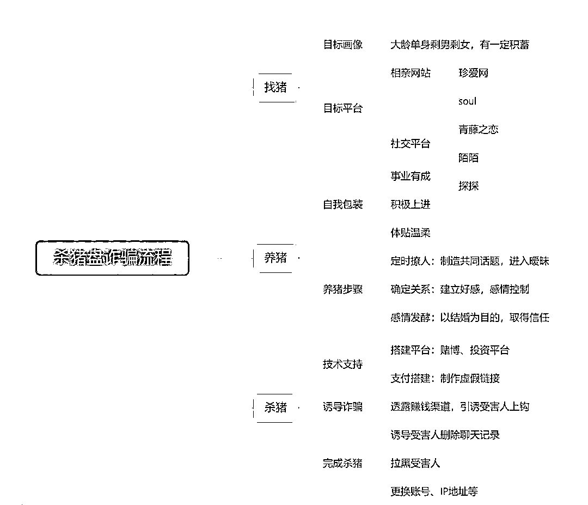

# “宝贝不懂没关系呀，跟着我投就行了呀，爱你……”

> 原文：[`mp.weixin.qq.com/s?__biz=MzIyMDYwMTk0Mw==&mid=2247507545&idx=2&sn=66aaa0b0d9548f7b9687a27a683c08c6&chksm=97cb1561a0bc9c771d976829a4a0b072f5753952085d36e4117a7c13709dab9e67a3611acdb1&scene=27#wechat_redirect`](http://mp.weixin.qq.com/s?__biz=MzIyMDYwMTk0Mw==&mid=2247507545&idx=2&sn=66aaa0b0d9548f7b9687a27a683c08c6&chksm=97cb1561a0bc9c771d976829a4a0b072f5753952085d36e4117a7c13709dab9e67a3611acdb1&scene=27#wechat_redirect)

最近几天寒流来袭

“孤寡”的你是不是也想要一个温暖的怀抱

但是注意了

有些“怀抱”千万不能要!

**魔鬼藏在爱情的细节里**

魔鬼藏在爱情的细节里 

12 月 10 日，五华区 31 岁的雷女士报警说自己遇到了“杀猪盘”骗子。

10 月 23 日，雷女士通过**“米聊”****A**PP 认识了一个男子，两人很快通过聊天有了好感。不久，两人关系越来越好，于是确定了恋爱关系。对方对她知冷知热，每天与她聊天到深夜，疗慰她的孤独。

然后，看似很自然地，男子开始倾诉理财赚钱的财富梦。男子告诉雷女士自己是学金融的，对外汇很敏感，问雷女士要不要和他一起投资赚钱。

男子开始和她畅谈未来：赚点钱，可以一起去旅游，重要的是要共度后半生。之后，就发了一个二维码给雷女士。沉浸在爱情中的雷女士通过这个二维码下载了**“中国外汇”**APP，又在男子的带领下进入到一个推荐群中。

“他说要教我赚钱，我就开始进行投资了”，雷女士在 APP 里存了 10 万元，根据系统的引导领彩金，领到的彩金都存在 APP 的账户中。男子告诉雷女士这种赚钱的方法非常简单，通过不断的充值领彩金。

这种充值方式是找 APP 客服要充值，客服会提供不同的银行卡账号给充值人，让充值人转账。为了赚到更多的钱，雷女士开始不断转钱到账户里面。

然而，雷女士把钱转进去之后系统却提示说是还需要再进行一次充值才能领完这个彩金，后雷女士陆续通过两张自己的银行卡转账 772800 元到客服提供的账号。

彩金是领到了，但钱却是在 APP 的账户上。雷女士在男子的“甜言蜜语”中也并未起疑。

直到 12 月 10 日，男子仿佛人间蒸发，雷女士才发现被骗，遂报警，损失人民币 772800 元。

大家注意了，除了白领、有钱人，现如今最普通的草根阶层，甚至是一穷二白的打工人，都能成为骗子**“杀猪盘”**里被盯上的猪。因为现在的网络贷款太普及了，一个人只要有身份证，就可以随随便便贷个几十万，“杀猪盘”诈光打工人的血汗钱，还要他们背上几十万甚至几百万的网贷，这些人的余生，全部被榨干。

杀猪盘剧本： 

**1.搭讪加好友，双方迅速坠入爱河，进入热恋期。**

一开始骗子会每天嘘寒问暖受害者，双方很快会建立关系。

**2\. 让受害人觉得自己出手阔绰，但其实和本身经济情况不符，激起受害人好奇心，顺势介绍虚假赌博网站。**

通常，骗子会先问受害者钱够不够用，告诉对方自己从事赌博网站技术维护工作，称自己近期发现技术漏洞，可以利用这个漏洞、修改后台赔率，稳赚不赔。感情诱骗也是惯用手法。若受害者表达不愿再投钱的想法，骗子就会打出感情牌，给受害者描绘赚钱之后一起买房买车、养孩子旅游的美好生活，受害者基于对美好未来的向往以及对“恋人”的信任，往往难以自拔。

**3.受害者尝完甜头后，骗子称漏洞马上就要修复，来笔大的。**

这个时候也是收网的时候了，骗子会要求受害者拿出所有积蓄，并怂恿受害者借钱、贷款，受害者在冲昏头脑、有利可图的情况下，借、贷、凑个 100 万一起投进去，之后第二天便会发现已经联系不上心目中的他，受害者被骗子拉黑取关了。

**高能预警！**

听到这 10 句话要提高警惕 

**1.“我在用手机赚外快”**

警方解析：这句话大多使用在杀猪盘的切入阶段。骗子和你加入好友之后，先会聊一阵子，然后突然减少聊天频率，等你去问他。当你问他时，他也不会说具体做什么，只会说赚外快，目的是勾起你的好奇心，顺便测试一下你是否容易被骗。

**2.“高频彩中奖频率特别高”**

警方解析：这是为了进一步引诱你走进陷阱，目前国家不允许任何网上销售彩票的行为，网络私彩基本上都是诈骗套路，千万不要碰！

**3.“玩一下试试，我保证你赚钱”**

警方解析：当你动心却下不定决心的时候，骗子一般会用保证赚钱来进一步引诱你，一般会让你先投入少量的钱，然后让你赚钱。目的是让你体验轻松赚钱的快感，同时展示实力。

**4.“借钱凑一下吧，赚笔大的就完事了”**

警方解析：这是杀猪盘的“调大”阶段。当你赚了钱想提现，又或者赔了钱不想继续，骗子会忽悠你借钱，目的是为了让你继续陷入这种疯狂的游戏不能自拔，同时也会后续让你加大投入做好铺垫。

**5.“请考虑下我们和父母的未来”**

警方解析：当你打退堂鼓的时候，骗子会用激将法让你继续投钱，通常会说让你考虑自己和父母的未来。

**6.“成为 VIP 可以赚更多钱”**

警方解析：骗子忽悠你进行大额投注。目的是骗更多的钱，而人一旦习惯一次输赢几万，就会对金钱不再敏感。

**7.“再贷一点吧，下把赢了就翻盘”**

警方解析：你的钱已经赔光了，不继续投钱就只能就地还债；继续投钱，就要四处贷款。骗子正是利用这个心理，引诱你去贷款。

**8.“我不方便视频，以后再见面”**

警方解析：骗子的朋友圈照片都是盗用，一视频就会暴露，同时不想留下任何证据，“不视频”是杀猪盘诈骗的一个显著特征。

**9.“我能骗你什么呢？”**

警方解析：当你质疑的时候，骗子就会以一些“鸡汤文”来给你洗脑，说这是全新的盈利模式，而不是诈骗。

**10.“有紧急情况，把聊天记录全删掉”**

警方解析：觉得你无钱可骗的时候，对方会利用前期对你的感情铺垫，制造一个紧急情况的理由，让你删除所有的聊天记录，目的是毁掉所有证据。

**反诈民警提示：**

**勇敢寻找“温暖的抱抱”很赞，**

**但辨别良人需要多问几遍“为什么？”**

**没有由来的爱和财，小心是骗子的陷阱**

来源：昆明反电信网络诈骗中心

← 向右滑动与灰产圈互动交流 →

