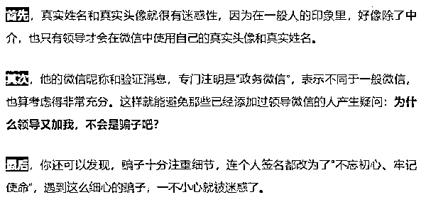

# “我是 XXX 领导，需要钱周转一下……”

> 原文：[`mp.weixin.qq.com/s?__biz=MzIyMDYwMTk0Mw==&mid=2247507545&idx=3&sn=972fa94c5a3f01833a3e6fa293db639a&chksm=97cb1561a0bc9c778d76afa759970cb06eb9ad3ec3af5b57e1bbd650b02d35986cf5ca4b72b7&scene=27#wechat_redirect`](http://mp.weixin.qq.com/s?__biz=MzIyMDYwMTk0Mw==&mid=2247507545&idx=3&sn=972fa94c5a3f01833a3e6fa293db639a&chksm=97cb1561a0bc9c778d76afa759970cb06eb9ad3ec3af5b57e1bbd650b02d35986cf5ca4b72b7&scene=27#wechat_redirect)

“我是 XXX 领导，需要钱周转一下……”

假的！

近期

全国高发冒充领导干部实施电信网络诈骗案件

银川市多个县区此类案件频发

涉案金额巨大

为群众造成了严重经济损失

1 月 8 日

银川市公安局发布

关于冒充领导照片案件多发的紧急通报

**真实案例**

1 月 3 日晚，贺兰县公安局接辖区群众报警称，有一个自称是贺兰县某部门领导的人添加其微信。

添加成功后，对方称其急需用钱，需要受害人帮忙。

其以跨行转账不能实时到账为由，主动提出先给受害人转账，然后让受害人将钱再转给其另外一个账号，其先将钱转到受害人提供的账号上。

随后，受害人向对方提供的银行账户转款 49999 元后，一直未收到转账信息，发现被骗。

（网络图）

贺兰县公安局接辖区群众报警称：2020 年 12 月 27 日，有人添加受害人微信，对方微信头像是贺兰县一个部门领导的照片。

次日对方称有朋友急需用钱，需要帮忙转账，向受害人提供的银行账号转账，同时将转账截图发送给受害人，并称因为跨行转账无法实时到账，朋友那边又着急用钱，需要受害人先给指定的账号转钱。

随后，受害人将 9.8 万元转到指定账号。

然而，受害人与该部门领导电话联系时，领导称并未添加受害人微信，也没有让他帮忙转账，受害人这才发现被骗。  ‍

那么

骗子到底是如何

精准找到领导干部的姓名、照片

进而冒充

又是如何

精准找到领导干部所在辖区群众信息

进而行骗的？

**利用公开信息，锁定目标领导**

****

****

**不得不说**

**这个手法确实高明**

****

****

****锁定受害人，联络感情****

********

********

********

****（真实案例图片）****

******一招鲜，吃遍天——实施诈骗******

************

************

******书记的理由很合理，就是亲戚开公司要借钱，但是自己是领导，不方便直接转账，想以吴总的名义转账，这样也方便以后索要。******

******当然了，这笔钱书记会先转给吴总，打消吴总的后顾之忧。******

************

******不得不说，这个话术之所以成功率很高，就是因为无懈可击。******

******对于一个企业负责人来说，以自己的名义转账给别人不费吹灰之力，哪怕是直接垫资都可以。何况，现在书记又主动提出要先转账给自己，这简直就是上天赐予的和领导建立密切关系的最佳机会啊！于是，很多人欣然照做。******

******当然，骗子的戏份也会做得很足，他会假模假样地向受害人索要银行卡账号、开户行等信息，说要现在转账。******

************

********而且在要完卡号信息后，会马上行动，给受害人发来一张转账凭证。********

**********当然了，这个转账凭证是伪造的**，他根本不会转账，只是在后台 P 了一张图。********

****************

**********通常来说，很多企事业单位的负责人，一看领导这么实在，为了体现自己落实领导要求积极，往往不去查询这笔款是否到账，就马上按要求转账给领导的“亲戚”了。**********

************而一旦有人质疑为何没收到转账，领导往往会解释说“大额转账要 24 小时才到账”，那边亲戚急需这笔钱，请立即转账。************

********领导的气场实在强大，说的话也越来越严厉，很多人顶不住压力往往会立马转账，而自己是永远不会收到领导转账的。********

********更可气的是，很多人被骗后往往还不知道自己被骗，以为领导是变相索贿，还不去报案。********

********在此******** 

********一定要提醒大家以下几点********

********1.对于以领导名义加 QQ 与微信的，尤其是加完后涉及转账汇款的，请务必通过原有联系方式与本人进行确认。********

********2.网络汇款截图不可轻信，钱未到账就要你代为转账的一律是诈骗。********

********3.如遇诈骗，请及时拨打 110 报警。‍********

********以上这些只是众多诈骗手法中的一部分********

********但却是最近高发的案例！********

********虽然犯罪分子的骗术花样百出********

********但无论他们多么狡诈********

********只要我们提高警惕********

********了解更多安全防范知识********

********就能有效避免陷入诈骗套路********

********保护自己的财产安全********

********来源：银川发布，利箭在出击********

********************************

********← 向右滑动与灰产圈互动交流 →********

****************