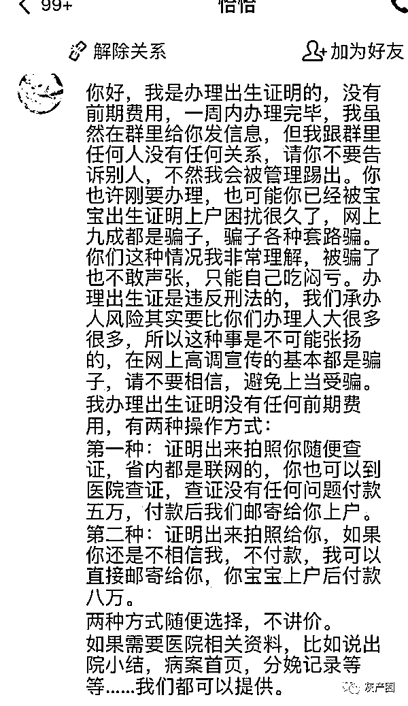
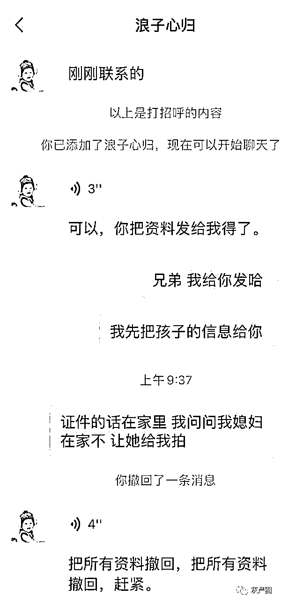
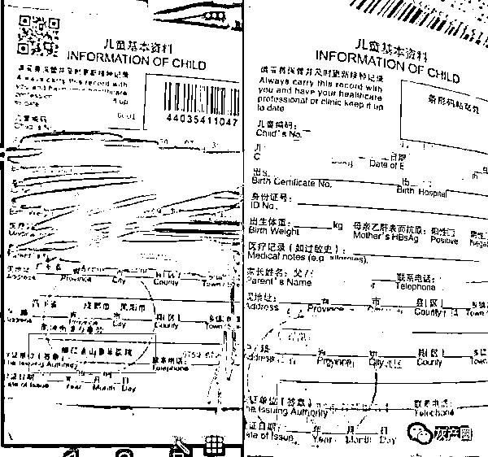
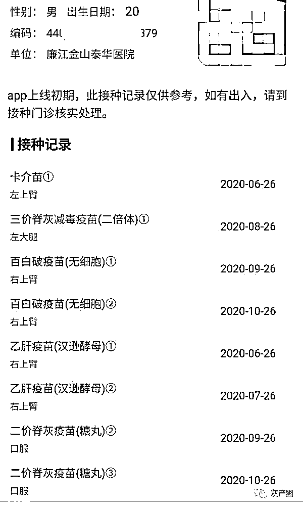
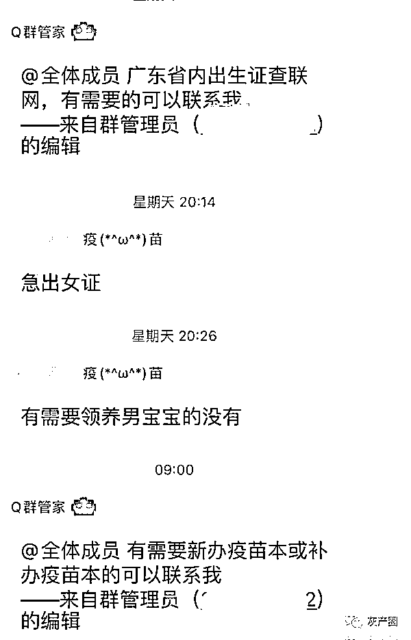
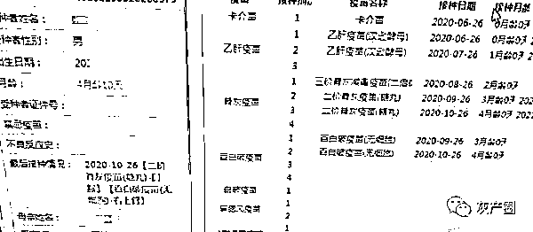

# 可以买卖的儿童疫苗本：虚构婴儿获接种记录，中介能指挥人随意删除

> 原文：[`mp.weixin.qq.com/s?__biz=MzIyMDYwMTk0Mw==&mid=2247507603&idx=1&sn=b2ce9e1092d261e4b854a22d8c3fa461&chksm=97cb15aba0bc9cbd7ee1bb88b3c5374a9f9eb4ed1b794ec9c45c87363d057f5ed1626bc082e2&scene=27#wechat_redirect`](http://mp.weixin.qq.com/s?__biz=MzIyMDYwMTk0Mw==&mid=2247507603&idx=1&sn=b2ce9e1092d261e4b854a22d8c3fa461&chksm=97cb15aba0bc9cbd7ee1bb88b3c5374a9f9eb4ed1b794ec9c45c87363d057f5ed1626bc082e2&scene=27#wechat_redirect)

出生证明、疫苗本，只要花钱就能办。记者发现，有社会中介通过 QQ、微信等网络渠道招揽客户，为被拐儿童提供一条龙“售后”服务。

1 月初，记者接到线索：有中介自称能够办理出生证明、疫苗本，为被拐儿童“洗白”身份，提供一整套的“售后”服务。举报人透露，这些社会中介通过 QQ、微信等网络渠道招揽客户，一天时间里、即可轻而易举地办出疫苗本，并且在官方系统中能够查到相关信息，价格一般在 1 万到 1.5 万元不等。办理出生证明相较而言时间更长、价格更贵，一周内出证、标价 5 万到 8 万元。

（昵称为“恰恰”的中介在 QQ 上介绍业务）

一个证 1 万到 1.5 万

官方系统可查到信息

1 月 11 日，根据举报人提供的信息，记者拨通归属地为广西桂林的手机号。接电话男子自称“小王”，全程表现得极为谨慎。记者声称孩子没有上户口、没有接种卡，按照正规程序根本无法办理疫苗本。小王随即表示：现在能办疫苗本的人确实不多，但自己有渠道。

在电话中，小王告诉记者：“需要提供孩子的相关信息，最快半天时间就能办好。”

（中介表现得极为谨慎）

记者咨询某疾控中心工作人员得知：疫苗本又叫“预防接种本”，是儿童入托、入学、出国的健康证明，不能漏打也不能多打。一般办理疫苗本的正规流程是，孩子出生后，家长会在出生医院拿到孩子首次接种的乙肝疫苗和卡介疫苗接种卡。随后携带出生证明、户口簿、接种卡，到街道医院办理。疫苗本会准确记录每次疫苗接种的时间、地点、下次预约接种时间、疫苗规格等基本信息，并录入电脑。

对于被拐卖儿童来说，无法提供接种卡、出生证明等有效证件，意味着通过正规流程是办不下来疫苗本的。如何给被拐卖儿童“洗白”身份？小王说：“交钱就能办，在官方接种管理平台上查到信息后再付款。”

小王向记者透露，他们主要在广东省湛江市进行操作，“我们在这边有关系，好几家医院都能办。”为了展示自己的业务能力，小王向记者发来多个办理成功的疫苗本照片。虽然照片做了打码处理，但能看到发证单位有的是“廉江金山泰华医院”，有的是“廉江市石颈镇卫生院”。

（中介办理过的疫苗本）

另外一名昵称为“恰恰”的中介明确表示：“如果没有指定的疫苗批号，可以直接用医院的疫苗批号，按照正常孩子的疫苗信息进行录入。”中介介绍，孩子的接种信息统一在广东粤苗 APP 上查询。正观记者了解到，粤苗 APP 是广东省官方推出的儿童疫苗接种服务软件，用户可以在平台上预约接种疫苗、查看疫苗接种信息。

记者随即提出疑问“外地孩子在广东省办理疫苗本是否靠谱？”中介称拿到疫苗本后，可以转到当地的街道医院，“只需要说孩子在外地出生，现在需要转回来，系统中的信息是全国通用的。”

无论是“小王”，还是“恰恰”，均表示：在官方疫苗接种系统中查到信息后，再付款。

（在广东粤苗 APP 中查到假身份的接种记录）

“假男婴”可办疫苗本

中介：不付款就删除信息

长期关注拐卖儿童的上官正义向记者透露，自己早就注意到这条为拐卖儿童办理出生证明、疫苗本的“灰色产业链”。上官正义说，该产业链为拐卖儿童提供了一条龙“售后”服务，相当于“洗白”身份，为警方寻找被拐儿童增加了困难。

2020 年下半年，上官正义通过一条模糊的信息，查到了一名中介的上家，就是“恰恰”。通过伪装身份，他与“恰恰”搭上线。提供了“假男婴”的姓名、孕周、性别及出生日期，仅一个下午的时间，便能在广东粤苗 APP 中查询到假身份的相关接种信息。

（办理疫苗针的 QQ 群）

记者从某疾控中心工作人员处了解到，孩子出生后需要打乙肝疫苗和卡介疫苗，一个月时打乙肝疫苗第二针，两个月脊髓灰质炎疫苗，三个月脊髓灰质炎疫苗及百白破，四个月脊髓灰质炎及百白破，五个月百白破，六个月乙肝疫苗第 3 针，八个月麻疹疫苗。以后的就是上述疫苗复种。

广东粤苗 APP 中，“假男婴”的接种信息一应俱全，接种的疫苗种类与上述疾控中心工作人员介绍的一样。同时，在中介提供的电脑页面当中，详尽的标注了接种日期、接种月龄，还备注有最后接种情况：百白破疫苗（右上臂）。

即便如此，上官正义依然无法相信接种信息的真实性，他告诉记者：“国家对于儿童接种疫苗有严格的管控，他们究竟是如何做到的？”

信息查到后，中介“恰恰”称：“想要拿到疫苗本，就需要付款了。”如果没有付款，系统中的信息就会被中介删除。

（“假婴儿”的接种信息）

1 月 11 日，记者向中介“小王”提供了一个假婴儿的信息。不到半天时间，同样在广东粤苗 APP 中查到了相关信息。小王向记者索要 1 万 5 千元的服务费，并表示“孩子年龄越大，收费越高。”直至下午未收到记者转账，小王将微信拉黑。再次登录粤苗平台查询时，已无法查到“假婴儿”的任何信息。

1 月 11 日下午，记者向某地方卫生院咨询儿童疫苗管理系统的操作流程，一名工作人员向记者透露，儿童在出生医院打过乙肝疫苗和卡介疫苗后，系统会将孩子信息分到所属街道医院、卫生服务中心或卫生院。以地方卫生院为例，儿童疫苗管理系统有专人负责操作，而且保证一人一账号。信息录入流程较为简单，但删除信息非常复杂。“单从卫生院层面是无法彻底将孩子的信息删除的，必须要联系系统开发的后台才能实现。”

公开资料显示，廉江金山泰华医院成立于 2018 年 7 月 26 日，所属位置与中介办出疫苗本中的地址一致，是一所二级综合医院。1 月 11 日下午，记者联系该医院办公室电话，一直处于无人接听状态。

上官正义表示：“希望有关部门能够严查严惩此类中介行为，加强打拐力度、完善相关监管体系。”不要因为疫苗本的问题，让不法分子钻了空子，让公安机关寻找被拐儿童受到阻力。

来源：正观新闻

← 向右滑动与灰产圈互动交流 →

