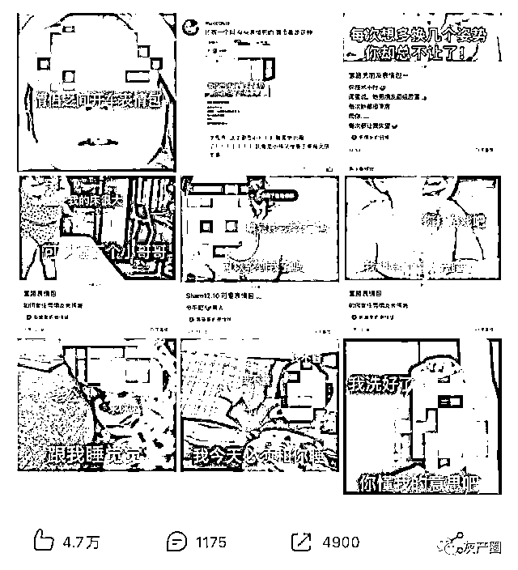
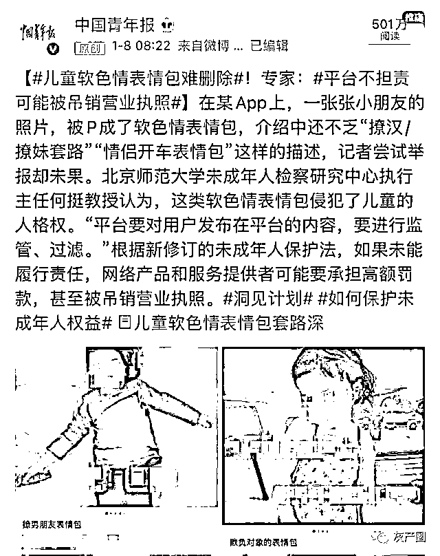
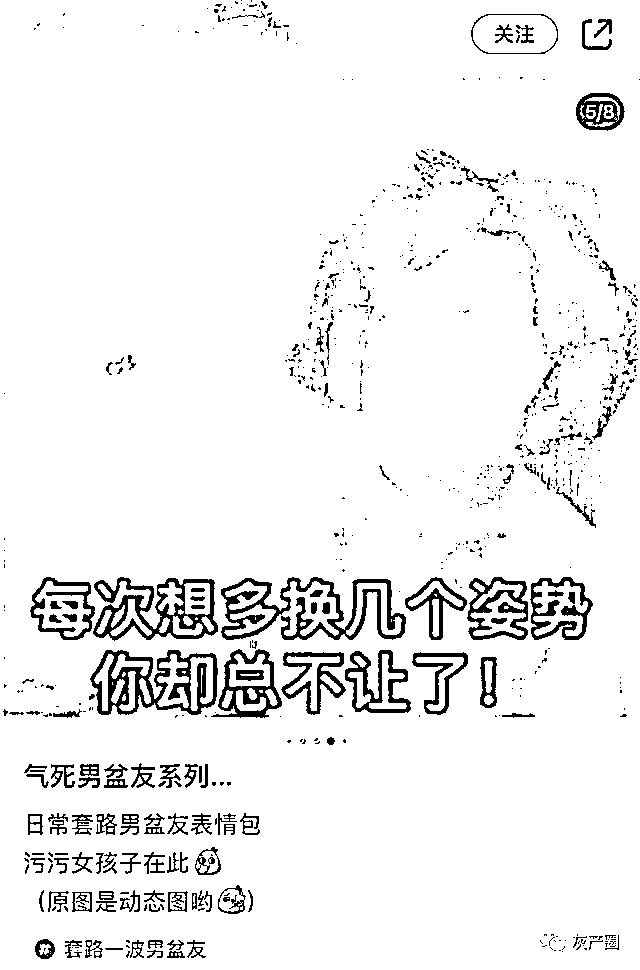
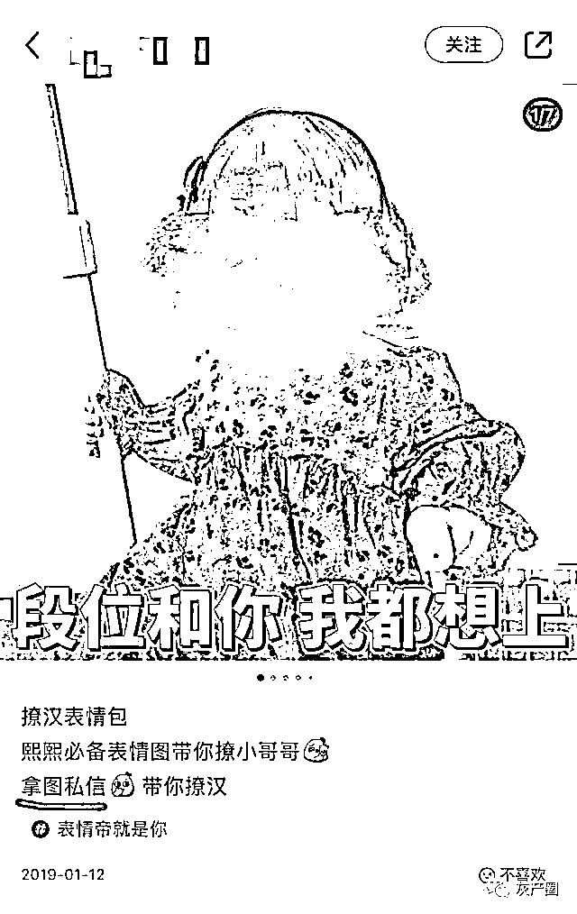
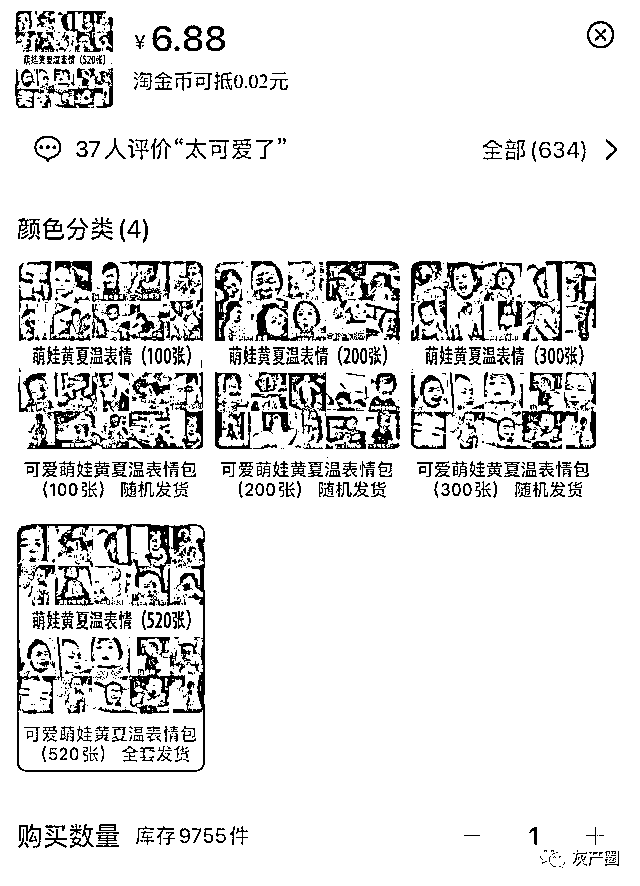
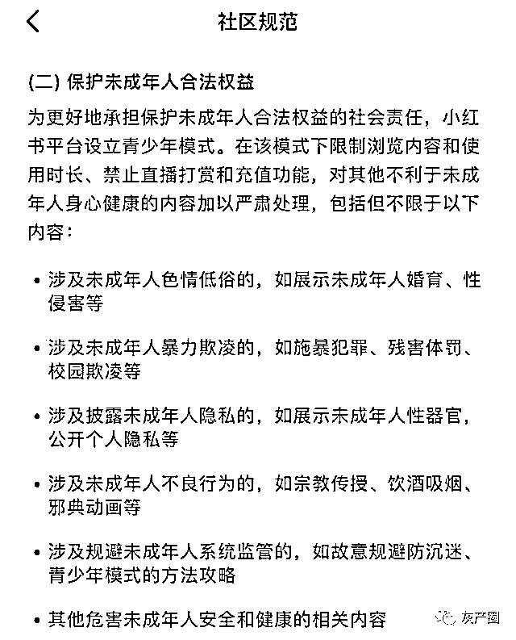
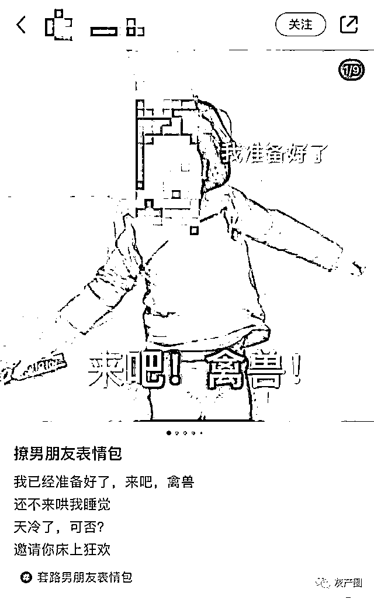
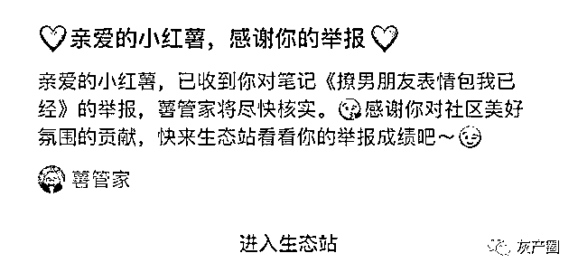

# 儿童软色情表情包背后暗藏“套路”

> 原文：[`mp.weixin.qq.com/s?__biz=MzIyMDYwMTk0Mw==&mid=2247507603&idx=2&sn=fe5102eb285915f1d468ddf6f9eb1213&chksm=97cb15aba0bc9cbdc232ce8797505e159973892af72f7dc70b2384657332b8c603a9dfc949e9&scene=27#wechat_redirect`](http://mp.weixin.qq.com/s?__biz=MzIyMDYwMTk0Mw==&mid=2247507603&idx=2&sn=fe5102eb285915f1d468ddf6f9eb1213&chksm=97cb15aba0bc9cbdc232ce8797505e159973892af72f7dc70b2384657332b8c603a9dfc949e9&scene=27#wechat_redirect)

近日，一条网友吐槽儿童软色情表情包的微博，在网络掀起轩然大波↓↓↓

记者检索发现，在某 App 上，“我馋你身子好久了”“想把你压在床上”……一张张小朋友的照片上，被 P 上了如是文字，变成了“想约”“开车”的表情包。类似的萌娃表情包的介绍中，还不乏“撩汉/撩妹套路”“情侣开车表情包”这样的描述。

民法典第四编人格权编中，对公民的肖像权、名誉权和隐私权等与互联网紧密相关的问题进行了规制。北京师范大学未成年人检察研究中心执行主任何挺教授认为，这类软色情表情包侵犯了这些儿童的人格权。

截图来源：@

萌趣外衣下的儿童软色情表情包

“在两性关系里把自己弱智化、把情欲理解为‘可爱’。”这条评论被网友认为是“导致儿童软色情表情包泛滥的最大原因”。

南京大学新闻传播学院宗益祥博士在接受中青报·中青网记者采访时表示，表情包本身作为一种社交语言，具有替代和超越一般语言文字的独特意义。而萌娃表情包将萌和趣融合在一起，达到了此处无言胜有言的沟通效果。

心理咨询师冰千里从心理动力学的角度分析说：“把羞于启齿的、不好的需求，通过弱小的孩子来发声，会降低人们内心的羞耻感和恐惧。”

可即便这些可爱的表情包把“性”进行了“伪装”、让这些图片及动图显得不那么“扎眼”，宗益祥仍指出：“萌趣化的儿童色情无论采取何种传播形式进行包装，都已触及法律、道德底线。”

侵权容易维权难

在该 App 上，有的博主往往会设计一系列类似表情包，“撩”起人来步步为营。用户想要获取全套必须点赞、关注，为博主增加人气，或是私信添加好友获取原图，成为博主的下一个“猎物”。随便加几位，点开朋友圈就是微商广告。

而在电商平台检索，有各种“萌娃”表情包在售，价格不一。某个韩国童星的表情包已成为打包售卖的商品，100 张卖 1.49 元，而第四档的套餐足足有 520 张，标价为 6.88 元。该店铺同时有多套表情包在售，月销件数最高 100+。

记者询问商家上述表情包是否会侵权时，店主的回应是：“都是网上搜集的，不会。”

北京金诚同达律师事务所高级合伙人周俊武律师表示，不少网友自发地使用这些童星的照片制作表情包，容易被更多网友传播。而“商家更多地选择外国童星，也是因为被权利人知悉的可能性更小一些，包括权利人维权成本也更高”。

网络平台如何担责

在开头提到的 App2020 年 2 月更新的《社区规范》中，明确要“抵制一切色情低俗内容”，包括“以带有性暗示、性挑逗的语言描述性行为、性过程、性方式的内容”。而在“保护未成年人合法权益”专章中，则规定：“涉及未成年人色情低俗的”将被平台“严肃处理”。

然而，记者注意到，不少有儿童软色情之嫌的表情包在 2019 年就被上传至该 App。记者尝试对其中一条链接进行了举报。图中一个学龄前小女孩躺在床上，被 P 上了“来吧！禽兽！我准备好了”的文字，而推广文案的表述则为：“邀请你床上狂欢。”

不到两分钟，该平台就回应称“您举报的表情包已被处理”，但并未标明处理方式和结果。随后，记者重新检索这条链接，发现该链接依旧可公开显示。

周俊武律师表示：“如果商家没有向童星方取得许可而擅自使用他们的肖像用于营利，属于侵犯肖像权的行为。”有的软色情表情包，是把照片、文字、图样等综合在一起，可能关联儿童本人形象与色情印象，或配文本身也可能构成对儿童的侮辱，这些情况都可能造成儿童社会评价降低、名誉贬损，从而侵犯儿童名誉权。

何挺则认为，网络平台运营者在内的网络产品和服务提供者，需要承担起未成年人保护相应的企业责任。平台要建立便捷、合理、有效的投诉和举报渠道，公开投诉、举报方式等信息，及时受理并处理涉及未成年人的投诉、举报。根据新修订的未成年人保护法，如果未能履行上述责任，网络产品和服务提供者可能要承担高额罚款，甚至被吊销营业执照。

何挺说：“侵害未成年人合法权益和影响未成年人健康成长的事件，可能发生在日常生活或者网络世界一些不经意的角落。”如何提升未成年人保护的意识并通过投诉、举报等方式，积极履行未成年人保护的公民职责，是我们每个人都需要思考的问题。

对此，你怎么看？

来源：中国青年报

← 向右滑动与灰产圈互动交流 →

