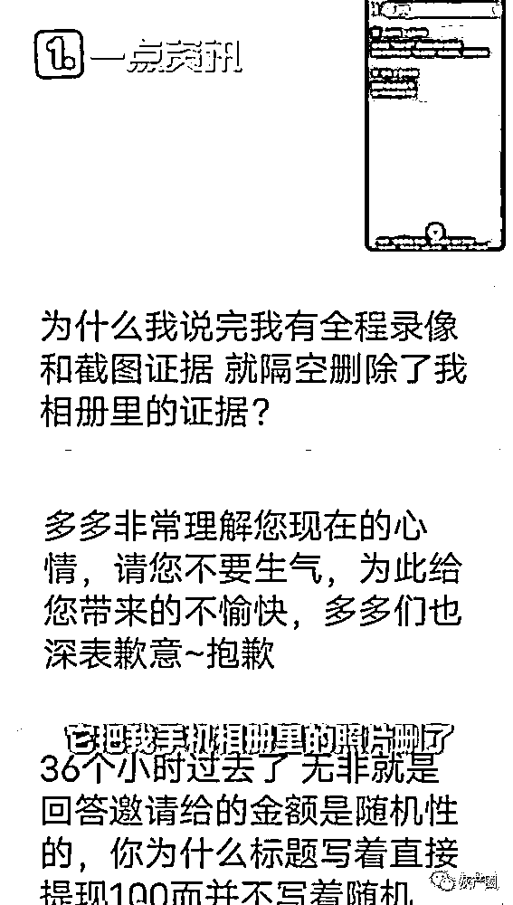

# 套路用户被揭发？拼多多否认远程删除用户照片：可补偿 30 元券

> 原文：[`mp.weixin.qq.com/s?__biz=MzIyMDYwMTk0Mw==&mid=2247507676&idx=2&sn=5afd3a0e3cb8572040657567d2a90ef9&chksm=97cb15e4a0bc9cf2b6cd8f644d961983c00fd2359a88e31190cfe92492353b187767472b6c96&scene=27#wechat_redirect`](http://mp.weixin.qq.com/s?__biz=MzIyMDYwMTk0Mw==&mid=2247507676&idx=2&sn=5afd3a0e3cb8572040657567d2a90ef9&chksm=97cb15e4a0bc9cf2b6cd8f644d961983c00fd2359a88e31190cfe92492353b187767472b6c96&scene=27#wechat_redirect)

导语

1 月 12 日消息，近日，有网友爆料称拼多多远程删除其相册照片，被自己的手机系统检测到。对此拼多多回应称，是清除缓存造成的，拼多多工作人员致电该网友称，没有删除，可以补偿 30 元无门槛代金券。

据悉，该网友在参加拼多多的活动时，将其活动截图截了下来，而在其完成任务后，没有得到相应奖励，于是去找客服理论。

而在与客服理论时发现，自己保存的拼多多活动图片被删除了。

拼多多客服回应网友称是清除缓存造成的。

该用户询问了其手机官方客服，表示如允许对应的权限，该软件就可以获取对应的信息。

拼多多工作人员致电该网友称，没有删除，可以补偿 30 元无门槛代金券。

拼多多：用 APP 拍照并编辑图片后会删原图，将改进

1 月 12 日消息，今日晚间，拼多多针对被用户爆料远程删除用户照片这一事件，通过其官方微博发布《关于个别用户反馈“vivo 手机提示拼多多删除照片”的说明》。拼多多表示，绝不会删除用户主动保存的任何照片和文件。

拼多多在这一声明中提到，收到个别用户反馈后，团队十分重视并第一时间核查。初步认定的原因为，“在拼多多 App 内的客服聊天页面，如果在发送之前，进行剪裁、美化等编辑动作，App 会保存一张拍完的图片到系统相册，起到类似于“缓存”的作用，待编辑完成并发送后，App 会删除编辑之前的图片，保留编辑后发送的图片。这导致了 vivo 系统认为有删除图片的操作。”

以下是拼多多《关于个别用户反馈“vivo 手机提示拼多多删除照片”的说明》

近日，我们收到个别用户反馈“vivo 手机提示拼多多 App 删除照片”，团队十分重视并第一时间核查，初步原因说明如下：

1，在拼多多 App 内的客服聊天页面，点击“+”选择“拍摄”并完成拍照后，如果立刻点击发送，这一图片会被保存至系统相册；如果在发送之前，进行剪裁、美化等编辑动作，App 会保存一张拍完的图片到系统相册，起到类似于“缓存”的作用，待编辑完成并发送后，App 会删除编辑之前的图片，保留编辑后发送的图片。这导致了 vivo 系统认为有删除图片的操作。

2，收到反馈后，我们将对产品做改进。在拍照完成并编辑后，将不会再删除拍照的原图。

3，我们会联系 vivo 及其他手机厂商，在保护用户隐私的基础上，共同协商优化该体验。

4，消费者权益是我们的第一准则。拼多多 App 绝不会删除用户主动保存的任何照片和文件。感谢广大网友的监督。

背景介绍：

拼多多又上热搜第一！被曝远程删除用户照片？补偿 30 元代金券

12 日下午，拼多多又上了热搜第一。

网友评论

来源：网易新闻

← 向右滑动与灰产圈互动交流 →

