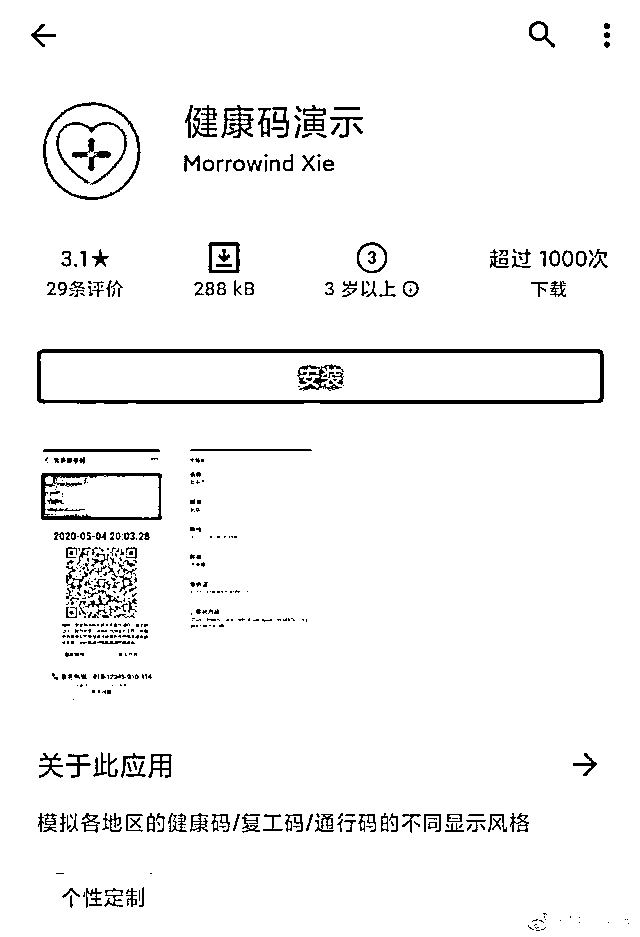
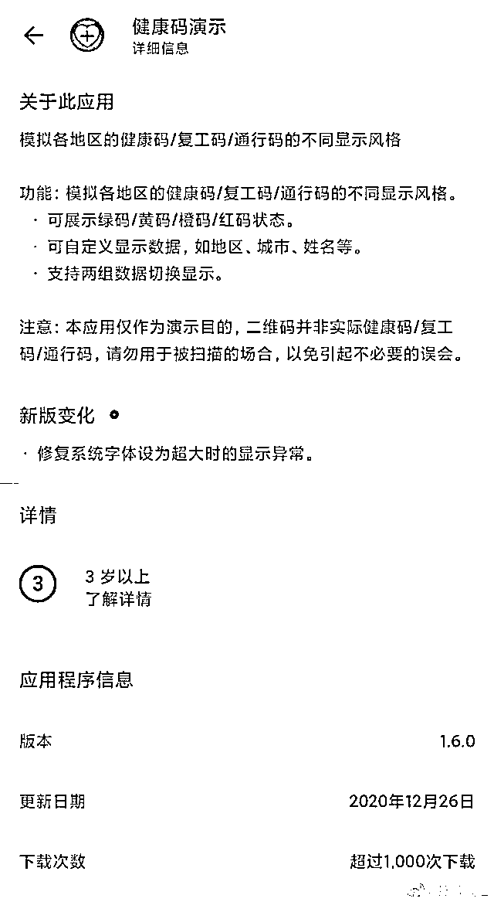
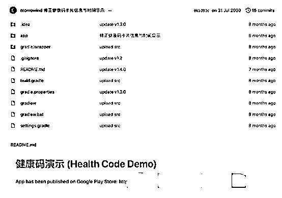
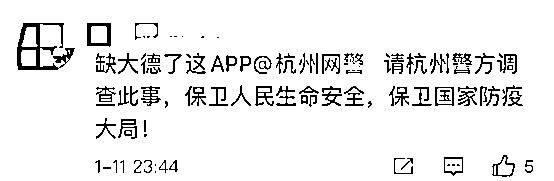
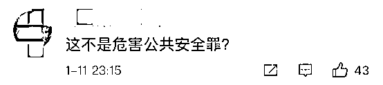
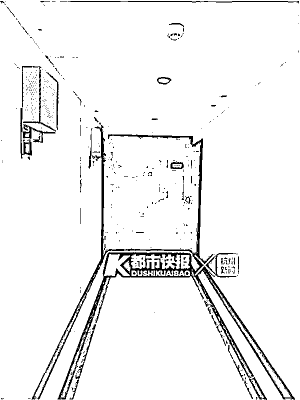

# 细思极恐！健康码演示 APP 竟可随意展示红码、绿码？

> 原文：[`mp.weixin.qq.com/s?__biz=MzIyMDYwMTk0Mw==&mid=2247507676&idx=4&sn=485dcae81c679ca0d6f3fbbdea768996&chksm=97cb15e4a0bc9cf255cc17f0fd906222f4312cc47c18f48fda7eb219e7da09b3db7789834470&scene=27#wechat_redirect`](http://mp.weixin.qq.com/s?__biz=MzIyMDYwMTk0Mw==&mid=2247507676&idx=4&sn=485dcae81c679ca0d6f3fbbdea768996&chksm=97cb15e4a0bc9cf255cc17f0fd906222f4312cc47c18f48fda7eb219e7da09b3db7789834470&scene=27#wechat_redirect)

在全国各地推行的健康码，原本为疫情防控和整个社会秩序的恢复常态提供了全新的技术手段，但近日有网友爆料网上出现模拟健康码的软件。

[`v.qq.com/iframe/preview.html?width=500&height=375&auto=0&vid=k3220ewk3km`](https://v.qq.com/iframe/preview.html?width=500&height=375&auto=0&vid=k3220ewk3km)

11 日，有网友爆料称，在某应用软件商店中，一款名为“健康码演示”的软件能够根据个人所需随意显示各地健康码，涉嫌违法。 

我们注意到，“健康码演示”APP 显示，**这款 APP 能够模拟各地健康码、复工码、通行码的不同演示风格**。

功能上，该 APP 不仅能够展示不同健康码，还可展示绿码、黄码、橙码、红码状态，并可自定义显示数据，如地区、城市、姓名等。

我们注意到，该 APP 还标注了“注意事项”：称该应用仅作为演示目的，二维码并非实际健康码、复工码，请勿用于被扫码的场合，以免引起不必要误会。

这款 APP 被网友曝光后引发质疑，很多网友认为如果利用这款应用提供虚假的展示健康码，一旦感染新冠肺炎，相关防疫部门将难以追踪到患者准确轨迹，不利于疫情防控。

应用商店显示，这款软件开发者电子邮箱地址为 morrowindxie@gmail.com，其地址为杭州市上城区岳王路某科技公司。

有网友称，国外某共享软件代码的网站也有一名叫“Morrowind Xie”的网友在去年 7 月上传了该软件，并附上了谷歌商店下载链接，**不过目前链接已经失效**。此人资料显示其地址位于中国杭州，并用“伪装成人类的人工智能”作为个性签名。

对于这一消息，有网友批评**“缺大德”**，有的还@网警举报↓

12 日下午，我们赶到岳王路上的东方金座 B 座，这是一幢公寓楼，上楼要做登记，然后由前台工作人员刷电梯卡后才能上楼。

一位物业工作人员告诉我，12**住着一位租户，已经在这里租了四五年，肯定不是一家公司。

我们上到这一层，敲 12**的房门，一直没有人开，屋里也没有开灯。楼层管家说，这里的房间 50 到 90 平方米，因为是商住楼，可以租来开公司，现在房价大概 4 万元一平方米。

12 日，上城区市场监督管理局一位工作人员告诉我们，通过该地址查询不到公司，初步推断可能是个体行为或伪造地址。该工作人员表示，如果警方需要市场监督部门配合，他们会积极配合协助警方调查。**12 日，该应用已从应用商店下架。**

12 日，我们从上城区公安分局获悉，目前杭州市公安局已介入调查此事。

来源：红网、北京头条、都市快报、看看新闻

← 向右滑动与灰产圈互动交流 →

