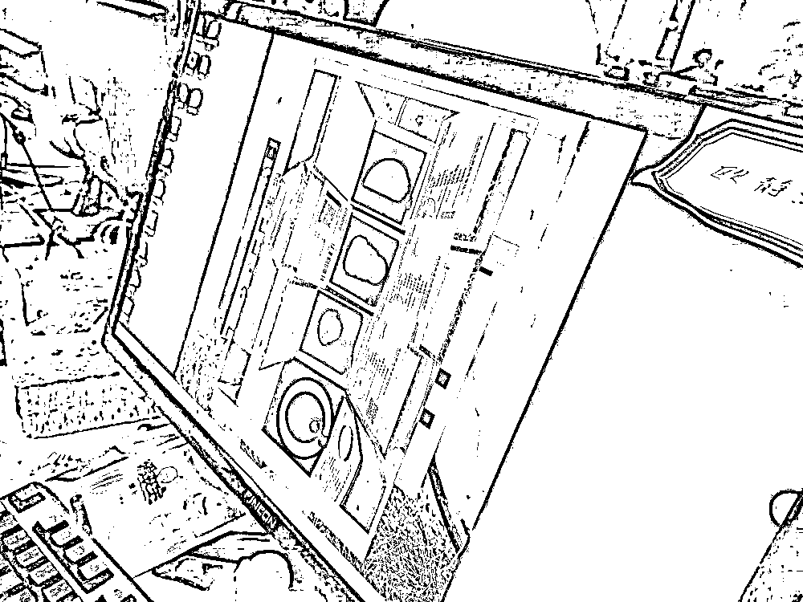
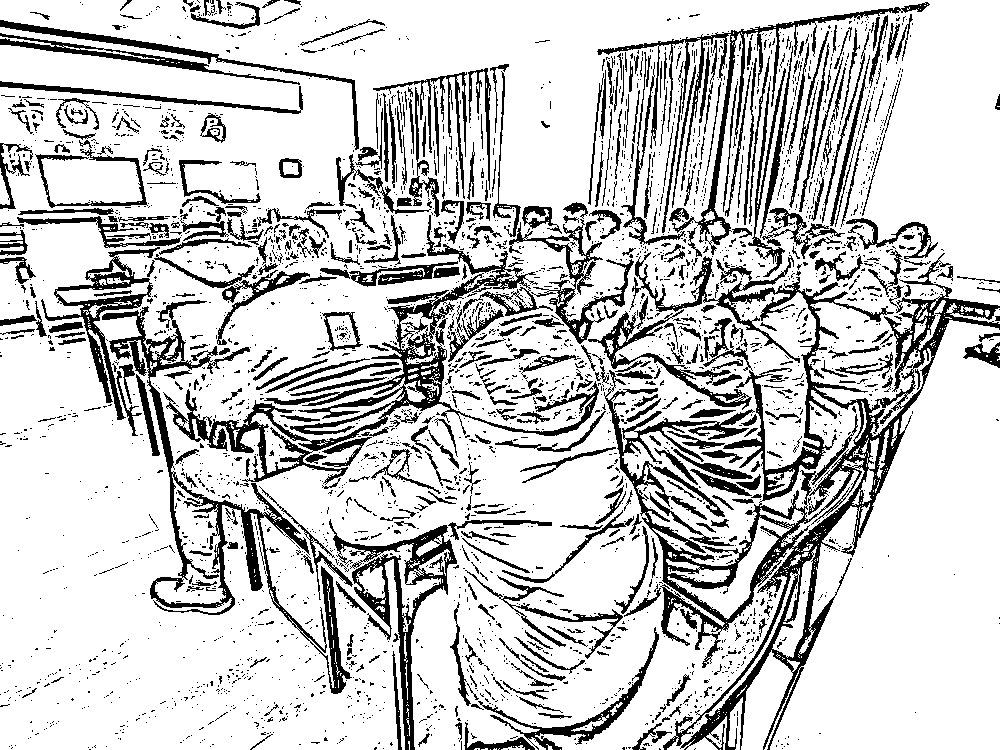
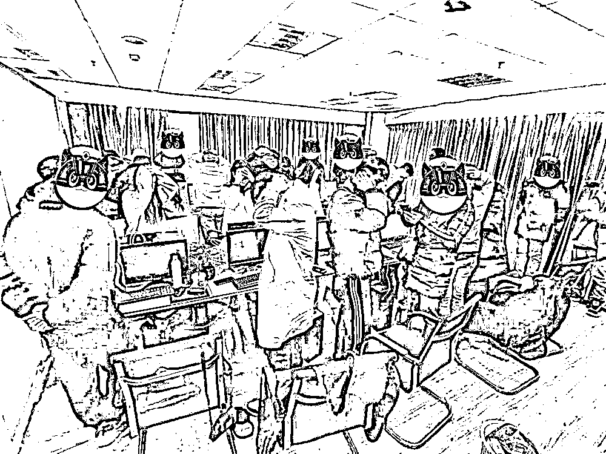
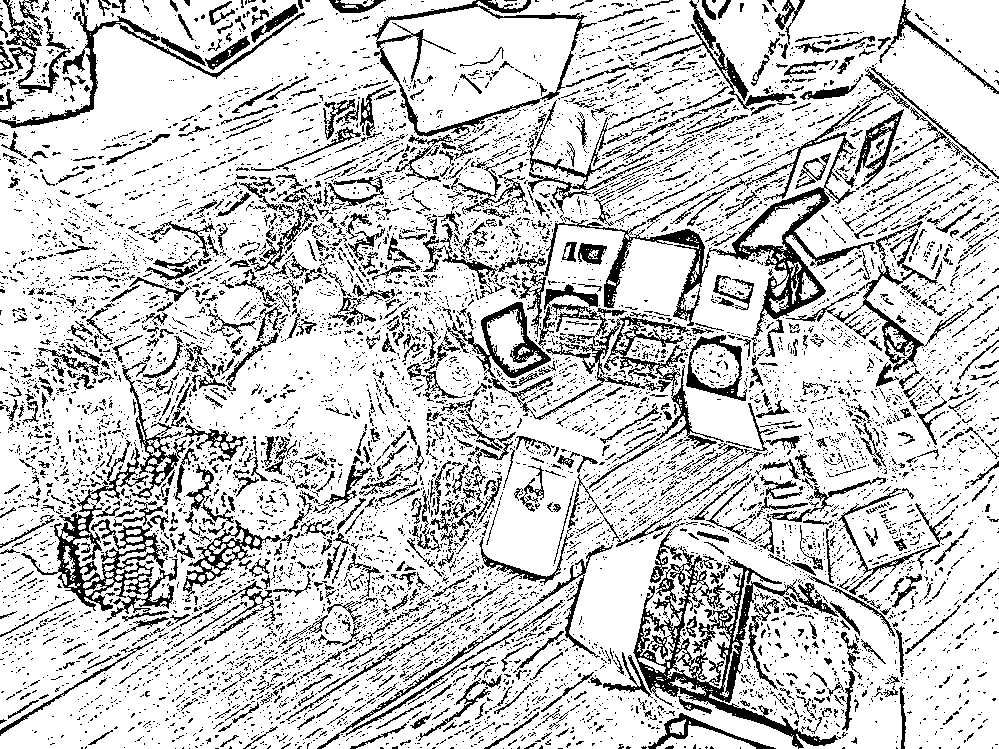
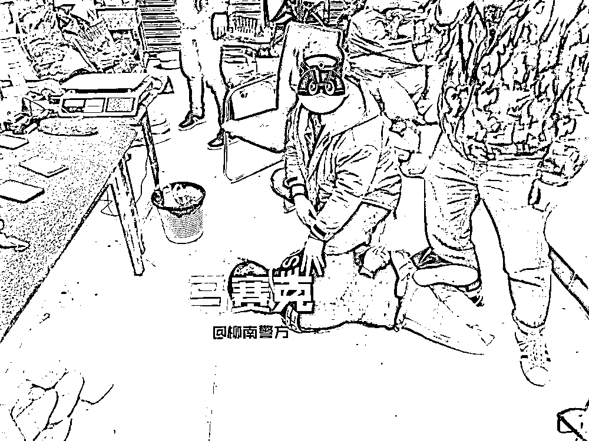

# 你在直播间认识的“美女主播”被抓了！

> 原文：[`mp.weixin.qq.com/s?__biz=MzIyMDYwMTk0Mw==&mid=2247507676&idx=5&sn=44e9b19a75b9bd2b96a3c2c7d2107f04&chksm=97cb15e4a0bc9cf203dabab9273a6cc3bd99426df5a4955c792b5dfd4bf5dc9147b02ce357c1&scene=27#wechat_redirect`](http://mp.weixin.qq.com/s?__biz=MzIyMDYwMTk0Mw==&mid=2247507676&idx=5&sn=44e9b19a75b9bd2b96a3c2c7d2107f04&chksm=97cb15e4a0bc9cf203dabab9273a6cc3bd99426df5a4955c792b5dfd4bf5dc9147b02ce357c1&scene=27#wechat_redirect)

你熟悉“杀猪盘”吗？

找猪-养猪-杀猪 

他们分工明确

从**话术脚本**到**人设情节**都是千人千面

精准匹配不同人

在骗术上

手段也是不断更新

但最终目的都是一样

**诈骗金钱**

[`mp.weixin.qq.com/mp/readtemplate?t=pages/video_player_tmpl&action=mpvideo&auto=0&vid=wxv_1690579326036967426`](https://mp.weixin.qq.com/mp/readtemplate?t=pages/video_player_tmpl&action=mpvideo&auto=0&vid=wxv_1690579326036967426)

近日

在柳州公安市局网安支队、刑侦支队指导和支持下

柳南公安分局

通过三个多月的侦查

成功打掉一个特大“杀猪盘”电信诈骗团伙

**抓获 39 名涉案嫌疑人**

**查获假玉石原石约 1 吨**

**劣质珠宝首饰一批**

**涉案金额上千万元**

露破绽涉千万元电诈案浮出水面

2020 年 10 月初，柳南公安分局河西责任区刑侦大队民警在工作中发现，柳州市某贸易公司利用某网络直播平台，通过虚假玉石毛料买卖活动，从事电信诈骗活动。该大队联合市公安局网安支队深入摸排侦查发现，这是一个以叶某诗为首的“杀猪盘”诈骗团伙，该团伙与云南边境赌石直播窝点串联，共同实施赌石诈骗活动。

咬不放 多警种协同作战

由于案情重大，分局立即将情况上报，柳州市公安局党委委员、副局长仲军要求柳南分局牵头成立专案组，在网安支队、刑侦支队等部门的技术支撑下，尽快摸清案件细节，确定抓捕对象，务必全链条打掉该犯罪集团。

柳南公安分局副局长韦江洲组织召开收网部署会

千里抓 百名警力三地同时收网

去年 12 月底，专案组赶赴云南瑞丽、广东四会等地调查取证，并制定详细抓捕方案。2021 年 1 月 9 日晚，抓捕时机成熟，分局副局长韦江洲坐镇指挥抓捕行动，专案组一百余名警力在柳州市城中区某大厦 501 室、604 室柳州市某贸易公司内，当场抓获以叶某诗为首的诈骗团伙成员 34 名。

柳南警方抓捕小组奔赴云南瑞丽边境，成功捣毁一网络直播窝点抓获诈骗团伙成员 3 名，在广东四会市抓获下游首饰供应嫌疑人 2 名。行动缴获作案电脑**40 余台**，假玉石原石约**1 吨**及劣质首饰 1 批。

快揭秘 直播间成为犯罪“通道”

[`mp.weixin.qq.com/mp/readtemplate?t=pages/video_player_tmpl&action=mpvideo&auto=0&vid=wxv_1690607661563609089`](https://mp.weixin.qq.com/mp/readtemplate?t=pages/video_player_tmpl&action=mpvideo&auto=0&vid=wxv_1690607661563609089)

     经初步调查，以叶某诗为首的电信网络诈骗团伙以柳州某贸易公司为伪装，组织“业务员”**冒充美女在互联网上以婚恋、交友**为名骗取陌生男子信任，诱导被害人进入云南的网络直播间内观看**“赌石”直播**。云南的直播窝点通过雇佣缅甸籍人员冒充毛料市场摊主，网络主播则伪装成在毛料市场和摊主讨价还价，帮助被害人淘玉石，以骗取被害人的毛料费、加工费、鉴定费等。

**经审查**

叶某诗（男，34 岁，福建人）、谢某东（男，22 岁，广西人）等 36 名嫌疑人均对从事诈骗犯罪事实供认不讳。该团伙涉案资金上千万元，初步核实诈骗案件 500 余起。目前，叶某诗、谢某东等 36 人已被依法刑事拘留，案件仍在进一步侦办中。

**某平台直播“赌石”** 

**变成了警察蜀黍的直播抓捕**

**这波操作很圈粉**

**警方提醒**

网上交友一定要谨慎，当网友突然提到“钱”的时候，提高警惕，不要被“糖衣炮弹”冲昏头脑。

1.网恋不要过度投入感情，尤其是没见过面的网友，不要被诈骗分子的花言巧语与表面行为所迷惑。

2.不要轻信“婚恋对象”口中的“投资”，切莫被对方“日进斗金”的说法所迷惑，天上不会掉馅饼，眼见不一定为实，只要对方开始谈钱，就要提高警惕。

3.不要心存侥幸心理，发现疑似骗局的苗头，立即止损，一旦被骗，及时报警！

来源：柳南警方、柳州警方，柳州晚报，利箭在行动

← 向右滑动与灰产圈互动交流 →

